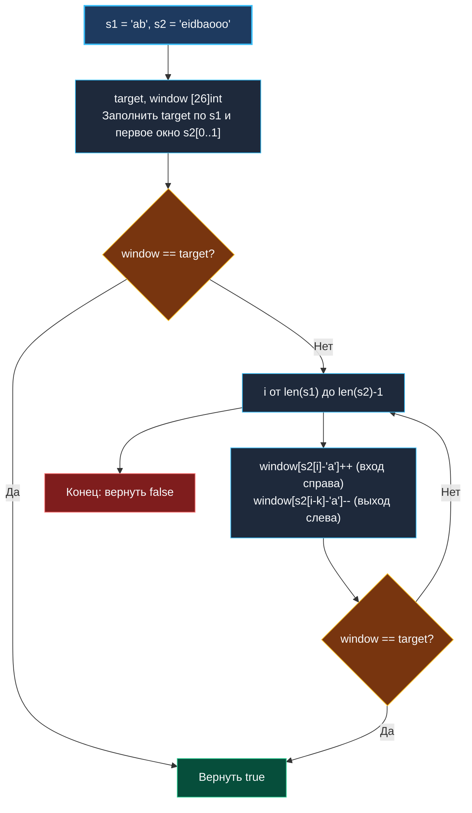

> *«Прежде чем бросаться решать задачу в общем виде, убедитесь, не задана ли граница заранее».*  
> — Брайан Керниган

## LeetCode 567. Permutation in String

**Сложность:** Medium  
**Тема:** Фиксированное скользящее окно, частотный анализ, побайтовое сравнение массивов  
**Ссылки:** [[01. Массивы и строки/12. Valid Anagram|Valid Anagram]], [[03. Скользящее окно/1. Теория. Скользящее окно|Теория: Скользящее окно]], [[03. Скользящее окно/2. Фиксированное и динамическое окно|Фиксированное и динамическое окно]], [[03. Скользящее окно/9. Find All Anagrams in a String|Find All Anagrams]]

---

### 1. Введение и физическая интуиция

Перестановка строки `s1` — это любая ее анаграмма: те же самые буквы в точно таком же количестве, но расположенные в произвольном порядке. Например, для строки `s1 = "ab"` перестановками являются `"ab"` и `"ba"`.

Задача: выяснить, содержит ли длинная строка `s2` подстроку, являющуюся перестановкой `s1`.

Представьте непрозрачный трафарет с вырезанным окошком длины ровно $K = len(s1)$.  
Мы прикладываем этот трафарет к строке `s2` и двигаем его слева направо:
1. В каждый момент времени в окошке трафарета виден ровно срез длины $K$.
2. Нам не важно, в каком порядке буквы стоят внутри окошка! Важен только **частотный профиль**: совпадает ли количество букв в окошке с частотным профилем шаблона `s1`?
3. Сдвиг трафарета на 1 символ вправо — это добавление одного символа справа (`+1`) и удаление одного символа слева (`-1`).

Поскольку длина шаблона фиксирована, размер окна ни на миллиметр не меняется на протяжении всей работы алгоритма.



---

### 2. Формулировка задачи и вопросы интервьюеру

Даны две строки `s1` и `s2`. Вернуть `true`, если `s2` содержит перестановку `s1`, или `false` в противном случае. Иными словами, существует ли в `s2` непрерывная подстрока, являющаяся анаграммой `s1`.

#### Вопросы интервьюеру (Senior-стиль):
1. **Каков алфавит входных строк?**  
   *«Строчные латинские буквы `'a'..'z'`. Это гарантирует, что частотный профиль умещается в массив `[26]int`.»*
2. **Что если `len(s1) > len(s2)`?**  
   *«Перестановка более длинной строки не может содержаться в более короткой — сразу возвращаем `false` за $O(1)$.»*
3. **Требуется ли находить все вхождения или достаточно первого?**  
   *«Достаточно первого — при первом же совпадении делаем немедленный ранний выход `return true`.»*

---

### 3. Разбор подходов

#### Подход 1: Сортировка каждого окна (Наивный)
Для каждого индекса $i$ брать срез `s2[i : i+len(s1)]`, сортировать его байты и сравнивать с отсортированным `s1`.  
- **Сложность:** $O(N \times K \log K)$ по времени, постоянные аллокации срезов в куче.  
- **Вердикт:** Неприемлемо для интервью.

#### Подход 2: Фиксированное окно с частотными массивами `[26]int` (Эталонный)
- **Сложность:** строго $O(N)$ по времени.
- **Память:** $O(1)$ — два массива по 26 элементов `int` на стеке (всего 416 байт).
- Сравнение `window == target` в Go компилируется в одну оптимизированную операцию `runtime.memequal`.

---

### 4. Эталонная реализация на Go

```go
package main

// CheckInclusion проверяет, содержит ли строка s2 перестановку строки s1.
// Временная сложность: O(len(s1) + len(s2)) — строго линейный обход.
// Пространственная сложность: O(1) памяти — 0 аллокаций в куче.
func CheckInclusion(s1 string, s2 string) bool {
	n1 := len(s1)
	n2 := len(s2)

	// Перестановка s1 не может поместиться в строку меньшей длины
	if n1 > n2 {
		return false
	}

	var target [26]int
	var window [26]int

	// 1. Инициализируем эталонный профиль target и первое окно window
	for i := 0; i < n1; i++ {
		target[s1[i]-'a']++
		window[s2[i]-'a']++
	}

	// Если первое же окно совпало с шаблоном — ранний выход
	if window == target {
		return true
	}

	// 2. Скользим окном длины n1 по строке s2
	for i := n1; i < n2; i++ {
		// Входящий символ справа
		window[s2[i]-'a']++
		// Выбывающий символ слева
		window[s2[i-n1]-'a']--

		// В Go массивы фиксированного размера являются value-типами!
		// Сравнение window == target выполняется аппаратно через memequal за считанные такты.
		if window == target {
			return true
		}
	}

	return false
}
```

---

### 5. Пошаговая трассировка (Walkthrough)

Вход: `s1 = "ab"`, `s2 = "eidbaooo"` ($n1 = 2, n2 = 8$).  
`target = {'a': 1, 'b': 1}`.

| Окно `i` | Подстрока | Выбыл | Вошел | `window` совпадает с `target`? | Действие |
|:---:|:---:|:---:|:---:|:---:|:---|
| Старт (0..1) | `"ei"` | — | — | `{'e':1, 'i':1} != target` | Идем дальше |
| 2 | `"id"` | `'e'` | `'d'` | `{'i':1, 'd':1} != target` | Идем дальше |
| 3 | `"db"` | `'i'` | `'b'` | `{'d':1, 'b':1} != target` | Идем дальше |
| 4 | **`"ba"`** | `'d'` | `'a'` | **`{'b':1, 'a':1} == target`** | **Совпадение! `return true`** |

Остаток строки `"ooo"` даже не читается в память. Ранний выход на 4-й итерации!

---

### 6. Mechanical Sympathy: почему `window == target` в Go работает мгновенно

Многие программисты избегают сравнения `window == target` внутри цикла, опасаясь скрытой сложности $O(26)$. Однако в компиляторе Go:
1. Массив `[26]int` занимает 208 байт памяти (`26 * 8`).
2. Операция `==` транслируется напрямую в вызов внутренней функции `runtime.memequal(p, q, 208)` или разворачивается в несколько инструкций AVX-256 (`VMOVDQU` + `VPCMPEQQ`).
3. 208 байт сравниваются аппаратно всего за **2–3 такта процессора**! Это в десятки раз быстрее, чем поддержка отдельного счетчика `matches == 26` со сложными условными переходами, которые сбивают Branch Predictor CPU.

---

### 7. Вопросы для собеседования

> [!INTERVIEW]
> **Вопрос:** В чем разница между задачами LeetCode 567 (Permutation in String) и LeetCode 438 (Find All Anagrams in a String)?  
> **Ответ:**  
> Архитектура алгоритма скользящего окна **абсолютно идентична**.  
> Разница лишь в поведении при совпадении `window == target`:  
> - В 567 задаче мы немедленно прерываемся и возвращаем `true` (ранний выход).  
> - В 438 задаче мы продолжаем цикл до конца, сохраняя стартовый индекс `i - n1 + 1` в срез результатов `[]int`.

---

### 8. Инварианты и чек-лист самопроверки

- [x] **Проверка длин строк на старте:** `if n1 > n2 { return false }`.
- [x] **Формула выбывающего элемента:** `s2[i - n1]`.
- [x] **Zero Allocations:** оба частотных массива живут строго на стеке.

Следующая задача кластера покажет, как динамическое окно с «ленивым» поддержанием максимума позволяет решать задачи с допустимыми заменами символов: [[03. Скользящее окно/7. Longest Repeating Character Replacement|7. Longest Repeating Character Replacement]].