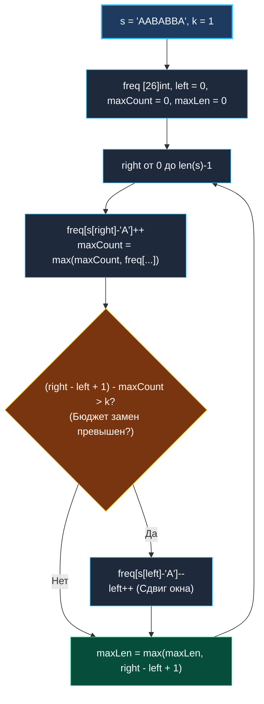

> *«Вместо того чтобы постоянно пересчитывать максимум, достаточно помнить рекорд, ведь превзойти можно только его».*  
> — Брайан Керниган

## LeetCode 424. Longest Repeating Character Replacement

**Сложность:** Medium  
**Тема:** Динамическое скользящее окно, бюджет замен, ленивое обновление максимума (Lazy Max)  
**Ссылки:** [[03. Скользящее окно/1. Теория. Скользящее окно|Теория: Скользящее окно]], [[03. Скользящее окно/2. Фиксированное и динамическое окно|Фиксированное и динамическое окно]], [[03. Скользящее окно/4. Longest Substring Without Repeating Characters|Longest Substring]]

---

### 1. Введение и физическая интуиция

Представьте строку из заглавных букв: `"A A B A B B A"`. Вам выдан «бюджет» из $k$ замен: вы можете перекрасить любые $k$ букв в любой другой символ. Требуется найти самую длинную подстроку, которую можно сделать монолитной (состоящей из одной и той же буквы).

Рассмотрим любое окно `[left .. right]` длиной $L = right - left + 1$:
- Пусть самая частая (доминирующая) буква в этом окне встречается $maxCount$ раз.
- Тогда все остальные буквы в окне — это «чужаки», которых необходимо заменить.
- Количество чужаков равно:
  $$ \text{Количество замен} = \text{Длина окна} - maxCount = (right - left + 1) - maxCount $$
- Окно является валидным, если количество требуемых замен укладывается в бюджет:
  $$ (right - left + 1) - maxCount \le k $$

Главный трюк уровня Senior: **мы не пересчитываем $maxCount$ при сжатии окна!**  
Поскольку нас интересует исключительно глобальный рекорд максимальной длины окна, нам не нужно уменьшать $maxCount$, если окно сжимается. Нас волнует только тот момент, когда появится новое окно с еще большей частотой доминирующего символа!



---

### 2. Формулировка задачи и вопросы интервьюеру

Дана строка `s`, состоящая только из заглавных английских букв, и целое число `k`. Разрешается выбрать не более `k` символов строки и заменить их на любые другие заглавные буквы. Вернуть длину самой длинной подстроки, содержащей одинаковые буквы, после проведения не более `k` изменений.

#### Вопросы интервьюеру (Senior-стиль):
1. **Каков алфавит строки?**  
   *«Только заглавные латинские буквы `'A'..'Z'`. Это позволяет использовать компактный массив `[26]int` на стеке.»*
2. **Что если $k \ge len(s)$?**  
   *«Мы можем заменить все символы на один и тот же — ответом будет длина всей строки `len(s)`.»*
3. **Что если $k = 0$?**  
   *«Замены запрещены — задача сводится к поиску самой длинной непрерывной последовательности одинаковых букв.»*

---

### 3. Почему «ленивый» $maxCount$ математически строг

Многие начинающие инженеры пытаются искать новый максимум частот в цикле по 26 элементам при каждом сдвиге `left++`. Это лишняя работа!

Докажем корректность ленивого обновления:
1. Длина окна равна $L = right - left + 1$.
2. Чтобы побить текущий рекорд длины $maxLen$, нам необходимо, чтобы выполнилось:
   $$ L_{new} > maxLen \implies (L_{new} - k) > (maxLen - k) $$
   А поскольку $L - k \le maxCount$, новое рекордное окно физически невозможно сформировать без **увеличения $maxCount$**!
3. Если после сжатия окна реальная максимальная частота уменьшилась, наше сохраненное значение `maxCount` временно оказывается слегка «завышенным».
4. Это завышение приведет лишь к тому, что окно начнет сжиматься чуть позже, сохраняя текущий размер, но **оно никогда не позволит окну раздуться сверх реально допустимого размера**, пока не будет найден новый истинный рекорд частоты!

Сложность алгоритма сохраняется строго на уровне $O(N)$ без скрытых коэффициентов $\times 26$.

---

### 4. Эталонная реализация на Go

```go
package main

// CharacterReplacement возвращает длину самой длинной подстроки из одинаковых букв
// после не более чем k замен.
// Временная сложность: O(N) — строго один проход по строке.
// Пространственная сложность: O(1) памяти — 26 элементов int на стеке.
func CharacterReplacement(s string, k int) int {
	if len(s) == 0 {
		return 0
	}

	var freq [26]int
	left := 0
	maxCount := 0
	maxLen := 0

	for right := 0; right < len(s); right++ {
		charIdx := s[right] - 'A'
		freq[charIdx]++

		// Обновляем исторический максимум частоты символа в окне
		if freq[charIdx] > maxCount {
			maxCount = freq[charIdx]
		}

		// Если число символов, требующих замены, превышает бюджет k —
		// сдвигаем левую границу окна вправо
		if (right-left+1)-maxCount > k {
			freq[s[left]-'A']--
			left++
		}

		// Обновляем максимальную длину окна
		currentLen := right - left + 1
		if currentLen > maxLen {
			maxLen = currentLen
		}
	}

	return maxLen
}
```

---

### 5. Пошаговая трассировка (Walkthrough)

Вход: `s = "AABABBA"`, $k = 1$.

| `right` | Символ | `freq` | `maxCount` | Длина окна | Замен нужно ($L - maxCount$) | Превышен бюджет $k=1$? | `left` | `maxLen` |
|:---:|:---:|:---|:---:|:---:|:---:|:---:|:---:|:---:|
| 0 | `'A'` | `A:1` | 1 | 1 | $1 - 1 = 0$ | Нет | 0 | **1** |
| 1 | `'A'` | `A:2` | 2 | 2 | $2 - 2 = 0$ | Нет | 0 | **2** |
| 2 | `'B'` | `A:2, B:1` | 2 | 3 | $3 - 2 = 1$ | Нет | 0 | **3** |
| 3 | `'A'` | `A:3, B:1` | 3 | 4 | $4 - 3 = 1$ | Нет | 0 | **4** |
| 4 | `'B'` | `A:3, B:2` | 3 | 5 | $5 - 3 = 2$ | **Да ($2 > 1$)** | Сдвиг `left` $\to$ 1 | 4 |
| 5 | `'B'` | `A:2, B:3` | 3 | 5 | $5 - 3 = 2$ | **Да ($2 > 1$)** | Сдвиг `left` $\to$ 2 | 4 |
| 6 | `'A'` | `A:3, B:2` | 3 | 5 | $5 - 3 = 2$ | **Да ($2 > 1$)** | Сдвиг `left` $\to$ 3 | 4 |

Итоговый результат: `maxLen = 4` (подстрока `"AABA"` с заменой `'B'` на `'A'`).

---

### 6. Mechanical Sympathy: работа регистров и L1-кэша

1. **Массив `[26]int` на стеке:**  
   Занимает всего 208 байт. Escape analysis оставляет его в текущем стековом фрейме.
2. **Нулевой Branch Misprediction на циклах сжатия:**  
   Обратите внимание: мы используем не цикл `for (right-left+1)-maxCount > k`, а одинарное условие `if`!  
   Так как на каждой итерации `right` увеличивается строго на 1, а левая граница `left` сдвигается на 1, размер окна не может вырасти больше, чем на 1 за шаг. Однократного `if` абсолютно достаточно для удержания окна в допустимых границах. Это превращает сжатие в прямолинейный код без циклических переходов.

---

### 7. Вопросы для собеседования

> [!INTERVIEW]
> **Вопрос:** Почему в этом алгоритме достаточно использовать `if` вместо цикла `while` при сжатии окна?  
> **Ответ:**  
> Правая граница `right` сдвигается ровно на 1 позицию за итерацию. Значит, длина окна увеличивается максимум на 1.  
> Если до этого окно было валидным, то после добавления одного символа количество требуемых замен могло увеличиться максимум на 1.  
> Следовательно, одного сдвига `left++` достаточно, чтобы восстановить баланс или сохранить размер окна постоянным в поисках лучшего `maxCount`.

---

### 8. Инварианты и чек-лист самопроверки

- [x] **Формула замен:** `(right - left + 1) - maxCount <= k`.
- [x] **Обновление `maxCount`:** строго до проверки условия сжатия.
- [x] **Zero Allocations:** массив на 26 элементов живет строго на стеке.

Переходим к предпоследней задаче кластера — сложнейшей задаче на скользящее окно с поддержанием экстремума через монотонную очередь: [[03. Скользящее окно/8. Sliding Window Maximum|8. Sliding Window Maximum]].