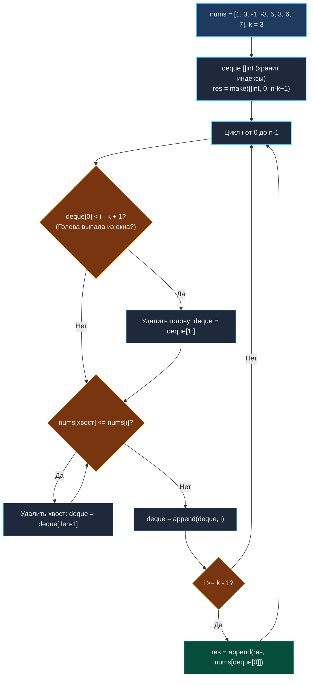

> *«Избавляйтесь от того, что заведомо не имеет будущего, и тогда на вершине останется только лучшее».*  
> — Брайан Керниган

## LeetCode 239. Sliding Window Maximum

**Сложность:** Hard  
**Тема:** Скользящее окно, монотонная двусторонняя очередь (Monotonic Deque), $O(N)$ амортизированное время  
**Ссылки:** [[03. Скользящее окно/1. Теория. Скользящее окно|Теория: Скользящее окно]], [[03. Скользящее окно/2. Фиксированное и динамическое окно|Фиксированное и динамическое окно]], [[03. Скользящее окно/3. Maximum Average Subarray I|Maximum Average Subarray I]]

---

### 1. Введение и физическая интуиция

Представьте спортивную команду с жестким регламентом отбора в окно ротации длины $k$.  
Каждый день на просмотр приходит новый игрок:
1. Если новый игрок моложе (пришел позже) и при этом играет **лучше** (значение больше или равно), чем игроки, пришедшие раньше него — ветераны теряют всякий шанс стать лучшим игроком окна! Они гарантированно покинут команду раньше новичка и никогда не превзойдут его. Их можно **немедленно отчислить из очереди** с правого конца.
2. Если игрок в начале очереди состарился настолько, что выпал за левую границу окна ($< i - k + 1$), его также отчисляют из головы очереди.

В результате очередь претендентов становится **строго монотонно убывающей**:
- В голове очереди всегда находится **самый лучший (максимальный) игрок** текущего окна.
- Каждый элемент входит в очередь ровно один раз и выбывает ровно один раз.
- Время получения максимума для каждого положения окна составляет строго **$O(1)$**!



---

### 2. Формулировка задачи и вопросы интервьюеру

Дан целочисленный массив `nums` и размер скользящего окна `k`. Окно движется слева направо на 1 позицию за шаг. Найти максимальный элемент в каждом окне и вернуть массив максимумов.

#### Вопросы интервьюеру (Senior-стиль):
1. **Каков размер входных данных?**  
   *«$1 \le k \le len(nums) \le 10^5$. Число окон равно $N - k + 1$. Решение $O(N \times k)$ гарантированно получит TLE при $k \approx 50\,000$. Требуется строго линейное решение $O(N)$.»*
2. **Могут ли числа быть отрицательными?**  
   *«Да, числа в диапазоне $[-10^4, 10^4]$.»*
3. **Что хранить в очереди — сами значения или индексы?**  
   *«Строго **индексы**! Хранение индексов позволяет за $O(1)$ проверять, вышел ли элемент за левую границу окна (`deque[0] < i - k + 1`), а значение элемента всегда доступно по `nums[deque[0]]`.»*

---

### 3. Разбор подходов

| Алгоритм | Временная сложность | Память | Особенности реализации |
|:---|:---:|:---:|:---|
| **Наивный перебор** | $O(N \times k)$ | $O(1)$ | Повторное сканирование $k$ элементов, TLE |
| **Max-Куча (Heap)** | $O(N \log k)$ | $O(k)$ | Требует «ленивого» удаления устаревших элементов из корня |
| **Монотонная Deque** | **$O(N)$** | **$O(k)$** | Амортизированное $O(1)$ на шаг, эталонный выбор |

---

### 4. Эталонная реализация на Go

```go
package main

// MaxSlidingWindow находит максимум в каждом скользящем окне длины k.
// Временная сложность: O(N) — каждый индекс добавляется и удаляется из deque не более 1 раза.
// Пространственная сложность: O(k) вспомогательной памяти под срез deque.
func MaxSlidingWindow(nums []int, k int) []int {
	n := len(nums)
	if n == 0 || k <= 0 {
		return nil
	}

	// Точный размер результата известен заранее: n - k + 1
	result := make([]int, 0, n-k+1)

	// deque хранит индексы элементов nums в порядке строгого убывания их значений
	deque := make([]int, 0, k)

	for i := 0; i < n; i++ {
		// 1. Очистка головы: удаляем элементы, вышедшие за левую границу окна
		if len(deque) > 0 && deque[0] < i-k+1 {
			deque = deque[1:]
		}

		// 2. Очистка хвоста: удаляем все элементы, которые меньше или равны текущему.
		// Они никогда не смогут стать максимумом, так как nums[i] моложе и больше их!
		for len(deque) > 0 && nums[deque[len(deque)-1]] <= nums[i] {
			deque = deque[:len(deque)-1]
		}

		// 3. Добавляем текущий индекс в хвост очереди
		deque = append(deque, i)

		// 4. Начиная с индекса k-1 окно полностью сформировано
		if i >= k-1 {
			// Голова очереди гарантированно содержит максимум текущего окна
			result = append(result, nums[deque[0]])
		}
	}

	return result
}
```

---

### 5. Пошаговая трассировка (Walkthrough)

Пусть `nums = [1, 3, -1, -3, 5, 3, 6, 7]`, $k = 3$.

| `i` | Число `nums[i]` | Состояние `deque` (индексы) | Значения в `deque` | `deque[0]` (максимум) | Добавлен в `result` |
|:---:|:---:|:---|:---|:---:|:---:|
| 0 | 1 | `[0]` | `[1]` | — (окно не полно) | — |
| 1 | 3 | `[1]` (хвост `0` выбит, т.к. $1 \le 3$) | `[3]` | — | — |
| 2 | -1 | `[1, 2]` | `[3, -1]` | `nums[1] = 3` | **3** |
| 3 | -3 | `[1, 2, 3]` | `[3, -1, -3]` | `nums[1] = 3` | **3** |
| 4 | 5 | `[4]` (выбиты все: -3, -1, 3 $\le 5$) | `[5]` | `nums[4] = 5` | **5** |
| 5 | 3 | `[4, 5]` | `[5, 3]` | `nums[4] = 5` | **5** |
| 6 | 6 | `[6]` (выбиты 3 и 5) | `[6]` | `nums[6] = 6` | **6** |
| 7 | 7 | `[7]` (выбит 6) | `[7]` | `nums[7] = 7` | **7** |

Результат: `[3, 3, 5, 5, 6, 7]`. Ровно $N$ шагов!

---

### 6. Mechanical Sympathy: почему слайс как Deque бьет `container/list`

В стандартной библиотеке Go есть двусвязный список `container/list`. Но использовать его здесь — грубейшая ошибка:
1. `container/list` хранит элементы типа `any` (`interface{}`). Добавление числа `int` вызывает **аллокацию в куче (boxing)**.
2. Каждый узел списка — это отдельный объект в куче с указателями `prev` и `next` (pointer chasing, гарантированные Cache Misses).
3. Наш срез `deque := make([]int, 0, k)` размещается в **едином непрерывном куске памяти**.
4. Сдвиг головы `deque = deque[1:]` и усечение хвоста `deque = deque[:len-1]` не копируют массив — они лишь меняют указатель `Data` и длину `Len` в 24-байтной структуре заголовка среза за **1 такт CPU**!

---

### 7. Вопросы для собеседования

> [!INTERVIEW]
> **Вопрос:** Почему при очистке хвоста используется условие `<=`, а не `<`?  
> **Ответ:**  
> Если два элемента равны (например, `[3, 3]`), старый элемент выйдет из окна раньше нового.  
> Хранить дубликаты одинаковых максимумов нет никакого смысла: более свежий элемент проживет в окне дольше. Удаление равных элементов через `<=` поддерживает очередь минимально возможной длины, экономя такты CPU.

---

### 8. Инварианты и чек-лист самопроверки

- [x] **Очередь хранит индексы:** `deque[0] < i - k + 1` надежно отслеживает выход за пределы окна.
- [x] **Очистка с обоих концов:** голова очищается сдвигом `[1:]`, хвост — усечением `[:len-1]`.
- [x] **Предвыделение емкости:** `make([]int, 0, n-k+1)` исключает реаллокации результирующего массива.

Переходим к завершающей задаче кластера — поиску всех анаграмм шаблона в строке: [[03. Скользящее окно/9. Find All Anagrams in a String|9. Find All Anagrams in a String]].