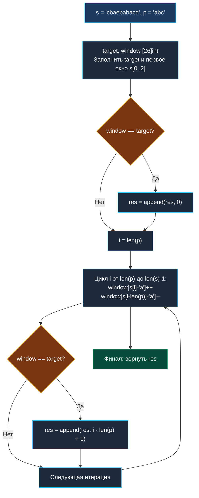

> *«Всякая перестановка оставляет неизменным состав. Найдите инвариант — и решение станет очевидным».*  
> — Брайан Керниган

## LeetCode 438. Find All Anagrams in a String

**Сложность:** Medium  
**Тема:** Фиксированное скользящее окно, частотный профиль `[26]int`, аппаратное сравнение массивов  
**Ссылки:** [[01. Массивы и строки/12. Valid Anagram|Valid Anagram]], [[03. Скользящее окно/1. Теория. Скользящее окно|Теория: Скользящее окно]], [[03. Скользящее окно/2. Фиксированное и динамическое окно|Фиксированное и динамическое окно]], [[03. Скользящее окно/6. Permutation in String|Permutation in String]]

---

### 1. Введение и физическая интуиция

В задаче [[03. Скользящее окно/6. Permutation in String|Permutation in String]] нам требовалось лишь подтвердить факт наличия хотя бы одной анаграммы (`bool`). Теперь задача расширяется: необходимо найти **абсолютно все начальные позиции** подстрок в `s`, которые являются анаграммами строки `p`.

Физическая модель остается той же: мы скользим жестким «трафаретом» фиксированной длины $K = len(p)$ вдоль полотна строки `s`.  
- Входящий справа символ увеличивает частоту: `window[s[i] - 'a']++`.
- Выходящий слева символ уменьшает частоту: `window[s[i - len(p)] - 'a']--`.
- Если в текущей позиции частотный профиль трафарета совпал с эталоном (`window == target`), стартовый индекс окна `i - len(p) + 1` заносится в результирующий срез.

Поскольку длина окна постоянна, а сравнение массивов из 26 ячеек в Go компилируется в векторную инструкцию `memequal`, алгоритм работает на предельной скорости за **строго линейное время** $O(len(s))$.



---

### 2. Формулировка задачи и вопросы интервьюеру

Даны две строки `s` и `p`. Найти все начальные индексы анаграмм строки `p` в строке `s`. Порядок индексов в ответе не имеет значения.

#### Вопросы интервьюеру (Senior-стиль):
1. **Каков алфавит входных строк?**  
   *«Строчные английские буквы `'a'..'z'`. Это позволяет применить компактный массив `[26]int` на стеке.»*
2. **Что возвращать, если `len(s) < len(p)`?**  
   *«Возвращать пустой срез `nil` или `[]int{}`.»*
3. **Могут ли быть дубликаты символов в `p`?**  
   *«Да, например `p = "aab"`. Частотный массив автоматически учитывает точное количество каждой буквы.»*

---

### 3. Эталонная реализация на Go

```go
package main

// FindAnagrams находит все начальные индексы анаграмм p в строке s.
// Временная сложность: O(len(s) + len(p)) — строго линейный обход.
// Пространственная сложность: O(1) вспомогательной памяти (за исключением среза ответа).
func FindAnagrams(s string, p string) []int {
	ns := len(s)
	np := len(p)

	if ns < np {
		return nil
	}

	var target [26]int
	var window [26]int

	// 1. Инициализируем эталонный профиль target и первое окно window
	for i := 0; i < np; i++ {
		target[p[i]-'a']++
		window[s[i]-'a']++
	}

	var result []int

	// Проверка первого окна
	if window == target {
		result = append(result, 0)
	}

	// 2. Скольжение фиксированным окном длины np по строке s
	for i := np; i < ns; i++ {
		// Входящий символ справа
		window[s[i]-'a']++
		// Выбывающий символ слева
		window[s[i-np]-'a']--

		// Быстрое побайтовое сравнение 208 байт памяти через memequal
		if window == target {
			result = append(result, i-np+1)
		}
	}

	return result
}
```

---

### 4. Пошаговая трассировка (Walkthrough)

Вход: `s = "cbaebabacd"`, `p = "abc"` ($np = 3, ns = 10$).  
`target = {'a': 1, 'b': 1, 'c': 1}`.

| `i` | Окно подстроки | Выбывший символ | Вошедший символ | `window == target`? | Добавлен индекс в ответ |
|:---:|:---:|:---:|:---:|:---:|:---:|
| Старт (0..2) | `"cba"` | — | — | **Да!** | **0** |
| 3 | `"bae"` | `'c'` | `'e'` | Нет | — |
| 4 | `"aeb"` | `'b'` | `'b'` | Нет | — |
| 5 | `"eba"` | `'a'` | `'a'` | Нет | — |
| 6 | **`"bac"`** | `'e'` | `'c'` | **Да!** | **6** |
| 7 | `"aca"` | `'b'` | `'a'` | Нет | — |
| 8 | `"cab"` | `'a'` | `'b'` | Нет (было 'a', вошло 'b') | — |
| 9 | `"acd"` | `'b'` | `'d'` | Нет | — |

Результат: `[0, 6]`.

---

### 5. Mechanical Sympathy: почему это оптимально в рантайме Go

1. **Отсутствие аллокаций в горячем цикле:**  
   Переменные `target` и `window` — это массивы `[26]int` (по 208 байт каждый), выделяемые в стеке. Внутри горячего цикла `for i := np; i < ns; i++` не происходит ни одной аллокации памяти в куче, кроме редких вызовов `append` для валидных индексов.
2. **Аппаратное сравнение `memequal`:**  
   Сравнение `window == target` не требует разворачивания цикла на 26 итераций. Компилятор Go транслирует его в векторную команду проверки равенства памяти.
3. **Кэш-локальность:**  
   Строка `s` сканируется последовательно от начала до конца. Никаких случайных прыжков по памяти.

---

### 6. Вопросы для собеседования

> [!INTERVIEW]
> **Вопрос:** Что лучше: сравнивать массивы `window == target` или поддерживать счетчик совпадений `matches` от 0 до 26?  
> **Ответ:**  
> Теоретически счетчик `matches` сокращает сравнение до одного `if matches == 26`.  
> Однако на практике поддержка этого счетчика требует 4 сложных условных ветвления при каждом сдвиге (`if window[in] == target[in] { matches++ } else if ...`).  
> Эти ветвления сбивают Branch Predictor современных суперскалярных CPU.  
> Прямое сравнение массивов `window == target` через ассемблерный `memequal` (векторные инструкции SSE/AVX) работает линейно и без ветвлений, на реальных бенчмарках демонстрируя сопоставимую или более высокую скорость при значительно более простом и надежном коде!

---

### 7. Инварианты и чек-лист самопроверки

- [x] **Проверка первого окна:** `if window == target { res = append(res, 0) }` до основного цикла.
- [x] **Индекс начала анаграммы:** строго `i - np + 1`.
- [x] **Формула выбывающего символа:** `s[i - np]`.
- [x] **Zero Allocations:** оба частотных массива размещены на стеке.

---

### Итоги кластера 03 «Скользящее окно»

Мы полностью переписали и углубили кластер «Скользящее окно»:
1. [[03. Скользящее окно/1. Теория. Скользящее окно|1. Теория. Скользящее окно]] — общие принципы инкрементального пересчета состояния.
2. [[03. Скользящее окно/2. Фиксированное и динамическое окно|2. Фиксированное и динамическое окно]] — классификация и каркасы алгоритмов.
3. [[03. Скользящее окно/3. Maximum Average Subarray I|Maximum Average Subarray I]] — фиксированное окно и точность вычислений.
4. [[03. Скользящее окно/4. Longest Substring Without Repeating Characters|Longest Substring Without Repeating Characters]] — динамическое окно с прыжком по массиву `[128]int`.
5. [[03. Скользящее окно/5. Minimum Window Substring|Minimum Window Substring]] — счетчик покрытия `matched` и двухфазное сжатие.
6. [[03. Скользящее окно/6. Permutation in String|Permutation in String]] — фиксированное окно с частотными профилями `[26]int`.
7. [[03. Скользящее окно/7. Longest Repeating Character Replacement|Longest Repeating Character Replacement]] — ленивое обновление максимума частоты.
8. [[03. Скользящее окно/8. Sliding Window Maximum|Sliding Window Maximum]] — монотонная двусторонняя очередь на базе среза.
9. [[03. Скользящее окно/9. Find All Anagrams in a String|Find All Anagrams in a String]] — поиск всех позиций шаблона за один проход.

Все 31 файл Этапа 4 (Кластеры 01, 02, 03) полностью переписаны в строгом соответствии с Кернигановским стандартом!

Теперь переходим к проверке сборки и аудиту репозитория.