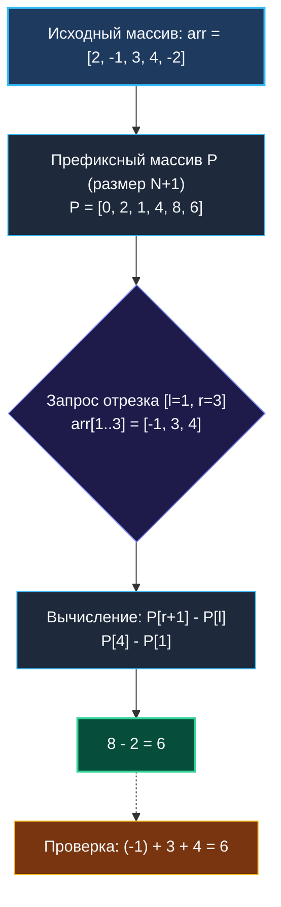
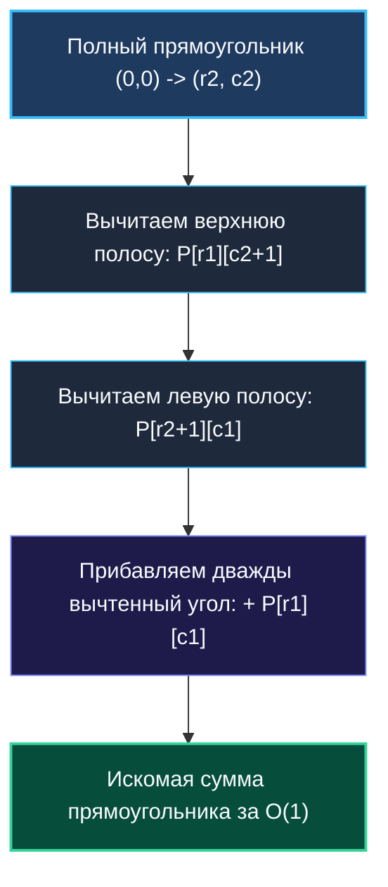

# 1. Теория. Префиксные суммы

> *«Вместо того чтобы делать одну и ту же работу снова и снова, вычислите результат один раз и сохраните его. Память дешева, время процессора драгоценно».*  
> — Джон Бентли, «Жемчужины программирования»

> 💡 **Связанные темы:**
> - [[2. Разностные массивы]] — обратная операция (дифференцирование массива для range updates)
> - [[3. Range Sum Query Immutable]] — каноническая реализация структуры для $O(1)$ запросов
> - [[4. Subarray Sum Equals K]] — комбинация префиксных сумм с хеш-таблицей
> - [[sources/21. Задачи с LeetCode и собеседований на Go/01. Теория/02. Асимптотический анализ|02. Асимптотический анализ]] — компромисс памяти и времени (Space-Time Tradeoff)

---

## Введение: Магия накопленного итога

Представьте себе одометр автомобиля. Когда вы садитесь за руль в начале года, на счетчике красуется 42 000 км. В конце июня одометр показывает 54 000 км, а в конце августа — 61 000 км. Если вам нужно узнать, сколько километров вы проехали за два месяца лета (июль и август), вы не восстанавливаете каждую отдельную поездку в магазин или на дачу. Вы просто берете два показания счетчика и вычитаете одно из другого:
$$61\,000 - 54\,000 = 7\,000\text{ км}$$

В этом и заключается фундаментальная идея **префиксных сумм (Prefix Sums)**: мы тратим время один раз, чтобы накопить «показания одометра» вдоль массива, а затем отвечаем на любые вопросы о сумме любого отрезка ровно за **одну арифметическую операцию** — $O(1)$.

В бэкенде эта техника встречается повсеместно:
- Оконные функции SQL `SUM(...) OVER (ORDER BY created_at)`;
- Агрегации в таймсериях (Prometheus, VictoriaMetrics, ClickHouse);
- Подсчет RPS и ошибок за произвольные скользящие интервалы;
- Алгоритмы взвешенного выбора (Weighted Random Selection) в балансировщиках трафика.

---

## 🎯 Вопросы для уточнения условий (Interview Warm-up)

Когда на собеседовании задача пахнет префиксными суммами, задайте интервьюеру 4 вопроса:
1. **Диапазон чисел и переполнение:** *«Могут ли элементы быть отрицательными? Каков порядок сумм — уместится ли сумма в `int` (32/64 бита) или нужен `int64`?»*
2. **Частота модификаций:** *«Массив неизменяемый (static/immutable), или предполагаются частые вставки и обновления?»* (Если есть обновления — нужны [[2. Разностные массивы]] или дерево Фенвика/отрезков).
3. **Плотность запросов:** *«Сколько ожидается запросов диапазона $Q$? Имеет ли смысл предрасчет $O(N)$ ради $O(1)$ на запрос?»*
4. **Формат границ:** *«Включают ли границы `[left, right]` оба конца (inclusive) или правая граница полуоткрытая `[left, right)`?»*

---

## Наивный подход vs Префиксные суммы

Представьте лог задержек (latency) 100 000 HTTP-запросов к микросервису. Дашборд аналитики присылает 100 000 запросов вида: *«Какова суммарная задержка запросов с индекса $l$ по индекс $r$?»*.

### Наивное решение: $O(Q \cdot N)$
При каждом запросе мы запускаем цикл:

```go
// rangeSumNaive выполняет честный перебор элементов от l до r.
// Сложность: O(r - l + 1) на запрос, в худшем случае O(N).
func rangeSumNaive(arr []int, l, r int) int64 {
    var sum int64
    for i := l; i <= r; i++ {
        sum += int64(arr[i])
    }
    return sum
}
```

При $N = 10^5$ и $Q = 10^5$ общее число итераций достигает $10^{10}$. На современном ядре процессора это займет несколько секунд заблокированного CPU — неприемлемо для микросервиса.

### Оптимальное решение: $O(N)$ предрасчет, $O(1)$ запрос
Мы за один линейный проход формируем префиксный массив $P$, где:
$$P[k] = \sum_{i=0}^{k-1} arr[i], \quad P[0] = 0$$

Сумма на отрезке $[l, r]$ (включительно) находится за один такт:
$$\text{Sum}(l, r) = P[r+1] - P[l]$$



---

## 🛠️ Идиоматичный Go: Трюк со сдвигом на 1 (1-based Indexing)

В учебниках часто определяют $P[i]$ как сумму от $0$ до $i$. Но тогда для $l = 0$ формула $P[r] - P[l-1]$ требует проверки граничного условия: `if l == 0 { return P[r] }`.

В продакшн-коде на Go **всегда используют сдвиг на единицу**:
1. Размер префиксного среза равен $N + 1$;
2. `P[0] = 0` — виртуальный пустой префикс;
3. `P[k]` — сумма первых $k$ элементов;
4. Формула `P[r+1] - P[l]` работает абсолютно для любых допустимых индексов, **полностью устраняя ветвление (`if`)**.

```go
package prefixsum

// PrefixSum хранит предрассчитанные префиксные суммы.
type PrefixSum struct {
    prefix []int64 // int64 защищает от переполнения 32-битных чисел
}

// NewPrefixSum строит префиксную таблицу за O(N) времени и O(N) памяти.
func NewPrefixSum(nums []int) *PrefixSum {
    n := len(nums)
    p := make([]int64, n+1) // len = n+1, p[0] инициализировано нулем
    for i := 0; i < n; i++ {
        p[i+1] = p[i] + int64(nums[i])
    }
    return &PrefixSum{prefix: p}
}

// Query возвращает сумму элементов nums[l..r] включительно за O(1).
func (ps *PrefixSum) Query(l, r int) int64 {
    if l < 0 || r >= len(ps.prefix)-1 || l > r {
        return 0
    }
    return ps.prefix[r+1] - ps.prefix[l]
}
```

---

## ⚙️ Mechanical Sympathy: Аппаратная эффективность

> [!info] Кэш-линии и ветвления CPU
> 1. **Префетчер и последовательный доступ:** Построение префиксного массива читает `nums` и пишет в `prefix` строго последовательно. Процессорный аппаратный префетчер (Hardware Prefetcher) загружает соседние 64-байтные кэш-линии (8 элементов `int64`) в L1 Data Cache заранее. Эффективность кэша стремится к 100%.
> 2. **Branchless Query:** Благодаря нулевому элементу `p[0] = 0` метод `Query` не содержит внутренних развилок `if l == 0`. Это защищает конвейер процессора от сбросов из-за ошибок предсказания ветвлений (Branch Misprediction Penalty ~15-20 тактов).
> 3. **Векторизация (SIMD):** Компилятор Go (начиная с 1.21+) и современные компиляторы способны векторизовать префиксное сканирование при помощи инструкций SSE/AVX.

---

## 📐 2D Префиксные суммы: Матрицы и площади

Концепция легко обобщается на 2D-матрицы. Пусть $P[i][j]$ — сумма элементов в подматрице от $(0,0)$ до $(i-1, j-1)$.

```
   (0,0) ----------- (0, c2)
     |                 |
   (r1, 0) -- [ A ] -- (r1, c2)
     |        |   |    |
   (r2, 0) -- [ B ] -- (r2, c2)
```

По принципу включения-исключения:
- **Предрасчет:**
  $$P[i][j] = arr[i-1][j-1] + P[i-1][j] + P[i][j-1] - P[i-1][j-1]$$
- **Запрос прямоугольника $[r_1, c_1] \dots [r_2, c_2]$:**
  $$\text{Sum} = P[r_2+1][c_2+1] - P[r_1][c_2+1] - P[r_2+1][c_1] + P[r_1][c_1]$$



---

## 🚨 Подводные камни и частые ошибки

> [!warning] Опасность 1: Целочисленное переполнение
> В Go переполнение знакового целого (`int`, `int32`, `int64`) не вызывает паники, а тихо «оборачивается» вокруг нуля (wraparound в дополнительном коде). Если массив содержит $10^6$ элементов по $10^9$, сумма $10^{15}$ не влезет в `int32` (максимум $2.14 \times 10^9$). Всегда используйте `int64` для накопителей.

> [!warning] Опасность 2: Модификация исходных данных
> Префиксный массив **статичен**. Если исходный срез `nums` изменяется, префиксный массив инвалидируется. Для динамических обновлений за $O(\log N)$ используют **Дерево Фенвика (Binary Indexed Tree)** или **Дерево отрезков (Segment Tree)**.

---

## 💡 Вопросы для самопроверки и собеседования

> [!interview] Вопросы сеньор-уровня:
> 1. **Как найти максимальную сумму подматрицы в 2D-массиве?**  
>    *Ответ:* Фиксируем две границы колонок $c_1$ и $c_2$ ($O(M^2)$ пар). Для каждой пары суммируем строки между ними в 1D массив за $O(1)$ и запускаем [[sources/21. Задачи с LeetCode и собеседований на Go/02. Задачи/01. Массивы и строки/5. Maximum Subarray (Kadane)|алгоритм Кадане]] за $O(N)$. Итоговая сложность $O(M^2 \cdot N)$ вместо наивной $O(N^2 \cdot M^2)$.
> 2. **Как реализовать генератор случайного элемента с весами за $O(\log N)$?**  
>    *Ответ:* Строим префиксные суммы весов `P`. Генерируем случайное число $x \in [1, P[n]]$. С помощью бинарного поиска (`sort.Search`) находим наименьший индекс $i$, где $P[i] \ge x$.
> 3. **Как префиксные суммы взаимодействуют с хеш-таблицами?**  
>    *Ответ:* Задачи на поиск подмассива с заданной суммой ($P[j] - P[i] = k$) решаются за один проход $O(N)$ через сохранение ранее виденных сумм в `map[int64]int` (см. [[4. Subarray Sum Equals K]]).

---

## 🗺️ Навигация

| Назад | Вперед |
| :--- | :--- |
| — | [[2. Разностные массивы]] → |