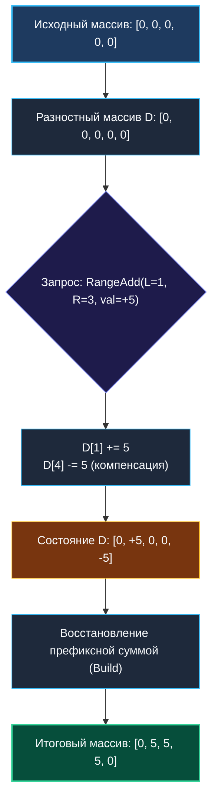

# 2. Разностные массивы

> *«Дифференцирование находит границы изменений, интегрирование собирает их воедино. В программировании эта классическая математическая симметрия превращает квадратичную сложность в мгновенную линейную».*  
> — Леонард Эйлер

> 💡 **Связанные темы:**
> - [[1. Теория. Префиксные суммы]] — базовая операция интегрирования
> - [[3. Range Sum Query Immutable]] — статические запросы сумм на отрезках
> - [[sources/21. Задачи с LeetCode и собеседований на Go/02. Задачи/23. Интервалы/1. Теория. Интервальные задачи|23. Интервалы]] — объединение и пересечение диапазонов
> - [[sources/21. Задачи с LeetCode и собеседований на Go/01. Теория/02. Асимптотический анализ|02. Асимптотический анализ]] — амортизация операций

---

## Введение: Симметрия интегрирования и дифференцирования

В [[1. Теория. Префиксные суммы]] мы узнали, как за $O(1)$ получать сумму на любом отрезке неизменяемого массива. Но что делать, если задача зеркальная?
Представьте себе поезд метро с $N$ станциями. На станции $L$ в вагон заходит толпа из 50 человек, а на станции $R$ они выходят. Сколько людей едет между станциями?

Наивный подход — бегать по всем станциям от $L$ до $R$ и прибавлять 50 к счетчику каждой станции:
```go
for i := l; i <= r; i++ { passengers[i] += 50 }
```
Если пассажиров миллион, а станций тысячи, вы потратите миллиарды операций.

Но в реальности проводнику не нужно пересчитывать людей на каждой станции пути! Ему достаточно зафиксировать всего **два события**:
1. На станции $L$: вошло $+50$ человек;
2. На станции $R+1$: вышло $-50$ человек (разница относительно предыдущей станции).

В конце смены проводник проходит по станциям один раз от $0$ до $N-1$, накапливая текущее число пассажиров префиксной суммой. Это и есть **разностный массив (Difference Array)**.

---

## 🎯 Вопросы для уточнения условий (Interview Warm-up)

1. **Характер запросов (Offline vs Online):**  
   *«Все ли операции добавления приходят пачкой до запроса итогового состояния (Offline/Batch), или запросы изменений и чтения перемежаются (Online)?»*  
   *(Если перемежаются — разностный массив не подходит, требуется дерево отрезков).*
2. **Индексация и границы:**  
   *«Включена ли правая граница $r$ в интервал обновления (inclusive), и выходит ли $r+1$ за пределы массива?»*
3. **Размер массива и начальные значения:**  
   *«Массив изначально заполнен нулями или уже содержит произвольные стартовые значения?»*

---

## Математическая модель

Для массива $A$ длины $N$ разностный массив $D$ определяется как:
$$D[0] = A[0]$$
$$D[i] = A[i] - A[i-1] \quad (\text{для } i > 0)$$

**Фундаментальное свойство:**  
Исходный массив $A$ восстанавливается из $D$ обычной операцией взятия префиксной суммы:
$$A[k] = \sum_{i=0}^{k} D[i]$$

### Массовое обновление отрезка $[L, R]$ на величину $val$ за $O(1)$
Чтобы прибавить $val$ ко всем элементам от $L$ до $R$, достаточно изменить ровно две ячейки:
1. $D[L] \mathrel{+}= val$ — с индекса $L$ значения увеличиваются на $val$;
2. $D[R+1] \mathrel{-}= val$ (если $R+1 < N$) — после индекса $R$ эффект добавления нейтрализуется.



---

## 🛠️ Идиоматичная реализация на Go

```go
package diffarray

// DifferenceArray реализует эффективное массовое обновление диапазонов за O(1).
type DifferenceArray struct {
    diff []int64
}

// NewDifferenceArray создает разностную структуру на основе среза nums.
func NewDifferenceArray(nums []int) *DifferenceArray {
    n := len(nums)
    if n == 0 {
        return &DifferenceArray{diff: nil}
    }

    d := make([]int64, n)
    d[0] = int64(nums[0])
    for i := 1; i < n; i++ {
        d[i] = int64(nums[i]) - int64(nums[i-1])
    }
    return &DifferenceArray{diff: d}
}

// RangeAdd добавляет val ко всем элементам в диапазоне [l, r] включительно за O(1).
func (da *DifferenceArray) RangeAdd(l, r int, val int64) {
    n := len(da.diff)
    if l < 0 || l >= n || r < l {
        return
    }

    da.diff[l] += val
    if r+1 < n {
        da.diff[r+1] -= val
    }
}

// Build восстанавливает финальный массив за один линейный проход O(N).
// Zero-alloc вариант: можно мутировать внутренний срез либо аллоцировать новый.
func (da *DifferenceArray) Build() []int64 {
    n := len(da.diff)
    if n == 0 {
        return nil
    }

    res := make([]int64, n)
    res[0] = da.diff[0]
    for i := 1; i < n; i++ {
        res[i] = res[i-1] + da.diff[i]
    }
    return res
}
```

---

## ⚙️ Mechanical Sympathy: Почему $K \times O(1) + O(N)$ побеждает на железе

Представьте, что к массиву на $100\,000$ элементов поступает $50\,000$ обновлений случайных диапазонов:

1. **Наивный подход ($O(K \cdot N)$):**
   Каждое обновление бежит по срезу. Память читается и пишется случайными кусками. Кэш L1/L2 постоянно вымывается, конвейер процессора захлебывается в циклах и промахах (Cache Misses). Итого: $\approx 2.5 \times 10^9$ операций.
2. **Разностный массив:**
   $50\,000$ вызовов `RangeAdd` затрагивают ровно $100\,000$ операций записи в память (по 2 на вызов).  
   Финальный вызов `Build()` сканирует массив строго последовательно. Аппаратный префетчер загружает данные блоками по 64 байта. Процессор выполняет сложения на полной пропускной способности оперативной памяти без задержек.

---

## 🏭 Применение в Production & System Design

1. **LeetCode 1094: Car Pooling / Бронирование отелей:**  
   Автомобиль вместимостью `capacity` забирает пассажиров на километре $L$ и высаживает на $R$. Чтобы проверить, не превышена ли вместимость, создаем разностный массив километров, делаем `RangeAdd(L, R, passengers)`, восстанавливаем префикс и проверяем, что нигде `current > capacity`.
2. **Генераторы нагрузки (k6, Vegeta, Locust):**  
   Планирование сценариев нагрузочного тестирования: ступени «ramp-up», «plateau», «ramp-down» задаются интервалами изменения RPS через разностную модель.
3. **Аренда мощностей в Cloud (AWS EC2 Spot Instances):**  
   Анализ перегрузки серверных стоек по временным слотам бронирования виртуальных машин.

---

## 🚨 Подводные камни и частые ошибки

> [!warning] Ошибка правой границы: off-by-one
> Если интервал полуоткрытый $[L, R)$ (как принято в слайсах Go), то вычитать нужно из $D[R]$, а не $D[R+1]$.  
> Если интервал закрытый $[L, R]$ (как в большинстве LeetCode задач), вычитаем из $D[R+1]$. Всегда уточняйте семантику правой границы!

> [!warning] Ограничение разностного массива: Offline only
> Если вам нужно сделать `RangeAdd`, затем спросить сумму на отрезке, затем снова `RangeAdd`, затем сумму — разностный массив деградирует до $O(N)$ на каждый запрос суммы. В таком случае ответом на собеседовании должно быть **Segment Tree (Дерево отрезков)** с отложенными операциями (Lazy Propagation) или **Binary Indexed Tree (Дерево Фенвика)**.

---

## 🗺️ Навигация

| Назад | Вперед |
| :--- | :--- |
| ← [[1. Теория. Префиксные суммы]] | [[3. Range Sum Query Immutable]] → |