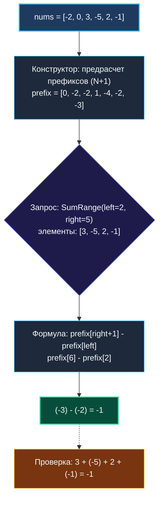

# 3. Range Sum Query Immutable

> *«Проектирование структуры данных — это искусство выбирать, какую работу проделать заранее, чтобы все последующие ответы были мгновенными».*  
> — Никлаус Вирт

> 💡 **Связанные темы:**
> - [[1. Теория. Префиксные суммы]] — фундаментальные принципы и сдвиг на 1
> - [[2. Разностные массивы]] — обратная задача (эффективные обновления)
> - [[4. Subarray Sum Equals K]] — комбинация префиксных сумм с хеш-таблицей
> - [[sources/21. Задачи с LeetCode и собеседований на Go/01. Теория/02. Асимптотический анализ|02. Асимптотический анализ]] — асимптотика запросов в высоконагруженных системах

---

## Введение: Иммутабельность в высоконагруженных сервисах

Задача **Range Sum Query - Immutable** (LeetCode 303) моделирует фундамент любой аналитической системы (OLAP): у вас есть огромный объем неизменяемых исторических данных (логи платежей, метрики задержек, клики пользователей). Поступают миллионы аналитических запросов: *«Какова сумма на отрезке между индексами `left` и `right` включительно?»*.

Если на каждый запрос перебирать срез циклом, бэкенд мгновенно упрется в 100% утилизацию CPU. Префиксные суммы решают задачу раз и навсегда: один проход при инициализации — и любой последующий запрос выполняется за константное время $O(1)$.

---

## 🎯 Вопросы для уточнения условий (Interview Warm-up)

1. **Диапазон значений и переполнение:**  
   *«Могут ли элементы массива быть отрицательными? Какова максимальная длина массива и максимальное значение элемента?»*  
   *(В LeetCode 303 $N \le 10^4, -10^5 \le nums[i] \le 10^5$, что укладывается в обычный `int`, но в продакшене используем `int64`).*
2. **Частота вызовов `SumRange`:**  
   *«Сколько раз будет вызываться `SumRange` после создания структуры? Если один раз — предрасчет избыточен. Если тысячи или миллионы раз — префиксные суммы обязательны».*
3. **Корректность диапазонов:**  
   *«Гарантируется ли, что $0 \le left \le right < len(nums)$?»*

---

## Наивный подход vs Оптимальный

### Наивный подход: $O(N)$ на каждый запрос
```go
// SumRangeNaive: O(right - left + 1) времени, O(1) памяти.
// При Q запросах общая сложность O(Q * N).
func (na *NumArrayNaive) SumRange(left, right int) int {
    sum := 0
    for i := left; i <= right; i++ {
        sum += na.nums[i]
    }
    return sum
}
```

### Оптимальный подход: $O(N)$ инициализация, $O(1)$ на запрос
Выделяем срез префиксов длиной $N+1$, где `prefix[0] = 0`.  
Тогда $\text{Sum}(left, right) = prefix[right+1] - prefix[left]$.



---

## 🛠️ Реализация на Go

```go
package rangesum

// NumArray инкапсулирует предрассчитанные префиксные суммы.
type NumArray struct {
    prefix []int64
}

// Constructor выполняет предрасчет за O(N) времени и O(N) памяти.
func Constructor(nums []int) NumArray {
    n := len(nums)
    p := make([]int64, n+1)
    for i := 0; i < n; i++ {
        p[i+1] = p[i] + int64(nums[i])
    }
    return NumArray{prefix: p}
}

// SumRange возвращает сумму nums[left..right] включительно за O(1).
// Zero-alloc: не производит ни одной аллокации в куче!
func (na *NumArray) SumRange(left int, right int) int {
    if left < 0 || right >= len(na.prefix)-1 || left > right {
        return 0
    }
    return int(na.prefix[right+1] - na.prefix[left])
}
```

---

## ⚙️ Mechanical Sympathy: Почему это работает с предельной скоростью

1. **Zero-Alloc запросы:** Метод `SumRange` не создает никаких объектов в куче (`0 B/op, 0 allocs/op`). Сборщик мусора Go (GC) не отвлекается на очистку памяти при миллионах запросов в секунду.
2. **Branchless CPU Pipeline:** Благодаря виртуальному элементу `prefix[0] = 0` внутри метода нет условий `if left == 0`. Процессор выполняет прямое чтение двух адресов памяти и операцию `SUB`. Никаких остановок конвейера (Pipeline Stalls).
3. **Hardware Prefetching:** При последовательных запросах непрерывный блок памяти `[]int64` идеально укладывается в кэш-линии процессора (64 байта = 8 элементов).
4. **Конкурентная безопасность из коробки (Lock-Free Read):** Так как массив после конструктора иммутабелен (read-only), тысячи горутин могут вызывать `SumRange` параллельно без блокировок, мьютексов (`sync.RWMutex`) и атомиков.

---

## 🏭 Применение в Production: Time-Series & Event Sourcing

1. **Prometheus / VictoriaMetrics:**  
   Запросы вида `rate(http_requests_total[5m])` вычисляются через разность накопленных счетчиков на границах временного интервала:
   $$\Delta = \text{Counter}(t_2) - \text{Counter}(t_1)$$
2. **Event Sourcing & Банковский баланс:**  
   Вместо мутации общего баланса счета в БД хранят иммутабельный журнал проводок (append-only ledger). Баланс пользователя на любую дату рассчитывается как разность префиксных сумм транзакций.

---

## 🚨 Подводные камни

> [!warning] Опасность выхода за пределы (Slice Bounds Out of Range)
> Если входные аргументы `left` и `right` приходят из внешнего ненадежного API, обязательна валидация `0 <= left <= right < len(nums)`. Иначе рантайм выбросит панику индексации.

> [!tip] Что отвечать, если данные мутабельны?
> Если на собеседовании интервьюер внезапно добавляет метод `Update(index, val)`, скажите:  
> *«При частых обновлениях префиксный массив теряет смысл, так как `Update` потребует $O(N)$ времени на пересчет всех последующих элементов. В этом случае мы переходим к Дереву Фенвика (Fenwick Tree / Binary Indexed Tree) или Дереву отрезков (Segment Tree), где и `SumRange`, и `Update` выполняются за $O(\log N)$»*.

---

## 🗺️ Навигация

| Назад | Вперед |
| :--- | :--- |
| ← [[2. Разностные массивы]] | [[4. Subarray Sum Equals K]] → |