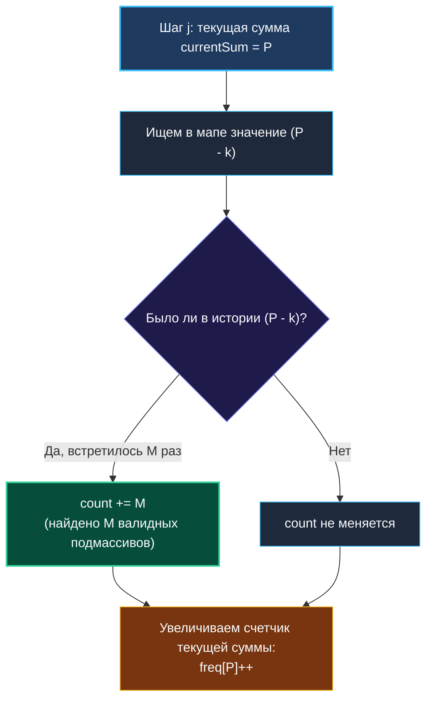

# 4. Subarray Sum Equals K

> *«Преобразование уравнения часто преобразует и сам алгоритм: то, что казалось тяжелым поиском в будущем, оказывается простым взглядом в сохраненное прошлое».*  
> — Кен Томпсон

> 💡 **Связанные темы:**
> - [[1. Теория. Префиксные суммы]] — базовая формула разности префиксов
> - [[5. Continuous Subarray Sum]] — расширение идеи на модульную арифметику
> - [[6. Maximum Size Subarray Sum Equals K]] — поиск самого длинного подмассива
> - [[sources/21. Задачи с LeetCode и собеседований на Go/02. Задачи/01. Массивы и строки/3. Two Sum|Two Sum]] — идеологический родственник в мире хеш-таблиц

---

## Введение: Инверсия мышления

Задача **Subarray Sum Equals K** (LeetCode 560) — одна из самых частых и любимых задач на технических интервью в бигтех (Яндекс, Google, Meta).
На первый взгляд, формулировка звучит обманчиво просто:
> *Дан массив целых чисел `nums` и число `k`. Найти количество непрерывных подмассивов, сумма элементов которых равна `k`.*

Первый рефлекс инженера: *«Сумма подмассива? Давайте запустим скользящее окно с двумя указателями!»*.  
И это главная ловушка: в массиве могут присутствовать **отрицательные числа**. Как только в данных появляются минусы, свойство монотонности рушится: при расширении окна сумма может уменьшиться, а при сужении — увеличиться. Скользящее окно здесь бессильно.

Решение кроется в союзе двух фундаментальных концепций: **префиксных сумм** и **хеш-таблицы**.

---

## 🎯 Вопросы для уточнения условий (Interview Warm-up)

1. **Знаки чисел:**  
   *«Могут ли элементы массива быть отрицательными или нулями?»*  
   *(Да! Именно поэтому Two Pointers и Sliding Window не работают, требуется хеш-таблица).*
2. **Значение $k$:**  
   *«Может ли само целевое число $k$ быть отрицательным или равным нулю?»*  
   *(Да, $k$ может быть любым).*
3. **Размер массива и переполнение:**  
   *«Какова длина массива ($N \le 2 \cdot 10^4$) и диапазон чисел? Может ли сумма переполнить 32-битный `int`?»*  
   *(В Go для накопителя всегда надежнее брать `int64`).*

---

## Инверсия математической формулы

Вспомним базовую формулу префиксных сумм из [[1. Теория. Префиксные суммы]]: сумма подмассива с индекса $i$ по $j$ выражается как:
$$\text{Sum}(i, j) = P[j+1] - P[i]$$

По условию задачи эта сумма обязана равняться $k$:
$$P[j+1] - P[i] = k$$

Перенесем слагаемые:
$$P[i] = P[j+1] - k$$

**Ключевой инсайт:**  
Находясь на текущем шаге $j$ с накопленной суммой $P[j+1]$, нам **не нужно** перебирать все возможные левые границы $i$. Нам достаточно спросить у истории:
> *«Сколько раз ранее мы встречали префиксную сумму, равную точно $(P[j+1] - k)$?»*

Каждое такое прошлое вхождение дает валидный подмассив, заканчивающийся прямо здесь!



---

## 🛠️ Оптимальное решение на Go

```go
package subarrsum

// SubarraySum возвращает число непрерывных подмассивов с суммой k.
// Сложность: O(N) по времени, O(N) по памяти.
func SubarraySum(nums []int, k int) int {
    count := 0
    var currentSum int64 = 0

    // freq хранит соответствие: префиксная сумма -> сколько раз она встретилась
    // Преаллокация снижает оверхед на рехеширование мапы
    freq := make(map[int64]int, len(nums)+1)

    // КРИТИЧЕСКИЙ ИНВАРИАНТ:
    // Пустой префикс (до начала массива) имеет сумму 0 и встретился ровно 1 раз!
    freq[0] = 1

    target := int64(k)
    for _, num := range nums {
        currentSum += int64(num)

        // Ищем в истории префикс P[i] = currentSum - target
        needed := currentSum - target
        if times, ok := freq[needed]; ok {
            count += times
        }

        // Регистрируем текущую префиксную сумму
        freq[currentSum]++
    }

    return count
}
```

---

## 🛑 Главная ловушка собеседования: `freq[0] = 1`

> [!warning] Почему без `freq[0] = 1` алгоритм сломается?
> Представьте простой массив `nums = [5]` и `k = 5`.
> 1. Без инициализации: на первом шаге `currentSum = 5`. Мы ищем `needed = 5 - 5 = 0`. В мапе нуля нет! Алгоритм вернет `0`, хотя подмассив `[5]` существует и дает сумму `5`.
> 2. С `freq[0] = 1`: мы находим ноль, `count` увеличивается на 1.
> 
> Физический смысл: `freq[0] = 1` учитывает подмассивы, которые начинаются **с самого первого элемента массива** (с индекса 0).

---

## ⚙️ Mechanical Sympathy: Память и хеш-таблицы в Go

> [!info] Что происходит под капотом рантайма?
> 1. **Аллокации `map`:** В Go `map[int64]int` — это хеш-таблица с бакетами по 8 элементов (`bmap`). При отсутствии преаллокации при превышении load factor ($\approx 6.5$) рантайм удваивает число бакетов (`runtime.makemap`, `runtime.hashGrow`), аллоцируя новую память в куче и вызывая Stop-The-World всплески задержек.
> 2. **Преаллокация емкости:** Вызов `make(map[int64]int, len(nums)+1)` сразу выделяет память под нужное число бакетов, снижая число аллокаций до минимума.
> 3. **Cache Miss vs Array:** В отличие от задачи [[3. Range Sum Query Immutable]], где данные лежат непрерывно в слайсе, доступ к хеш-таблице случаен (вычисление хеша, переход по указателю). Это расплата за снижение алгоритмической сложности с $O(N^2)$ до $O(N)$.

---

## 🏭 Практическое применение в продакшене

1. **Детекция аномалий и фрода в платежах:**  
   Поток банковских транзакций (пополнения со знаком $+$, списания со знаком $-$). Нужно мгновенно отловить последовательность операций, которая в сумме дает $0$ (фиктивные транзакции для накрутки кэшбэка) или подозрительную круглую сумму.
2. **Балансировка очередей сообщений:**  
   Анализ накопленного лага между продюсерами и консьюмерами в топиках Kafka.

---

## 💡 Вопросы для самопроверки

> [!interview] Частые вариации на собеседовании:
> 1. **А что если нужно вернуть не количество, а границы подмассивов?**  
>    *Ответ:* В мапе нужно хранить не счетчик вхождений, а срез индексов: `map[int64][]int`.
> 2. **Как найти максимальную длину такого подмассива?**  
>    *Ответ:* Хранить только **самый первый индекс**, на котором встретилась сумма. См. [[6. Maximum Size Subarray Sum Equals K]].
> 3. **А если в массиве только положительные числа?**  
>    *Ответ:* Тогда оптимальнее использовать скользящее окно (два указателя) — сложность останется $O(N)$ по времени, но потребление памяти упадет с $O(N)$ до идеального $O(1)$.

---

## 🗺️ Навигация

| Назад | Вперед |
| :--- | :--- |
| ← [[3. Range Sum Query Immutable]] | [[5. Continuous Subarray Sum]] → |
