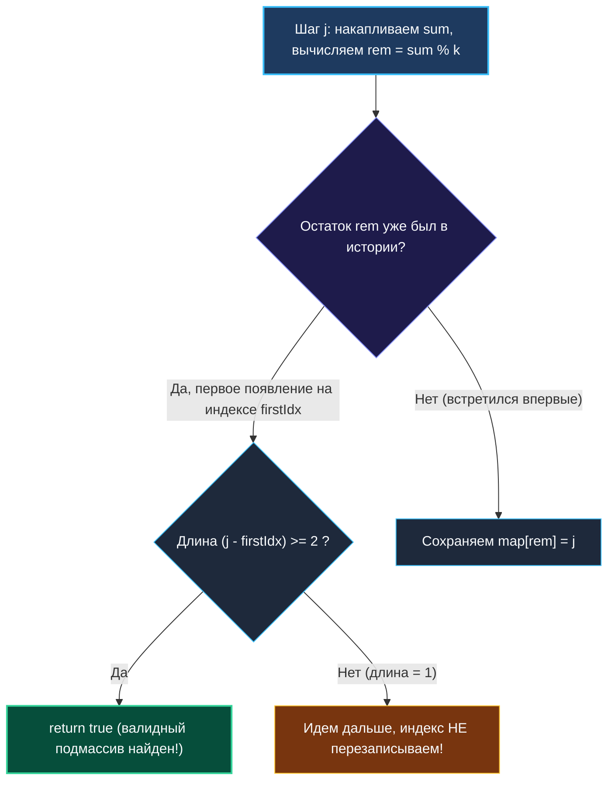

# 5. Continuous Subarray Sum

> *«В теории чисел нет ничего более практичного, чем арифметика остатков. Она позволяет сжать бесконечные числовые ряды до компактного кольца вычетов».*  
> — Карл Фридрих Гаусс

> 💡 **Связанные темы:**
> - [[4. Subarray Sum Equals K]] — базовый паттерн «префиксные суммы + хеш-таблица»
> - [[6. Maximum Size Subarray Sum Equals K]] — поиск подмассива максимальной длины
> - [[1. Теория. Префиксные суммы]] — математический фундамент
> - [[sources/21. Задачи с LeetCode и собеседований на Go/02. Задачи/22. Битовые операции/1. Теория. Битовые операции|22. Битовые операции]] — оптимизация вычислений остатка степени двойки

---

## Введение: Переход от точного равенства к кратности

Задача **Continuous Subarray Sum** (LeetCode 523) развивает идею [[4. Subarray Sum Equals K]].
Вместо поиска подмассива с точной суммой $k$, нас просят найти подмассив **длины не менее 2**, сумма которого **делится на $k$ без остатка** (кратна $k$).

Формально:
$$\sum_{m=i}^{j} nums[m] = c \cdot k, \quad \text{где } j - i + 1 \ge 2, \; c \in \mathbb{Z}$$

Кажется, что задача усложнилась: чисел, кратных $k$, бесконечно много ($0, k, 2k, -k, 3k \dots$). Неужели придется проверять каждое из них в хеш-таблице?  
Вовсе нет! На помощь приходит классическая **модульная арифметика Гаусса**.

---

## 🎯 Вопросы для уточнения условий (Interview Warm-up)

1. **Значение $k$:**  
   *«Может ли $k$ быть отрицательным или нулевым?»*  
   *(Если $k < 0$, кратность $k$ эквивалентна кратности $|k|$. Если $k = 0$, делимость на 0 не определена: сумма подмассива должна быть строго 0, что сводится к двум подряд идущим нулям).*
2. **Отрицательные элементы в `nums`:**  
   *«Могут ли элементы массива быть отрицательными?»*  
   *(В оригинальном LeetCode 523 числа неотрицательные, но на реальном собеседовании отрицательные числа гарантированно добавят, чтобы проверить ваше понимание работы оператора `%` в Go).*
3. **Ограничение по длине:**  
   *«Длина подмассива строго $\ge 2$?»*  
   *(Да! Одиночный элемент, даже если он равен $k$, решением не является).*

---

## Математическая модель: Сравнение по модулю

Вспомним формулу суммы отрезка через префиксы:
$$\text{Sum}(i, j) = P[j+1] - P[i]$$

Условие делимости на $k$:
$$(P[j+1] - P[i]) \pmod k = 0$$

В теории чисел это означает, что разность сравнима с нулем по модулю $k$:
$$P[j+1] \equiv P[i] \pmod k$$

**Фундаментальный инсайт:**  
Сумма подмассива кратна $k$ тогда и только тогда, когда **остатки от деления префиксных сумм на $k$ совпадают**!  
Нам больше не нужно искать миллионы кратных значений. Достаточно отслеживать остаток $rem \in [0, k-1]$. Если мы снова встретили остаток, который уже видели раньше на расстоянии не менее двух элементов — задача решена!



---

## 🛑 Ловушка Go: Поведение оператора `%` с отрицательными числами

В математике и в Python остаток от деления всегда неотрицателен:
$$-5 \pmod 3 = 1 \quad (\text{так как } -5 = (-2) \cdot 3 + 1)$$

Однако в языках с семантикой стандарта C99 (Go, C, C++, Java, Rust) оператор `%` является оператором **усеченного деления** (truncated division) и сохраняет знак делимого:
```go
fmt.Println(-5 % 3) // Выведет -2, а не 1!
```

Если не нормализовать остаток, ключи `-2` и `1` попадут в разные ячейки хеш-таблицы, и алгоритм пропустит решение.

> [!warning] Идиома нормализации остатка в Go
> ```go
> rem := int(((sum % int64(k)) + int64(k)) % int64(k))
> ```
> Эта каноническая конструкция гарантирует, что $rem \in [0, k-1]$ независимо от знака `sum`.

---

## 🛠️ Оптимальное решение на Go

```go
package continuoussum

// CheckSubarraySum проверяет наличие подмассива длины >= 2 с суммой, кратной k.
// Сложность: O(N) по времени, O(min(N, k)) по памяти.
func CheckSubarraySum(nums []int, k int) bool {
    n := len(nums)
    if n < 2 {
        return false
    }

    // Краевой случай k == 0: сумма кратна 0, только если сумма сама равна 0.
    // Для неотрицательных чисел это эквивалентно двум нулям подряд.
    if k == 0 {
        for i := 1; i < n; i++ {
            if nums[i] == 0 && nums[i-1] == 0 {
                return true
            }
        }
        return false
    }

    k64 := int64(k)
    if k64 < 0 {
        k64 = -k64 // Кратность отрицательному k эквивалентна кратности |k|
    }

    // firstSeen хранит: остаток -> самый первый индекс, на котором он возник
    firstSeen := make(map[int]int)

    // КРИТИЧЕСКИЙ ИНВАРИАНТ:
    // Пустой префикс (до индекса 0) имеет сумму 0, остаток 0 и виртуальный индекс -1!
    // Длина подмассива от 0 до j вычисляется как: j - (-1) = j + 1 >= 2 при j >= 1.
    firstSeen[0] = -1

    var prefixSum int64 = 0
    for i, num := range nums {
        prefixSum += int64(num)

        // Нормализуем остаток
        rem := int(((prefixSum % k64) + k64) % k64)

        if firstIdx, exists := firstSeen[rem]; exists {
            // Проверяем расстояние между индексами
            if i-firstIdx >= 2 {
                return true
            }
            // ВАЖНО: не обновляем firstSeen[rem]! Нам нужен самый ранний индекс.
        } else {
            firstSeen[rem] = i
        }
    }

    return false
}
```

---

## ⚙️ Mechanical Sympathy: Массив на стеке вместо хеш-таблицы при малых $K$

Если на собеседовании интервьюер скажет: *«Число $k$ гарантированно не превышает $1000$»*, сеньор-разработчик не станет использовать `map[int]int`.

Почему?
1. `map` аллоцирует бакеты в куче (`heap`), нагружая сборщик мусора Go (GC);
2. Поиск по ключу в `map` требует хеширования и прыжков по памяти (Cache Misses).

При $k \le 1000$ мы можем выделить **массив фиксированного размера прямо на стеке горутины**:
```go
// Выделяется на стеке (0 аллокаций в куче!)
var seen [1000]int
for i := range seen {
    seen[i] = -2 // -2 означает "остаток еще не встречался"
}
seen[0] = -1 // пустой префикс

// Доступ seen[rem] выполняется за 1 такт CPU через адресацию по смещению!
```
Такой код работает на порядок быстрее и имеет абсолютно детерминированную задержку (Zero Jitter).

---

## 💡 Вопросы для собеседования

> [!interview] Вопросы на засыпку:
> 1. **Зачем мы сохраняем `firstSeen[0] = -1`?**  
>    *Ответ:* Если префикс от самого начала массива `nums[0..1]` делится на $k$, его сумма дает остаток $0$. При `i = 1` длина составит `1 - (-1) = 2`, что удовлетворяет условию задачи. Без этой инициализации мы потеряли бы все валидные префиксы, начинающиеся с нулевого индекса.
> 2. **Почему при повторной встрече остатка мы не перезаписываем его индекс?**  
>    *Ответ:* Нам нужно, чтобы расстояние `i - firstIdx` было как можно больше (как минимум $\ge 2$). Чем левее `firstIdx`, тем выше шанс удовлетворить условию по длине.
> 3. **Какова пространственная сложность?**  
>    *Ответ:* Не более $O(\min(N, k))$, так как различных остатков по модулю $k$ существует ровно $k$ штук.

---

## 🗺️ Навигация

| Назад | Вперед |
| :--- | :--- |
| ← [[4. Subarray Sum Equals K]] | [[6. Maximum Size Subarray Sum Equals K]] → |