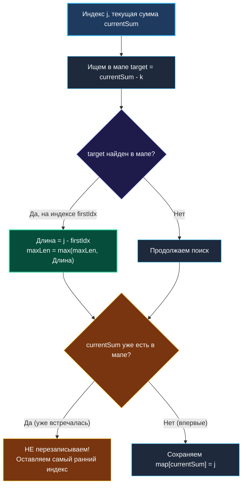

# 6. Maximum Size Subarray Sum Equals K

> *«В поисках максимума самое трудное — не забыть самое первое начало».*  
> — Эдсгер Дейкстра

> 💡 **Связанные темы:**
> - [[4. Subarray Sum Equals K]] — подсчет общего количества подмассивов
> - [[5. Continuous Subarray Sum]] — кратность суммы числу $k$
> - [[1. Теория. Префиксные суммы]] — математика префиксных сумм
> - [[sources/21. Задачи с LeetCode и собеседований на Go/02. Задачи/03. Скользящее окно/1. Теория. Скользящее окно|03. Скользящее окно]] — почему монотонность нарушается при отрицательных числах

---

## Введение: От подсчета количества к максимизации длины

Задача **Maximum Size Subarray Sum Equals K** (LeetCode 325) — классическое продолжение темы [[4. Subarray Sum Equals K]].  
Если там требовалось подсчитать *количество* всех валидных подмассивов, то теперь перед нами стоит оптимизационная цель: найти **наибольшую длину** непрерывного подмассива, дающего в сумме ровно $k$. Если таких подмассивов нет — вернуть `0`.

Казалось бы, изменение в условии минимально. Но оно кардинально меняет логику работы с хеш-таблицей!

---

## 🎯 Вопросы для уточнения условий (Interview Warm-up)

1. **Знаки чисел:**  
   *«Могут ли числа быть отрицательными?»*  
   *(Да! Если бы числа были строго положительными, задача решалась бы двумя указателями за $O(1)$ памяти. Отрицательные числа делают необходимым использование префиксных сумм).*
2. **Что возвращать, если подходящих подмассивов нет?**  
   *(Возвращаем `0`).*
3. **Значение $k$:**  
   *«Может ли $k$ быть равным нулю?»*  
   *(Да! $k=0$ — частый случай: поиск самого длинного отрезка, где положительные и отрицательные числа уравновешивают друг друга).*

---

## Инверсия формулы и ключевой инвариант

Как и прежде, сумма отрезка от $i$ до $j$ выражается через префиксы:
$$P[j+1] - P[i] = k \implies P[i] = P[j+1] - k$$

Длина подмассива от индекса $i$ до индекса $j$ (включительно) равна:
$$\text{Length} = j - i + 1$$

Чтобы длина была **максимальной** при текущем фиксированном правом конце $j$, левая граница $i$ обязана быть **как можно меньше** — то есть находиться как можно ближе к началу массива!

**Золотое правило алгоритма:**  
В хеш-таблице мы сохраняем **только самое первое (самое раннее)** появление каждой префиксной суммы! Если эта сумма встретится нам снова на более поздних шагах, мы **игнорируем** ее и сохраняем старый индекс.



---

## 🛠️ Оптимальное решение на Go

```go
package maxsubarr

// MaxSubArrayLen находит максимальную длину подмассива с суммой k.
// Сложность: O(N) по времени, O(N) по памяти.
func MaxSubArrayLen(nums []int, k int) int {
    // firstIndex хранит: префиксная сумма -> самый первый индекс, где она возникла
    firstIndex := make(map[int64]int, len(nums)+1)

    // КРИТИЧЕСКИЙ ИНВАРИАНТ:
    // Пустой префикс с суммой 0 находится "до начала массива" — на индексе -1!
    // Это позволяет подмассиву от 0 до j иметь длину j - (-1) = j + 1.
    firstIndex[0] = -1

    var maxLen int
    var currentSum int64
    targetK := int64(k)

    for j, num := range nums {
        currentSum += int64(num)

        // Ищем в истории префикс P[i] = currentSum - targetK
        needed := currentSum - targetK
        if firstIdx, exists := firstIndex[needed]; exists {
            length := j - firstIdx
            if length > maxLen {
                maxLen = length
            }
        }

        // ВАЖНО: сохраняем индекс только если такой суммы еще не было!
        // Нам нужен самый левый (минимальный) индекс для максимизации длины.
        if _, exists := firstIndex[currentSum]; !exists {
            firstIndex[currentSum] = j
        }
    }

    return maxLen
}
```

---

## 🛑 Главная ловушка: перезапись индекса в мапе

> [!warning] Ошибка 80% кандидатов
> Запись вида `firstIndex[currentSum] = j` без проверки `if !exists` разрушает весь алгоритм!  
> Представьте массив: `nums = [1, -1, 1, -1, 1]` и $k = 1$.  
> Префиксные суммы чередуются: $1, 0, 1, 0, 1$.  
> Если вы будете перезаписывать индекс нуля при каждом появлении, то к концу массива индекс нуля сместится на 3. И когда вы на последнем элементе будете искать $target = 1 - 1 = 0$, вы найдете индекс 3 и посчитаете длину $4 - 3 = 1$.  
> В то время как настоящий ответ — весь массив длины $5$ (начиная с виртуального индекса $-1$: $4 - (-1) = 5$).  
> **Никогда не затирайте самый первый индекс!**

---

## ⚙️ Mechanical Sympathy: Внутреннее устройство `hmap` и кэш

> [!info] Как `map[int64]int` размещается в памяти?
> 1. **Выравнивание по 8 байт:** И ключ `int64`, и значение `int` занимают ровно 8 байт. В бакете `bmap` Go хранит 8 ключей подряд, а затем 8 значений подряд. Это гарантирует отсутствие межбайтового паддинга (padding waste) и идеальное 64-битное выравнивание.
> 2. **Предсказуемость против случайности:** При $N = 10^5$ мапа займет порядка нескольких мегабайт. Поиск префикса прыгает по случайным бакетам в зависимости от младших бит хеша. Поэтому предварительное выделение емкости `make(map[int64]int, len(nums)+1)` избавляет рантайм от дорогостоящих переаллокаций и фрагментации страниц виртуальной памяти OS.

---

## 🏭 Практическое применение в System Design

1. **Анализ финансовых периодов безубыточности:**  
   Поиск самого продолжительного непрерывного периода в истории компании, когда операционные доходы и расходы полностью компенсировали друг друга ($k = 0$).
2. **Анализ сетевых сессий (TCP Zero Window):**  
   Поиск максимального окна времени, на протяжении которого подтвержденный объем переданных байт в точности соответствовал квоте буфера приемника.

---

## 💡 Вопросы для самопроверки

> [!interview] Вопросы сеньор-уровня:
> 1. **Зачем инициализировать `firstIndex[0] = -1`?**  
>    *Ответ:* Если префикс от индекса $0$ до $j$ уже дает сумму $k$, то $currentSum - k = 0$. Формула $j - (-1) = j + 1$ точно возвращает количество элементов от $0$ до $j$. Без этой записи мы бы не смогли обнаружить подмассивы, стартующие с самого первого элемента.
> 2. **Какова пространственная сложность?**  
>    *Ответ:* В худшем случае (когда все промежуточные суммы уникальны) — $O(N)$ памяти под хеш-таблицу.
> 3. **Можно ли решить задачу за $O(1)$ памяти?**  
>    *Ответ:* Если массив содержит отрицательные числа — в общем случае нет, так как нельзя предсказать монотонность. Если бы числа были строго положительными — да, с помощью скользящего окна за $O(1)$ памяти.

---

## 🗺️ Навигация

| Назад | Вперед |
| :--- | :--- |
| ← [[5. Continuous Subarray Sum]] | [[sources/21. Задачи с LeetCode и собеседований на Go/02. Задачи/05. Хеш таблицы/1. Теория. Хеш таблицы|05. Хеш таблицы: 1. Теория]] → |