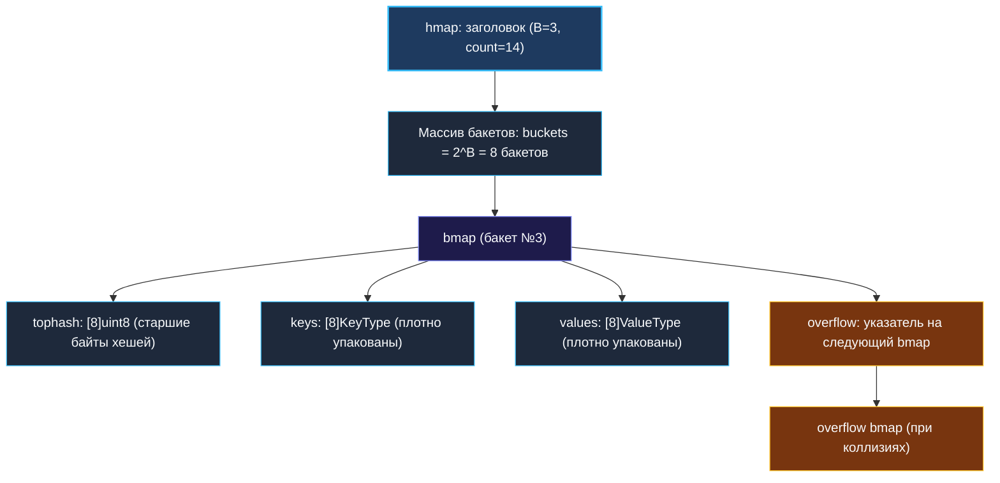

# 1. Теория. Хеш таблицы

> *«Таблицы с вычислением ключей — это то место в компьютерных науках, где абстрактная математическая вероятность превращается в осязаемую физическую скорость процессора».*  
> — Дональд Кнут

> 💡 **Связанные темы:**
> - [[2. Частотные паттерны]] — базовые приемы агрегации данных
> - [[3. Group Anagrams]] — канонизация ключей для группировки
> - [[7. Contains Duplicate]] — множество `map[T]struct{}` с нулевой аллокацией значений
> - [[9. Insert Delete GetRandom O1]] — гибридизация хеш-таблицы и слайса
> - [[sources/21. Задачи с LeetCode и собеседований на Go/01. Теория/02. Асимптотический анализ|02. Асимптотический анализ]] — амортизированная сложность $O(1)$ vs худший случай $O(N)$

---

## Введение: Сердце бэкенд-архитектуры

Хеш-таблица — безусловно, самая часто используемая структура данных в бэкенде. Кэши в оперативной памяти (Redis, Memcached, in-memory cache), маршрутизация HTTP-запросов по URL, индексация в базах данных, сессии пользователей, дедупликация событий в шинах сообщений (Kafka, RabbitMQ) — все они полагаются на фундаментальное обещание: **доступ к данным за константное время $O(1)$**.

Но за видимой простотой синтаксиса `val, ok := m[key]` в Go скрывается один из самых изощренных механизмов стандартной библиотеки и рантайма, непрерывно эволюционирующий от классической архитектуры `hmap/bmap` к швейцарским таблицам (Swiss Tables в Go 1.24+).

---

## 🎯 Вопросы для уточнения условий (Interview Warm-up)

Когда на собеседовании речь заходит о хеш-таблицах в Go, проверьте себя по этим фундаментальным вопросам:
1. **Потокобезопасность:** *«Является ли стандартная `map` в Go потокобезопасной?»*  
   *(Категорически нет! Одновременная запись и чтение без синхронизации вызывают немедленный краш всего процесса: `fatal error: concurrent map read and map write`, который невозможно перехватить через `recover()`).*
2. **Адресуемость элементов:** *«Можно ли взять указатель на элемент мапы: `ptr := &m[key]`?»*  
   *(Нет, это запрещено компилятором, поскольку при эвакуации бакетов адреса элементов в памяти физически меняются).*
3. **Порядок итерации:** *«Почему обход `for k, v := range m` выдает элементы в разном порядке?»*  
   *(Рантайм Go намеренно рандомизирует начальный бакет и оффсет при каждом вызове `mapiterinit`, чтобы разработчики не полагались на случайный порядок).*
4. **Zero-value и `nil map`:** *«Что произойдет при чтении из `nil` мапы и при записи в нее?»*  
   *(Чтение безопасно возвращает нулевое значение типа, а запись немедленно паникует: `panic: assignment to entry in nil map`).*

---

## Как устроена `map` в Go: Архитектура рантайма

### 1. Классическая модель: `hmap` и `bmap` (до Go 1.23)

В рантайме Go (`src/runtime/map.go`) карта представлена структурой `hmap`:

```go
type hmap struct {
    count      int            // Общее число элементов
    flags      uint8          // Флаги состояния (например, hashWriting)
    B          uint8          // log2 от числа бакетов (len(buckets) == 2^B)
    noverflow  uint16         // Приблизительное число overflow-бакетов
    hash0      uint32         // Случайная соль хеш-функции (защита от HashDoS атак)
    buckets    unsafe.Pointer // Указатель на массив бакетов bmap
    oldbuckets unsafe.Pointer // Указатель на старые бакеты во время эвакуации
    nevacuate  uintptr        // Счетчик прогресса эвакуации
    extra      *mapextra      // Ссылки на overflow-бакеты для сборщика мусора
}
```



---

## ⚙️ Mechanical Sympathy: Секреты производительности бакета

Каждый бакет `bmap` спроектирован с исключительным пониманием архитектуры CPU:

### 1. Вектор `tophash` для мгновенного отсечения промахов
Вместо того чтобы сравнивать громоздкие ключи (например, строки по 100 символов), процессор сначала сканирует массив `tophash [8]uint8` — старшие 8 бит хеша ключа.  
Сравнение 8 байт происходит за считанные такты CPU. Только при совпадении байта `tophash` рантайм переходит к побайтовому сравнению самого ключа. Это спасает процессор от штрафов сброса конвейера.

### 2. Раздельное хранение Keys и Values (Memory Alignment)
Вместо пар `struct { key K; val V }` рантайм хранит сначала 8 ключей подряд, затем 8 значений подряд:
```go
// Концептуальный вид бакета
type bmap struct {
    tophash  [8]uint8
    keys     [8]KeyType
    values   [8]ValueType
    overflow *bmap
}
```
**Зачем это сделано?**  
Представьте `map[int8]int64`. Если бы они лежали парами, компилятор добавлял бы по 7 байт паддинга (padding) к каждому `int8` ради 8-байтового выравнивания `int64`.  
Раздельная компоновка устраняет паддинг, сокращая размер бакета почти вдвое и позволяя уместить больше полезных данных в одну 64-байтную кэш-линию процессора!

---

## 🚀 Эволюция: Swiss Tables в Go 1.24+

Начиная с Go 1.24, рантайм внедряет новую реализацию `map` на базе **Swiss Tables** (разработка Google, изначально созданная для C++ `absl::flat_hash_map`).

### Что изменилось?
1. **Открытая адресация группами (Group Probing):** Вместо цепочек overflow-бакетов данные хранятся в непрерывных массивах слотов, разбитых на группы по 8 элементов (`MapGroupSlots = 8`).
2. **SWAR/SIMD-поиск по метаданным:** Каждая группа снабжена 8-байтным контрольным словом (Control Word / `ctrlGroup`). Процессор с помощью параллельных побитовых операций SWAR (или векторных инструкций) за единичные инструкции сверяет 7-битный хэш `h2` сразу со всеми 8 слотами группы!
3. **Сокращение расхода памяти:** Память утилизируется значительно эффективнее, а число Cache Misses при коллизиях снизилось на 30–50%.

---

## Инкрементальная эвакуация (Resize)

В Go порог загрузки (Load Factor) классической мапы равен **6.5** (в среднем 6.5 элементов на бакет).
Когда этот порог превышается:
1. Выделяется новый массив бакетов удвоенного размера ($2^{B+1}$).
2. Перенос данных происходит **не одномоментно**, а **инкрементально** (по 2 бакета за каждую последующую операцию записи или удаления).
3. Это полностью предотвращает длительные задержки (Latency Spikes), столь характерные для Java `HashMap` или C++ `std::unordered_map`.

> [!info] Преаллокация спасает продакшн
> Если вам заранее известно примерное число элементов $N$, всегда пишите:
> ```go
> m := make(map[string]User, n)
> ```
> Это избавит рантайм от серий эвакуаций, перехеширования и фрагментации страниц памяти.

---

## 🧹 Garbage Collector и `map` без указателей

Сборщик мусора Go (Tri-color Mark-and-Sweep) обязан сканировать всю память, содержащую указатели.
Если у вас в памяти висит `map[int]int` на $10\,000\,000$ записей:
- Типы `int` не содержат указателей.
- Рантайм Go помечает внутренний массив бакетов специальным флагом `haspointers = false`.
- **Сборщик мусора пропускает весь этот гигантский массив целиком!** Паузы GC составляют микросекунды.

Но если вы используете `map[string]*User` или `map[int][]byte`:
- GC вынужден обойти миллионы указателей при каждом цикле сборки. Паузы Stop-The-World возрастают до сотен миллисекунд.

> [!tip] Сеньорский трюк для Highload
> При проектировании больших in-memory кэшей заменяйте ключи-строки на целочисленные хеши `uint64`, а сложные структуры храните в плоских предвыделенных слайсах, ссылаясь на них по целочисленному индексу `map[uint64]uint32`. Это полностью освободит GC от сканирования вашей таблицы.

---

## 🔒 Конкурентность: `map` vs `sync.RWMutex` vs `sync.Map`

| Сценарий | Рекомендуемый инструмент | Почему? |
|---|---|---|
| Однопоточный код | `map[K]V` | Максимальная скорость, zero overhead |
| Конкурентный доступ (смешанный) | `map[K]V` + `sync.RWMutex` | Предсказуемая производительность, типизация |
| Read-heavy (редкая запись, частое чтение) | `sync.Map` | Lock-free чтение через атомарную замену `read` map |
| Раздельные множества ключей для горутин | `sync.Map` | Минимальная конкуренция за кэш-линии CPU |

---

## 🚨 Подводные камни и частые ошибки

> [!warning] Ошибка 1: Модификация поля структуры в мапе
> ```go
> type Counter struct { Count int }
> m := map[string]Counter{"app": {Count: 1}}
> m["app"].Count++ // Ошибка компиляции: cannot assign to struct field m["app"].Count in map
> ```
> **Причина:** Значения в мапе не адресуемы (`not addressable`).  
> **Решение:** Хранить указатели `map[string]*Counter` либо извлекать структуру во временную переменную, менять и записывать обратно.

> [!warning] Ошибка 2: «Утечка» памяти при удалении ключей (`delete`)
> Операция `delete(m, key)` удаляет элемент и помечает слот пустым, но **не уменьшает размер выделенной под бакеты памяти**! Память возвращается операционной системе только тогда, когда удаляется вся `map` целиком.  
> Если в процессе работы в мапу залили $10^7$ записей, а затем удалили все, кроме 10, она продолжит занимать сотни мегабайт.  
> **Решение:** Периодически пересоздавать мапу и копировать в нее оставшиеся элементы.

---

## 🗺️ Навигация

| Назад | Вперед |
| :--- | :--- |
| ← [[sources/21. Задачи с LeetCode и собеседований на Go/02. Задачи/04. Префиксные суммы/6. Maximum Size Subarray Sum Equals K|04. Префиксные суммы: 6. Maximum Size Subarray]] | [[2. Частотные паттерны]] → |