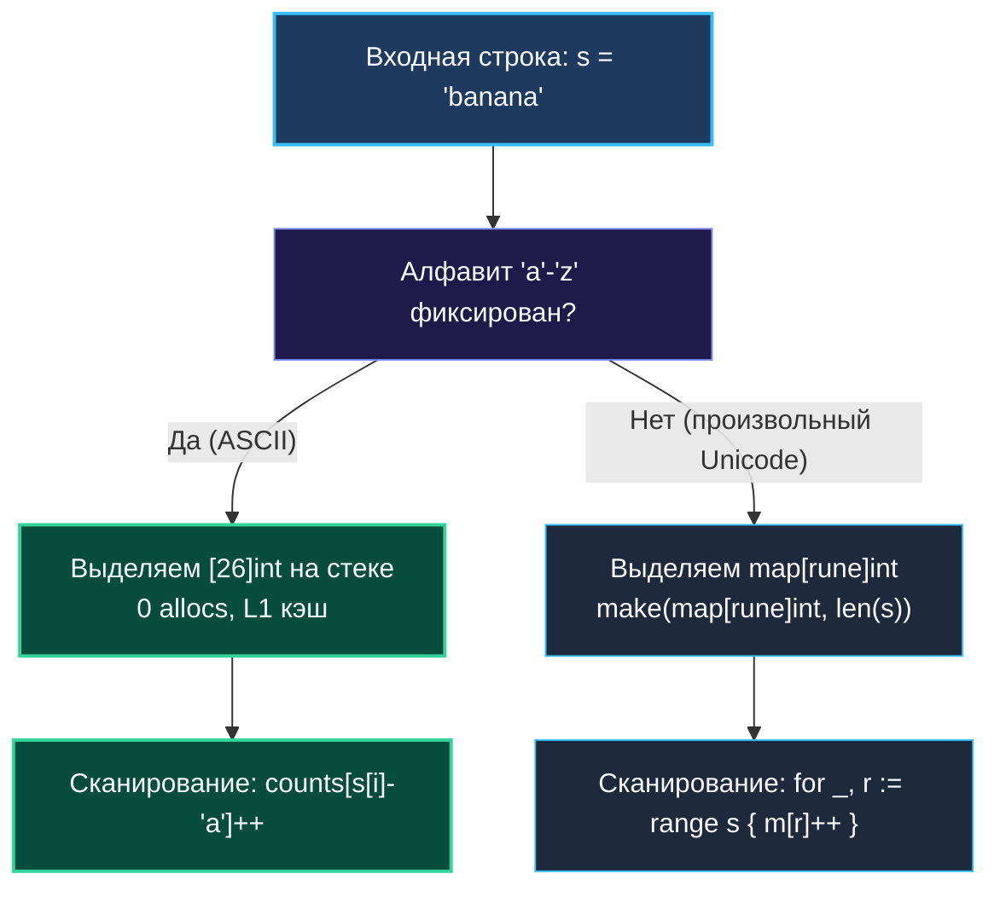

# 2. Частотные паттерны

> *«Вместо того чтобы сравнивать каждый предмет со всеми остальными, разложите их по подписанным коробкам. Порядок в алгоритмах рождается из классификации».*  
> — Чарльз Хоар

> 💡 **Связанные темы:**
> - [[1. Теория. Хеш таблицы]] — устройство `map`, бакеты и Swiss tables
> - [[3. Group Anagrams]] — группировка строк по частотной сигнатуре
> - [[4. Top K Frequent Elements]] — отбор наиболее часто встречающихся элементов
> - [[sources/21. Задачи с LeetCode и собеседований на Go/02. Задачи/01. Массивы и строки/12. Valid Anagram|01. Массивы и строки: 12. Valid Anagram]] — проверка анаграмм

---

## Введение: Сила частотного анализа

Частотный паттерн (Frequency Counter Pattern) — фундаментальная техника, позволяющая заменить дорогой квадратичный перебор пар $O(N^2)$ на два независимых линейных прохода $O(N)$.
Идея проста: мы проходим по коллекции один раз, подсчитывая количество вхождений каждого ключа в хеш-таблицу или массив-счетчик, а затем оперируем готовой статистикой.

В реальном бэкенде эта концепция встречается на каждом шагу:
- Агрегация HTTP-логов (подсчет RPS по статусам ответов `200`, `404`, `500`);
- Построение обратного индекса (Inverted Index) в полнотекстовых поисковых движках (Elasticsearch, Bleve);
- Детекция спама, ботнетов и Rate Limiting (Token Bucket / Sliding Window counters).

---

## 🎯 Вопросы для уточнения условий (Interview Warm-up)

1. **Размер алфавита:**  
   *«Ограничен ли набор ключей (например, только строчные латинские буквы `'a'-'z'`) или возможен произвольный Unicode/произвольные числа?»*  
   *(Если алфавит ограничен — используем массив `[26]int` на стеке вместо `map`).*
2. **Кодировка строк:**  
   *«Входные строки — это чистый ASCII (байты) или UTF-8 (символы переменной длины)?»*  
   *(В Go `s[i]` возвращает `byte`, а `for _, r := range s` дает `rune`).*
3. **Требуемый порядок:**  
   *«Важен ли порядок вывода результатов? (Помним, что `map` в Go не сохраняет порядок вставки).*»

---

## 🛠️ Идиоматичный Go: Магия Zero-Value

В языках вроде Java или Python разработчики вынуждены писать конструкции с проверкой наличия ключа (`getOrDefault` или `dict.get(k, 0)`).  
В Go благодаря концепции **Zero-Value** обращение к отсутствующему ключу возвращает нулевое значение типа (`0` для чисел). А синтаксис инкремента работает напрямую:

```go
freq := make(map[string]int)
words := []string{"apple", "banana", "apple", "cherry"}

for _, w := range words {
    freq[w]++ // Если ключа нет, вернется 0, прибавится 1 и запишется 1!
}
```

---

## ⚙️ Mechanical Sympathy: Стек против Кучи (`[26]int` vs `map`)

Хотя `map` дает асимптотическое $O(1)$, на реальном процессоре разница между хеш-таблицей и плоским массивом колоссальна:

| Характеристика | `map[byte]int` | `[26]int` (фиксированный массив) |
|---|---|---|
| Место в памяти | Куча (`heap`, структура `hmap` + бакеты) | **Стек горутины** (208 байт) |
| Аллокации | $\ge 1$ аллокация в куче | **0 аллокаций** |
| Нагрузка на GC | Требует сканирования сборщиком мусора | **GC полностью игнорирует стек** |
| Доступ к памяти | Хеширование, бакеты, Cache Misses | **Прямой сдвиг указателя (1 такт CPU)** |
| Локальность кэша | Разброс по страницам памяти | **Целиком помещается в 4 кэш-линии L1** |

```go
// Решение сеньор-уровня для ASCII:
func charFrequency(s string) [26]int {
    var counts [26]int // 208 байт на стеке
    for i := 0; i < len(s); i++ {
        counts[s[i]-'a']++
    }
    return counts
}
```



---

## 🛑 Ловушка Unicode: `byte` vs `rune`

Строки в Go — это иммутабельные срезы байт в кодировке UTF-8.
- Если вы итерируетесь по индексам `s[i]`, вы получаете **сырые байты (`byte`)**. Английские буквы занимают 1 байт, но русские буквы (`'п'`, `'р'`, `'и'`, `'в'`, `'е'`, `'т'`) или эмодзи занимают от 2 до 4 байт!
- При подсчете частот символов в многоязычных текстах обязательна итерация по **рунам (`rune` / `int32`)**:

```go
// Правильный подсчет для Unicode
func unicodeFrequency(s string) map[rune]int {
    freq := make(map[rune]int)
    for _, r := range s { // r имеет тип rune (Unicode code point)
        freq[r]++
    }
    return freq
}
```

---

## 💡 Типовые вариации частотного паттерна

1. **Двусторонняя сверка (Check Anagram / Ransom Note):**  
   Для первой строки увеличиваем счетчики `freq[ch]++`, для второй — уменьшаем `freq[ch]--`. Если любой счетчик уходит ниже нуля — коллекции не совпадают.
2. **Множество уникальных элементов (Set):**  
   В Go нет встроенного типа `Set`. Идиоматичный способ — карта пустых структур:
   ```go
   seen := make(map[int]struct{})
   seen[x] = struct{}{} // struct{} занимает ровно 0 байт памяти!
   ```
3. **Группировка по частотной сигнатуре:**  
   Массив частот `[26]int` можно использовать непосредственно в качестве **ключа мапы**:
   ```go
   groups := make(map[[26]int][]string)
   ```
   В Go массивы фиксированной длины `[26]int` сравнимы (`comparable`) и могут выступать ключами хеш-таблицы!

---

## 🗺️ Навигация

| Назад | Вперед |
| :--- | :--- |
| ← [[1. Теория. Хеш таблицы]] | [[3. Group Anagrams]] → |