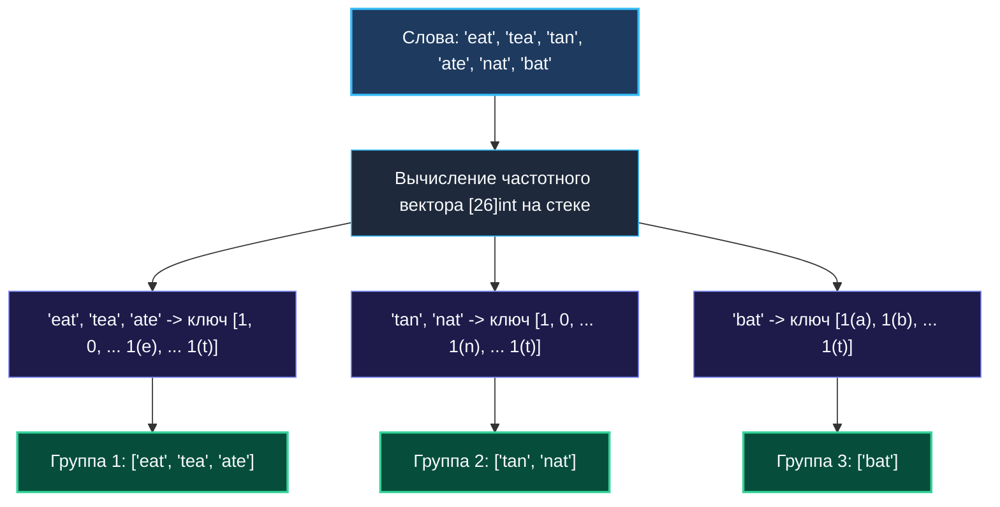

# 3. Group Anagrams

> *«Всякая перестановка сохраняет состав. Если научиться описывать инвариант формы, внешне разные сущности мгновенно объединяются в одну семью».*  
> — Брайан Керниган

> 💡 **Связанные темы:**
> - [[1. Теория. Хеш таблицы]] — устройство `map` и требования к ключам
> - [[2. Частотные паттерны]] — подсчет символов и массивы на стеке
> - [[4. Top K Frequent Elements]] — отбор K самых частых элементов
> - [[sources/21. Задачи с LeetCode и собеседований на Go/02. Задачи/01. Массивы и строки/12. Valid Anagram|01. Массивы и строки: 12. Valid Anagram]] — проверка единичной пары

---

## Введение: Инвариант анаграммы

Задача **Group Anagrams** (LeetCode 49) — один из самых элегантных тестов на знание языка Go и тонкостей работы с памятью.
Формулировка лаконична:
> *Дан массив строк `strs`. Сгруппировать анаграммы вместе. Анаграмма — это слово, полученное перестановкой букв другого слова (например, `"eat"`, `"tea"`, `"ate"`).*

Ключевой математический вопрос: **что является инвариантом анаграмм?**  
Два слова являются анаграммами тогда и только тогда, когда:
1. Либо их буквы, отсортированные по алфавиту, образуют идентичную строку (`"eat" -> "aet"`, `"tea" -> "aet"`);
2. Либо их векторы частот символов строго равны.

---

## 🎯 Вопросы для уточнения условий (Interview Warm-up)

1. **Алфавит и кодировка:**  
   *«Состоят ли строки только из строчных английских букв `a-z`, или в тексте могут встретиться пробелы, цифры и Unicode-символы?»*  
   *(В классическом условии — только `a-z`, что открывает дорогу к супер-оптимизации через массив `[26]int`).*
2. **Пустые строки:**  
   *«Могут ли строки быть пустыми `""`?»*  
   *(Да, пустые строки группируются вместе в отдельную группу).*
3. **Порядок групп и элементов:**  
   *«Важен ли порядок групп в итоговом ответе?»*  
   *(Нет, порядок может быть любым).*

---

## Подход 1: Сортировка как канонический ключ ($O(N \cdot K \log K)$)

Прямолинейный путь: отсортировать каждую строку по алфавиту и использовать результат как строковый ключ мапы `map[string][]string`.

```go
func groupAnagramsSort(strs []string) [][]string {
    groups := make(map[string][]string, len(strs))

    for _, s := range strs {
        // Конвертация в срез байт для сортировки
        b := []byte(s)
        sort.Slice(b, func(i, j int) bool {
            return b[i] < b[j]
        })
        key := string(b)
        groups[key] = append(groups[key], s)
    }

    result := make([][]string, 0, len(groups))
    for _, group := range groups {
        result = append(result, group)
    }
    return result
}
```

### В чем слабость этого решения для продакшена?
1. **Сложность:** $O(N \cdot K \log K)$, где $K$ — длина строки. Сортировка каждой строки дорога.
2. **Лишние аллокации в куче:** Строки в Go неизменяемы (`immutable`). Каждая конвертация `[]byte(s)` и обратная `string(b)` аллоцируют память в куче, создавая бессмысленную нагрузку на Garbage Collector.

---

## Подход 2: Фиксированный массив как ключ мапы ($O(N \cdot K)$)

В большинстве языков программирования (Java, Python, C++) вы не можете напрямую использовать массив как ключ хеш-таблицы (в Java `int[]` использует ссылочный `hashCode`, в C++ `std::unordered_map` требует отдельного функтора хеширования).

Но **в языке Go массивы фиксированного размера `[26]int` сравнимы оператором `==`**!  
А это значит, что массив может выступать ключом в `map` «из коробки» без каких-либо строковых конвертаций!

```go
package anagrams

// GroupAnagrams группирует слова-анаграммы за линейное время O(N * K).
func GroupAnagrams(strs []string) [][]string {
    // Ключ — 26-элементный массив счетчиков букв!
    groups := make(map[[26]int][]string, len(strs))

    for _, s := range strs {
        var counts [26]int // Выделяется на стеке (0 B/op в куче!)
        for i := 0; i < len(s); i++ {
            counts[s[i]-'a']++
        }
        groups[counts] = append(groups[counts], s)
    }

    result := make([][]string, 0, len(groups))
    for _, group := range groups {
        result = append(result, group)
    }
    return result
}
```



---

## ⚙️ Mechanical Sympathy: Как рантайм Go хеширует `[26]int`

> [!info] Под капотом рантайма
> 1. **Размер ключа в памяти:** Массив `[26]int` на 64-битной архитектуре занимает ровно $26 \times 8 = 208$ байт.
> 2. **Хеширование:** Для типов с фиксированным размером компилятор генерирует вызов `runtime.memhash`, который читает блок памяти 208 байт напрямую.
> 3. **Сравнение:** Сравнение двух ключей выполняется функцией `runtime.memequal` (оптимизированной векторизованными AVX/SSE инструкциями, сравнивающими память блоками по 32 или 64 байта за такт).
> 4. **Стек вместо кучи:** Массив `var counts [26]int` живет исключительно в стековом фрейме текущей функции. В кучу попадает только копия ключа внутри бакета мапы. Никаких промежуточных аллокаций `[]byte`!

---

## 🌐 Что делать, если строки содержат произвольный Unicode?

Если на собеседовании условие расширяют до произвольного Unicode (кириллица, китайские иероглифы, эмодзи), размер массива в 26 ячеек не подойдет.
Слайс `[]rune` или `map[rune]int` не могут быть ключами мапы (они несравнимы через `==`).

В этом случае строят **детерминированную строковую сигнатуру** через `strings.Builder`:
1. Подсчитываем частоты в `map[rune]int`;
2. Извлекаем уникальные руны и **сортируем их** (чтобы порядок записи был детерминированным!);
3. Формируем строку вида `"#а2#б1#в3"`.

```go
func makeUnicodeSignature(s string) string {
    freq := make(map[rune]int)
    for _, r := range s {
        freq[r]++
    }

    runes := make([]rune, 0, len(freq))
    for r := range freq {
        runes = append(runes, r)
    }
    sort.Slice(runes, func(i, j int) bool { return runes[i] < runes[j] })

    var sb strings.Builder
    for _, r := range runes {
        sb.WriteRune('#')
        sb.WriteRune(r)
        sb.WriteString(strconv.Itoa(freq[r]))
    }
    return sb.String()
}
```

---

## 💡 Вопросы для собеседования

> [!interview] Вопросы сеньор-уровня:
> 1. **Каковы временная и пространственная сложности решения с `[26]int`?**  
>    *Ответ:* Временная сложность $O(N \cdot K)$ — мы проходим по каждому символу каждой строки один раз. Память — $O(N \cdot K)$ для хранения всех сгруппированных строк в мапе.
> 2. **Почему нельзя использовать слайс `[]int` в качестве ключа мапы?**  
>    *Ответ:* В Go слайсы не поддерживают оператор `==` (за исключением сравнения с `nil`), так как слайс — это заголовок с указателем на мутабельный массив. Нельзя гарантировать неизменность хеша ключа. Массив фиксированного размера `[26]int` копируется по значению и является строго сравнимым.

---

## 🗺️ Навигация

| Назад | Вперед |
| :--- | :--- |
| ← [[2. Частотные паттерны]] | [[4. Top K Frequent Elements]] → |