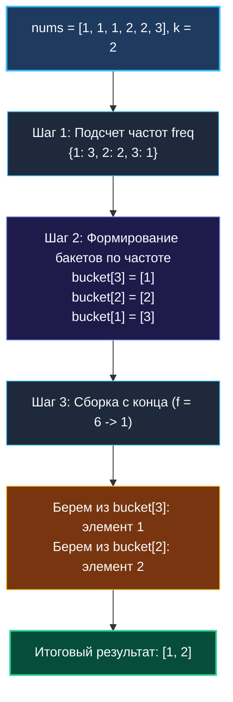

# 4. Top K Frequent Elements

> *«В реальных системах важно не то, сколько данных вы способны накопить, а то, насколько быстро вы извлекаете несколько самых ценных крупиц информации».*  
> — Брайан Керниган

> 💡 **Связанные темы:**
> - [[1. Теория. Хеш таблицы]] — устройство и асимптотика `map`
> - [[2. Частотные паттерны]] — подсчет частот и zero-values
> - [[sources/21. Задачи с LeetCode и собеседований на Go/02. Задачи/16. Кучи и Top K/1. Теория. Кучи|16. Кучи и Top K: 1. Теория]] — организация очередей с приоритетом
> - [[sources/21. Задачи с LeetCode и собеседований на Go/02. Задачи/28. Потоковые алгоритмы/2. Heavy hitters|28. Потоковые: Heavy Hitters]] — поиск частых элементов в бесконечных потоках

---

## Введение: От логов к ключевым инсайтам

Задача **Top K Frequent Elements** (LeetCode 347) моделирует одну из самых частых задач распределенного бэкенда:
> *Дан массив целых чисел `nums` и число `k`. Найти `k` наиболее часто встречающихся элементов.*

Примеры из жизни:
- **Антифрод и DDoS-защита:** найти $K$ IP-адресов, сгенерировавших наибольшее число сетевых запросов за последнюю минуту;
- **Маркетплейсы:** выявить $K$ самых продаваемых товаров дня;
- **Поисковые подсказки:** отобрать $K$ самых популярных поисковых запросов пользователей.

Задача интересна тем, что на ней можно продемонстрировать сразу три ступени инженерной зрелости: от наивной сортировки до идеального с точки зрения процессора алгоритма за $O(N)$.

---

## 🎯 Вопросы для уточнения условий (Interview Warm-up)

1. **Гарантия единственности ответа:**  
   *«Гарантируется ли, что $k$ самых частых элементов определены однозначно, или возможны совпадения частот на границе отсечения?»*  
   *(В LeetCode 347 ответ гарантированно уникален, но на собеседовании порядок элементов с одинаковой частотой может быть произвольным).*
2. **Диапазон $k$ относительно $N$:**  
   *«Каково соотношение между $k$ и размером массива $N$? $k \ll N$ (например, топ-10 из миллиона) или $k \approx N$?»*  
   *(Если $k$ мало, отлично работает куча $O(N \log k)$ или бакетная сортировка $O(N)$).*
3. **Статический массив vs Поток данных (Data Stream):**  
   *«Массив доступен целиком в памяти (Offline), или данные поступают непрерывным потоком (Online/Streaming)?»*

---

## Подход 1: Хеш-таблица + Сортировка ($O(N \log N)$)

Подсчитываем частоты всех элементов в `map[int]int`, извлекаем уникальные ключи в срез и сортируем их по убыванию частоты с помощью `sort.Slice`.

```go
func topKFrequentSort(nums []int, k int) []int {
    freq := make(map[int]int)
    for _, num := range nums {
        freq[num]++
    }

    keys := make([]int, 0, len(freq))
    for key := range freq {
        keys = append(keys, key)
    }

    sort.Slice(keys, func(i, j int) bool {
        return freq[keys[i]] > freq[keys[j]]
    })

    return keys[:k]
}
```
**Минус:** Сортировать весь массив уникальных элементов ради получения первых $k$ неэффективно при $N = 10^7$ и $k = 5$.

---

## Подход 2: Min-Heap фиксированного размера $k$ ($O(N \log k)$)

Если поддерживать кучу минимальных элементов (**Min-Heap**) емкостью строго $k$:
1. Складываем элементы в кучу по их частоте;
2. Как только размер кучи превышает $k$, выталкиваем наименьший элемент (`heap.Pop`);
3. В куче всегда остаются $k$ элементов с наибольшими частотами!

```go
package topk

import (
    "container/heap"
)

type pair struct {
    val  int
    freq int
}

type minHeap []pair

func (h minHeap) Len() int           { return len(h) }
func (h minHeap) Less(i, j int) bool { return h[i].freq < h[j].freq } // Min-Heap
func (h minHeap) Swap(i, j int)      { h[i], h[j] = h[j], h[i] }
func (h *minHeap) Push(x any)        { *h = append(*h, x.(pair)) }
func (h *minHeap) Pop() any {
    old := *h
    n := len(old)
    item := old[n-1]
    *h = old[:n-1]
    return item
}

func topKFrequentHeap(nums []int, k int) []int {
    freq := make(map[int]int)
    for _, n := range nums {
        freq[n]++
    }

    h := &minHeap{}
    heap.Init(h)

    for val, f := range freq {
        heap.Push(h, pair{val: val, freq: f})
        if h.Len() > k {
            heap.Pop(h) // Выбрасываем кандидата с минимальной частотой
        }
    }

    result := make([]int, k)
    for i := k - 1; i >= 0; i-- {
        result[i] = heap.Pop(h).(pair).val
    }
    return result
}
```

---

## Подход 3: Bucket Sort (Блочная сортировка) за строгое $O(N)$

> [!important] Ключевой инвариант
> Ни один элемент массива длины $N$ не может встретиться **чаще, чем $N$ раз**!  
> Частота любого элемента гарантированно лежит в диапазоне $[1, N]$.

Это позволяет применить **блочную сортировку по частотам**:
1. Считаем частоты в `map[int]int`;
2. Создаем срез бакетов `buckets := make([][]int, len(nums)+1)`, где индекс бакета — это сама **частота**;
3. Раскладываем элементы по бакетам: `buckets[f] = append(buckets[f], val)`;
4. Идем по бакетам **с конца** (от максимальной частоты $N$ к минимальной 1) и собираем первые $k$ элементов!

```go
package topk

// TopKFrequent находит k самых частых элементов за линейное время O(N).
func TopKFrequent(nums []int, k int) []int {
    n := len(nums)
    freq := make(map[int]int)
    for _, num := range nums {
        freq[num]++
    }

    // buckets[f] содержит список всех чисел, встретившихся ровно f раз
    buckets := make([][]int, n+1)
    for val, count := range freq {
        buckets[count] = append(buckets[count], val)
    }

    result := make([]int, 0, k)
    // Сканируем от максимальной частоты n вниз к 1
    for f := n; f >= 1 && len(result) < k; f-- {
        if len(buckets[f]) > 0 {
            for _, val := range buckets[f] {
                result = append(result, val)
                if len(result) == k {
                    break
                }
            }
        }
    }

    return result
}
```



---

## ⚙️ Mechanical Sympathy: Почему Bucket Sort выигрывает у Кучи на реальном CPU

1. **Кэш-локальность:** Обход массива `buckets` с конца — это строго последовательное чтение памяти. Hardware Prefetcher процессора подгружает смежные ячейки в L1 Data Cache до того, как они понадобятся.
2. **Отсутствие ветвлений кучи:** В куче операции `Push` и `Pop` вызывают логарифмическое просеивание (`siftUp`/`siftDown`), прыгая по индексам `2*i + 1` и `2*i + 2`. Это сбивает предсказатель переходов и вызывает промахи кэша.
3. **Асимптотика:** $O(N)$ времени против $O(N \log k)$ — при больших размерах данных бакетная сортировка работает в разы быстрее.

---

## 🏭 Применение в распределенных системах (System Design)

В реальных терабайтных распределенных потоках (Apache Flink, Kafka Streams) поддерживать точную мапу частот невозможно: памяти сервера не хватит на миллиарды уникальных ключей.

Для таких задач используют вероятностные структуры данных:
- **Count-Min Sketch:** Сжатая двумерная матрица счетчиков с несколькими хеш-функциями, позволяющая оценить частоту любого ключа за $O(1)$ памяти;
- **Алгоритм Мисры — Гриса (Misra-Gries / Heavy Hitters):** Поддержание скользящего окна из $K$ наиболее частых элементов с гарантированной погрешностью;
- **Top-K на MapReduce:** Локальная бакетная сортировка на каждом worker-узле с последующим объединением частичных топов на редюсере.

---

## 🗺️ Навигация

| Назад | Вперед |
| :--- | :--- |
| ← [[3. Group Anagrams]] | [[5. Isomorphic Strings]] → |