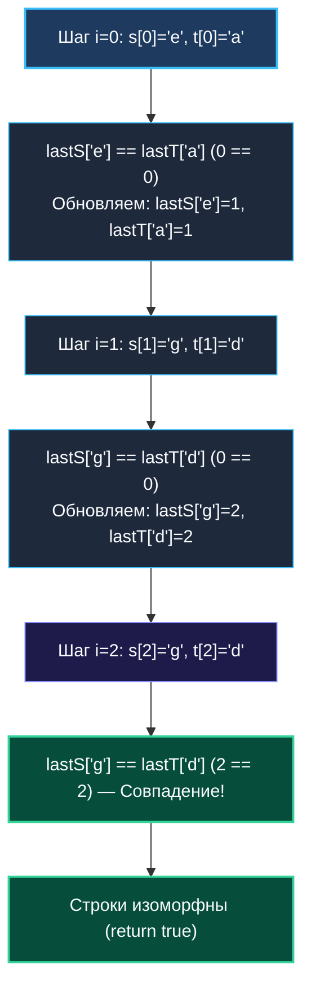

# 5. Isomorphic Strings

> *«Взаимно однозначное соответствие — это надежный мост между двумя мирами. Стоит разрушить симметрию, и мост неизбежно рухнет».*  
> — Анри Пуанкаре

> 💡 **Связанные темы:**
> - [[1. Теория. Хеш таблицы]] — базовая семантика хеш-таблиц
> - [[2. Частотные паттерны]] — массивы на стеке против кучи
> - [[6. Happy Number]] — детекция циклов и повторений
> - [[sources/21. Задачи с LeetCode и собеседований на Go/01. Теория/02. Асимптотический анализ|02. Асимптотический анализ]] — константы алгоритма и аппаратная эффективность

---

## Введение: Математика взаимно однозначного соответствия

Задача **Isomorphic Strings** (LeetCode 205) проверяет не просто умение оперировать хеш-таблицами, а понимание фундаментальной концепции дискретной математики — **биекции** (взаимно однозначного отображения).

Формулировка:
> *Даны две строки `s` и `t` одинаковой длины. Определить, являются ли они изоморфными.  
> Строки изоморфны, если символы в `s` можно заменить символами из `t` с сохранением порядка следования. Никакие два разных символа не могут отображаться в один и тот же символ (инъективность), и каждый символ должен иметь прообраз (сюръективность).*

Примеры:
- `"egg"` и `"add"` — изоморфны (`e -> a`, `g -> d`);
- `"foo"` и `"bar"` — не изоморфны (`o` не может одновременно мапиться в `a` и `r`);
- `"badc"` и `"baba"` — **не изоморфны**! Буква `b` в первой строке мапится в `b`, а затем буква `d` пытается тоже смапиться в `b` (коллизия прообразов).

---

## 🎯 Вопросы для уточнения условий (Interview Warm-up)

1. **Размер алфавита и символы:**  
   *«Могут ли строки содержать пробелы, спецсимволы, цифры или произвольный ASCII (0–255)?»*  
   *(В стандартном условии — любой печатный ASCII, до 256 значений).*
2. **Длина строк:**  
   *«Всегда ли длина `s` равна длине `t`?»*  
   *(Если длины не равны — строки гарантированно не изоморфны, возвращаем `false`).*
3. **Отображение в самого себя:**  
   *«Может ли символ отображаться сам в себя (например, `a -> a`)?»*  
   *(Да, символ может мапиться сам в себя, если это сохраняет взаимную однозначность).*

---

## 🛑 Главная ловушка: Односторонняя хеш-таблица

Типичная ошибка кандидатов — создать одну мапу `m := make(map[byte]byte)` и проверять отображение `s -> t`:
```go
// ОШИБКА: проверяет инъективность только в одну сторону!
for i := 0; i < len(s); i++ {
    if mapped, ok := m[s[i]]; ok {
        if mapped != t[i] { return false }
    } else {
        m[s[i]] = t[i]
    }
}
```
Для теста `s = "badc"`, `t = "baba"` этот код выдаст `true`, потому что:
- `'b' -> 'b'` (записали)
- `'a' -> 'a'` (записали)
- `'d' -> 'b'` (записали! Ведь ключа `'d'` в мапе еще не было!)
- `'c' -> 'a'` (записали!)

Но два разных символа `'b'` и `'d'` отобразились в один и тот же `'b'`. Биекция разрушена!

---

## Подход 1: Две хеш-таблицы (Двустороннее отображение)

Для честной биекции отслеживаем соответствие в обе стороны:
1. `mapST: s[i] -> t[i]`
2. `mapTS: t[i] -> s[i]`

```go
func isIsomorphicMaps(s, t string) bool {
    if len(s) != len(t) {
        return false
    }

    mapST := make(map[byte]byte, 256)
    mapTS := make(map[byte]byte, 256)

    for i := 0; i < len(s); i++ {
        cs, ct := s[i], t[i]

        if val, ok := mapST[cs]; ok && val != ct {
            return false
        }
        if val, ok := mapTS[ct]; ok && val != cs {
            return false
        }

        mapST[cs] = ct
        mapTS[ct] = cs
    }

    return true
}
```

---

## Подход 2: Mechanical Sympathy — Массивы на стеке и инвариант позиции

Зачем аллоцировать две хеш-таблицы в куче, если весь расширенный алфавит ASCII укладывается в 256 байт?

Вместо сохранения конкретных пар отображения применим красивый инвариант:
> **Если строки изоморфны, то позиции последнего появления символа $s[i]$ в строке $s$ и символа $t[i]$ в строке $t$ обязаны строго совпадать на каждом шаге!**

Создаем два массива `[256]int`.  
Значение `0` означает: символ еще ни разу не встречался.  
При первой встрече на позиции `i` записываем `i + 1` (сдвиг на 1, чтобы индекс 0 не путался с нулем по умолчанию).

```go
package isomorphic

// IsIsomorphic проверяет изоморфизм строк за O(N) времени и 0 аллокаций в куче.
func IsIsomorphic(s, t string) bool {
    if len(s) != len(t) {
        return false
    }

    // Два массива по 256 int (256 * 8 = 2048 байт каждый)
    // Размещаются на стеке горутины! Полное отсутствие GC паузы.
    var lastS [256]int
    var lastT [256]int

    for i := 0; i < len(s); i++ {
        cs := s[i]
        ct := t[i]

        // Если предыдущие позиции символов не совпадают — биекция нарушена
        if lastS[cs] != lastT[ct] {
            return false
        }

        // Обновляем позицию последнего вхождения (i+1 для отличия от zero-value)
        lastS[cs] = i + 1
        lastT[ct] = i + 1
    }

    return true
}
```



---

## ⚙️ Mechanical Sympathy: Архитектура процессора и L1 Data Cache

1. **2048 байт на массив:** Массив `[256]int` занимает 2 КБ. Два массива — 4 КБ. Это крошечная доля типичного L1 Data Cache современного процессора (32–48 КБ на ядро).
2. **Нулевой Escape Analysis:** Компилятор видит фиксированный размер `[256]int` и не выпускает переменные в кучу (`does not escape`). Сборщик мусора Go даже не замечает выполнения этой функции (`0 B/op, 0 allocs/op`).
3. **Прямая адресация памяти:** Доступ `lastS[cs]` компилируется в одну инструкцию процессора: чтение по базовому регистру со смещением `RSP + cs*8`. Никаких хеш-функций и проходов по бакетам.

---

## 🏭 Применение в System Design: Биекция в распределенных шлюзах

В микросервисной архитектуре биективное отображение критично при трансляции идентификаторов:
1. **API Gateway & Маскирование ID:** Преобразование внутренних 64-битных автоинкрементных ID базы данных в публичные зашифрованные токены (Hashids, UUIDv7) для клиентов. Если маппинг не биективен, один клиент случайно получит доступ к данным другого;
2. **Сжатие колоночных данных (Dictionary Encoding в Parquet/ClickHouse):** Строковые значения заменяются на целочисленные суррогатные ключи. Для корректной декомпрессии словарь обязан представлять собой строгую биекцию.

---

## 🗺️ Навигация

| Назад | Вперед |
| :--- | :--- |
| ← [[4. Top K Frequent Elements]] | [[6. Happy Number]] → |