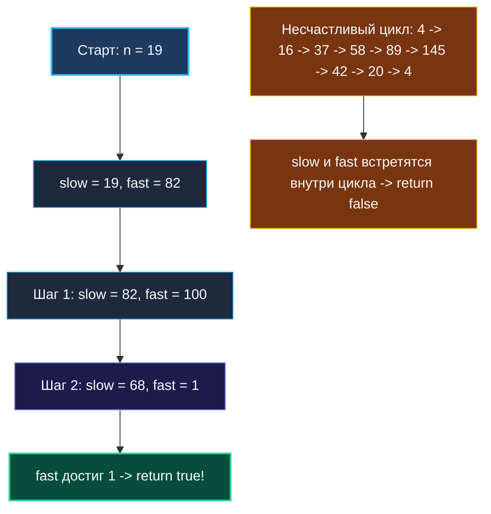

# 6. Happy Number

> *«Простейший способ обнаружить цикл — пустить по замкнутой трассе двух бегунов с разной скоростью. Если дорога закольцована, быстрый неизбежно догонит медленного».*  
> — Роберт Флойд

> 💡 **Связанные темы:**
> - [[1. Теория. Хеш таблицы]] — устройство `map` и множества
> - [[7. Contains Duplicate]] — множество с нулевой стоимостью значений `struct{}`
> - [[sources/21. Задачи с LeetCode и собеседований на Go/02. Задачи/08. Связные списки/5. Linked List Cycle|08. Связные списки: 5. Linked List Cycle]] — алгоритм двух указателей в графах

---

## Введение: Математический фокус или теория графов?

Задача **Happy Number** (LeetCode 202) на первый взгляд маскируется под абстрактную арифметическую головоломку:
> *Число называется счастливым, если повторяющийся процесс замены числа на сумму квадратов его десятичных цифр в итоге приводит к единице. Если процесс бесконечно зацикливается, не достигая 1, число считается несчастливым.*

Пример:
$$19 \to 1^2 + 9^2 = 82 \to 8^2 + 2^2 = 68 \to 6^2 + 8^2 = 100 \to 1^2 + 0^2 + 0^2 = 1 \quad (\text{Счастливое!})$$

Для практикующего бэкенд-инженера это **задача на обнаружение циклов в неявном ориентированном графе состояний**, где каждое число имеет ровно одно исходящее ребро: $x \to \text{sumOfSquares}(x)$.

---

## 🎯 Вопросы для уточнения условий (Interview Warm-up)

1. **Гарантия завершения:**  
   *«Может ли последовательность сумм квадратов неограниченно расти до бесконечности ($+\infty$), так и не войдя в цикл?»*  
   *(Нет! Для любого $32$-битного целого числа сумма квадратов цифр мгновенно схлопывается в компактный диапазон $\le 810$).*
2. **Ограничения по памяти:**  
   *«Допустимо ли решение с дополнительной памятью $O(\log N)$ (хеш-множество) или ожидается константная память $O(1)$?»*  
   *(На собеседовании решение с хеш-таблицей принимается как базовое, но для уровня Senior ждут двух указателей Флойда за $O(1)$ памяти).*

---

## 📐 Математическое доказательство ограниченности состояний

Почему числа не растут вечно?
Возьмем максимально возможное 32-битное положительное число: $2^{31}-1 = 2\,147\,483\,647$ (10 цифр).  
Наибольшую возможную сумму квадратов дает гипотетическое 10-значное число из одних девяток: $9999999999$.
$$\text{MaxSum} = 10 \times 9^2 = 10 \times 81 = 810$$

Это значит, что какое бы гигантское число нам ни дали на вход, уже после **одного шага** сумма квадратов гарантированно станет меньше или равна $810$.  
А в конечном множестве чисел $[1, 810]$ любой бесконечный процесс по принципу Дирихле **обязан либо закончиться единицей, либо войти в повторяющийся цикл**!

---

## Подход 1: Хеш-множество `map[int]struct{}` ($O(\log N)$ памяти)

Мы эмулируем процесс и запоминаем каждое посещенное число. Если число уже есть в множестве — цикл обнаружен.

```go
func isHappySet(n int) bool {
    // В Go идиоматичное множество — это map[T]struct{}
    // struct{} занимает ровно 0 байт памяти!
    seen := make(map[int]struct{})

    for n != 1 {
        if _, exists := seen[n]; exists {
            return false // Зациклились
        }
        seen[n] = struct{}{}
        n = getNext(n)
    }
    return true
}

func getNext(n int) int {
    sum := 0
    for n > 0 {
        d := n % 10
        sum += d * d
        n /= 10
    }
    return sum
}
```

---

## Подход 2: Алгоритм двух указателей Флойда ($O(1)$ памяти)

Вместо сохранения чисел в хеш-таблицу пустим по неявному графу двух «бегунов»:
- `slow` делает один шаг: $\text{slow} = \text{getNext}(\text{slow})$;
- `fast` делает два шага: $\text{fast} = \text{getNext}(\text{getNext}(\text{fast}))$.

Если цикл существует, `fast` неизбежно догонит `slow`. Если граф ведет к единице, `fast` первым коснется единицы.

```go
package happy

// IsHappy определяет, является ли число счастливым, за O(1) памяти.
func IsHappy(n int) bool {
    slow := n
    fast := getNext(n)

    for fast != 1 && slow != fast {
        slow = getNext(slow)
        fast = getNext(getNext(fast))
    }

    return fast == 1
}

func getNext(n int) int {
    sum := 0
    for n > 0 {
        digit := n % 10
        sum += digit * digit
        n /= 10
    }
    return sum
}
```



---

## ⚙️ Mechanical Sympathy: Регистры CPU против Аллокаций в куче

1. **Ноль аллокаций:** В решении Флойда переменные `slow`, `fast`, `digit`, `sum` — обычные примитивные `int`. Компилятор Go аллоцирует их прямо в **регистрах процессора** (`RAX`, `RBX`, `RCX`).
2. **Отсутствие пауз сборщика мусора:** Нет структуры `hmap`, нет бакетов, нет эвакуаций памяти. Программа работает с предельной аппаратной скоростью.
3. **Быстрое деление на 10:** Современные компиляторы заменяют операцию деления на 10 (`n / 10`) и взятия остатка (`n % 10`) на умножение на магическую константу с битовым сдвигом (Reciprocal Multiplication), превращая дорогой `DIV` в дешевый `MUL`.

---

## 🏭 Применение в System Design: Защита от шторма повторных попыток (Retry Storm)

В распределенных микросервисах круговые зависимости между сервисами ($A \to B \to C \to A$) при сбоях вызывают лавинообразные зацикленные повторные запросы.
Детектирование циклов в распределенной трассировке (OpenTelemetry / Jaeger Trace Context) использует тот же принцип: если идентификатор родительского спана встречается среди потомков (или интервалы хешей совпадают), срабатывает Circuit Breaker, предотвращающий падение кластера.

---

## 🗺️ Навигация

| Назад | Вперед |
| :--- | :--- |
| ← [[5. Isomorphic Strings]] | [[7. Contains Duplicate]] → |