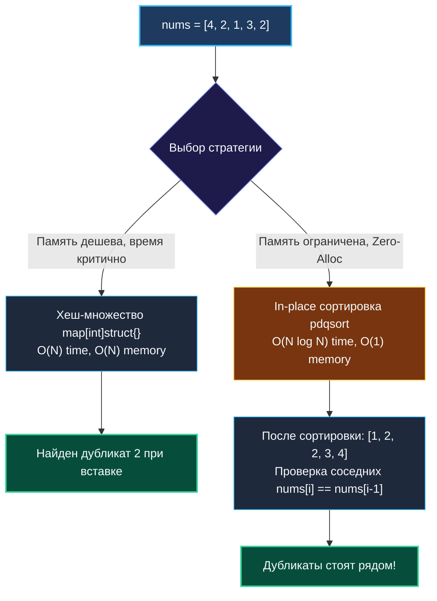

# 7. Contains Duplicate

> *«Простейшие вопросы часто вскрывают самые глубокие архитектурные компромиссы между временем, памятью и физическим устройством машины».*  
> — Брайан Керниган

> 💡 **Связанные темы:**
> - [[1. Теория. Хеш таблицы]] — устройство `map` и асимптотика поиска
> - [[6. Happy Number]] — множество с нулевой ценой значений `struct{}`
> - [[8. Longest Consecutive Sequence]] — развертывание последовательностей через хеш-множество
> - [[sources/21. Задачи с LeetCode и собеседований на Go/02. Задачи/01. Массивы и строки/2. Типовые операции и приёмы|01. Массивы и строки: 2. Типовые операции]] — дедупликация и сортировка

---

## Введение: Идемпотентность и краеугольный камень бэкенда

Задача **Contains Duplicate** (LeetCode 217) — классический разминочный вопрос технического интервью.
Формулировка:
> *Дан целочисленный массив `nums`. Вернуть `true`, если хотя бы одно значение встречается в массиве дважды или более, и `false`, если все элементы строго уникальны.*

За внешней простотой скрывается фундаментальный вызов бэкенд-разработки: **идемпотентность обработки сообщений**.
В любой распределенной системе (Kafka, RabbitMQ, платежные шлюзы с семантикой доставки *at-least-once*) дубликаты событий неизбежны. От того, как инженер проектирует дедупликацию, зависит надежность финансового баланса и стабильность сервиса под нагрузкой.

---

## 🎯 Вопросы для уточнения условий (Interview Warm-up)

1. **Мутабельность входного массива:**  
   *«Разрешено ли модифицировать (мутировать) исходный срез `nums` на месте (in-place)?»*  
   *(Если да — мы можем отсортировать массив без единого байта дополнительной памяти).*
2. **Ограничения по памяти:**  
   *«Что критичнее: абсолютная скорость $O(N)$ или минимальный объем используемой памяти $O(1)$?»*  
   *(Хеш-таблица дает $O(N)$ времени, но требует памяти; сортировка требует $O(N \log N)$ времени, но сохраняет $O(1)$ памяти).*
3. **Диапазон чисел:**  
   *«Каков диапазон значений? Если числа ограничены (например, от $0$ до $10^5$), мы можем применить битовый вектор (Bitset) вместо хеш-таблицы».*

---

## Подход 1: Хеш-множество `map[int]struct{}` ($O(N)$ времени, $O(N)$ памяти)

Идиоматичный путь в Go: используем хеш-таблицу в роли множества.  
Значением выступает пустая структура `struct{}`, занимающая ровно $0$ байт.

```go
package duplicate

// ContainsDuplicateSet проверяет наличие дубликатов за линейное время O(N).
func ContainsDuplicateSet(nums []int) bool {
    // Преаллокация емкости устраняет серийный рехешинг hmap
    seen := make(map[int]struct{}, len(nums))

    for _, num := range nums {
        if _, exists := seen[num]; exists {
            return true
        }
        seen[num] = struct{}{}
    }
    return false
}
```

---

## Подход 2: Mechanical Sympathy — Сортировка на месте ($O(N \log N)$ времени, $O(1)$ памяти)

А что, если в памяти лежит массив из $50\,000\,000$ чисел, и аллокация огромной хеш-таблицы вызовет Out-Of-Memory (OOM) и многосекундную паузу Garbage Collector?

Мы сортируем срез на месте с помощью современного пакета `slices.Sort` (Go 1.21+, алгоритм pdqsort — Pattern-defeating Quicksort):

```go
package duplicate

import "slices"

// ContainsDuplicateSort проверяет дубликаты без аллокаций в куче (0 B/op).
func ContainsDuplicateSort(nums []int) bool {
    slices.Sort(nums) // In-place сортировка pdqsort

    for i := 1; i < len(nums); i++ {
        if nums[i] == nums[i-1] {
            return true
        }
    }
    return false
}
```



---

## ⚙️ Mechanical Sympathy: Почему сортировка иногда побеждает мапу на практике

| Параметр | `map[int]struct{}` | `slices.Sort` (pdqsort) |
|---|---|---|
| Временная сложность | $O(N)$ в среднем | $O(N \log N)$ |
| Память | $O(N)$ в куче (heap) | **$O(1)$** |
| Паузы GC | Высокие при миллионах ключей | **0 микросекунд** |
| Доступ к памяти | Случайный (Cache Misses) | **Последовательный (Prefetcher friendly)** |

При очень больших объемах данных непрерывный линейный обход отсортированного среза целиком загружается процессором в L1 Data Cache. Аппаратный префетчер работает без задержек. В то же время хеш-таблица прыгает по случайным страницам RAM, вызывая задержки на подгрузку кэш-линий (DRAM Latency ~60-80 нс против 1 нс в L1).

---

## 🏭 Применение в распределенных системах: Дедупликация потока

Если данные приходят бесконечным потоком (Event Stream в Apache Kafka), хеш-таблица `map` бесконечно расти не может — сервер упадет по OOM.

Решения в продакшене:
1. **Фильтры Блума (Bloom Filter):** Компактная вероятностная структура на битовых массивах. Гарантирует: если фильтр ответил «элемента не было» — его точно не было (нет false negatives);
2. **Скользящее окно с TTL в Redis:** Хранение ключей дедупликации `idempotency_key:<UUID>` с автоматическим удалением через 24 часа (`SET key val EX 86400 NX`).

---

## 🗺️ Навигация

| Назад | Вперед |
| :--- | :--- |
| ← [[6. Happy Number]] | [[8. Longest Consecutive Sequence]] → |