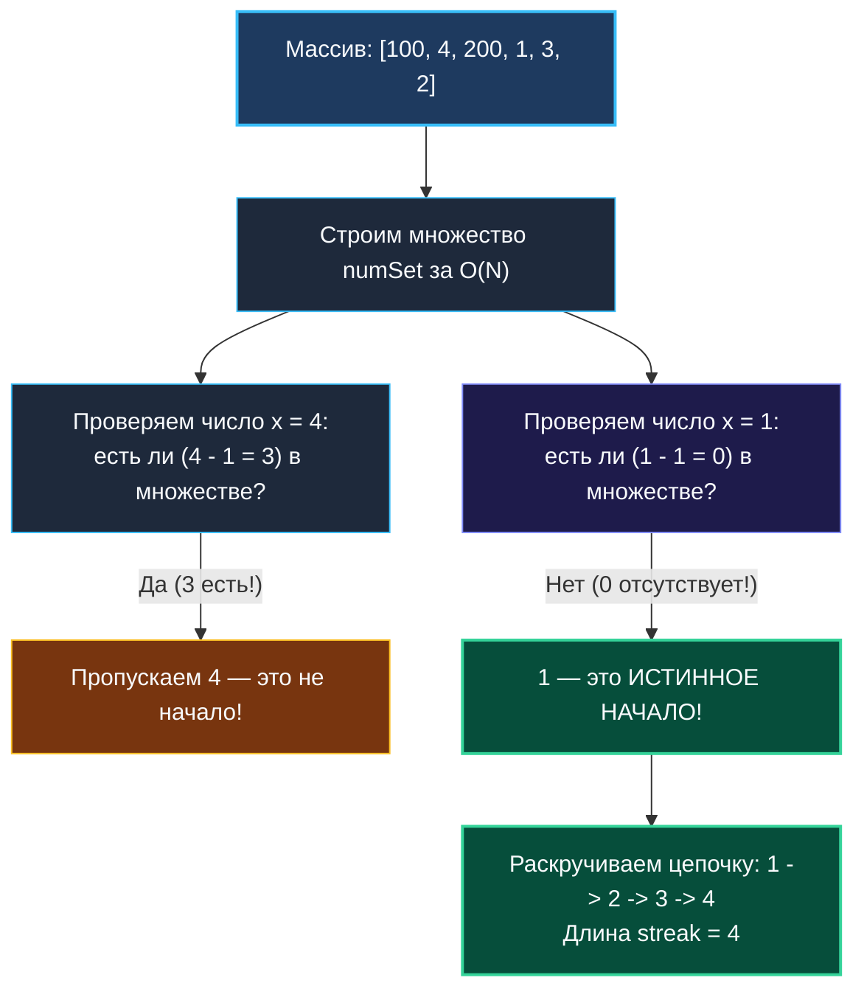

# 8. Longest Consecutive Sequence

> *«Любая цепочка начинается с первого звена. Если отсечь звенья из середины и исследовать только начала, квадратичный поиск превращается в линейный взмах».*  
> — Брайан Керниган

> 💡 **Связанные темы:**
> - [[1. Теория. Хеш таблицы]] — множество на пустых структурах `struct{}`
> - [[7. Contains Duplicate]] — дедупликация элементов
> - [[9. Insert Delete GetRandom O1]] — гибридизация структур данных
> - [[sources/21. Задачи с LeetCode и собеседований на Go/02. Задачи/15. Union Find/1. Теория. Union Find|15. Union Find: 1. Теория]] — динамическое объединение смежных компонент

---

## Введение: Кажущийся тупик квадратичной сложности

Задача **Longest Consecutive Sequence** (LeetCode 128) — образец алгоритмической элегантности:
> *Дан неотсортированный массив целых чисел `nums`. Найти длину самой длинной последовательности элементов, идущих подряд в числовом ряду (например, `[1, 2, 3, 4]`).  
> **Жесткое требование:** алгоритм обязан работать за строго линейное время $O(N)$.*

Первый инстинкт программиста — отсортировать массив за $O(N \log N)$ и линейно подсчитать максимальный непрерывный отрезок.  
Но условие задачи бескомпромиссно: **только $O(N)$**. Сортировка запрещена правилами игры.

Как же обнаружить соседние числа в хаотичном массиве за один проход?

---

## 🎯 Вопросы для уточнения условий (Interview Warm-up)

1. **Дубликаты в массиве:**  
   *«Может ли массив содержать дублирующиеся числа (например, `[1, 2, 0, 1]`)?»*  
   *(Да, дубликаты должны учитываться в последовательности ровно один раз: длина `[0, 1, 2]` равна 3).*
2. **Отрицательные числа:**  
   *«Могут ли числа быть отрицательными?»*  
   *(Да, поддерживаются любые целые числа: `[-2, -1, 0, 1]`).*
3. **Размер массива и пустой ввод:**  
   *«Что возвращать для пустого массива `[]`?»*  
   *(Возвращаем `0`).*

---

## Золотой инвариант: Поиск начал последовательностей

Представьте, что мы занесли все числа в хеш-множество `numSet := make(map[int]struct{})` за $O(N)$.  
Теперь мы можем за $O(1)$ проверить наличие любого числа.

Если для каждого числа $x$ мы начнем проверять $x+1, x+2, \dots$, мы рискуем скатиться к $O(N^2)$ (для массива `[1, 2, 3, 4, 5]` мы бы стартовали обход и от 1, и от 2, и от 3...).

**Ключевой инсайт:**  
Число $x$ является **началом последовательности** тогда и только тогда, когда в множестве **отсутствует его предшественник**:
$$x - 1 \notin \text{numSet}$$

Если $x - 1$ уже есть в множестве, значит, текущее число $x$ — это середина или конец цепочки, которую мы обязательно раскрутим (или уже раскрутили) от ее истинного начала. Мы просто **пропускаем** его!



---

## 🛠️ Оптимальное решение на Go

```go
package consecutive

// LongestConsecutive находит длину самой длинной непрерывной последовательности за O(N).
func LongestConsecutive(nums []int) int {
    if len(nums) == 0 {
        return 0
    }

    // Шаг 1: переносим все элементы в хеш-множество за O(N)
    set := make(map[int]struct{}, len(nums))
    for _, num := range nums {
        set[num] = struct{}{}
    }

    longest := 0

    // Шаг 2: ищем только начала последовательностей
    for num := range set {
        // Если num-1 отсутствует, значит num — начало цепочки!
        if _, hasPrev := set[num-1]; !hasPrev {
            current := num
            streak := 1

            // Раскручиваем цепочку вправо
            for {
                if _, hasNext := set[current+1]; hasNext {
                    current++
                    streak++
                } else {
                    break
                }
            }

            if streak > longest {
                longest = streak
            }
        }
    }

    return longest
}
```

---

## 📊 Доказательство сложности $O(N)$

Почему вложенный цикл `for` не делает алгоритм квадратичным?
1. Внешний цикл проходит по каждому уникальному числу ровно 1 раз.
2. Внутренний цикл `for` запускается **исключительно для начал цепочек**.
3. Каждое число $x$ массива входит ровно в одну непрерывную последовательность. Поэтому внутренний цикл посетит каждое число массива **строго один раз за все время работы программы**!
4. Итоговое количество операций: $N$ (построение множества) $+ N$ (внешний цикл) $+ N$ (внутренний цикл) $= 3N \in O(N)$.

---

## ⚙️ Mechanical Sympathy: Память и кэш-линии

> [!info] Математика $O(N)$ против железа
> 1. **Хеш-множество:** `map[int]struct{}` идеально укладывается в асимптотику $O(N)$. Однако доступ к `set[current+1]` порождает случайные скачки по бакетам памяти (Cache Misses).
> 2. **Сортировка на практике:** На реальных серверных CPU для умеренных массивов ($N \le 10^5$) решение с in-place сортировкой `slices.Sort(nums)` ($O(N \log N)$) может работать быстрее, чем хеш-таблица, из-за стопроцентной последовательной локальности кэша L1/L2 и отсутствия аллокаций.
> 3. Если на собеседовании вас спросят: *«Как обойтись без памяти?»*, отвечайте: *«Сортировка in-place за $O(N \log N)$ времени и $O(1)$ памяти»*.

---

## 🏭 Применение в System Design: Детекция непрерывных последовательностей

1. **Анализ логов безопасности (SIEM / Audit Trails):**  
   Поиск непрерывных диапазонов скомпрометированных портов или последовательных IP-адресов подсети бота.
2. **Восстановление пропущенных сообщений (Message Sequence Numbers):**  
   В протоколах гарантированной доставки (TCP SACK, финансовые FIX-протоколы) при получении пачки пакетов не по порядку требуется определить непрерывный диапазон доставленных номеров транзакций и выявить «дыры» для повторного запроса.
3. **Union-Find для стриминга:**  
   В потоковых системах, где числа приходят в реальном времени, вместо периодической перестройки множества применяют структуру **Disjoint Set Union (Union-Find)**: приход числа $x$ объединяет множества $[x-1]$ и $[x+1]$ за почти константное время $O(\alpha(N))$.

---

## 🗺️ Навигация

| Назад | Вперед |
| :--- | :--- |
| ← [[7. Contains Duplicate]] | [[9. Insert Delete GetRandom O1]] → |
