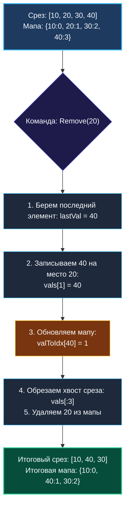

# 9. Insert Delete GetRandom O(1)

> *«Ни одна отдельная структура данных не совершенна сама по себе. Но соединив достоинства двух структур, мы получаем инструмент исключительной мощи».*  
> — Чарльз Хоар

> 💡 **Связанные темы:**
> - [[1. Теория. Хеш таблицы]] — устройство `map` и асимптотика поиска
> - [[8. Longest Consecutive Sequence]] — хеш-множества и быстрый доступ
> - [[sources/21. Задачи с LeetCode и собеседований на Go/02. Задачи/27. Рандомизированные алгоритмы/1. Теория. Рандомизированные алгоритмы|27. Рандомизированные алгоритмы: 1. Теория]] — вероятностные подходы
> - [[sources/21. Задачи с LeetCode и собеседований на Go/01. Теория/02. Асимптотический анализ|02. Асимптотический анализ]] — амортизированное константное время

---

## Введение: Дилемма базовых структур данных

Задача **Insert Delete GetRandom O(1)** (LeetCode 380) — эталонный вопрос алгоритмического System Design:
> *Спроектировать структуру данных, поддерживающую три операции со средней сложностью $O(1)$:*
> 1. `Insert(val)` — вставить элемент, если его еще нет;
> 2. `Remove(val)` — удалить элемент, если он присутствует;
> 3. `GetRandom()` — вернуть равновероятно случайный элемент из текущего набора.

Ни одна стандартная структура в одиночку не справляется:
- **Хеш-таблица (`map`):** вставка $O(1)$, удаление $O(1)$, но получение случайного элемента требует обхода итератором за $O(N)$ (ключи не проиндексированы плотным числовым рядом $0 \dots M-1$);
- **Непрерывный массив / срез (`slice`):** вставка в конец $O(1)$, выбор случайного элемента по индексу $O(1)$ (`vals[rand.IntN(len)]`), но удаление из середины требует сдвига всех последующих элементов за $O(N)$.

**Инженерный инсайт:**  
Создать гибрид: **Срез для непрерывной индексации + Хеш-таблица для мгновенного поиска индекса**.

---

## 🎯 Вопросы для уточнения условий (Interview Warm-up)

1. **Равномерность распределения:**  
   *«Обязан ли `GetRandom()` возвращать каждый из текущих элементов со строго одинаковой вероятностью $\frac{1}{N}$?»*  
   *(Да! Именно поэтому нельзя просто взять случайный бакет мапы, так как коллизии бакетов дают неравномерное распределение).*
2. **Дубликаты элементов:**  
   *«Может ли коллекция содержать повторяющиеся значения?»*  
   *(В классической постановке элементы уникальны. Если дубликаты разрешены — это задача LeetCode 381, где в мапе хранится множество индексов `map[int]map[int]struct{}`).*
3. **Генератор случайных чисел:**  
   *«Какой генератор случайных чисел использовать?»*  
   *(В современном Go 1.22+ стандарт де-факто — быстрый пакет `math/rand/v2`).*

---

## Паттерн «Swap and Pop» (Смена местами с хвостом)

Как удалить произвольный элемент из середины среза за $O(1)$?
Если порядок элементов в коллекции **не имеет значения**, мы:
1. Находим индекс удаляемого элемента `idx` в мапе;
2. Копируем **последний элемент среза** на позицию `idx`;
3. Обновляем в мапе индекс перемещенного элемента: `valToIdx[lastVal] = idx`;
4. «Откусываем» хвост среза за $O(1)$: `vals = vals[:len-1]`;
5. Удаляем сам элемент из мапы: `delete(valToIdx, val)`.



---

## 🛠️ Реализация на Go (с использованием `math/rand/v2`)

```go
package randomizedset

import (
    "math/rand/v2" // Быстрый и потокобезопасный генератор Go 1.22+
)

// RandomizedSet поддерживает Insert, Remove и GetRandom за амортизированное O(1).
type RandomizedSet struct {
    valToIdx map[int]int // значение -> индекс в срезе
    vals     []int       // плотный непрерывный срез значений
}

// Constructor инициализирует пустую структуру.
func Constructor() RandomizedSet {
    return RandomizedSet{
        valToIdx: make(map[int]int),
        vals:     make([]int, 0),
    }
}

// Insert добавляет значение, если его еще нет. Возвращает true, если вставка состоялась.
func (rs *RandomizedSet) Insert(val int) bool {
    if _, exists := rs.valToIdx[val]; exists {
        return false
    }

    // Добавляем в конец среза
    rs.vals = append(rs.vals, val)
    rs.valToIdx[val] = len(rs.vals) - 1
    return true
}

// Remove удаляет значение из структуры. Возвращает true, если элемент присутствовал.
func (rs *RandomizedSet) Remove(val int) bool {
    idx, exists := rs.valToIdx[val]
    if !exists {
        return false
    }

    lastIdx := len(rs.vals) - 1
    lastVal := rs.vals[lastIdx]

    // Если удаляемый элемент не является последним, перемещаем последний на его место
    if idx != lastIdx {
        rs.vals[idx] = lastVal
        rs.valToIdx[lastVal] = idx
    }

    // Обрезаем последний элемент
    rs.vals = rs.vals[:lastIdx]
    delete(rs.valToIdx, val)

    return true
}

// GetRandom возвращает случайный элемент с равномерной вероятностью.
func (rs *RandomizedSet) GetRandom() int {
    // rand.IntN работает за константное время O(1)
    randomIndex := rand.IntN(len(rs.vals))
    return rs.vals[randomIndex]
}
```

---

## 🛑 Ловушка утечки памяти при хранении указателей

> [!warning] Опасность скрытой утечки (Memory Leak) в Go
> Если бы наш срез хранил указатели или интерфейсы (например, `[]*User`), то операция обрезки:
> ```go
> rs.vals = rs.vals[:lastIdx]
> ```
> скрывала бы элемент от индексации среза, **но базовый массив (underlying array) продолжал бы удерживать указатель на объект в куче**!  
> Сборщик мусора Go не сможет освободить объект, пока жив весь срез.  
> **Идиоматичное решение для указателей:** всегда обнулять ссылку перед усечением:
> ```go
> rs.vals[lastIdx] = nil // Даем GC очистить память!
> rs.vals = rs.vals[:lastIdx]
> ```

---

## ⚙️ Mechanical Sympathy: Локальность кэша и `math/rand/v2`

1. **Кэш при GetRandom:** Генерация индекса и взятие `rs.vals[randomIndex]` читает непрерывную память. Процессор выбирает элемент за считанные наносекунды.
2. **Преимущества `math/rand/v2` (Go 1.22+):**  
   Классический `math/rand` содержал глобальный мьютекс под капотом, вызывавший жестокие просадки при конкурентных обращениях из десятков горутин. `math/rand/v2` использует алгоритмы ChaCha8/PCG с thread-local генератором без блокировок, гарантируя нулевую межъядерную конкуренцию за шину памяти (False Sharing).

---

## 🏭 Применение в System Design: Балансировка и выборка

1. **Алгоритмы балансировки трафика (Power of Two Choices):**  
   Балансировщик выбирает два случайных рабочих сервера из пула и отправляет запрос на наименее загруженный. Когда узел выходит из строя (Health Check Fail), он удаляется из пула за $O(1)$ без остановки трафика.
2. **Рандомизированное тестирование (Chaos Engineering / A/B testing):**  
   Мгновенное добавление и удаление целевых групп пользователей и выбор случайной выборки для канареечных релизов.

---

## 🗺️ Навигация

| Назад | Вперед |
| :--- | :--- |
| ← [[8. Longest Consecutive Sequence]] | [[sources/21. Задачи с LeetCode и собеседований на Go/02. Задачи/06. Стек/1. Теория. Стек|06. Стек: 1. Теория]] → |