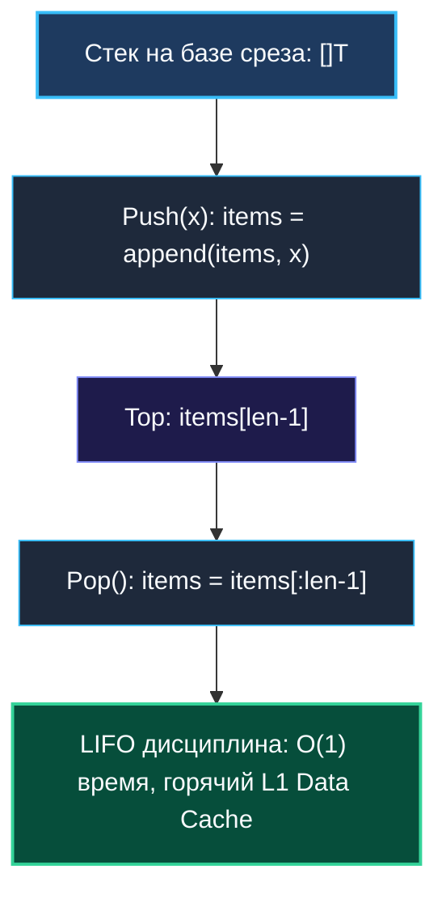

# 1. Теория. Стек

> *«Стек — это строгая дисциплина памяти: то, что пришло последним, уходит первым. Без этой простой очередности не было бы ни вызовов функций, ни синтаксических анализаторов, ни современных операционных систем».*  
> — Никлаус Вирт

> 💡 **Связанные темы:**
> - [[2. Монотонный стек]] — поддержание порядка элементов для поиска ближайших меньших/больших
> - [[3. Valid Parentheses]] — каноническая проверка баланса скобок
> - [[4. Min Stack]] — вспомогательный стек для $O(1)$ поиска минимума
> - [[8. Decode String]] — парсинг вложенных контекстов
> - [[sources/21. Задачи с LeetCode и собеседований на Go/02. Задачи/11. Поиск в глубину DFS/2. Рекурсия и стек|11. DFS: 2. Рекурсия и стек]] — неявный стек вызовов vs явный стек

---

## Введение: Архитектурный фундамент Computer Science

Стек (Stack, LIFO — *Last In, First Out*) — одна из фундаментальных структур данных в компьютерных науках.
Каждый вызов функции в любой программе, каждая операция «Отмена» (Undo, `Ctrl+Z`), кнопка «Назад» в веб-браузере, синтаксический разбор JSON, SQL или XML — все они основаны на дисциплине стека.

В языке Go понимание стека критично не только для решения алгоритмических задач, но и для понимания архитектуры самого рантайма: устройства стеков вызовов горутин (Continuous Stacks) и планировщика задач GMP (Work-stealing Deque).

---

## 🎯 Вопросы для уточнения условий (Interview Warm-up)

1. **Тип данных и хранение:**  
   *«Хранит ли стек примитивные типы (`int`, `byte`) или ссылочные структуры/указатели (`*Node`, `any`)?»*  
   *(Если стек хранит указатели, операция `Pop()` обязана занулять ячейку среза во избежание скрытых утечек памяти).*
2. **Максимальная глубина:**  
   *«Известен ли максимальный размер стека заранее?»*  
   *(Если известен, инициализируем срез с емкостью `make([]T, 0, capacity)`, полностью исключая реаллокации памяти).*
3. **Обработка пустого стека:**  
   *«Что должен возвращать `Pop()` при пустом стеке: ошибку, панику или `(zero, false)`?»*

---

## 🛠️ Стек в Go: Слайс против Связного списка

В стандартной библиотеке Go нет отдельного типа `Stack`. И это осознанное решение проектировщиков языка. В 99% случаев стек в Go реализуется поверх обычного **слайса (slice)**.

Почему слайс, а не связный список (`container/list`)?
Ответ дает **Mechanical Sympathy** (аппаратное сочувствие к железу):

| Критерий | Слайс (`[]T`) | Связный список (`*Element`) |
|---|---|---|
| **Локальность кэша** | **Идеальная.** Элементы лежат в непрерывном блоке памяти, L1/L2 кэш загружает их пачками (64 байта) | **Ужасная.** Каждый узел — отдельный объект в куче, порождающий Cache Misses при переходе по указателям |
| **Нагрузка на GC** | **Минимальная.** Память выделяется крупными чанками, амортизированное $O(1)$ | **Колоссальная.** Каждый `Push` аллоцирует новый узел, нагружая сборщик мусора |
| **Оверхед по памяти** | Только заголовок среза (24 байта) | Указатели `next`/`prev` (16 байт) на каждый элемент |



---

## 🛠️ Идиоматичная обобщенная реализация (Go 1.18+ Generics)

```go
package stack

import "errors"

var ErrEmptyStack = errors.New("stack is empty")

// Stack реализует типобезопасный LIFO-стек на базе слайса.
type Stack[T any] struct {
    items []T
}

// NewStack создает стек с предварительно выделенной емкостью.
func NewStack[T any](capacity int) *Stack[T] {
    return &Stack[T]{
        items: make([]T, 0, capacity),
    }
}

// Push добавляет элемент на вершину стека за амортизированное O(1).
func (s *Stack[T]) Push(val T) {
    s.items = append(s.items, val)
}

// Pop удаляет и возвращает верхний элемент стека.
func (s *Stack[T]) Pop() (T, error) {
    var zero T
    n := len(s.items)
    if n == 0 {
        return zero, ErrEmptyStack
    }

    lastIdx := n - 1
    val := s.items[lastIdx]

    // КРИТИЧЕСКИ ВАЖНО ДЛЯ GC:
    // Зануляем ячейку, чтобы сборщик мусора мог освободить память,
    // если T является указателем или содержит ссылки!
    s.items[lastIdx] = zero
    s.items = s.items[:lastIdx]

    return val, nil
}

// Peek возвращает верхний элемент без удаления.
func (s *Stack[T]) Peek() (T, error) {
    var zero T
    n := len(s.items)
    if n == 0 {
        return zero, ErrEmptyStack
    }
    return s.items[n-1], nil
}

// IsEmpty сообщает, пуст ли стек.
func (s *Stack[T]) IsEmpty() bool {
    return len(s.items) == 0
}

// Len возвращает количество элементов.
func (s *Stack[T]) Len() int {
    return len(s.items)
}
```

---

## 🛑 Главная ловушка собеседования: Утечка памяти при `Pop()`

> [!warning] Опасность скрытой ссылки в underlying array
> Если стек хранит указатели (например, `*TreeNode`), простая операция среза `s.items = s.items[:len-1]` уменьшает длину (`len`), **но оставляет указатель в базовом массиве** (`capacity` не изменилась!).  
> Сборщик мусора Go считает этот объект живым, пока жив весь слайс стека. В долговременных сервисах это приводит к колоссальным утечкам памяти!  
> **Правило:** Всегда обнуляйте слот перед усечением: `s.items[lastIdx] = nil`.

---

## ⚙️ Стек под капотом рантайма Go

### 1. Стеки горутин (Continuous Stacks)
Каждая горутина при создании получает свой собственный крошечный стек — всего **2 КБ** (в отличие от потоков ОС, требующих по 1–8 МБ).  
Если горутине перестает хватать места (глубокая рекурсия):
- Рантайм Go выделяет новый непрерывный блок памяти в 2 раза больше;
- Полностью копирует туда старый стек;
- Корректирует все указатели на переменные в стеке!

### 2. Work-Stealing Deque в планировщике GMP
Локальная очередь горутин у каждого логического процессора `P` организована как гибрид стека и очереди (Work-stealing Deque):
- Владелец (`P`) кладет и забирает задачи **с хвоста (Tail) по принципу стека (LIFO)**. Это максимизирует локальность кэша: только что созданная горутина горяча в L1/L2 кэше CPU!
- Другие процессоры, оставшиеся без работы, «крадут» задачи **с головы (Head) по принципу очереди (FIFO)**, избегая конкуренции за одну кэш-линию.

---

## 💡 Типовые паттерны задач на стек

1. **Проверка вложенных скобок (Parentheses Matching):**  
   Открывающие скобки складываются в стек, закрывающие сверяются с вершиной (`[[3. Valid Parentheses]]`).
2. **Стек с поддержкой минимума за $O(1)$:**  
   Синхронный параллельный стек минимумов (`[[4. Min Stack]]`).
3. **Парсинг выражений и стековые машины:**  
   Обратная польская нотация (RPN) и вычисление вложенных выражений (`[[8. Decode String]]`).
4. **Монотонный стек:**  
   Поиск ближайшего большего или меньшего элемента за $O(N)$ (`[[2. Монотонный стек]]`, `[[5. Daily Temperatures]]`).

---

## 🗺️ Навигация

| Назад | Вперед |
| :--- | :--- |
| ← [[sources/21. Задачи с LeetCode и собеседований на Go/02. Задачи/05. Хеш таблицы/9. Insert Delete GetRandom O1|05. Хеш таблицы: 9. Insert Delete GetRandom]] | [[2. Монотонный стек]] → |