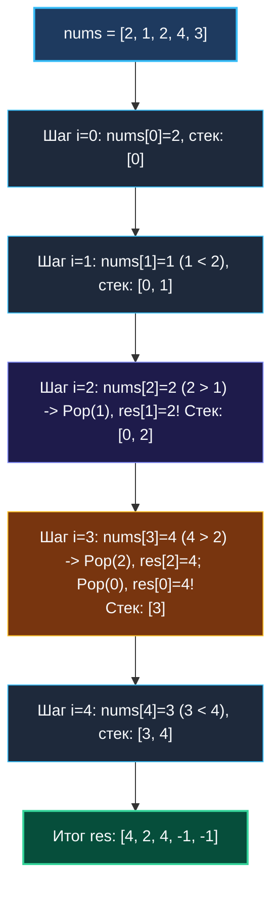

# 2. Монотонный стек

> *«Когда в потоке данных сохраняется строгий порядок, каждый новый элемент мгновенно находит свое место, решительно сбрасывая все, что слабее него».*  
> — Брайан Керниган

> 💡 **Связанные темы:**
> - [[1. Теория. Стек]] — базовые принципы и реализация на срезах
> - [[5. Daily Temperatures]] — классическая задача на расстояние до следующего теплого дня
> - [[6. Next Greater Element I]] — комбинация монотонного стека с хеш-таблицей
> - [[7. Largest Rectangle in Histogram]] — «финальный босс»: поиск левых и правых границ за $O(N)$
> - [[sources/21. Задачи с LeetCode и собеседований на Go/01. Теория/02. Асимптотический анализ|02. Асимптотический анализ]] — амортизационный анализ сложности

---

## Введение: Линия горизонта в массиве

На технических интервью уровня Middle+ и Senior редко просят просто «написать стек». Вместо этого предлагают задачу, которая в лоб решается квадратичным перебором за $O(N^2)$, но интервьюер ждет элегантного линейного решения за $O(N)$.  
В девяти случаях из десяти ключом к победе служит **Монотонный стек (Monotonic Stack)**.

Монотонный стек — это не отдельная структура данных, а **дисциплина поддержания порядка**: элементы внутри стека в любой момент времени остаются строго отсортированными (либо по возрастанию, либо по убыванию).

### Бытовая метафора: шеренга людей
Представьте, что вы стоите в шеренге людей разного роста и смотрите направо. Кого вы увидите?  
Вы увидите только тех людей, кто **выше** вас. Все люди меньшего или равного роста, стоящие за ними, окажутся в «мертвой зоне» — их закроет более высокий человек.  
Монотонный стек моделирует эту линию видимости: встречая более сильный элемент, он выталкивает всех более слабых предшественников.

---

## 🎯 Вопросы для уточнения условий (Interview Warm-up)

1. **Что искать:**  
   *«Мы ищем следующий больший элемент (Next Greater) или следующий меньший (Next Smaller)? Справа или слева?»*  
   - Ищем больший справа $\implies$ **монотонно убывающий стек**;
   - Ищем меньший справа $\implies$ **монотонно возрастающий стек**.
2. **Что возвращать:**  
   *«Нужно вернуть само значение элемента, его индекс или расстояние (дельта индексов `j - i`)?»*  
   *(В стеке **всегда сохраняем индексы**, а не значения! По индексу мы мгновенно восстановим и значение `nums[idx]`, и расстояние `i - idx`).*
3. **Строгость сравнения:**  
   *«Строго больше (`>`) или больше либо равно (`>=`)?»*

---

## Архитектура алгоритма: Next Greater Element

Пусть дан массив: `nums = [2, 1, 2, 4, 3]`.  
Требуется для каждого числа найти ближайшее большее число справа. Если такого нет — записать `-1`.



---

## 🛠️ Идиоматичная реализация на Go

```go
package monotonic

// NextGreaterElements находит следующий больший элемент справа за O(N).
func NextGreaterElements(nums []int) []int {
    n := len(nums)
    if n == 0 {
        return nil
    }

    // 1. Инициализируем массив ответов значениями по умолчанию -1
    res := make([]int, n)
    for i := range res {
        res[i] = -1
    }

    // 2. Стек хранит ИНДЕКСЫ.
    // Преаллокация capacity = n защищает от лишних реаллокаций среза.
    stack := make([]int, 0, n)

    for i := 0; i < n; i++ {
        // Пока стек не пуст И текущий элемент превышает элемент на вершине стека
        for len(stack) > 0 && nums[i] > nums[stack[len(stack)-1]] {
            topIdx := stack[len(stack)-1]
            stack = stack[:len(stack)-1] // Pop за O(1)

            // Текущий элемент nums[i] является следующим большим для nums[topIdx]
            res[topIdx] = nums[i]
        }

        // Кладем текущий индекс на вершину стека
        stack = append(stack, i)
    }

    return res
}
```

---

## 📊 Доказательство сложности: почему это $O(N)$, а не $O(N^2)$?

На первый взгляд вложенный цикл `for len(stack) > 0` пугает кандидатов, заставляя предполагать $O(N^2)$.
Это классическое заблуждение. Применим **амортизационный анализ**:
1. Каждый индекс $i \in [0, n-1]$ попадает в стек (`Push`) **ровно 1 раз** во внешнем цикле;
2. Каждый индекс извлекается из стека (`Pop`) во внутреннем цикле **не более 1 раза** за всю жизнь программы;
3. Общее число операций со стеком:
   $$\text{Total Ops} \le N_{\text{push}} + N_{\text{pop}} \le 2N$$
4. Итоговая временная сложность: строго **$O(N)$**.

---

## ⚙️ Mechanical Sympathy: Почему монотонный стек молниеносен на CPU

1. **Непрерывный underlying array:** Срез `stack := make([]int, 0, n)` никогда не реаллоцируется, оставаясь в границах одного непрерывного блока оперативной памяти.
2. **Zero GC Overheads:** Стек хранит примитивные целые числа `int`. Сборщик мусора Go полностью игнорирует этот срез при обходе графа объектов.
3. **L1 Кэш:** Чтение `stack[len(stack)-1]` всегда попадает в самую горячую кэш-линию L1 процессора.

---

## 🛑 Подводные камни и частые ошибки

> [!warning] Ошибка 1: Хранение значений вместо индексов
> Если вы сохраните в стек значения `nums[i]`, вы не сможете:
> - Записать результат в правильную ячейку `res[topIdx]`;
> - Посчитать расстояние между элементами (как в задаче [[5. Daily Temperatures]]).  
> **Всегда храните в монотонном стеке индексы!**

> [!warning] Ошибка 2: Закольцованные массивы (Circular Arrays)
> Если в задаче массив считается кольцевым (после последнего элемента идет первый):  
> Не создавайте копию массива! Запустите цикл длины $2N$:
> ```go
> for i := 0; i < 2*n; i++ {
>     idx := i % n
>     // логика со стеком для nums[idx]
> }
> ```

---

## 🗺️ Навигация

| Назад | Вперед |
| :--- | :--- |
| ← [[1. Теория. Стек]] | [[3. Valid Parentheses]] → |