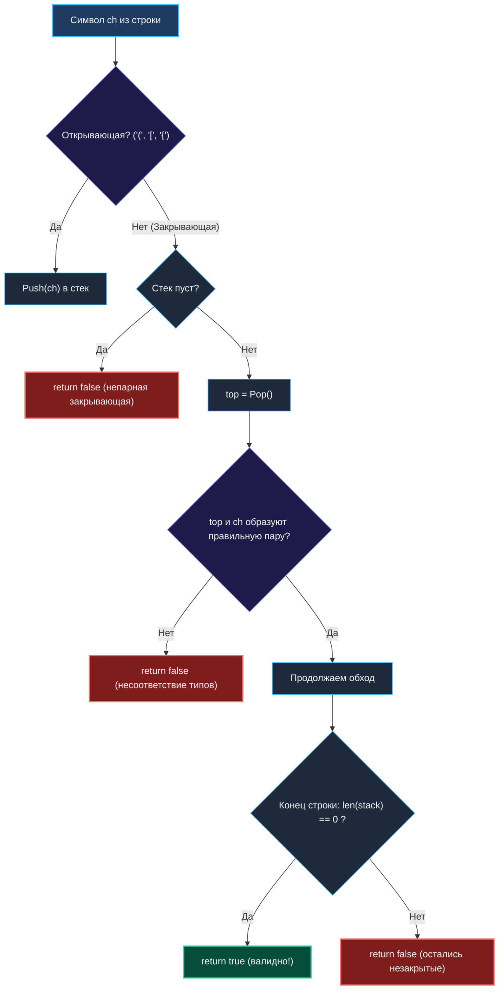

# 3. Valid Parentheses

> *«Каждое открывающее действие во вселенной требует своего закрытия. Тот, кто помнит прошлые шаги, никогда не заблудится в лабиринте скобок».*  
> — Брайан Керниган

> 💡 **Связанные темы:**
> - [[1. Теория. Стек]] — базовые принципы и реализация на срезах
> - [[2. Монотонный стек]] — поддержание порядка элементов
> - [[4. Min Stack]] — расширение возможностей стека
> - [[8. Decode String]] — синтаксический анализ вложенных структур

---

## Введение: Каноническая задача синтаксического анализа

Задача **Valid Parentheses** (LeetCode 20) — эталонная задача на структуру данных «стек», встречающаяся на скринингах практически любой технологической компании:
> *Дана строка `s`, состоящая только из символов `'('`, `')'`, `'{'`, `'}'`, `'['` и `']'`.  
> Определить, является ли строка правильной скобочной последовательностью.*

Правила валидности:
1. Каждая открывающая скобка закрывается скобкой строго того же типа;
2. Скобки закрываются в корректном порядке вложенности (LIFO);
3. Каждой закрывающей скобке соответствует открывающая скобка.

Несмотря на кажущуюся элементарность, то, **как именно** вы напишете это решение на Go, моментально раскрывает ваш уровень владения языком, понимание кэш-линий CPU и аллокаций памяти.

---

## 🎯 Вопросы для уточнения условий (Interview Warm-up)

1. **Длина строки:**  
   *«Может ли длина строки быть нечетной?»*  
   *(Если длина нечетная — строка гарантированно невалидна, делаем мгновенный ранний выход: `if len(s)%2 != 0 { return false }`).*
2. **Пустая строка:**  
   *«Считается ли пустая строка `""` валидной?»*  
   *(Да, пустая строка тривиально валидна).*
3. **Состав символов:**  
   *«Строка состоит только из скобок или могут встречаться буквы/пробелы?»*  
   *(В LeetCode 20 — только скобки ASCII. Итерация по байтам `s[i]` работает без накладных расходов на декодирование UTF-8).*

---

## Архитектура решения и поток состояний

Алгоритм сканирует строку слева направо:
1. **Открывающая скобка:** помещается на вершину стека (`Push`);
2. **Закрывающая скобка:**
   - Если стек пуст $\implies$ ошибка (нет открывающей пары);
   - Иначе извлекаем вершину (`Pop`) и проверяем совпадение типов скобок;
3. **Финал:** по окончании строки стек обязан быть **абсолютно пуст** (все открытые скобки получили закрытие).



---

## 🛠️ Оптимальная реализация на Go (Zero-Alloc, Mechanical Sympathy)

```go
package parentheses

// IsValid проверяет сбалансированность скобок за O(N) времени и O(N) памяти.
func IsValid(s string) bool {
    n := len(s)

    // Быстрый отсев: нечетная длина не может быть сбалансирована
    if n%2 != 0 {
        return false
    }

    // Предвыделение памяти под срез байт.
    // Максимальная глубина стека не превысит n/2 при валидной строке
    stack := make([]byte, 0, n/2)

    // Прямой проход по байтам (без лишнего декодирования рун)
    for i := 0; i < n; i++ {
        ch := s[i]

        switch ch {
        case '(':
            stack = append(stack, ')')
        case '[':
            stack = append(stack, ']')
        case '{':
            stack = append(stack, '}')
        default:
            // Закрывающая скобка: сверяем с ожидаемой вершиной
            stackLen := len(stack)
            if stackLen == 0 || stack[stackLen-1] != ch {
                return false
            }
            stack = stack[:stackLen-1] // Pop
        }
    }

    // Стек обязан быть пустым к концу строки
    return len(stack) == 0
}
```

---

## ⚙️ Mechanical Sympathy: Почему трюк с «ожидаемой скобкой» гениален

Обратите внимание на конструкцию в коде выше:
Когда мы встречаем `'('`, мы кладем в стек **не `'('`, а ожидаемую закрывающую скобку `')'`**!

В чем преимущество такого решения?
1. **Никакой хеш-таблицы (`map[byte]byte`):**  
   Многие кандидаты объявляют `pairs := map[byte]byte{')': '(', ...}`. Хеш-таблица в куче порождает Cache Misses и вычисления хеша. Наш `switch` транслируется в несколько инструкций условного перехода процессора.
2. **Простейшая проверка за 1 машинный такт:**  
   Вместо сложной проверки парности:
   ```go
   if (ch == ')' && top != '(') || (ch == ']' && top != '[') ...
   ```
   мы выполняем прямое поэлементное сравнение:
   ```go
   if stack[len-1] != ch { return false }
   ```
3. **Escape Analysis:**  
   Срез `stack` при небольших размерах строки размещается прямо на стеке горутины, не создавая ни единой аллокации в куче (`0 B/op`).

---

## 🛑 Краевые случаи (Edge Cases)

1. **`s = "]"`:**  
   Длина 1 (нечетная) $\implies$ отсекается на проверке `n%2 != 0`.
2. **`s = "()[]{}"`:**  
   Каждая скобка открывается и сразу закрывается. Максимальный размер стека равен 1.
3. **`s = "((("`:**  
   Длина нечетная $\implies$ `false`.
4. **`s = "(((("`:**  
   Четная длина, все 4 скобки лягут в стек. Цикл завершится, но `len(stack) == 4 != 0`, функция вернет `false`.

---

## 🗺️ Навигация

| Назад | Вперед |
| :--- | :--- |
| ← [[2. Монотонный стек]] | [[4. Min Stack]] → |