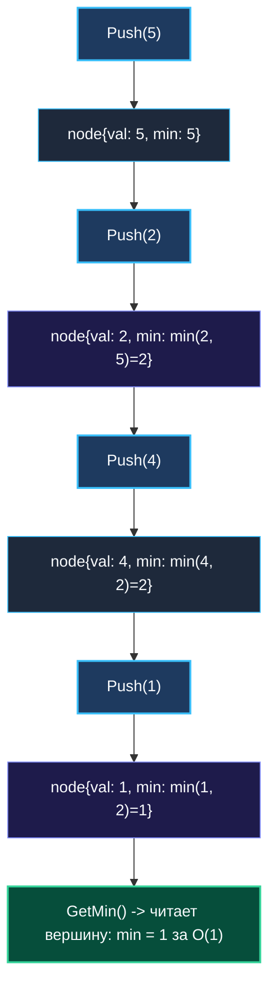

# 4. Min Stack

> *«Пространство и время всегда находятся в равновесии: сохраняя крупицу истории на этапе записи, мы покупаем мгновенные ответы при чтении».*  
> — Брайан Керниган

> 💡 **Связанные темы:**
> - [[1. Теория. Стек]] — базовая дисциплина LIFO и реализация на срезах
> - [[2. Монотонный стек]] — динамическое поддержание порядка
> - [[5. Daily Temperatures]] — практическое использование истории состояний
> - [[sources/21. Задачи с LeetCode и собеседований на Go/01. Теория/02. Асимптотический анализ|02. Асимптотический анализ]] — компромиссы памяти и времени

---

## Введение: Хранение истории состояний

Классический стек — это пассивное хранилище: мы кладем значение на вершину и забираем его. Но в реальных распределенных сервисах структуры данных часто обязаны мгновенно отвечать на мета-вопросы о своем текущем состоянии.

Задача **Min Stack** (LeetCode 155):
> *Спроектировать стек, поддерживающий стандартные операции `Push`, `Pop`, `Top`, а также метод `GetMin`, возвращающий минимальный элемент во всем стеке.  
> **Все операции обязаны выполняться за строго константное время $O(1)$.***

Наивный поиск минимума линейным проходом по срезу занимает $O(N)$ времени — это нарушение условия.  
Хранить одну глобальную переменную `currentMin` тоже нельзя: когда мы снимем (`Pop`) минимальный элемент с вершины, мы потеряем информацию о том, какое число было минимумом *до* него.

**Решение:** Каждый элемент стека должен помнить локальный минимум на момент своего добавления!

---

## 🎯 Вопросы для уточнения условий (Interview Warm-up)

1. **Поведение при пустом стеке:**  
   *«Что должен возвращать `GetMin()` и `Top()`, если стек пуст: ошибку, панику или дефолтное значение?»*  
   *(В условиях LeetCode вызовы на пустом стеке не происходят, но в production-коде возвращаем `error` или `(int, bool)`).*
2. **Диапазон чисел:**  
   *«Могут ли числа быть отрицательными?»*  
   *(Да, поддерживается весь диапазон 32- и 64-битных знаковых целых чисел).*
3. **Требования к памяти:**  
   *«Допустимо ли использование $O(N)$ дополнительной памяти для кэширования минимумов?»*

---

## Архитектурные подходы: AoS против SoA

### Подход 1: Два параллельных среза (Struct of Arrays — SoA)
Один срез для данных `vals []int`, второй для минимумов `mins []int`.  
Минус: данные одного логического шага разнесены по разным областям кучи, что повышает риск промаха кэша процессора.

### Подход 2: Срез структур (Array of Structs — AoS) — Выбор инженера
Объединяем значение и локальный минимум в компактную 16-байтную структуру:
```go
type node struct {
    val int
    min int
}
```



---

## 🛠️ Оптимальная реализация на Go

```go
package minstack

import "errors"

var ErrEmptyStack = errors.New("stack is empty")

type entry struct {
    val int
    min int
}

// MinStack поддерживает операции Push, Pop, Top и GetMin за константное время O(1).
type MinStack struct {
    elements []entry
}

// Constructor инициализирует стек.
func Constructor() MinStack {
    return MinStack{
        elements: make([]entry, 0),
    }
}

// Push добавляет элемент на вершину за O(1).
func (s *MinStack) Push(val int) {
    currentMin := val
    n := len(s.elements)
    if n > 0 {
        topMin := s.elements[n-1].min
        if topMin < currentMin {
            currentMin = topMin
        }
    }

    s.elements = append(s.elements, entry{
        val: val,
        min: currentMin,
    })
}

// Pop удаляет верхний элемент за O(1).
func (s *MinStack) Pop() {
    n := len(s.elements)
    if n == 0 {
        return
    }
    // Так как entry хранит примитивные int, зануление для GC не требуется
    s.elements = s.elements[:n-1]
}

// Top возвращает значение на вершине за O(1).
func (s *MinStack) Top() int {
    n := len(s.elements)
    if n == 0 {
        return 0
    }
    return s.elements[n-1].val
}

// GetMin возвращает минимальный элемент за O(1).
func (s *MinStack) GetMin() int {
    n := len(s.elements)
    if n == 0 {
        return 0
    }
    return s.elements[n-1].min
}
```

---

## ⚙️ Mechanical Sympathy: AoS и 64-байтные кэш-линии процессора

Почему срез структур `[]entry` работает быстрее двух отдельных срезов `[]int`?
1. **Размер структуры:** `struct { val, min int }` на 64-битной платформе занимает ровно $8 + 8 = 16$ байт.
2. **Упаковка в кэш-линию:** Стандартная кэш-линия L1 Data Cache процессора имеет размер **64 байта**. В одну такую линию помещается ровно 4 полных элемента `entry`:
   $$\frac{64\text{ байта}}{16\text{ байт}} = 4\text{ элемента}$$
3. При вызове `Push` мы одновременно читаем `min` предыдущего элемента и пишем `val` и `newMin`. Оба поля находятся в пределах одного адреса памяти — это стопроцентное попадание в L1 Data Cache (Zero Cache Misses).

---

## 🎓 Уровень Senior: Трюк с разностями ($O(1)$ дополнительной памяти)

На собеседованиях в бигтех любят задавать каверзный вопрос:
*«А как реализовать MinStack за $O(1)$ дополнительной памяти, используя только один срез `[]int` и одну переменную `min`?»*

Ответ — **математическое кодирование разности**:
- Вместо самого значения мы сохраняем в стек дельту:
  $$\text{diff} = x - \text{min}$$
- Если $x < \text{min}$, то $\text{diff} < 0$. Мы обновляем $\text{min} = x$, а в стек кладем отрицательную дельту.
- При `Pop()`: если извлеченный $\text{diff} < 0$, значит, уходящий элемент был минимумом, а предыдущий восстанавливается как $\text{prevMin} = \text{min} - \text{diff}$.

> [!warning] Опасность целочисленного переполнения в проде
> Хотя этот трюк математически безупречен, в продакшене он опасен: операция `x - min` для крайних значений `math.MaxInt64` и `math.MinInt64` вызовет тихое **целочисленное переполнение (Integer Overflow)** в Go.  
> Поэтому сеньор-инженер выбирает Array of Structs: он на 100% безопасен, не подвержен переполнению и максимально дружелюбен к L1-кэшу CPU.

---

## 🗺️ Навигация

| Назад | Вперед |
| :--- | :--- |
| ← [[3. Valid Parentheses]] | [[5. Daily Temperatures]] → |