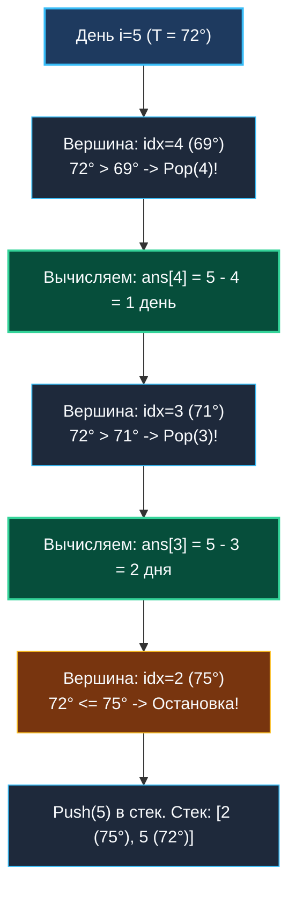

# 5. Daily Temperatures

> *«Прошлое неизменно, но его можно согреть будущим. Сохраняя индексы холодных дней в монотонном стеке, мы мгновенно вычисляем время ожидания первой оттепели».*  
> — Брайан Керниган

> 💡 **Связанные темы:**
> - [[1. Теория. Стек]] — базовая структура LIFO
> - [[2. Монотонный стек]] — теория и инвариант убывающего стека
> - [[6. Next Greater Element I]] — поиск большего элемента в связанном массиве
> - [[7. Largest Rectangle in Histogram]] — вычисление площадей через монотонный стек

---

## Введение: Хрестоматия монотонного стека

Задача **Daily Temperatures** (LeetCode 739) — главный демонстрационный полигон для паттерна «Монотонный стек»:
> *Дан целочисленный массив `temperatures`, представляющий ежедневную температуру воздуха.  
> Вернуть массив `answer`, где `answer[i]` — это количество дней, которое нужно подождать после `i`-го дня до наступления более теплого дня. Если такого дня в будущем нет, записать `0`.*

Пример:
`temperatures = [73, 74, 75, 71, 69, 72, 76, 73]`  
Ответ: `[1, 1, 4, 2, 1, 1, 0, 0]`.

Наивный подход перебирает все будущие дни вложенным циклом за $O(N^2)$, что при $N = 100\,000$ дает $10^{10}$ операций и гарантированный Time Limit Exceeded (TLE).  
Монотонно убывающий стек решает задачу ровно за один проход — строго за $O(N)$!

---

## 🎯 Вопросы для уточнения условий (Interview Warm-up)

1. **Что сохранять в стеке:**  
   *«Нам нужно само значение температуры или количество дней (дистанция)?»*  
   *(Нам нужна дистанция `i - prevIdx`. Если сложить в стек температуру, мы потеряем временную координату. Поэтому в стек помещаются **строго индексы**).*
2. **Значения по умолчанию:**  
   *«Что возвращать, если более теплый день так и не наступил до конца измерений?»*  
   *(Возвращаем `0`. В Go срезы `make([]int, n)` изначально заполнены нулями, что избавляет от необходимости заполнять дефолтные значения).*
3. **Строгость потепления:**  
   *«День с такой же температурой считается потеплением?»*  
   *(Нет, день должен быть **строго теплее**: `temperatures[i] > temperatures[top]`).*

---

## Пошаговая визуализация работы алгоритма

Пусть накопилась цепочка холодных дней `idx=2 (75°), idx=3 (71°), idx=4 (69°)`.  
Наступает день `i = 5` с потеплением до `72°`:



---

## 🛠️ Оптимальное решение на Go

```go
package temperatures

// DailyTemperatures вычисляет дни ожидания до потепления за O(N) времени и O(N) памяти.
func DailyTemperatures(temperatures []int) []int {
    n := len(temperatures)
    if n == 0 {
        return nil
    }

    // 1. Инициализируем срез ответа.
    // В Go make([]int, n) автоматически заполнен нулями (zero-values) —
    // дни без потепления останутся 0 без лишних действий!
    ans := make([]int, n)

    // 2. Стек индексов с предварительно выделенной емкостью cap = n
    stack := make([]int, 0, n)

    for i := 0; i < n; i++ {
        currentTemp := temperatures[i]

        // Пока стек не пуст и наступил день теплее вершины стека
        for len(stack) > 0 && currentTemp > temperatures[stack[len(stack)-1]] {
            prevIdx := stack[len(stack)-1]
            stack = stack[:len(stack)-1] // Pop

            // Дистанция = разность индексов
            ans[prevIdx] = i - prevIdx
        }

        // Кладем текущий день в стек
        stack = append(stack, i)
    }

    return ans
}
```

---

## ⚙️ Mechanical Sympathy: Zero-Alloc стек и префетчинг

1. **Единоразовая аллокация:** `make([]int, 0, n)` резервирует память под базовый массив ровно один раз. Никаких вызовов `runtime.growslice` в цикле.
2. **Zero GC Overheads:** Стек оперирует примитивными целыми числами `int`. Сборщик мусора Go не сканирует срез.
3. **Амортизированная линейность:** Каждый день добавляется в стек ровно 1 раз и удаляется максимум 1 раз. Общее число итераций внутреннего цикла за весь запуск функции не превышает $N$. Временная сложность строго **$O(N)$**.

---

## 🎓 Уровень Senior: Решение справа налево за $O(1)$ памяти

На интервью для Senior/Staff инженера часто звучит вопрос:
*«А можно ли найти ответ за $O(1)$ дополнительной памяти, не выделяя стек?»*

**Ответ: Да, обходом справа налево!**  
Мы идем от последнего дня к первому и используем уже заполненный массив `ans` в качестве **таблицы прыжков (jump pointers)**:
- Если следующий день теплее (`temperatures[i+1] > temperatures[i]`), ответ равен `1`;
- Если холоднее или равен, мы перепрыгиваем сразу на `i + 1 + ans[i+1]`, минуя все дни заведомо меньшей температуры!

```go
func dailyTemperaturesNoStack(temperatures []int) []int {
    n := len(temperatures)
    ans := make([]int, n)

    for i := n - 2; i >= 0; i-- {
        curr := temperatures[i]
        next := i + 1

        for next < n && temperatures[next] <= curr {
            if ans[next] == 0 {
                // Если у следующего дня нет потепления, значит и у нас его нет
                next = n
                break
            }
            // Перепрыгиваем через холодные дни!
            next += ans[next]
        }

        if next < n {
            ans[i] = next - i
        }
    }

    return ans
}
```
Это решение требует $O(1)$ дополнительной памяти (за пределами возвращаемого среза `ans`), наглядно демонстрируя глубокое понимание динамического программирования.

---

## 🗺️ Навигация

| Назад | Вперед |
| :--- | :--- |
| ← [[4. Min Stack]] | [[6. Next Greater Element I]] → |