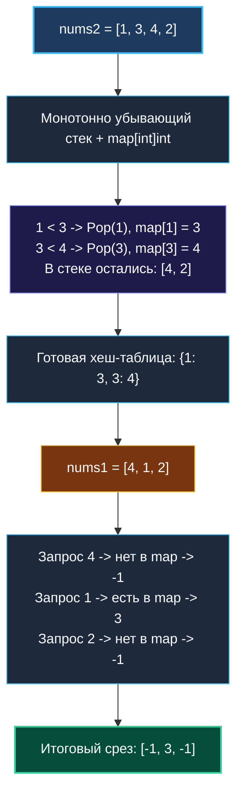

# 6. Next Greater Element I

> *«Разделяй и властвуй — это не только военная стратагема, но и главный инженерный принцип: подготовьте данные один раз, проиндексируйте их, и любые последующие запросы превратятся в мгновенные ответы».*  
> — Брайан Керниган

> 💡 **Связанные темы:**
> - [[1. Теория. Стек]] — базовая структура LIFO
> - [[2. Монотонный стек]] — алгоритм поддержания порядка
> - [[5. Daily Temperatures]] — монотонный стек с хранением дистанций
> - [[7. Largest Rectangle in Histogram]] — применение монотонного стека для площадей
> - [[sources/21. Задачи с LeetCode и собеседований на Go/02. Задачи/05. Хеш таблицы/1. Теория. Хеш таблицы|05. Хеш таблицы: 1. Теория]] — оптимизация `no-scan` в Go GC

---

## Введение: Симбиоз стека и хеш-таблицы

В реальных распределенных сервисах задачи редко решаются одной изолированной структурой. Архитектурная сила проявляется в их **композиции**.
Задача **Next Greater Element I** (LeetCode 496) демонстрирует этот паттерн:
> *Даны два массива уникальных целых чисел: `nums1` и `nums2`, где `nums1` является подмножеством `nums2`.  
> Для каждого числа из `nums1` найти следующий больший элемент справа в массиве `nums2`. Если большего элемента справа нет, вернуть `-1`.*

Наивный подход ищет каждое число из `nums1` в `nums2` линейно, а затем бежит вправо в поисках большего: $O(N_1 \cdot N_2)$.  
При $N_1, N_2 = 10^5$ это $10^{10}$ операций — тяжелый провал по производительности.

Мы объединим **монотонно убывающий стек** и **хеш-таблицу**, решив задачу за линейное время $O(N_1 + N_2)$!

---

## 🎯 Вопросы для уточнения условий (Interview Warm-up)

1. **Уникальность элементов:**  
   *«Гарантируется ли уникальность чисел в массивах?»*  
   *(Да! В классическом условии LeetCode 496 все числа уникальны. Это дает нам право использовать **сами значения как ключи** хеш-таблицы, не сохраняя индексы).*
2. **Вложенность подмножества:**  
   *«Все ли элементы `nums1` присутствуют в `nums2`?»*  
   *(Да, по условию `nums1` — строгое подмножество `nums2`).*
3. **Что если большего элемента нет:**  
   *«Какое значение возвращать, если большего элемента справа нет?»*  
   *(Возвращаем `-1`).*

---

## Архитектура: Препроцессинг за $O(N_2)$ + Запросы за $O(N_1)$

Вместо того чтобы метаться между двумя массивами, разделим задачу на две независимые фазы:
1. **Фаза 1 (Монотонный стек по `nums2`):**  
   Проходим по `nums2` один раз. Монотонно убывающий стек находит следующий больший элемент для каждого числа. Результаты записываем в словарь: `mapping[val] = nextGreaterVal`.
2. **Фаза 2 (O(1) чтение для `nums1`):**  
   Проходим по `nums1` и за константное время $O(1)$ читаем готовый ответ из `mapping`.



---

## 🛠️ Оптимальное решение на Go

```go
package nextgreater

// NextGreaterElement находит следующий больший элемент за O(len(nums1) + len(nums2)).
func NextGreaterElement(nums1 []int, nums2 []int) []int {
    // Хеш-таблица хранит: число -> его следующий больший элемент
    // Преаллокация под размер nums2 устраняет рехеширование
    nextGreater := make(map[int]int, len(nums2))

    // Стек значений (так как все элементы уникальны)
    stack := make([]int, 0, len(nums2))

    // Шаг 1: сканируем nums2 монотонным стеком
    for _, num := range nums2 {
        for len(stack) > 0 && num > stack[len(stack)-1] {
            top := stack[len(stack)-1]
            stack = stack[:len(stack)-1] // Pop

            nextGreater[top] = num
        }
        stack = append(stack, num)
    }

    // Шаг 2: собираем результат для nums1 за O(len(nums1))
    res := make([]int, len(nums1))
    for i, num := range nums1 {
        if val, exists := nextGreater[num]; exists {
            res[i] = val
        } else {
            res[i] = -1 // Для элементов, оставшихся в стеке
        }
    }

    return res
}
```

---

## ⚙️ Mechanical Sympathy: Оптимизация `no-scan` в Go Garbage Collector

Почему использование `map[int]int` в Go работает в разы быстрее, чем аналогичные коллекции в Java или Python?

1. **Отсутствие указателей (Scalar Types):**  
   И ключ, и значение имеют тип `int`. В них нет ссылок, срезов или интерфейсов.
2. **Флаг `no-scan` рантайма Go:**  
   Компилятор и рантайм Go помечают бакеты этой мапы специальным флагом. Во время фазы маркировки (GC Mark Phase) сборщик мусора **вообще не сканирует бакеты этой мапы**! Он не заходит внутрь пар ключ-значение, так как там гарантированно нет адресов в куче.
3. **Хеширование на уровне инструкций CPU:**  
   Хеширование 64-битного целого числа `int` не требует обхода байт: оно выполняется за 2–3 процессорных такта аппаратно-ускоренными алгоритмами.

---

## 💡 Усложнение задачи: Что делать, если в `nums2` есть дубликаты?

> [!interview] Вопрос сеньор-уровня на собеседовании:
> *«А как изменится решение, если в `nums2` разрешены одинаковые числа?»*  
> **Ответ:**  
> Если в массиве есть дубликаты, использовать числа в качестве ключей мапы нельзя (последующие вхождения затрут предыдущие).  
> Мы обязаны вернуться к **классическому монотонному стеку индексов**:
> 1. Стек хранит индексы `i` массива `nums2`;
> 2. Мапа связывает `индекс_в_nums2 -> следующий_больший_элемент`;
> 3. Поиск для `nums1` требует предварительного сопоставления значений с их позициями. Это наглядно доказывает: **стек индексов — самый универсальный инвариант!**

---

## 🗺️ Навигация

| Назад | Вперед |
| :--- | :--- |
| ← [[5. Daily Temperatures]] | [[7. Largest Rectangle in Histogram]] → |