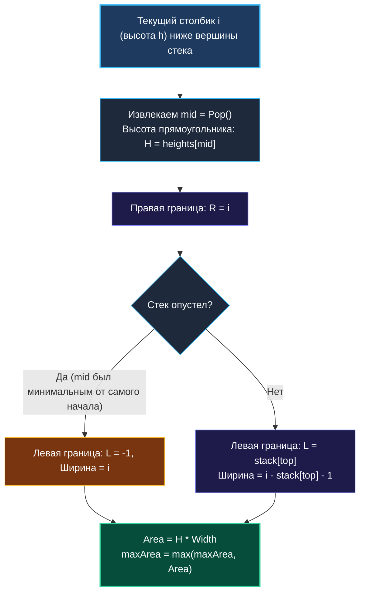

# 7. Largest Rectangle in Histogram

> *«В архитектуре высота здания ограничена его самым слабым фундаментом. В алгоритмах ширина прямоугольника ограничена его самым низким столбиком».*  
> — Брайан Керниган

> 💡 **Связанные темы:**
> - [[1. Теория. Стек]] — базовая структура LIFO
> - [[2. Монотонный стек]] — монотонно возрастающий стек
> - [[5. Daily Temperatures]] — вычисление дистанций через монотонный стек
> - [[sources/21. Задачи с LeetCode и собеседований на Go/02. Задачи/29. Сложные задачи/5. Largest Rectangle in Histogram|29. Сложные задачи: 5. Largest Rectangle in Histogram]] — глубокий разбор алгоритма в разделе сложных задач

---

## Введение: Финальный босс монотонных стеков

Задача **Largest Rectangle in Histogram** (LeetCode 84, уровень Hard) по праву считается кульминацией темы монотонных стеков:
> *Дан массив неотрицательных целых чисел `heights`, представляющий высоты смежных столбиков гистограммы, где ширина каждого столбика равна `1`.  
> Найти площадь наибольшего прямоугольника, который можно вписать в эту гистограмму.*

Пример:
`heights = [2, 1, 5, 6, 2, 3]`  
Ответ: `10` (прямоугольник высотой `5` и шириной `2`, образованный столбиками `5` и `6`).

Наивный перебор всех возможных левых и правых границ $(L, R)$ требует $O(N^3)$ или $O(N^2)$ времени. При $N = 100\,000$ квадратичный алгоритм потребует $10^{10}$ операций и безнадежно зависнет.  
Монотонно возрастающий стек находит решение за **один проход строго за $O(N)$**!

---

## 🎯 Вопросы для уточнения условий (Interview Warm-up)

1. **Возможны ли нулевые высоты:**  
   *«Могут ли столбики иметь высоту 0?»*  
   *(Да, высота 0 означает разрыв гистограммы, площадь такого прямоугольника равна 0).*
2. **Размер массива и переполнение:**  
   *«Может ли площадь превысить 32-битный `int`?»*  
   *(В LeetCode 84 $N \le 10^5, heights[i] \le 10^4$, максимальная площадь $10^9$ укладывается в 32-битный `int`, но в продакшене лучше оперировать `int64`).*
3. **Мутация входных данных:**  
   *«Разрешено ли дописывать элементы в конец среза `heights`?»*  
   *(Категорически нет! Мутация чужого среза — опасный антипаттерн в Go).*

---

## Ключевой инсайт: Локальный минимум как ограничитель высоты

Площадь любого прямоугольника определяется формулой:
$$\text{Area} = \text{Height} \times \text{Width}$$

Если мы выберем некоторый столбик $i$ высотой $H = heights[i]$ в качестве **минимального (ограничивающего)** столбика прямоугольника, то насколько широко мы сможем растянуть этот прямоугольник влево и вправо?
1. **Правая граница ($R$):** первый столбик справа, который **строго ниже** текущего ($heights[R] < H$);
2. **Левая граница ($L$):** первый столбик слева, который **строго ниже** текущего ($heights[L] < H$).

Ширина такого максимального прямоугольника составит:
$$\text{Width} = R - L - 1$$

### Магия Pop-операции в возрастающем стеке
Монотонно возрастающий стек находит **обе границы одновременно** в момент извлечения (`Pop`)!
Когда мы встречаем столбик $i$, который ниже вершины стека:
- Текущий индекс $i$ — это и есть **правая граница $R$** для извлекаемой вершины;
- А **левой границей $L$** является элемент, который лежит в стеке непосредственно **под** вершиной!



---

## 🛠️ Оптимальное решение на Go: Трюк с виртуальным нулем

Чтобы в конце алгоритма корректно вытолкнуть все оставшиеся в стеке столбики, не нужно делать `heights = append(heights, 0)` (это вызовет лишнюю аллокацию и сломает память вызывающего кода).  
Мы просто виртуально расширяем цикл до `i <= n`, считая при `i == n` высоту равной `0`:

```go
package histogram

// LargestRectangleArea вычисляет наибольшую площадь за O(N) времени и O(N) памяти.
func LargestRectangleArea(heights []int) int {
    n := len(heights)
    if n == 0 {
        return 0
    }

    // Стек хранит индексы столбиков
    stack := make([]int, 0, n)
    maxArea := 0

    // Идем до n включительно. На шаге i = n виртуальная высота h = 0,
    // что гарантированно выталкивает все оставшиеся элементы из стека!
    for i := 0; i <= n; i++ {
        var currentHeight int
        if i < n {
            currentHeight = heights[i]
        } else {
            currentHeight = 0 // Виртуальный замыкающий ноль
        }

        // Поддерживаем монотонно возрастающий стек
        for len(stack) > 0 && currentHeight < heights[stack[len(stack)-1]] {
            // Извлекаем вершину — столбик, для которого считаем площадь
            midIdx := stack[len(stack)-1]
            stack = stack[:len(stack)-1] // Pop

            h := heights[midIdx]

            // Определяем ширину
            var width int
            if len(stack) == 0 {
                // Столбик midIdx был наименьшим от самого начала массива
                width = i
            } else {
                leftBound := stack[len(stack)-1]
                width = i - leftBound - 1
            }

            area := h * width
            if area > maxArea {
                maxArea = area
            }
        }

        stack = append(stack, i)
    }

    return maxArea
}
```

---

## ⚙️ Mechanical Sympathy: Zero Allocations и Branch Predictor

1. **Ноль аллокаций в горячем цикле:** Срез `stack` выделяется ровно один раз с емкостью `n`. Все локальные переменные (`currentHeight`, `h`, `width`, `area`) компилируются в регистры CPU.
2. **Идеальное предсказание ветвлений (Branch Prediction):** Условие `if i < n` оказывается истинным ровно $N$ раз подряд и только один раз (на последнем шаге) ложным. Процессор выполняет этот цикл на полной скорости без штрафов за ошибки спекулятивного исполнения (Branch Misprediction).
3. **Строгая линейная сложность:** Каждый индекс попадает в стек ровно 1 раз и извлекается ровно 1 раз. Общее число операций $\le 2N$.

---

## 🗺️ Навигация

| Назад | Вперед |
| :--- | :--- |
| ← [[6. Next Greater Element I]] | [[8. Decode String]] → |