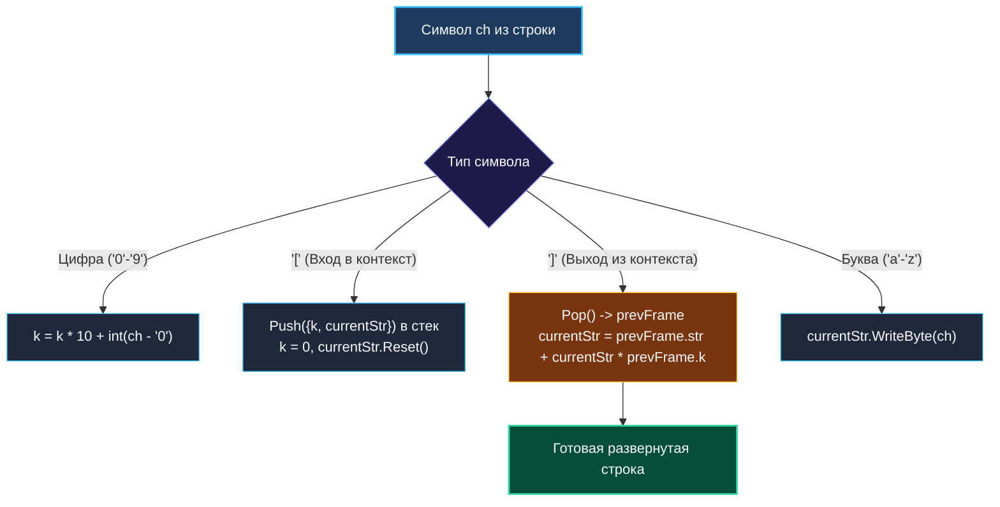

# 8. Decode String

> *«Стек превращает машину времени в реальность: каждый раз, погружаясь на новый уровень вложенности, вы оставляете на вершине снимок прошлого, к которому вернетесь с результатом нового опыта».*  
> — Брайан Керниган

> 💡 **Связанные темы:**
> - [[1. Теория. Стек]] — базовая структура LIFO
> - [[3. Valid Parentheses]] — скобочные структуры и парсинг
> - [[7. Largest Rectangle in Histogram]] — вычисление площадей через монотонный стек
> - [[sources/21. Задачи с LeetCode и собеседований на Go/02. Задачи/07. Очередь/1. Теория. Очередь|07. Очередь: 1. Теория]] — смена дисциплины LIFO на FIFO

---

## Введение: Синтаксический анализ вложенных контекстов

Исторически структура данных «стек» создавалась в Computer Science не для поиска чисел в массивах, а для **синтаксического анализа (парсинга) формальных грамматик и языков программирования**.

Задача **Decode String** (LeetCode 394) — классическая миниатюра написания лексера и парсера:
> *Дана закодированная строка вида `k[encoded_string]`, где строка внутри скобок должна быть повторена ровно `k` раз. Вложенность может быть произвольной глубины.*  
> Пример: `3[a2[c]]` $\to$ `3[acc]` $\to$ `accaccacc`.

Эта задача тестирует способность инженера управлять стеком состояний (State Machine) и писать высокопроизводительный код на Go, где неаккуратная работа со строками грозит $O(N^2)$ лишних аллокаций.

---

## 🎯 Вопросы для уточнения условий (Interview Warm-up)

1. **Многозначные множители:**  
   *«Может ли число $k$ состоять из нескольких цифр (например, `100[leetcode]`)?»*  
   *(Да! Множитель необходимо накапливать поразрядно: `k = k*10 + int(b - '0')`).*
2. **Символы вне скобок:**  
   *«Могут ли буквы встречаться без скобок (например, `2[abc]3[cd]ef`)?»*  
   *(Да, обычные буквы просто дописываются в текущий буфер).*
3. **Корректность формата:**  
   *«Гарантируется ли, что скобки расставлены правильно и нет битого синтаксиса?»*  
   *(Да, строка всегда валидна по условию LeetCode 394).*

---

## Архитектура: Сохранение контекста во фреймах

Каждый раз, когда парсер встречает символ `'['`, происходит погружение во вложенный контекст:
1. Текущий накопленный множитель $k$ и собранная до скобки строка сохраняются во **фрейм стека** (Snapshot);
2. Буфер сбрасывается для сборки содержимого внутри скобок;
3. Когда встречается `']'`, фрейм извлекается из стека: содержимое умножается на $k$ и приклеивается к родительской строке.



---

## 🛠️ Оптимальное решение на Go

```go
package decodestr

import "strings"

// frame инкапсулирует сохраненное состояние родительского контекста.
type frame struct {
    k   int
    str string
}

// DecodeString разворачивает вложенную строку за линейное время O(N).
func DecodeString(s string) string {
    var stack []frame
    var currentK int
    var currentStr strings.Builder

    for i := 0; i < len(s); i++ {
        b := s[i]

        switch {
        case b >= '0' && b <= '9':
            // Поразрядное накопление множителя k
            currentK = currentK*10 + int(b-'0')

        case b == '[':
            // Сохраняем состояние текущего уровня во фрейм стека
            stack = append(stack, frame{
                k:   currentK,
                str: currentStr.String(),
            })

            // Сбрасываем контекст для нового уровня
            currentK = 0
            currentStr.Reset()

        case b == ']':
            // Извлекаем сохраненный контекст верхнего уровня (Pop)
            lastIdx := len(stack) - 1
            prev := stack[lastIdx]
            stack = stack[:lastIdx]

            chunk := currentStr.String()

            // Восстанавливаем строку верхнего уровня
            currentStr.Reset()
            currentStr.WriteString(prev.str)

            // Добавляем chunk ровно prev.k раз
            for j := 0; j < prev.k; j++ {
                currentStr.WriteString(chunk)
            }

        default:
            // Обычный символ буквы
            currentStr.WriteByte(b)
        }
    }

    return currentStr.String()
}
```

---

## ⚙️ Mechanical Sympathy: Секреты работы со строками в Go

### 1. Ловушка `strings.Builder` по значению
> [!warning] Ошибка, роняющая программу в рантайме
> Почему в структуре `frame` хранится `string`, а не сам `strings.Builder`?  
> Если попытаться скопировать `strings.Builder` по значению:
> ```go
> stack = append(stack, frame{sb: currentStr}) // ПАНИКА!
> ```
> Go выбросит панику: `panic: strings: illegal use of non-zero Builder copied by value`.  
> Внутри `strings.Builder` есть защитный механизм `noCopy`. Копирование структуры привело бы к тому, что две переменные писали бы в один базовый срез байт в куче, порождая разрушительные гонки данных. Вызов `.String()` перед сохранением в стек строго обязателен!

### 2. Zero-Copy в методе `String()`
Вызов `currentStr.String()` в Go не копирует байты памяти заново.  
Исходный код стандартной библиотеки Go:
```go
return unsafe.String(unsafe.SliceData(b.buf), len(b.buf))
```
Он создает заголовок строки `string` (указатель + длина), указывающий прямо на существующий срез байт билдера. Это исключает лишнее дублирование памяти.

### 3. Прямая запись вместо `strings.Repeat`
Использование `for j := 0; j < prev.k; j++ { currentStr.WriteString(chunk) }` пишет данные прямо в растущий буфер билдера. В отличие от `strings.Repeat`, который создает промежуточный объект в куче, наш подход экономит такты процессора и память GC.

---

## 🗺️ Навигация

| Назад | Вперед |
| :--- | :--- |
| ← [[7. Largest Rectangle in Histogram]] | [[sources/21. Задачи с LeetCode и собеседований на Go/02. Задачи/07. Очередь/1. Теория. Очередь|07. Очередь: 1. Теория]] → |