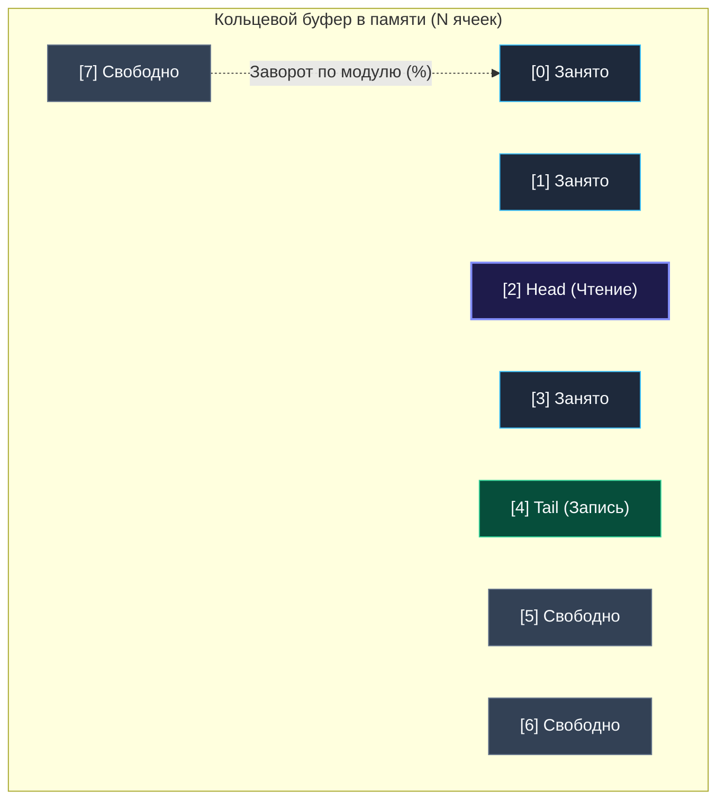
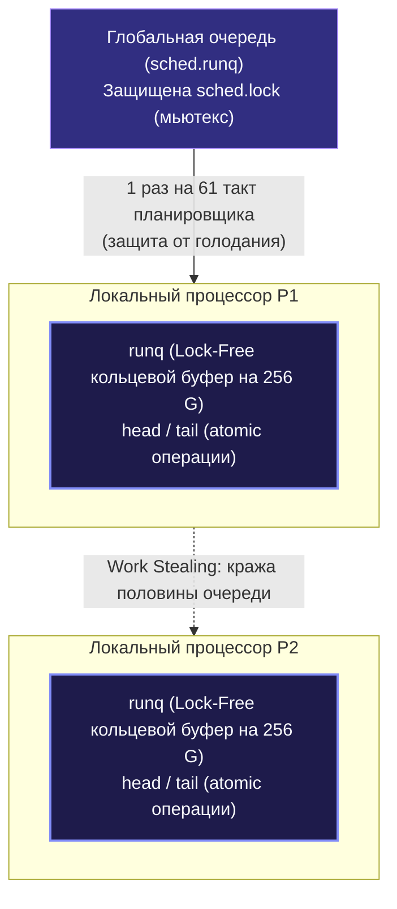

> *«Очередь — это воплощение справедливости в мире вычислений: каждый процесс будет обслужен ровно в свой черед».*  
> — Эдсгер Дейкстра

## Переход от LIFO к FIFO: Справедливость и Балансировка

В предыдущем разделе мы детально исследовали стек — структуру данных LIFO (*Last In, First Out*). Стек незаменим, когда нам нужно отслеживать контекст вложенности, возвращаться назад во времени (поиск в глубину DFS, парсинг грамматик, раскрутка стека вызовов при panic).

Однако в системном программировании, сетевых протоколах и распределенных системах мы чаще всего сталкиваемся с задачами обработки непрерывных потоков данных в естественном порядке их поступления. Обработка входящих сетевых пакетов ядра Linux, диспетчеризация HTTP-запросов в веб-сервере, пулы фоновых воркеров, брокеры сообщений (Kafka, RabbitMQ) — вся эта архитектура построена на фундаментальном принципе **справедливости (Fairness)**. Запрос, прибывший первым, обязан получить процессорное время раньше запросов, пришедших позже.

Для реализации этого инварианта используется фундаментальная структура данных — **Очередь (Queue)**, работающая по принципу **FIFO (First In, First Out)**: *«первым пришел — первым ушел»*.

---

## Абстракция Очереди

В классической очереди данные упорядочены линейно: добавление новых элементов происходит строго в конец (**Хвост / Tail / Back**), а извлечение и обработка — строго из начала (**Голова / Head / Front**).


### Базовые операции очереди:
- **Enqueue (Push)** — добавить элемент в хвост очереди ($O(1)$).
- **Dequeue (Pop)** — извлечь и вернуть элемент из головы ($O(1)$).
- **Front (Peek)** — прочитать значение на голове без удаления ($O(1)$).
- **Len / IsEmpty** — получить текущее количество элементов или проверить очередь на пустоту ($O(1)$).

---

## Mechanical Sympathy: Почему наивная реализация на Go смертельно опасна

На технических собеседованиях кандидаты младшего и среднего уровня часто поддаются соблазну реализовать очередь за пару строк с помощью стандартного слайса Go:

```go
// НАИВНАЯ И ОПАСНАЯ РЕАЛИЗАЦИЯ (Антипаттерн!)
type NaiveQueue struct {
    items []int
}

func (q *NaiveQueue) Enqueue(val int) {
    q.items = append(q.items, val)
}

func (q *NaiveQueue) Dequeue() int {
    if len(q.items) == 0 {
        return 0
    }
    val := q.items[0]
    q.items = q.items[1:] // Сдвигаем окно слайса вправо
    return val
}
```

Код проходит простые юнит-тесты на 5-10 элементах, но в реальном высоконагруженном сервисе такой класс гарантированно приведет к деградации производительности и аварийной остановке по Out of Memory (OOM). 

> [!WARNING] Ловушка / Gotcha: Memory Drag и утечки памяти (Memory Leaks)
> В этой реализации скрыты две критические проблемы рантайма Go:
> 
> 1. **Утечка ссылок (Lapsed Listener / Stale Pointer):**  
>    Если очередь хранит указатели (`[]*Transaction`) или структуры с ссылочными типами (строки, мапы, интерфейсы), то срез `q.items = q.items[1:]` лишь изменяет заголовок слайса `SliceHeader` (сдвигает указатель `Data` на `sizeof(T)` байт вправо и уменьшает `Len` на 1).  
>    При этом в ячейке с индексом `0` базового массива (`underlying array`) **физически остается старый указатель**. Сборщик мусора Go (GC) видит живую ссылку из базового массива и **не может освободить объект в куче**, пока жив весь массив!
> 
> 2. **Постоянные реаллокации (Infinite Growth / Memory Drag):**  
>    Операция `q.items[1:]` уменьшает `len`, но оставляет `cap` почти неизменным (`cap - 1`). С каждым добавлением `append` расходует остаток емкости справа. Когда хвост массива достигает границы `cap`, рантайм вызывает `runtime.growslice`, выделяя новый, еще больший кусок памяти в куче и копируя туда текущий срез.  
>    Очередь постоянно «ползет» вправо по адресной памяти, провоцируя бесконечные аллокации и напрягая GC очисткой сотен гигабайт «брошенных» префиксов.

---

## Идиоматичная реализация: Кольцевой буфер (Ring Buffer)

Чтобы получить честное константное время $O(1)$ без единой лишней аллокации в установившемся режиме, в системном программировании применяют **Кольцевой буфер (Circular Queue / Ring Buffer)**.

Идея проста и изящна: мы выделяем непрерывный массив фиксированного размера $M$ и поддерживаем два целочисленных индекса — `head` (откуда читаем) и `tail` (куда пишем). При достижении границы массива индексы «заворачиваются» в начало с помощью операции деления по модулю (`idx = (idx + 1) % M`) или быстрой побитовой маски.



### Production-ready реализация на дженериках Go:

```go
package queue

import (
	"errors"
)

var (
	ErrQueueEmpty = errors.New("очередь пуста")
	ErrQueueFull  = errors.New("очередь переполнена")
)

// RingQueue реализует высокопроизводительную FIFO-очередь на кольцевом буфере.
type RingQueue[T any] struct {
	buf   []T
	head  int // Индекс извлечения (Dequeue)
	tail  int // Индекс вставки (Enqueue)
	count int // Фактическое количество активных элементов
}

// NewRingQueue создает очередь с заданной вместимостью.
func NewRingQueue[T any](capacity int) *RingQueue[T] {
	if capacity <= 0 {
		capacity = 16
	}
	return &RingQueue[T]{
		buf: make([]T, capacity),
	}
}

// Enqueue добавляет элемент в хвост очереди за O(1).
func (q *RingQueue[T]) Enqueue(val T) error {
	if q.count == len(q.buf) {
		// При необходимости здесь можно вызвать q.grow(), но для фиксированного буфера:
		return ErrQueueFull
	}

	q.buf[q.tail] = val
	q.tail = (q.tail + 1) % len(q.buf)
	q.count++
	return nil
}

// Dequeue извлекает элемент из головы очереди за O(1).
func (q *RingQueue[T]) Dequeue() (T, error) {
	var zero T
	if q.count == 0 {
		return zero, ErrQueueEmpty
	}

	val := q.buf[q.head]
	q.buf[q.head] = zero // КРИТИЧНО: зануляем слот, освобождая память для GC!

	q.head = (q.head + 1) % len(q.buf)
	q.count--
	return val, nil
}

// Front возвращает элемент на голове без удаления.
func (q *RingQueue[T]) Front() (T, error) {
	if q.count == 0 {
		var zero T
		return zero, ErrQueueEmpty
	}
	return q.buf[q.head], nil
}

// Len возвращает количество элементов в очереди.
func (q *RingQueue[T]) Len() int {
	return q.count
}

// IsEmpty проверяет, пуста ли очередь.
func (q *RingQueue[T]) IsEmpty() bool {
	return q.count == 0
}
```

> [!TIP] Mechanical Sympathy: Оптимизация деления по модулю через битовую маску
> На уровне процессора инструкция целочисленного деления `DIV` / `IDIV` — одна из самых дорогостоящих (требует 15–40 тактов CPU).  
> Если зафиксировать размер буфера как **степень двойки** ($N = 2^k$), математическую операцию остатка `idx % N` можно заменить сверхбыстрой побитовой операцией `idx & (N - 1)`, которая выполняется за **1 такт CPU**:
> ```go
> // Вместо: q.tail = (q.tail + 1) % len(q.buf)
> q.tail = (q.tail + 1) & (len(q.buf) - 1)
> ```
> Именно этот трюк используется во всех внутренних кольцевых буферах ядра Linux и рантайма Go.

---

## Внутренности Go: Как устроены очереди в рантайме

Понимание механизма очередей дает ключ к пониманию всей параллельной модели Go. Язык буквально пронизан очередями на всех уровнях рантайма.

### 1. Буферизированные каналы (`runtime/chan.go`)
Канал в Go — это не магическая сущность, а потокобезопасная обертка вокруг структуры `hchan`, ядром которой является тот самый классический кольцевой буфер:

```go
type hchan struct {
    qcount   uint           // Всего элементов в канале
    dataqsiz uint           // Вместимость кольцевого буфера (make(chan T, cap))
    buf      unsafe.Pointer // Указатель на непрерывный массив ячеек в памяти
    elemsize uint16
    closed   uint32
    elemtype *_type         // Информация о типе для сборщика мусора
    sendx    uint           // Индекс записи (наш tail!)
    recvx    uint           // Индекс чтения (наш head!)
    recvq    waitq          // Очередь заблокированных горутин-читателей (sudog)
    sendq    waitq          // Очередь заблокированных горутин-писателей (sudog)
    lock     mutex          // Спинлок/мьютекс, защищающий буфер
}
```
Когда горутина отправляет значение в буферизированный канал `ch <- x`, рантайм копирует байты в ячейку `buf[sendx]`, увеличивает `sendx = (sendx + 1) % dataqsiz` и пробуждает ожидающего читателя из `recvq`.

### 2. Планировщик Go (GMP): Локальные и глобальные очереди задач

Планировщик Go распределяет миллионы горутин ($G$) по системным потокам ОС ($M$), используя логические процессоры ($P$). Очереди планировщика организованы двухуровнево:



1. **Локальная очередь процессора `P.runq`:**  
   Каждый процессор $P$ хранит кольцевой буфер ровно на 256 элементов: `runq [256]guintptr`.  
   Операции добавления и извлечения собственных горутин выполняются **без мьютексов (lock-free)** с использованием атомарных инструкций `atomic.LoadAcq` и `atomic.CasRel`. Это исключает конкуренцию за блокировки между потоками.
2. **Алгоритм Work Stealing (Кража работы):**  
   Если у процессора $P_1$ опустела собственная очередь, он не засыпает, а пытается «украсть» ровно половину горутин из хвоста локальной очереди другого случайного процессора $P_2$, восстанавливая баланс загрузки ядер CPU.
3. **Глобальная очередь `schedt.runq`:**  
   Сюда попадают горутины при переполнении локального буфера (более 256 элементов) или после разблокировки сетевых вызовов. Чтобы горутины в глобальной очереди не голодали (*starvation*), каждый $P$ раз в 61 такт проверки очереди принудительно берет задачу из глобальной очереди, даже если его собственный буфер полон.

---

## Паттерны использования на алгоритмических секциях

На технических интервью структуры данных на основе FIFO возникают в следующих ключевых сценариях:

1. **Поиск в ширину (BFS — Breadth-First Search):**  
   Стандарт обхода графов и деревьев по слоям (поуровневый обход, поиск кратчайшего пути в невзвешенном графе). Очередь гарантирует, что все узлы на расстоянии $d$ будут обработаны строго до перехода к узлам на расстоянии $d+1$.
2. **Скользящее окно по потоку (Sliding Window):**  
   Поддержание фиксированного окна последних поступивших элементов при агрегации потоковых метрик (например, скользящее среднее).
3. **Топологическая сортировка (Алгоритм Кана):**  
   Очередь хранит вершины с нулевой входящей степенью (in-degree = 0). По мере их удаления уменьшаются степени соседей, а новые вершины с нулевой степенью добавляются в очередь.

> [!INTERVIEW] Вопросы с реальных собеседований
> - **В чем разница между кольцевым буфером и двусвязным списком (`container/list`) для реализации очереди?**  
>   *Ответ:* Связный список требует аллокации отдельного узла в куче на каждый `Push` (что нагружает GC и фрагментирует память) и страдает от постоянных Cache Misses из-за разброса указателей. Кольцевой буфер размещается в непрерывном массиве: данные идеально кэшируются в L1/L2 процессора, а в устоявшемся режиме число аллокаций равно нулю.
> - **Что произойдет, если в Go срезать слайс `q = q[1:]` при хранении указателей?**  
>   *Ответ:* Нулевой элемент останется в базовом массиве и не будет утилизирован сборщиком мусора, пока жив весь массив. Это скрытая утечка памяти. Перед сдвигом указатель необходимо занулить: `q[0] = nil`.

## Итог

Очередь — это базовый строительный блок архитектуры современных параллельных систем. Идиоматичный путь в Go — кольцевые буферы с плотной упаковкой в кэше CPU и обязательным занулением слотов при удалении.

Но что делать, если в скользящем окне нам нужно не просто хранить элементы по порядку, а **мгновенно находить максимум или минимум за $O(1)$**? Обычная очередь бессильна. В следующей статье мы познакомимся с её продвинутой эволюцией: [[2. Монотонная очередь]].