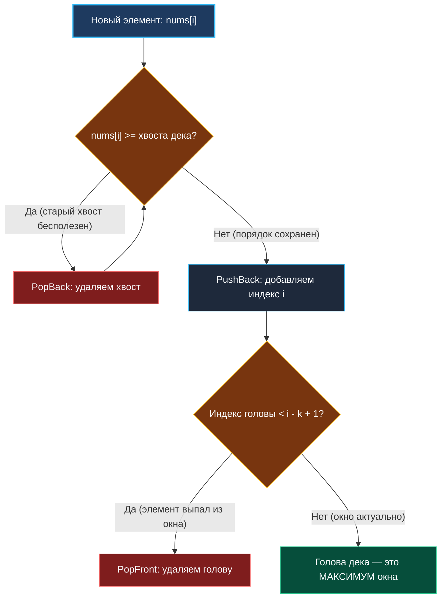

> *«Устранение лишней информации в нужный момент — ключ к созданию быстрых алгоритмов».*  
> — Брайан Керниган

## От монотонного стека к скользящему окну: Двусторонняя очередь (Deque)

В теме [[2. Монотонный стек]] мы исследовали мощный инструмент поиска ближайших больших или меньших элементов в статичном массиве за $O(N)$. Стек работал безупречно, потому что нам требовалось возвращаться назад и срезать локальные пики только с одного конца структуры.

Однако при обработке потоковых данных или анализе **скользящего окна (Sliding Window)** размера $K$ возникает новая фундаментальная проблема:
1. Новые элементы поступают справа (в хвост окна).
2. Старые элементы «протухают» и покидают окно слева (из головы окна).
3. При этом на каждом шаге сдвига окна требуется мгновенно отвечать на вопрос: *«Какой элемент является максимальным (или минимальным) прямо сейчас?»*

Обычный стек бессилен: он не умеет эффективно удалять элементы с самого своего дна. Обычная FIFO-очередь умеет удалять элементы из головы, но не хранит информацию об экстремумах. 

Решением является синтез этих двух структур: **Монотонная двусторонняя очередь (Monotonic Deque — Double-Ended Queue)**.

---

## Инвариант Монотонного Дека

**Дек (Deque)** — это структура данных, позволяющая добавлять и удалять элементы как с головы (*Head / Front*), так и с хвоста (*Tail / Back*) за гарантированное $O(1)$.

Очередь называется **монотонной**, если в любой момент времени значения её элементов образуют строго монотонную последовательность (убывающую или возрастающую).

### Правило поддержания максимума (Strictly Decreasing Deque):
1. **Голова (Head):** Здесь всегда находится абсолютный максимум текущего окна.
2. **Хвост (Tail):** Здесь выстраиваются кандидаты, упорядоченные по убыванию. Каждый последующий элемент меньше предыдущего, но появился в окне позже (он моложе).
3. **Очистка хвоста при добавлении:** Когда в окно входит новый элемент `nums[i]`, мы смотрим на хвост дека. Если элемент на хвосте **меньше либо равен** новому, мы выбиваем его (`PopBack`).  
   *Почему?* Новый элемент больше старого и появился позже. Старый элемент уже **никогда** не сможет стать максимумом ни в текущем окне, ни во всех последующих сдвигах — он полностью затмлен новым лидером.
4. **Очистка головы по времени:** Если индекс элемента на голове дека вышел за левую границу текущего окна (`dq.Front() < i - k + 1`), он вытесняется (`PopFront`).



---

## Mechanical Sympathy: Проблема слайсинга в Go

В стандартной библиотеке Go нет специализированного типа `deque`. Подавляющее большинство программистов пишут дек на основе стандартного слайса:
- Вставка в хвост: `dq = append(dq, x)`
- Удаление с хвоста: `dq = dq[:len(dq)-1]`
- Удаление из головы: `dq = dq[1:]`

> [!WARNING] Ловушка / Gotcha: Memory Drag и скрытые реаллокации
> Операция `dq = dq[1:]` формально занимает $O(1)$, но не освобождает выделенный буфер, а лишь смещает указатель данных в заголовке слайса вправо.  
> Если через ваше скользящее окно проходит поток из 10 000 000 чисел, а активное окно содержит всего 5 элементов, базовый массив слайса будет непрерывно расти вправо. Каждые несколько тысяч шагов емкость `cap` будет исчерпываться, вызывая системную реаллокацию памяти `runtime.growslice`.  
> В высоконагруженном коде это приводит к деградации производительности и колоссальному расходу памяти на ровном месте.

### Идиоматичный подход: Виртуальный указатель головы

Чтобы устранить аллокации, достаточно выделить память под дек ровно один раз и имитировать операцию `PopFront` простым инкрементом целочисленного индекса `head++`.

```go
package monotonic

// Deque реализует двустороннюю очередь индексов без реаллокаций памяти.
type Deque struct {
	items []int // Слайс для хранения индексов массива
	head  int   // Виртуальный указатель на начало активной зоны
}

// NewDeque инициализирует дек с заданной емкостью.
func NewDeque(capacity int) *Deque {
	return &Deque{
		items: make([]int, 0, capacity),
		head:  0,
	}
}

// PushBack добавляет индекс в конец дека за O(1).
func (d *Deque) PushBack(idx int) {
	d.items = append(d.items, idx)
}

// PopBack удаляет элемент с конца дека за O(1).
func (d *Deque) PopBack() {
	d.items = d.items[:len(d.items)-1]
}

// PopFront сдвигает виртуальную голову вперед за O(1) без реаллокаций.
func (d *Deque) PopFront() {
	d.head++
}

// Front возвращает индекс на голове очереди.
func (d *Deque) Front() int {
	return d.items[d.head]
}

// Back возвращает индекс на хвосте очереди.
func (d *Deque) Back() int {
	return d.items[len(d.items)-1]
}

// IsEmpty проверяет, пуст ли дек с учетом смещения головы.
func (d *Deque) IsEmpty() bool {
	return d.head == len(d.items)
}
```

---

## Канонический шаблон скользящего окна

Продемонстрируем, как лаконично и надежно выглядит алгоритм нахождения максимумов во всех окнах размера $K$ с использованием нашей структуры:

```go
// maxSlidingWindow возвращает срез максимальных элементов во всех окнах размера k.
func maxSlidingWindow(nums []int, k int) []int {
	n := len(nums)
	if n == 0 || k <= 0 {
		return nil
	}
	if k == 1 {
		return nums
	}

	// Результат содержит ровно n - k + 1 элементов
	res := make([]int, 0, n-k+1)
	
	// Выделяем память под дек ровно один раз: емкость n исключает любые growslice!
	dq := NewDeque(n)

	for i := 0; i < n; i++ {
		// 1. Очистка головы: удаляем индексы, вышедшие за пределы левой границы [i - k + 1, i]
		for !dq.IsEmpty() && dq.Front() < i-k+1 {
			dq.PopFront()
		}

		// 2. Очистка хвоста: поддерживаем строго убывающий порядок значений
		// Выбиваем всех кандидатов, которые меньше или равны текущему nums[i]
		for !dq.IsEmpty() && nums[dq.Back()] <= nums[i] {
			dq.PopBack()
		}

		// 3. Добавляем текущий индекс в дек
		dq.PushBack(i)

		// 4. Запись ответа: начинаем фиксировать максимум, как только сформировано первое полное окно
		if i >= k-1 {
			res = append(res, nums[dq.Front()])
		}
	}

	return res
}
```

---

## Взгляд под капот: Временная сложность и CPU-кэш

Вложенный цикл `for !dq.IsEmpty() && nums[dq.Back()] <= nums[i]` может создать обманчивое впечатление квадратичной сложности $O(N \times K)$. Однако это строгая иллюзия.

### Амортизированная сложность: $O(N)$
Каждый индекс $i \in [0, N-1]$ исходного массива:
1. Ровно **один раз** добавляется в хвост дека (`PushBack`).
2. Максимум **один раз** удаляется из дека — либо с хвоста (`PopBack`), либо с головы (`PopFront`).

Суммарное количество манипуляций с деком за весь проход по массиву длины $N$ строго ограничено $2N$ операциями. Среднее время обработки одного элемента составляет честное $O(1)$.

### Сравнение с Приоритетной очередью (Max-Heap)
| Характеристика | Monotonic Deque | Max-Heap (`container/heap`) |
|---|---|---|
| **Временная сложность** | $O(N)$ строго | $O(N \log K)$ |
| **Дополнительная память** | $O(K)$ или $O(N)$ | $O(K)$ |
| **Локальность данных** | Превосходная (непрерывный слайс) | Средняя (массив двоичного дерева) |
| **Удаление устаревших** | $O(1)$ с головы | $O(\log K)$ или ленивое удаление |
| **Нагрузка на GC** | Нулевая (Zero-allocs) | Высокая при частых интерфейсных обертках |

> [!TIP] Mechanical Sympathy: Локальность данных против `container/list`
> В стандартной библиотеке Go есть пакет `container/list`, реализующий двусвязный список. Но использовать его для монотонного дека — грубейшая ошибка.  
> `list.List` упаковывает каждый элемент в структуру `Element` в куче:
> ```go
> type Element struct {
>     next, prev *Element
>     list       *List
>     Value      any // Интерфейс: еще одна скрытая аллокация!
> }
> ```
> При обходе такого списка процессор тратит сотни тактов на ожидание подгрузки разрозненных адресов памяти из RAM (Cache Misses).  
> Наш монотонный дек на непрерывном слайсе `[]int` размещается прямо в строках L1d-кэша процессора. Инструкции сравнения выполняются на предельной скорости конвейера CPU.

---

> [!INTERVIEW] Вопросы для собеседований
> 1. **Почему мы сохраняем в деке именно индексы, а не сами значения элементов?**  
>    *Ответ:* Значение само по себе не позволяет определить, находится ли элемент внутри текущего временного интервала скользящего окна $[i - k + 1, i]$. Индекс дает полную информацию: он позволяет мгновенно проверить актуальность окна за $O(1)$ и получить само значение через `nums[idx]`.
> 2. **Как адаптировать монотонную очередь для поиска минимума?**  
>    *Ответ:* Достаточно инвертировать условие очистки хвоста: выбивать элементы, которые **больше либо равны** входящему (`nums[dq.Back()] >= nums[i]`). Тогда на голове дека всегда будет минимальный элемент.

## Итог

Монотонный дек — это вершина алгоритмической оптимизации для скользящих окон. Он превращает тяжелые поиски экстремумов из $O(N \times K)$ в мгновенный линейный проход $O(N)$.

Закрепив фундаментальные концепции очередей и деков, вернемся к классической инженерной головоломке, которую так любят задавать на скринингах для проверки понимания инвариантов: [[3. Implement Queue using Stacks]].