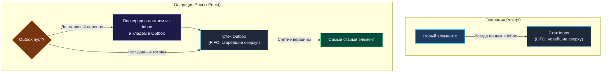

> *«Сложное поведение часто рождается из гармоничного сочетания двух простых механизмов».*  
> — Никлаус Вирт

## Синтетика с глубоким смыслом

Задача **Implement Queue using Stacks** (LeetCode 232) на первый взгляд кажется кандидатам странной и оторванной от реальности: *«Зачем в реальном бэкенде эмулировать FIFO-очередь через два LIFO-стека, если можно написать эффективный кольцевой буфер на десяток строк?»*

Ответ прост: в промышленном коде вы вряд ли напишете такую конструкцию, но на технических собеседованиях в FAANG, Yandex, Avito и VK эта задача — постоянный гость. Она мгновенно тестирует три критически важных навыка инженера:
1. **Понимание структурных инвариантов:** как трансформировать обратный порядок LIFO в прямой порядок FIFO.
2. **Управление состоянием:** координация данных между двумя независимыми хранилищами без гонок и лишних копирований.
3. **Глубокое понимание амортизированного анализа (Amortized Complexity):** почему редкая «тяжелая» операция не делает весь алгоритм медленным.

---

## Архитектура решения: Инверсия порядка через двойной стек

Стек разворачивает последовательность данных задом наперед. Если мы отправим в стек числа `[1, 2, 3]`, то при последовательном извлечении получим `[3, 2, 1]`.

Как восстановить исходный порядок `[1, 2, 3]` без использования сторонних коллекций?  
Вспомним базовый закон логики: **двойное отрицание дает утверждение**. Если развернуть уже развернутую последовательность второй раз, мы получим первоначальный FIFO-порядок!

Для этого разделим обязанности между двумя стеками:
1. **Inbox (Входной стек):** служит накопителем для всех новых поступлений. Метод `Push(x)` всегда отправляет элемент на вершину `inbox` за честное и строгое $O(1)$.
2. **Outbox (Выходной стек):** предназначен исключительно для отдачи элементов. Методы `Pop()` и `Peek()` всегда читают с вершины `outbox`.



> [!WARNING] Ловушка / Gotcha: Фатальная ошибка начинающих (двойной перенос)
> Самая распространенная ошибка кандидатов на интервью:
> *«При каждом вызове `Pop()` мы пересыпаем все элементы из `Inbox` в `Outbox`, забираем один элемент, а затем сразу пересыпаем всё оставшееся обратно в `Inbox`!»*
> 
> Такой подход катастрофически разрушает производительность: абсолютно каждый вызов `Pop()` превращается в тяжелый цикл $O(N)$.  
> **Золотое правило:** никогда не пересыпайте элементы обратно в `Inbox`! Данные, однажды попавшие в `Outbox`, уже лежат в идеальном FIFO-порядке. Пусть они спокойно живут там, пока `Outbox` полностью не опустеет.

---

## Идиоматичная реализация на Go

В Go роль стека идеально выполняет обычный срез (slice). Структура получается максимально компактной и лаконичной:

```go
package queue

// MyQueue реализует FIFO-очередь поверх двух стеков (слайсов).
type MyQueue struct {
	inbox  []int // Стек для входящих элементов
	outbox []int // Стек для выдачи элементов
}

// Constructor инициализирует пустую очередь.
func Constructor() MyQueue {
	return MyQueue{
		inbox:  make([]int, 0, 8),
		outbox: make([]int, 0, 8),
	}
}

// Push добавляет элемент x в конец очереди за O(1).
func (q *MyQueue) Push(x int) {
	q.inbox = append(q.inbox, x)
}

// moveInboxToOutbox переносит элементы из inbox в outbox при необходимости.
// Ключевой инвариант: перенос происходит ТОЛЬКО когда outbox полностью пуст!
func (q *MyQueue) moveInboxToOutbox() {
	if len(q.outbox) > 0 {
		return
	}

	// Переливаем элементы: вершина inbox становится дном outbox,
	// а дно inbox (самый старый элемент) оказывается на вершине outbox.
	for len(q.inbox) > 0 {
		n := len(q.inbox) - 1
		val := q.inbox[n]
		q.inbox = q.inbox[:n] // Снимаем с вершины inbox
		q.outbox = append(q.outbox, val)
	}
}

// Pop извлекает и возвращает элемент из начала очереди.
func (q *MyQueue) Pop() int {
	q.moveInboxToOutbox()

	if len(q.outbox) == 0 {
		return 0 // По условиям LeetCode очередь не пуста
	}

	n := len(q.outbox) - 1
	val := q.outbox[n]
	q.outbox = q.outbox[:n] // Удаляем вершину outbox
	return val
}

// Peek возвращает элемент из начала очереди без его удаления.
func (q *MyQueue) Peek() int {
	q.moveInboxToOutbox()

	if len(q.outbox) == 0 {
		return 0
	}

	return q.outbox[len(q.outbox)-1]
}

// Empty проверяет, пуста ли очередь.
func (q *MyQueue) Empty() bool {
	return len(q.inbox) == 0 && len(q.outbox) == 0
}
```

---

## Взгляд под капот: Амортизированная сложность $O(1)$

На собеседовании интервьюер обязательно спросит:  
*«Какова временная сложность метода `Pop()`?»*

Если кандидат ответит $O(1)$, интервьюер укажет на цикл переливания `for len(q.inbox) > 0`. Если кандидат ответит $O(N)$, интервьюер усомнится в понимании алгоритмов.  
Правильный ответ: **Худший случай (Worst Case) — $O(N)$, но Амортизированное время (Amortized Time) — строго $O(1)$**.

### Математическое обоснование методом учетных стоимостей (Accounting Method):
Проследим весь жизненный путь каждого отдельного элемента $x$, прошедшего через нашу очередь:
1. **Шаг 1:** Вызов `Push(x)` помещает его в `inbox` — ровно **1 операция**.
2. **Шаг 2:** Во время редкого переноса элемент один раз снимается из `inbox` — ровно **1 операция**.
3. **Шаг 3:** Элемент добавляется в `outbox` — ровно **1 операция**.
4. **Шаг 4:** При вызове `Pop()` элемент снимается с вершины `outbox` — ровно **1 операция**.

Каждый элемент за всю свою жизнь в структуре данных участвует **ровно в 4 операциях перемещения**, независимо от того, сколько тысяч элементов находится в очереди.  
Если перенос 1000 элементов из `inbox` в `outbox` потребовал 1000 итераций, то последующие 999 вызовов `Pop()` выполнятся за мгновенное прямое чтение вершины за $O(1)$. Размазанная по времени стоимость каждой операции составляет $4 / 1 = O(1)$.

> [!TIP] Mechanical Sympathy: Повторное использование емкости (Capacity Reuse)
> В отличие от наивной очереди `q = q[1:]`, которая бесконечно растет вправо и расходует новую память, реализация на двух стеках **полностью дружелюбна к аллокатору Go**.  
> Когда мы опустошаем `inbox` через `q.inbox = q.inbox[:n]`, мы лишь уменьшаем длину `len`, сохраняя выделенную базовую емкость `cap`. При следующих вызовах `Push` слайс `inbox` заново заполняет уже выделенный блок памяти в куче, не дергая `runtime.growslice` и не создавая мусора для сборщика мусора.

---

> [!INTERVIEW] Вопросы для собеседований
> 1. **Как сделать эту структуру потокобезопасной (Concurrent Safe)?**  
>    *Ответ:* Если обернуть всю структуру единым `sync.Mutex`, операции `Push` и `Pop` будут блокировать друг друга. Более зрелое архитектурное решение — использовать **два раздельных мьютекса**: `inLock` для записи в `inbox` и `outLock` для чтения из `outbox`. `inLock` захватывается только на время добавления, а `outLock` — на время чтения. При переносе из `inbox` в `outbox` кратковременно захватываются обе блокировки в строгом порядке (`outLock`, затем `inLock`), что предотвращает deadlocks.
> 2. **Какова пространственная сложность (Space Complexity)?**  
>    *Ответ:* $O(N)$, где $N$ — общее количество элементов в очереди. Каждый элемент хранится ровно в одном месте: либо в `inbox`, либо в `outbox`, поэтому дублирования памяти не происходит.

## Итог

Задача «Очередь на двух стеках» — это классический триумф амортизированного анализа над наивной оценкой худшего случая. Ленивый перенос данных превращает потенциально дорогостоящую операцию в незаметную константу.

Освоив координацию дискретных структур, перейдем к фундаментальной задаче потоковой аналитики реального времени: вычислению бегущих метрик над бесконечным потоком данных в статье [[4. Moving Average from Data Stream]].