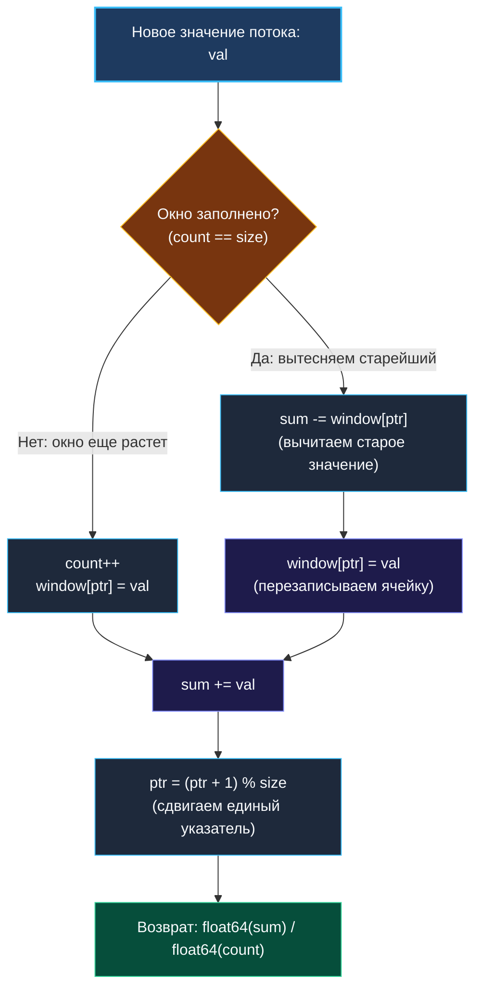

> *«Не пытайся объять необъятное: бесконечный поток требует конечного окна и постоянного времени».*  
> — Кен Томпсон

## Потоковая обработка данных и агрегация в реальном времени

В классических алгоритмах мы обычно оперируем статическими массивами или строками, целиком загруженными в оперативную память. Однако в реальном бэкенде — при сборе телеметрии и метрик (Prometheus, OpenTelemetry), анализе биржевых котировок или мониторинге задержек API (latency) — данные приходят непрерывным, бесконечным потоком (*Data Stream*).

Попытка сохранить всю историю потока в памяти приведет к неминуемому аварийному завершению процесса по Out of Memory (OOM). Архитектура сервиса обязана агрегировать показатели «на лету», используя **строго ограниченный объем памяти и гарантированное константное время $O(1)$** на каждое входящее событие.

Задача **Moving Average from Data Stream** (LeetCode 346) — это эталонный пример построения скользящего аналитического окна над бесконечным потоком.

> [!NOTE] Условие задачи
> Спроектируйте структуру данных, которая принимает на вход поток целых чисел и после каждого нового числа возвращает скользящее среднее арифметическое (*Simple Moving Average — SMA*) последних $K$ поступивших значений.
> 
> ```go
> ma := Constructor(3)
> ma.Next(1) // возвращает 1.0 = 1 / 1
> ma.Next(10) // возвращает 5.5 = (1 + 10) / 2
> ma.Next(3) // возвращает 4.66667 = (1 + 10 + 3) / 3
> ma.Next(5) // вытесняет 1; возвращает 6.0 = (10 + 3 + 5) / 3
> ```

---

## Архитектура решения: Инвариант бегущей суммы и кольцевой буфер

Наивный подход начинающего разработчика — складывать все входящие числа в слайс, а при вызове `Next` брать срез последних $K$ элементов и в цикле вычислять их сумму.  
*В чем изъян?* Вычисление суммы в цикле требует $O(K)$ операций. Если размер окна составляет 500 000 элементов (например, мониторинг запросов за последние 10 минут), каждый вызов метода превратится в тяжелую бессмысленную нагрузку на CPU.

### Инвариант бегущей суммы (Running Sum)
Зрелый инженер использует математический инвариант скользящего окна. Зачем суммировать все элементы заново, если изменились всего два значения?
$$\text{Сумма}_{\text{новая}} = \text{Сумма}_{\text{старая}} - \text{Элемент}_{\text{старейший}} + \text{Элемент}_{\text{новый}}$$

Чтобы мгновенно получать самый старый элемент, нам требуется очередь FIFO вместимостью $K$. А чтобы исключить аллокации памяти в цикле, мы применим **Кольцевой буфер (Ring Buffer)** фиксированного размера $K$.



---

## Изящный трюк: Единый указатель кольцевого буфера

В классическом кольцевом буфере используются два раздельных указателя: `head` (для чтения) и `tail` (для записи). 

Однако в задаче скользящего окна с фиксированной вместимостью $K$ вытеснение старого элемента происходит **в ту же самую позицию**, куда должен быть записан новый элемент! 
- Ячейка `ptr`, на которую указывает наш текущий индекс, содержит старейший элемент окна.
- Мы вычитаем его значение из бегущей суммы.
- Записываем в эту же позицию новое число: `window[ptr] = val`.
- Прибавляем новое число к сумме.
- Сдвигаем `ptr = (ptr + 1) % size`.

Один-единственный целочисленный индекс полностью заменяет сложную структуру с двумя указателями.

---

## Идиоматичный Go-код

```go
package movingaverage

// MovingAverage вычисляет скользящее среднее арифметическое над потоком чисел.
type MovingAverage struct {
	window []int // Кольцевой буфер фиксированного размера
	size   int   // Максимальная вместимость окна
	sum    int   // Текущая бегущая сумма элементов окна
	ptr    int   // Единый циклический указатель вытеснения и записи
	count  int   // Реальное количество элементов в окне (пока count < size)
}

// Constructor инициализирует буфер заданного размера.
func Constructor(size int) MovingAverage {
	return MovingAverage{
		window: make([]int, size), // Выделяем память ровно один раз!
		size:   size,
	}
}

// Next принимает очередное значение потока и возвращает актуальное среднее за O(1).
func (m *MovingAverage) Next(val int) float64 {
	if m.count == m.size {
		// Окно заполнено: вычитаем старейший элемент, на который указывает ptr
		m.sum -= m.window[m.ptr]
	} else {
		// Окно еще только набирает элементы
		m.count++
	}

	// Перезаписываем слот старого элемента новым значением
	m.window[m.ptr] = val
	m.sum += val

	// Циклически сдвигаем указатель вперед
	m.ptr = (m.ptr + 1) % m.size

	// Возвращаем среднее значение
	return float64(m.sum) / float64(m.count)
}
```

---

## Взгляд под капот: Mechanical Sympathy

Этот короткий фрагмент кода демонстрирует высочайшую культуру низкоуровневой оптимизации под рантайм Go и архитектуру современных CPU:

1. **Zero Heap Allocations (Нулевая нагрузка на сборщик мусора):**  
   Буфер `window` аллоцируется единственный раз при вызове `Constructor`. Метод `Next` оперирует исключительно плоскими примитивами (`int`, `float64`) по фиксированным смещениям. За миллионы вызовов `Next` не происходит **ни единого обращения к аллокатору кучи**, а сборщик мусора (GC) не тратит ни микросекунды на сканирование структуры.
2. **Кэш-линии CPU и аппаратный Prefetcher:**  
   Срез `window` представляет собой непрерывный блок памяти. Для окна $K=1024$ чисел типа `int` (8 байт на 64-битных системах) весь буфер занимает ровно 8 КБ. Это значение с огромным запасом помещается в кэш данных первого уровня ядра процессора (L1d Cache, обычно 32–48 КБ на ядро). Процессор никогда не обращается к медленной системной памяти (DRAM) — время доступа к ячейке составляет рекордные 1–3 такта CPU.
3. **Оптимизация деления по модулю:**  
   Если размер окна зафиксирован степенью двойки (например, 1024 или 4096), вместо тяжелой процессорной инструкции деления `DIV` достаточно применить побитовую операцию:
   ```go
   m.ptr = (m.ptr + 1) & (m.size - 1)
   ```

---

> [!WARNING] Ловушка / Gotcha: Целочисленное переполнение (Integer Overflow)
> В Go тип `int` на 64-битных платформах имеет диапазон от $-2^{63}$ до $2^{63}-1$. Это огромное число, однако в распределенных брокерах данных при сложении гигантских чисел или при денормализованных данных сумма `sum` может переполниться, превратившись в отрицательное число.
> 
> **Решение для Production:**  
> Если есть риск переполнения или требуется вычислять среднее над вещественными числами с защитой от накопления погрешности округления, применяют **Алгоритм Уэлфорда (Welford's Online Algorithm)**, который обновляет среднее инкрементально:
> $$\bar{x}_{new} = \bar{x}_{old} + \frac{x_{new} - x_{old}}{K}$$
> При этом отпадает необходимость хранить гигантскую общую сумму.

---

> [!INTERVIEW] Вопросы для собеседований
> 1. **Как сделать данную структуру потокобезопасной в многопоточном сервисе?**  
>    *Ответ:* Наиболее производительный путь — защитить методы структурой `sync.Mutex`. Так как критическая секция метода `Next` состоит всего из 5 быстрых операций в памяти (без I/O и системных вызовов), мьютекс удерживается доли наносекунды и практически не создает contention (соперничества потоков).
> 2. **Какова пространственная и временная сложность решения?**  
>    *Ответ:* Временная сложность — строго $O(1)$ на каждый вызов `Next`. Пространственная сложность — строго $O(K)$, где $K$ — размер окна.

## Итог

Задача **Moving Average from Data Stream** учит нас правильному мышлению при проектировании долгоживущих демонов и систем потоковой аналитики: фиксированная память, круговая перезапись и непрерывные инварианты агрегации.

Но что делать, если окно событий ограничивается не фиксированным *количеством* записей, а **временным интервалом** (например, последние 3 секунды)? В следующей статье мы исследуем структуру, лежащую в основе сетевых фильтров и Rate Limiters: [[5. Number of Recent Calls]].