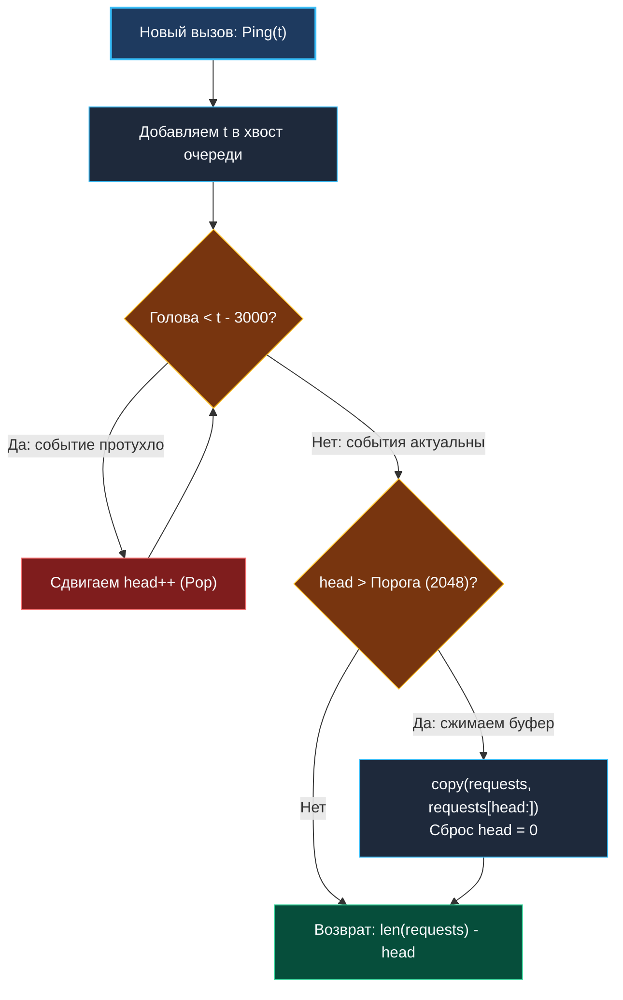

> *«Время непрерывно движется вперед, и хорошая система должна вовремя отпускать то, что уже ушло».*  
> — Брайан Керниган

## Временные окна и основы сетевого Rate Limiting

В предыдущей задаче размер скользящего окна определялся фиксированным *количеством* элементов ($K$). Однако в распределенных веб-сервисах, API-шлюзах и системах защиты от DDoS-атак ограничения почти всегда привязаны к **физическому времени**:
- *«Не более 100 запросов в минуту от одного IP-адреса»*
- *«Не более 10 неудачных попыток входа за последние 15 минут»*
- *«Не более 1000 транзакций в секунду на платежный шлюз»*

Задача **Number of Recent Calls** (LeetCode 933) — это классический прототип ключевого компонента сетевой инфраструктуры: **Ограничителя частоты запросов (Rate Limiter)** по алгоритму **Sliding Window Log (Журнал скользящего окна)**.

> [!NOTE] Условие задачи
> Реализуйте класс `RecentCounter`, который подсчитывает количество недавних запросов в пределах скользящего временного окна:
> - Метод `Ping(t int) int` регистрирует новый запрос, поступивший в момент времени `t` (в миллисекундах).
> - Метод возвращает суммарное количество запросов, произошедших в строгом интервале времени `[t - 3000, t]` (включая текущий запрос).
> - **Гарантия:** Каждый последующий вызов `Ping` приходит со строго большим значением `t` ($t_{i} > t_{i-1}$).

---

## Архитектура: Sliding Window Log на очереди

Поскольку поступающие временные метки строго монотонно возрастают ($t_1 < t_2 < t_3 < \dots$), поток событий естественным образом упорядочен во времени. Это идеальный сценарий для очереди FIFO.

### Логика работы алгоритма:
1. Добавляем текущую временную метку `t` в хвост очереди.
2. Проверяем голову очереди. Если самое старое зарегистрированное событие произошло раньше нижней границы окна (`queue.Front() < t - 3000`), оно официально признается «устаревшим» и удаляется.
3. Повторяем удаление до тех пор, пока на голове очереди не окажется метка, попадающая в интервал `[t - 3000, t]`.
4. Количество элементов, оставшихся в очереди, — это точное количество запросов за последние 3 секунды.



---

## Уровень Junior vs Senior: Ловушка бесконечного слайсинга

Многие кандидаты пишут решение за три строки, используя наивный срез слайса:

```go
// АНТИПАТТЕРН: Непригодно для production!
type NaiveCounter struct {
    reqs []int
}

func (c *NaiveCounter) Ping(t int) int {
    c.reqs = append(c.reqs, t)
    for len(c.reqs) > 0 && c.reqs[0] < t-3000 {
        c.reqs = c.reqs[1:] // Срезаем начало
    }
    return len(c.reqs)
}
```

### Почему это решение провалит системную секцию?
Операция `c.reqs = c.reqs[1:]` не высвобождает память. Она лишь сдвигает указатель данных `Data` в заголовке слайса на 8 байт вперед.  
Представьте реальный сервис, обрабатывающий 10 000 RPS. В окне за 3 секунды находится всего 30 000 чисел. Однако за сутки работы через метод `Ping` пройдет почти миллиард запросов! 
Слайс будет бесконечно ползти вправо по адресному пространству, регулярно исчерпывать `cap` и провоцировать постоянные тяжелые вызовы `runtime.growslice`. Память сервиса начнет бесконтрольно расти, что приведет к падению контейнера по OOM Killer.

---

## Идиоматичное решение: Виртуальная голова и Уплотнение памяти (Compaction)

Почему мы не можем просто применить кольцевой буфер с фиксированной емкостью, как в прошлой статье?  
Потому что в этой задаче количество элементов в окне **динамическое и непредсказуемое**! В штиль может поступить 5 запросов, а при сетевой вспышке — 50 000. Динамическое расширение кольцевого буфера требует сложной логики «разворачивания» кольца.

Более надежный, элегантный и высокопроизводительный инженерный подход — использовать **виртуальный указатель `head`** в связке с **периодическим уплотнением памяти (Memory Compaction)**:

```go
package recentcounter

const compactionThreshold = 2048 // Порог накопившегося "мертвого" префикса

// RecentCounter реализует sliding window log с защитой от утечек памяти.
type RecentCounter struct {
	requests []int
	head     int // Виртуальный индекс начала активных данных
}

// Constructor инициализирует счетчик запросов.
func Constructor() RecentCounter {
	return RecentCounter{
		// Выделяем начальную емкость для типичного профиля нагрузки
		requests: make([]int, 0, 4096),
		head:     0,
	}
}

// Ping регистрирует новый запрос и возвращает число вызовов за последние 3000 мс.
func (c *RecentCounter) Ping(t int) int {
	// 1. Добавляем актуальный timestamp в хвост
	c.requests = append(c.requests, t)

	// 2. Сдвигаем виртуальную голову, отсекая все timestamps старше t - 3000
	limit := t - 3000
	for c.head < len(c.requests) && c.requests[c.head] < limit {
		c.head++
	}

	// 3. Mechanical Sympathy: периодическое уплотнение памяти (Compaction)
	// Когда в начале базового массива скопилось более 2048 мертвых ячеек,
	// сдвигаем живые данные в начало буфера.
	if c.head > compactionThreshold {
		// Встроенная функция copy написана на ассемблере (memmove с SIMD-инструкциями)
		// и работает на порядки быстрее ручных циклов, безопасно обрабатывая перекрытия.
		copy(c.requests, c.requests[c.head:])

		// Отрезаем освобожденный хвост и сбрасываем указатель головы
		c.requests = c.requests[:len(c.requests)-c.head]
		c.head = 0
	}

	// 4. Длина активного окна
	return len(c.requests) - c.head
}
```

---

## Взгляд под капот: Векторизация `copy` и амортизированный анализ

Операция уплотнения памяти выглядит потенциально дорогой. Но давайте оценим ее стоимость с инженерной точностью:

1. **Векторизация через SIMD:**  
   В рантайме Go функция `copy(dst, src)` транслируется напрямую в высокооптимизированную системную инструкцию `memmove`. На современных процессорах x86-64 и ARM64 она использует векторные регистры AVX-2 / AVX-512 / NEON, перемещая по 32 или 64 байта за один такт процессора. Перемещение блока из 10 000 целых чисел занимает доли микросекунды и полностью происходит внутри быстрого L1/L2 кэша CPU.
2. **Амортизированная сложность $O(1)$:**  
   Уплотнение запускается не на каждый запрос, а лишь один раз на каждые 2048 устаревших элементов. Размазанная стоимость вызова `copy` на каждый отдельный `Ping` составляет доли процессорного такта.
3. **Стабилизация `capacity`:**  
   После выхода на стабильный профиль нагрузки слайс перестает расширяться: его емкость колеблется около максимального размера пикового окна, а аллокации в куче полностью прекращаются.

---

> [!WARNING] Ловушка / Gotcha: Утечка указателей при хранении объектов
> В этой задаче слайс хранит примитивы `int` (чистые скаляры). Если бы мы создавали промышленный Rate Limiter, хранящий структуры с контекстом запроса (`[]*UserRequest`), операция сдвига через `copy` потребовала бы **явного зануления освободившегося хвоста**:
> ```go
> n := len(c.requests) - c.head
> copy(c.requests, c.requests[c.head:])
> // КРИТИЧНО для GC: зануляем старые указатели в конце массива!
> for i := n; i < len(c.requests); i++ {
>     c.requests[i] = nil
> }
> c.requests = c.requests[:n]
> ```
> Без зануления старые ссылки на структуры `*UserRequest` останутся в «невидимой» части `capacity` базового массива, блокируя их освобождение сборщиком мусора.

---

> [!INTERVIEW] Вопросы по System Design: Алгоритмы Rate Limiting
> На архитектурном интервью по системному дизайну вас обязательно спросят:  
> *«Как работает Sliding Window Log в реальных распределенных сервисах и почему его редко используют в чистом виде под высокой нагрузкой?»*
> 
> **Сравнение подходов:**
> 1. **Sliding Window Log (наш алгоритм):**
>    - *Плюсы:* Абсолютная математическая точность до миллисекунды; отсутствие краевых эффектов на границах минут.
>    - *Минусы:* Высокое потребление памяти ($O(N)$, где $N$ — число запросов). В Redis обычно реализуется через Sorted Set (`ZSET`, где score = timestamp). При 100 000 RPS память Redis будет мгновенно забита.
> 2. **Token Bucket / Leaky Bucket (Корзина токенов):**
>    - *Плюсы:* Потребляет строго $O(1)$ памяти (всего 2 поля: баланс токенов и timestamp последнего пополнения). Идеально масштабируется на миллионы пользователей в Redis/Memcached.
> 3. **Sliding Window Counter (Гибридный счетчик):**
>    - Взвешивает количество запросов за предыдущее и текущее минутные окна. Требует $O(1)$ памяти и дает погрешность менее 0.05%.

## Итог

Задача **Number of Recent Calls** наглядно показывает, как глубокое понимание устройства слайсов в Go позволяет построить промышленное решение без утечек памяти и скрытых реаллокаций. 

Объединив концепцию скользящего окна, алгоритмы монотонности и строгий контроль над памятью, мы подошли к вершине темы очередей — знаменитой задаче уровня Hard: [[6. Sliding Window Maximum]].