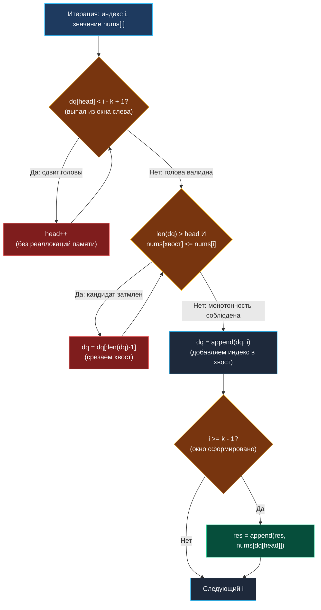
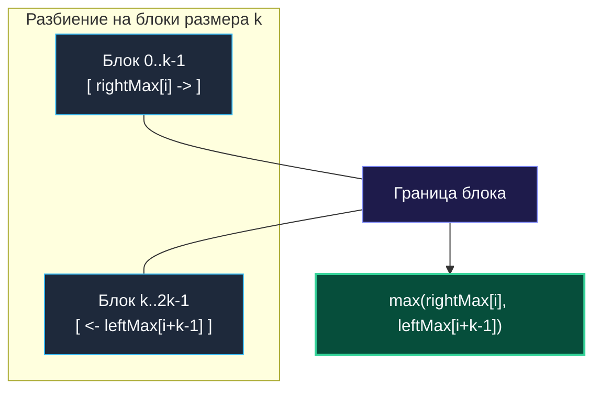

> *«Элегантный алгоритм делает ровно столько работы, сколько необходимо, и ни тактом больше».*  
> — Дональд Кнут

## Кульминация темы очередей: задача LeetCode 239

Задача **Sliding Window Maximum** (LeetCode 239, уровень Hard) — это абсолютная классика технических интервью в FAANG, Yandex, VK и ведущих финтех-компаниях мира. Уверенное решение этой задачи у доски за 15 минут с детальным объяснением механики работы с памятью и кэшем процессора — один из самых надежных индикаторов квалификации Senior-инженера.

> [!NOTE] Условие задачи
> Дан целочисленный массив `nums` и размер скользящего окна `k`, которое перемещается слева направо с шагом в 1 позицию. На каждом шаге в окне видны ровно `k` чисел.  
> Необходимо вернуть массив, содержащий максимальный элемент для каждого положения скользящего окна.
> 
> ```go
> nums = [1, 3, -1, -3, 5, 3, 6, 7], k = 3
> // Окна:
> // [1  3 -1] -3  5  3  6  7  -> max: 3
> //  1 [3 -1 -3] 5  3  6  7  -> max: 3
> //  1  3 [-1 -3  5] 3  6  7  -> max: 5
> //  1  3 -1 [-3  5  3] 6  7  -> max: 5
> //  1  3 -1 -3 [5  3  6] 7  -> max: 6
> //  1  3 -1 -3  5 [3  6  7] -> max: 7
> // Ответ: [3, 3, 5, 5, 6, 7]
> ```

Наивный подход «в лоб» — сканировать все $k$ элементов окна на каждом сдвиге. При $N = 100\,000$ и $k = 50\,000$ сложность $O(N \times K)$ потребует миллиардов операций и приведет к Time Limit Exceeded (TLE).  
Наша цель — построить решение с **гарантированным линейным временем $O(N)$ и нулевыми накладными расходами на аллокации**.

---

## Архитектура: Монотонный дек на сыром слайсе

В статье [[2. Монотонная очередь]] мы вывели теоретическую модель монотонного дека. Однако в условиях цейтнота на реальном собеседовании писать отдельный пользовательский тип данных со связкой методов избыточно.

Инженер высшей пробы пишет алгоритм прямо на сыром слайсе `dq []int` с виртуальным указателем головы `head int`.

### Инварианты структуры:
1. В деке хранятся **индексы** элементов массива `nums`, а не их значения.
2. Значения по этим индексам (`nums[dq[j]]`) образуют **строго убывающую последовательность** от головы к хвосту.
3. Индекс на голове дека (`dq[head]`) всегда указывает на абсолютный максимум активного окна.



---

## Идиоматичный Go-код (Уровень Senior)

```go
package slidingwindow

// maxSlidingWindow находит максимумы во всех окнах размера k за строгое O(N).
func maxSlidingWindow(nums []int, k int) []int {
	n := len(nums)
	if n == 0 || k <= 0 {
		return nil
	}
	if k == 1 {
		return nums
	}

	// 1. Предвыделяем срез ответа точного размера (Zero reallocations)
	res := make([]int, 0, n-k+1)

	// 2. Слайс для хранения индексов в монотонном деке
	// ВАЖНО: cap = n гарантирует, что append никогда не вызовет runtime.growslice!
	dq := make([]int, 0, n)
	head := 0 // Виртуальный указатель начала очереди

	for i := 0; i < n; i++ {
		// Шаг 1: Очистка устаревшей головы
		// Если индекс на голове вышел за левую границу [i - k + 1, i], сдвигаем head
		if head < len(dq) && dq[head] < i-k+1 {
			head++
		}

		// Шаг 2: Поддержание монотонного убывания
		// Выбиваем с хвоста всех кандидатов, чьи значения меньше или равны текущему nums[i]
		curVal := nums[i]
		for len(dq) > head && nums[dq[len(dq)-1]] <= curVal {
			dq = dq[:len(dq)-1]
		}

		// Шаг 3: Добавление текущего индекса в дек
		dq = append(dq, i)

		// Шаг 4: Фиксация ответа
		// Записываем максимум окна, как только прошли первые k-1 элементов
		if i >= k-1 {
			res = append(res, nums[dq[head]])
		}
	}

	return res
}
```

---

## Взгляд под капот: Mechanical Sympathy

На собеседовании высшего уровня важно не просто написать рабочий цикл, но и обосновать каждую константу в коде:

### 1. Почему `capacity` для `dq` равен `n`, а не `k`?
Начинающие разработчики часто пишут: `dq := make([]int, 0, k)`. Кажется очевидным: ведь окно состоит всего из $k$ элементов!  
Однако представьте строго монотонно убывающий массив: `[10, 9, 8, 7, 6, 5, 4]`, при $k = 3$.  
В этом случае условие очистки хвоста `nums[dq[...]] <= curVal` **не сработает ни разу**. Элементы будут непрерывно добавляться в хвост (`append`) и покидать дек через голову (`head++`).  
Если бы емкость слайса была ограничена $k$, вызов `append` вынужден был бы постоянно выделять новые блоки в куче (`growslice`) и копировать данные. Задав `cap = n`, мы полностью исключаем обращения к аллокатору Go на протяжении всей работы функции!

### 2. Отсутствие фрагментации и локальность данных
Весь алгоритм требует ровно **две аллокации памяти** в куче (`res` и `dq`), выполненные в прологе функции. Внутри основного цикла не создается ни одного промежуточного объекта. Срезы `nums`, `dq` и `res` читаются строго последовательно слева направо — это идеальный сценарий для аппаратного префетчера процессора (Hardware Prefetcher), который заранее подгружает следующие кэш-линии (64 байта) из оперативной памяти в L1d-кэш ядра.

---

## Альтернативный подход God Tier: Блочная декомпозиция (Prefix-Suffix Blocks)

Если вы хотите произвести неизгладимое впечатление на архитектора или Staff-инженера, предложите альтернативное решение за $O(N)$ **вообще без очередей, деков и стеков**:

```go
// maxSlidingWindowBlocks решает задачу через блочную декомпозицию за O(N).
func maxSlidingWindowBlocks(nums []int, k int) []int {
	n := len(nums)
	if n == 0 || k <= 0 {
		return nil
	}
	if k == 1 {
		return nums
	}

	leftMax := make([]int, n)
	rightMax := make([]int, n)

	// 1. Заполняем префиксные и суффиксные максимумы внутри блоков размера k
	for i := 0; i < n; i++ {
		// Префиксный максимум блока: сбрасывается в начале каждого блока (i % k == 0)
		if i%k == 0 {
			leftMax[i] = nums[i]
		} else {
			leftMax[i] = max(leftMax[i-1], nums[i])
		}

		// Суффиксный максимум блока: заполняется с конца
		j := n - 1 - i
		if j == n-1 || (j+1)%k == 0 {
			rightMax[j] = nums[j]
		} else {
			rightMax[j] = max(rightMax[j+1], nums[j])
		}
	}

	// 2. Любое окно [i, i+k-1] либо лежит внутри одного блока, 
	// либо разбивается границей двух соседних блоков!
	res := make([]int, n-k+1)
	for i := 0; i <= n-k; i++ {
		// rightMax[i] покрывает правую часть левого блока,
		// leftMax[i+k-1] покрывает левую часть правого блока.
		res[i] = max(rightMax[i], leftMax[i+k-1])
	}

	return res
}
```



### В чем превосходство блочного подхода на уровне CPU?
В коде блочного метода **нет циклов `while` с непредсказуемой глубиной отката**, как в монотонном деке. Все циклы строго детерминированы: ровно $N$ итераций без ветвлений. Предсказатель переходов (Branch Predictor) современного процессора работает со 100% точностью, а компилятор может автоматически применить SIMD-векторизацию для поиска `max`.

---

## Сравнительная таблица всех подходов к задаче

| Метод | Время (Time) | Память (Space) | Аллокации в цикле | Предсказуемость CPU Branching |
|---|---|---|---|---|
| **Brute Force** | $O(N \times K)$ | $O(1)$ | 0 | Плохая (TLE) |
| **Max-Heap (`container/heap`)** | $O(N \log K)$ | $O(K)$ | Множественные | Средняя |
| **Monotonic Deque (Канонический)** | **$O(N)$ строго** | **$O(N)$ или $O(K)$** | **0 (при `cap = n`)** | Хорошая |
| **Блочная декомпозиция (God Tier)** | **$O(N)$ строго** | **$O(N)$** | **0** | **Идеальная (без отката)** |

---

> [!INTERVIEW] Вопросы для собеседований
> 1. **Что произойдет, если в дек придет дубликат текущего максимума?**  
>    *Ответ:* В условии `nums[dq[len(dq)-1]] <= curVal` стоит нестрогое неравенство `<=`. Поэтому старый дубликат будет выбит из хвоста и заменен новым элементом с тем же значением. Это необходимо, так как новый дубликат появился позже и проживет в скользящем окне дольше!
> 2. **Какова худшая и амортизированная стоимость добавления элемента в монотонный дек?**  
>    *Ответ:* В худшем случае отдельная операция может потребовать выбивания до $K$ элементов из хвоста за $O(K)$. Однако каждый элемент выбивается не более одного раза за все время работы алгоритма, поэтому суммарное время работы строго $O(N)$, а среднее амортизированное время на элемент — $O(1)$.

## Итог

Мы завершили фундаментальный блок линейных структур данных: префиксные суммы, хэш-таблицы, монотонные стеки и очереди. Вы овладели ключевыми паттернами оптимизации рантайма Go: устранением memory drag, кэшированием в регистрах, кольцевыми буферами и монотонными деками.

Однако в реальных распределенных архитектурах данные далеко не всегда лежат в плоских непрерывных массивах. Часто они связаны сложными цепочками ссылок и указателей. Мы переходим к следующему фундаментальному разделу: [[1. Теория. Связные списки]].