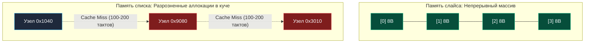
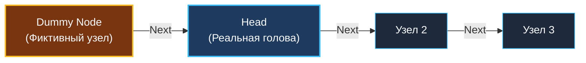

> *«Указатель — это мост между абстрактной мыслью и физической ячейкой памяти. Но горе тому строителю, чей мост ведет в никуда».*  
> — Брайан Керниган

## Динамическая топология памяти

До сих пор мы исследовали массивы, слайсы и кольцевые буферы — структуры данных, где элементы лежат в физической памяти строго непрерывным блоком. Это идеальный сценарий для аппаратного обеспечения CPU, однако он накладывает жесткое ограничение: вставка или удаление в середину непрерывного блока требует сдвига всех последующих элементов за $O(N)$, а расширение емкости вынуждает аллокатор выделять новый блок и копировать старые данные (`runtime.growslice`).

В системном дизайне часто требуются структуры, способные динамически расти, менять форму, мгновенно разрываться и склеиваться за строгое $O(1)$ без единого перемещения байтов в памяти.

Здесь на сцену выходят **Связные списки (Linked Lists)**. На собеседованиях задачи на связные списки — это главная лакмусовая бумажка: они мгновенно показывают, насколько свободно кандидат управляет указателями, держит в голове динамические топологии памяти и предотвращает разрывы цепочек ссылок.

---

## Анатомия Связного Списка

**Односвязный список (Singly Linked List)** — это линейная последовательность узлов (*Nodes*), где каждый узел хранит полезную нагрузку (*Payload*) и указатель на следующий узел в памяти.

В отличие от массива, узлы связного списка создаются независимыми аллокациями и разбросаны по виртуальной памяти в произвольном порядке.


### Каноническая структура в Go

В языке Go представление узла списка для алгоритмических задач и прикладных систем выглядит лаконично:

```go
package list

// ListNode представляет узел односвязного списка.
type ListNode struct {
	Val  int
	Next *ListNode
}
```

> [!NOTE] Указатели в Go против C/C++: Безопасность и Сборщик Мусора
> В языках C и C++ указатель — это числовое значение адреса, над которым разрешена адресная арифметика (`ptr + 1`). Ошибка программиста ведет к порче соседней памяти (Memory Corruption) или аварийному завершению (Segmentation Fault), а освобождение памяти требует ручного вызова `free(ptr)`.  
> В Go **адресная арифметика запрещена** на уровне спецификации языка (если не привлекать `unsafe.Pointer`). Указатель в Go — это строго типизированная, защищенная ссылка.  
> Главное преимущество Go при работе со списками — **автоматический сборщик мусора (GC)**. Когда вы исключаете узел из списка, сдвигая ссылку (`prev.Next = curr.Next`), вам не нужно вручную удалять узел из кучи. Если на узел не осталось активных ссылок из корневых объектов программы (GC Roots), рантайм Go утилизирует его память автоматически во время следующего цикла тройной раскраски (Tri-color marking).

---

## Mechanical Sympathy: Почему списки — тяжелое испытание для CPU

На собеседовании уровня Senior популярен вопрос на понимание физики «железа»:  
*«Что выполнит последовательный обход миллиона элементов быстрее: `[]int` или связный список `*ListNode`?»*

Неопытный кандидат ответит: *«Одинаково, сложность $O(N)$ в обоих случаях»*.  
Senior-инженер ответит: **«Слайс будет быстрее в десятки, а на некоторых процессорах — в сотни раз»**.

Почему абстрактная сложность $O(N)$ скрывает колоссальную разницу в физических миллисекундах?



1. **Локальность данных и строки кэша (L1/L2 Cache Lines):**  
   Современные процессоры не читают оперативную память по 8 байт. Минимальная единица обмена между RAM и кэшем ядра CPU — **кэш-линия размером 64 байта**.  
   Когда вы читаете первый элемент слайса `nums[0]`, контроллер памяти автоматически подтягивает следующие 7 чисел типа `int64` в L1d-кэш. Аппаратный Prefetcher распознает линейный шаг и непрерывно закачивает следующие килобайты на опережение.  
   В связном списке каждый узел живет по случайному адресу кучи. Переход по указателю `curr = curr.Next` с вероятностью почти 100% вызывает **промах кэша (Cache Miss)**. Процессор вынужден простаивать (*CPU Pipeline Stall*) 100–250 тактов, дожидаясь доставки байтов из медленной шины памяти.
2. **Накладные расходы по памяти (Memory Overhead):**  
   В `[]int` одно число занимает ровно 8 байт. В `ListNode` мы храним `Val` (8 байт) + указатель `Next` (8 байт) = 16 байт на полезное значение (ровно в 2 раза больше).
3. **Нагрузка на сборщик мусора (GC Pressure):**  
   Слайс на 1 000 000 чисел — это ровно **один** объект в куче.  
   Связный список на 1 000 000 узлов — это **1 000 000 отдельных объектов**. Аллокатор Go тратит время на поиск свободных слотов в размерных классах `mcache/mcentral`, а фаза разметки сборщика мусора вынуждена обходить миллион указателей.

> [!WARNING] Ловушка / Gotcha: `container/list` в высоконагруженном коде
> Стандартная библиотека Go предоставляет двусвязный список `container/list`.  
> Исторически (до Go 1.18) он был спроектирован под тип `interface{}` (any):
> ```go
> type Element struct {
>     Value any // Скрытый боксинг примитивов!
> }
> ```
> При добавлении каждого `int` происходит неявная аллокация в куче для упаковки числа в интерфейсную пару `(type, value)`. Никогда не используйте `container/list` в критических путях высоконагруженных сервисов.

---

## Фундаментальный паттерн: Dummy Node (Фиктивный узел)

Если в алгоритмах на связные списки и существует один паттерн, спасающий от 90% багов и `nil pointer dereference`, то это **Dummy Node (Sentinel Node)**.

При удалении или перестановке узлов самая уязвимая точка — **первый элемент (Голова / Head)**. Если удаляется голова, меняется точка входа в список. Без фиктивного узла код обрастает множеством ветвлений `if head == nil`, `if prev == nil`.

**Dummy Node** — это фиктивная структура, которую мы размещаем *перед* реальной головой списка. Она гарантирует, что у настоящей головы **всегда есть предыдущий элемент**.



### Идиоматичный пример: Удаление элементов по значению

```go
package list

// removeElements удаляет все узлы со значением targetVal.
func removeElements(head *ListNode, targetVal int) *ListNode {
	// 1. Создаем фиктивный узел, указывающий на реальную голову.
	// Escape Analysis разместит dummy на стеке, так как сам dummy наружу не возвращается!
	dummy := &ListNode{Next: head}

	// 2. Инициализируем указатель обхода
	curr := dummy

	// 3. Пока существует следующий узел
	for curr.Next != nil {
		if curr.Next.Val == targetVal {
			// Перенаправляем стрелку в обход удаляемого узла.
			// Сборщик мусора Go сам освободит отсеченный узел!
			curr.Next = curr.Next.Next
		} else {
			curr = curr.Next
		}
	}

	// 4. Возвращаем настоящую новую голову (все, что за dummy)
	return dummy.Next
}
```

Благодаря `dummy` случай удаления реальной головы ничем не отличается от удаления узла из середины списка. Никаких специальных проверок `if head.Val == targetVal` не требуется!

---

## Золотые правила работы с указателями

При манипуляциях со списками разработчик обязан соблюдать строгую дисциплину:

> [!WARNING] Ловушка / Gotcha: Nil Pointer Dereference
> В Go попытка обращения к полю `nil`-указателя (`nil.Next`) мгновенно вызывает панику:  
> `panic: runtime error: invalid memory address or nil pointer dereference`.  
> 
> **Железное правило:** Прежде чем написать разыменование `.Next`, убедитесь, что объект слева гарантированно проверен на неравенство `nil`.  
> Канонический безопасный цикл: `for curr != nil && curr.Next != nil`.

> [!TIP] Инвариант сохранения хвоста: «Сначала держи, потом отпускай»
> При вставке узла $B$ между узлами $A$ и $C$:
> - ❌ **Фатальная ошибка:** `A.Next = B` — ссылка на $C$ безвозвратно потеряна, весь хвост списка «тонет» и уничтожается GC!
> - ✅ **Правильный порядок:**  
>   1. `B.Next = A.Next` (узел $B$ сначала берет за руку узел $C$)  
>   2. `A.Next = B` (узел $A$ переключает руку на узел $B$)

## Итог

Связные списки переносят нас в мир явных топологических графов и ссылочных моделей памяти. Понимание устройства указателей и паттерна Dummy Node закладывает фундамент для проектирования деревьев, графов и lock-free очередей.

Освоив базовую механику, перейдем к главному алгоритмическому приему в списках, позволяющему за один проход находить середины, определять циклы и пересечения: [[2. Быстрый и медленный указатели]].