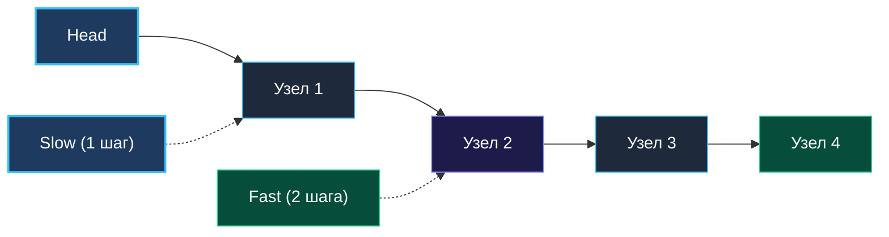
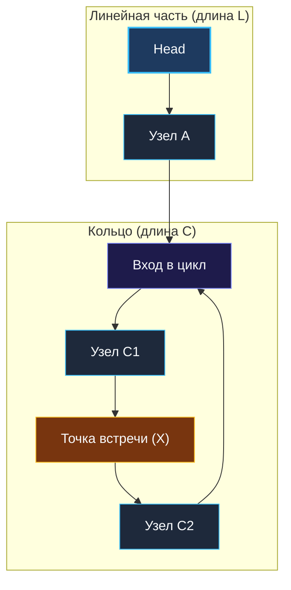

> *«В замкнутом мире разница в скоростях неизбежно превращается во встречу».*  
> — Роберт Флойд

## Отсутствие индексов и динамическая скорость

В предыдущей статье мы выяснили, что связные списки — это испытание для кэш-памяти CPU, а фиктивный узел (*Dummy Node*) избавляет от громоздких ветвлений. Теперь мы переходим к самому изящному алгоритмическому паттерну в теории графов и списков.

Поскольку узлы односвязного списка не пронумерованы и не имеют произвольного доступа по индексу, мы не можем мгновенно обратиться к середине `list[len/2]` или вычислить длину за $O(1)$. Любое измерение требует последовательного обхода.

Но что, если нам необходимо:
1. Найти **середину списка ровно за один проход** без предварительного подсчета длины?
2. Мгновенно определить, **не зациклен ли список** (когда хвост ссылается на один из пройденных узлов), не используя ни одного байта дополнительной памяти?
3. Найти **точный узел входа в цикл**?

Для решения этого класса задач применяется паттерн **Быстрый и медленный указатели (Fast and Slow Pointers)**, известный в мировой классике Computer Science как **Алгоритм черепахи и зайца (Floyd's Cycle-Finding Algorithm)**.

---

## Суть алгоритма: Черепаха и Заяц

Идея гениальна в своей простоте. Мы отправляем в путь по списку два указателя, которые стартуют одновременно из головы (`head`), но перемещаются с разной скоростью:
- **Slow (Черепаха):** делает ровно **1 шаг** за итерацию (`slow = slow.Next`).
- **Fast (Заяц):** делает ровно **2 шага** за итерацию (`fast = fast.Next.Next`).



Из этого простого соотношения скоростей $V_{\text{fast}} = 2 \cdot V_{\text{slow}}$ вытекают фундаментальные свойства, на которых строятся решения десятков алгоритмических задач.

---

## Паттерн 1: Поиск середины списка за один проход

Представьте двух бегунов на прямой трассе. Заяц бежит в два раза быстрее Черепахи. В тот момент, когда Заяц пересекает финишную черту, где находится Черепаха? **Ровно на половине дистанции!**

В связном списке это означает, что когда `fast` упирается в конец списка (`fast == nil` или `fast.Next == nil`), указатель `slow` указывает **в точности на средний узел**.

```go
package list

// middleNode возвращает средний узел связного списка за один проход O(N).
func middleNode(head *ListNode) *ListNode {
	slow := head
	fast := head

	// Заяц обязан безопасно делать два шага:
	// fast != nil проверяет списки четной длины, fast.Next != nil — нечетной
	for fast != nil && fast.Next != nil {
		slow = slow.Next      // 1 шаг
		fast = fast.Next.Next // 2 шага
	}

	return slow
}
```

> [!TIP] Четная длина списка: выбор левой или правой середины
> Если в списке четное число элементов (например, 6 узлов), у него две середины (3-й и 4-й узлы).  
> - При старте `slow = head, fast = head` цикл вернет **правую середину** (4-й узел) — именно это требуется в 95% задач на LeetCode.  
> - Если алгоритму (например, сортировке слиянием Merge Sort на списках) требуется **левая середина** (3-й узел), достаточно стартовать зайца на шаг впереди: `fast := head.Next`.

---

## Паттерн 2: Детекция цикла (Floyd's Cycle Detection)

Если список зациклен, Заяц никогда не встретит `nil`. Он будет бесконечно кружить по замкнутой петле. Поскольку Заяц бежит быстрее Черепахи на 1 шаг за каждую итерацию, расстояние между ними внутри кольца на каждом такте сокращается ровно на единицу. Заяц неизбежно догонит Черепаху сзади: в какой-то момент указатели совпадут (`slow == fast`).



```go
// hasCycle проверяет наличие зацикливания в связном списке за O(1) памяти.
func hasCycle(head *ListNode) bool {
	if head == nil {
		return false
	}

	slow := head
	fast := head

	for fast != nil && fast.Next != nil {
		slow = slow.Next
		fast = fast.Next.Next

		// Указатели сошлись в одной точке памяти — цикл гарантированно есть!
		if slow == fast {
			return true
		}
	}

	// Заяц выбежал в nil — зацикливания нет
	return false
}
```

---

## Mechanical Sympathy: Два указателя против Хеш-таблицы

На интервью часто звучит вопрос:  
*«Зачем городить двух бегунов, если можно складывать адреса пройденных узлов в `map[*ListNode]struct{}` и проверять наличие дубликата?»*

Это отличный повод показать глубокое понимание архитектуры рантайма Go:

| Критерий | Два указателя (Черепаха и Заяц) | Хеш-таблица (`map[*ListNode]struct{}`) |
|---|---|---|
| **Дополнительная память** | **$O(1)$ строго** (16 байт на стеке: 2 указателя) | $O(N)$ памяти (мегабайты в куче) |
| **Аллокации и Escape Analysis** | **0 аллокаций** (переменные живут в регистрах CPU) | Выделение `hmap`, эвакуация бакетов при росте |
| **Нагрузка на сборщик мусора** | **Нулевая** (GC вообще не сканирует стек) | Высокая: миллионы адресов для фазы Mark |
| **Операции процессора** | Инструкция `CMP` по регистрам CPU за 1 такт | Вычисление хеша, обход бакета, проверка коллизий |

---

## Уровень Senior: Математическое доказательство старта цикла (LeetCode 142)

На сложных собеседованиях требуют не просто определить наличие цикла, но и **вернуть точный узел входа в цикл** за $O(1)$ памяти.

### Алгоритм:
1. Запускаем `slow` и `fast` до первой точки встречи внутри кольца.
2. Если встречи нет (`fast` уперся в `nil`) — цикла нет.
3. Если встретились: оставляем `slow` в точке встречи, а `fast` телепортируем обратно в самое начало списка (`head`).
4. Теперь оба указателя двигаются с **одинаковой скоростью — ровно по 1 шагу**.
5. Точка их новой встречи — это математически строгий **узел входа в цикл**!

### Математическое доказательство:
Обозначим:
- $L$ — расстояние от начала списка до узла входа в цикл.
- $C$ — длина кольца.
- $X$ — расстояние от узла входа в цикл до точки первой встречи указателей.

К моменту первой встречи:
- Черепаха прошла расстояние: $D_{\text{slow}} = L + X$.
- Заяц прошел в 2 раза больше: $D_{\text{fast}} = 2(L + X)$.
- В то же время Заяц прошел линейный хвост и сделал $k$ полных оборотов по кольцу: $D_{\text{fast}} = L + X + k \cdot C$.

Приравниваем уравнения:
$$2(L + X) = L + X + k \cdot C \implies L + X = k \cdot C \implies L = k \cdot C - X$$

Перепишем выражение:
$$L = (k - 1) \cdot C + (C - X)$$

Что означает величина $(C - X)$? Это расстояние от точки встречи до входа в цикл при движении вперед!  
Следовательно, расстояние от старта списка до входа в цикл ($L$) **в точности равно** расстоянию от точки встречи до входа в цикл (с учетом возможных $k-1$ полных кругов). Запустив указатели с равной скоростью из `head` и точки встречи, они гарантированно встретятся в узле входа в цикл!

```go
// detectCycle возвращает узел входа в цикл или nil, если цикла нет.
func detectCycle(head *ListNode) *ListNode {
	if head == nil || head.Next == nil {
		return nil
	}

	slow, fast := head, head

	// Этап 1: поиск точки встречи
	for fast != nil && fast.Next != nil {
		slow = slow.Next
		fast = fast.Next.Next
		if slow == fast {
			break
		}
	}

	if fast == nil || fast.Next == nil {
		return nil // Цикла нет
	}

	// Этап 2: поиск узла входа
	fast = head
	for slow != fast {
		slow = slow.Next
		fast = fast.Next
	}

	return slow
}
```

---

> [!WARNING] Ловушка / Gotcha: Порядок проверки в цикле
> Проверка `fast != nil && fast.Next != nil` использует короткое замыкание (*short-circuit evaluation*). Если `fast == nil`, правая часть `fast.Next != nil` даже не вычисляется. Если случайно написать `fast.Next != nil && fast != nil`, при нечетном завершении список выбросит фатальный `panic: runtime error: invalid memory address`.

## Итог

Алгоритм черепахи и зайца — это ярчайший образец классической инженерной элегантности. Вместо гигабайтов хеш-таблиц и аллокаций мы получаем точные математические гарантии в регистрах процессора за честное константное пространство $O(1)$.

Теперь мы готовы перейти к самой часто встречающейся практической задаче на собеседованиях по программированию во всем мире: [[3. Reverse Linked List]].