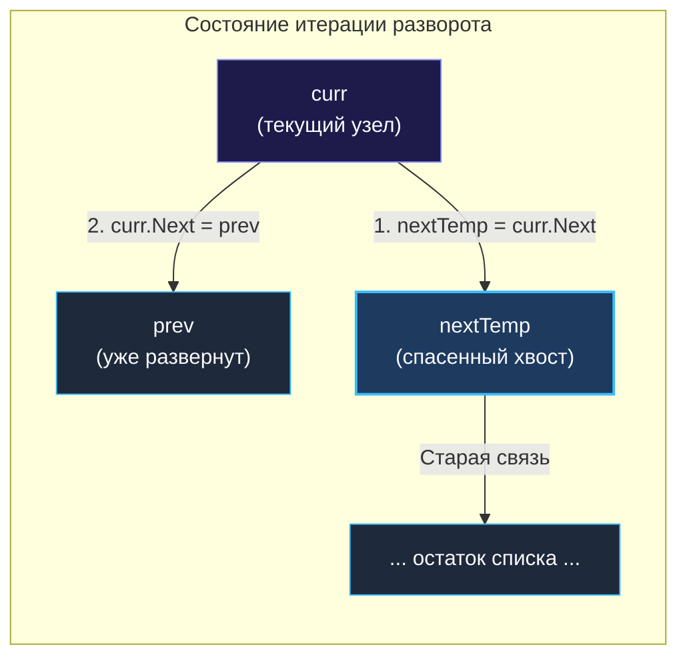

> *«Чтобы развернуть поток времени вспять, нужно крепко держать будущее, пока вы меняете прошлое».*  
> — Брайан Керниган

## Самая частая задача в мире

Если бы среди задач алгоритмических секций вручали высшую награду, задача **Reverse Linked List** (LeetCode 206) забрала бы гран-при за популярность. Это абсолютный «Hello World» мира технических собеседований — от джуниорских скринингов до интервью на позицию Staff Engineer в FAANG и Яндексе.

Интервьюеры любят эту задачу за то, что всего за 5 минут живого кода она беспощадно вскрывает уровень владения указателями (*pointers*), способность удерживать пространственные инварианты в памяти и дисциплину защиты от потери ссылок.

> [!NOTE] Условие задачи
> Дан указатель на голову (`head`) односвязного списка. Необходимо развернуть все указатели `Next` в противоположную сторону и вернуть новую голову списка (бывший хвост).
> 
> ```
> Исходный список: 1 -> 2 -> 3 -> 4 -> 5 -> nil
> Результат:       5 -> 4 -> 3 -> 2 -> 1 -> nil
> ```

---

## Архитектура: Инвариант трех указателей

Главная ментальная ловушка, в которую попадают начинающие разработчики: **потеря остатка списка при развороте ссылки**.

Представьте узел $A$, указывающий на $B$, который указывает на $C$. Наша цель — направить стрелку узла $A$ назад (на `prev`).  
Если мы напишем `curr.Next = prev`, то указатель на узел $B$ (и весь хвост списка $C \to D \dots$) будет мгновенно стерт! В Go сборщик мусора увидит, что на отрезанный подграф не осталось ссылок из активных корней, и безвозвратно уничтожит данные.

Поэтому для безопасной инверсии связей строго необходима триада указателей:
1. `prev` (*Предыдущий*) — адрес узла, на который должна указывать текущая нода (изначально `nil`).
2. `curr` (*Текущий*) — узел, чью стрелку `Next` мы разворачиваем прямо сейчас.
3. `nextTemp` (*Временный спасатель*) — ссылка на следующий узел, сохраненная **до** разрыва старой связи.



---

## Идиоматичное решение на Go (Итеративный подход)

Итеративный подход — это промышленный стандарт: он гарантирует линейное время $O(N)$ и абсолютно константную память $O(1)$.

```go
package list

// reverseList разворачивает односвязный список in-place за O(N) времени и O(1) памяти.
func reverseList(head *ListNode) *ListNode {
	var prev *ListNode // На старте предыдущего узла нет (голова станет хвостом -> nil)
	curr := head

	for curr != nil {
		// Шаг 1: СПАСАЕМ путь вперед до того, как перепишем ссылку
		nextTemp := curr.Next

		// Шаг 2: РАЗВОРАЧИВАЕМ стрелку текущего узла назад
		curr.Next = prev

		// Шаг 3: СДВИГАЕМ окно указателей на один шаг вперед
		prev = curr
		curr = nextTemp
	}

	// Когда curr вышел в nil, prev указывает на последний реальный узел (новую голову)
	return prev
}
```

---

## Взгляд под капот: Mechanical Sympathy

Почему этот простой код исполняется на процессоре с максимальной теоретической скоростью?

1. **Zero Heap Allocations (Нулевое воздействие на GC):**  
   Мы не создаем ни одного нового объекта в памяти. Указатели `prev`, `curr` и `nextTemp` компилятор Go аллоцирует исключительно в регистрах CPU (`RAX`, `RBX`, `RDX` на x86-64). Цикл сводится к элементарному перекладыванию 8-байтовых машинных слов между регистрами за доли такта. Сборщик мусора Go даже не пробуждается.
2. **Память-ограниченная операция (Memory-Bound):**  
   Каждый переход `curr.Next` влечет за собой потенциальный промах мимо L1/L2 кэша (Cache Miss), так как узлы создавались в разные моменты времени и разбросаны по куче. Однако алгоритм делает ровно одно чтение и одну запись на узел. Время работы полностью определяется латентностью системной шины RAM.

---

## Рекурсивный подход: Ловушка для неопытных

На собеседовании интервьюер часто задает коварный вопрос:  
*«Красиво. А можете написать это рекурсивно?»*

Написать рекурсивный вариант несложно, но Senior-инженер обязан сразу обозначить его фатальные недостатки для продакшена:

```go
// reverseListRecursive разворачивает список рекурсивно.
// ВНИМАНИЕ: Опасно для длинных списков в реальном бэкенде!
func reverseListRecursive(head *ListNode) *ListNode {
	// Базовый случай: пустой список или единственный последний узел
	if head == nil || head.Next == nil {
		return head
	}

	// 1. Погружаемся до самого хвоста списка
	newHead := reverseListRecursive(head.Next)

	// 2. Разворот ссылки на этапе раскрутки (всплытия) стека:
	// узел head.Next (бывший сосед справа) теперь ссылается на нас!
	head.Next.Next = head
	
	// 3. Обнуляем старую прямую связь, предотвращая зацикливание
	head.Next = nil

	return newHead
}
```

### Разбор рекурсии с точки зрения рантайма Go (Continuous Stacks)

Временная сложность осталась $O(N)$, но пространственная выросла до $O(N)$ из-за фреймов стека вызовов (*Call Stack*).

В рантайме Go горутина создается с компактным начальным стеком размером всего **2 КБ** (в отличие от потоков ОС на 2–8 МБ).  
Если в вашем сервисе список содержит 100 000 элементов:
1. Рекурсивные вызовы мгновенно заполнят начальные 2 КБ.
2. Сработает механизм **Continuous Stacks (Непрерывные динамические стеки)**: рантайм Go принудительно остановит горутину, выделит в куче новый блок стека в 2 раза больше (4 КБ, затем 8, 16, 32 КБ...), скопирует старый фрейм и пересчитает адреса всех указателей.
3. Этот процесс повторится десятки раз, сжигая процессорные такты на служебное копирование памяти.
4. В худшем случае приложение исчерпает лимит стека горутины (по умолчанию 1 ГБ на 64-битных системах) и завершится с фатальной паникой `runtime: goroutine stack exceeds 1000000000-byte limit`.

Именно поэтому в реальном коде высоконагруженных бэкендов всегда используется **только итеративный вариант**.

---

> [!INTERVIEW] Вопросы с реальных собеседований
> - **Почему в конце цикла мы возвращаем `prev`, а не `curr`?**  
>   *Ответ:* Цикл завершается при условии `curr == nil`. В этот момент `prev` находится ровно на последнем валидном узле исходного списка, который после разворота связей стал новой головой.
> - **Что произойдет, если забыть обнулить `head.Next = nil` в рекурсивном решении?**  
>   *Ответ:* Возникнет взаимное зацикливание между первыми двумя узлами: $A \leftrightarrow B$. При любой последующей попытке обойти список приложение уйдет в бесконечный цикл и зависнет.

## Итог

Разворот связного списка — это эталон проверки дисциплины работы со ссылками. Четкое понимание роли указателя `nextTemp` страхует от утечек памяти, а предпочтение итеративного подхода рекурсивному бережет динамические стеки горутин Go.

Освоив локальный разворот, объединим два независимых отсортированных списка в единую упорядоченную последовательность за $O(N)$ в следующей классической задаче: [[4. Merge Two Sorted Lists]].