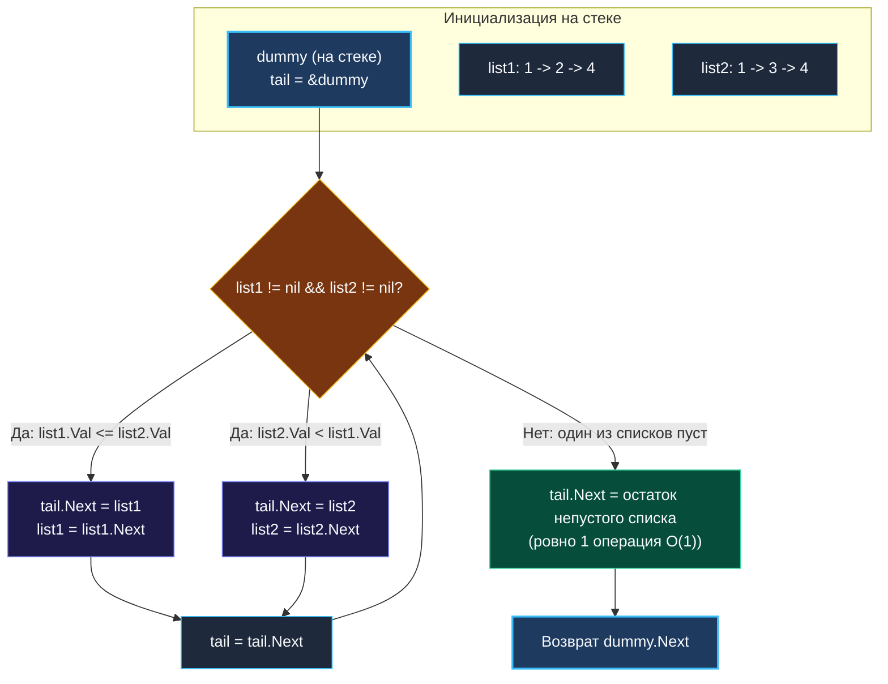

> *«Простейший способ упорядочить два раздельных потока — сплести их в один, выбирая наименьшее на каждом шаге».*  
> — Никлаус Вирт

## Слияние как искусство перекладывания ссылок

Задача **Merge Two Sorted Lists** (LeetCode 21) — это фундаментальный строительный блок алгоритма сортировки слиянием (*Merge Sort*) и распределенной обработки потоков данных (*External Merge Sort*). На собеседованиях любого уровня она встречается с завидной регулярностью, так как позволяет интервьюеру моментально оценить три критических инженерных качества:
1. Владеет ли кандидат паттерном **Dummy Node** (фиктивный узел).
2. Способен ли он перестраивать связи в динамической памяти (*in-place*), не аллоцируя ни одного лишнего объекта.
3. Понимает ли он риски рекурсивного подхода для динамического стека горутин Go.

> [!NOTE] Условие задачи
> Даны указатели на головы двух упорядоченных по неубыванию односвязных списков `list1` и `list2`.  
> Необходимо объединить их в один отсортированный связный список, переиспользуя существующие узлы, и вернуть новую голову.
> 
> ```
> list1: 1 -> 2 -> 4 -> nil
> list2: 1 -> 3 -> 4 -> nil
> Результат: 1 -> 1 -> 2 -> 3 -> 4 -> 4 -> nil
> ```

---

## Архитектура: Застежка-молния и Dummy Node

Представьте механизм застежки-молнии: бегунок поочередно захватывает зубчики то с левой, то с правой ленты, выбирая наименьший из двух текущих кандидатов.

Главная архитектурная дилемма при наивном слиянии: **какой узел станет первой головой результирующего списка?**  
Попытка определить голову «в лоб» приводит к громоздким проверкам `if list1.Val < list2.Val` перед основным циклом, дублированию логики и ошибкам при пустых входах.

Паттерн **Dummy Node** элегантно устраняет эту неопределенность. Мы создаем локальный узел-заглушку `dummy` прямо на стеке. Нам безразлично его поле `Val`. Указатель `tail` (хвост формируемой цепи) начинает движение от `dummy`, поочередно пристегивая минимальные элементы, а в финале функция возвращает чистый `dummy.Next`.



---

## Идиоматичный Go-код (Итеративный)

```go
package list

// mergeTwoLists объединяет два отсортированных списка in-place за O(N + M) времени и O(1) памяти.
func mergeTwoLists(list1 *ListNode, list2 *ListNode) *ListNode {
	// 1. Создаем локальную переменную структуры на стеке.
	// Escape Analysis докажет, что dummy не покидает функцию -> 0 аллокаций в куче!
	var dummy ListNode
	tail := &dummy

	// 2. Сплетаем списки, пока оба содержат элементы
	for list1 != nil && list2 != nil {
		if list1.Val <= list2.Val {
			tail.Next = list1
			list1 = list1.Next
		} else {
			tail.Next = list2
			list2 = list2.Next
		}
		tail = tail.Next
	}

	// 3. Прикрепляем оставшийся непустой хвост за константное время O(1)
	if list1 != nil {
		tail.Next = list1
	} else {
		tail.Next = list2
	}

	// Возвращаем реальную голову слитого списка
	return dummy.Next
}
```

---

## Взгляд под капот: Escape Analysis и константный остаток

Код предельно компактен, но содержит важнейшие инженерные тонкости:

### 1. Escape Analysis и Zero-Allocation
Обратите внимание на синтаксис:
```go
var dummy ListNode
tail := &dummy
```
Вместо `dummy := &ListNode{}` мы объявили переменную по значению. Компилятор Go анализирует время жизни `dummy`. Поскольку возвращается поле `dummy.Next` (указывающее на уже существующие в куче узлы `list1`/`list2`), сам адрес структуры `&dummy` наружу не утекает (*does not escape to heap*).  
Объект размещается прямо во фрейме стека текущей функции. Результат: **ровно 0 аллокаций в куче**, нулевое давление на GC.

### 2. Сшивание остатка за $O(1)$
Самая частая ошибка новичков на интервью — продолжать крутить цикл по оставшимся элементам второго списка:
```go
// АНТИПАТТЕРН: Лишний цикл!
for list1 != nil {
    tail.Next = list1
    list1 = list1.Next
    tail = tail.Next
}
```
Поскольку каждый из исходных списков уже гарантированно отсортирован, как только один список исчерпан, оставшийся хвост второго списка уже представляет собой готовую упорядоченную цепочку. Достаточно **одной единственной присвойки указателя** `tail.Next = list1` (или `list2`), чтобы мгновенно пришить цепочку любой длины (хоть из миллиона узлов) за $O(1)$!

---

## Рекурсивная альтернатива: Почему в Production выбирают итерацию

На интервью часто предлагают:  
*«А можете написать это в функциональном стиле через рекурсию?»*

Рекурсивный код лаконичен:
```go
// mergeTwoListsRecursive — рекурсивное слияние списков.
func mergeTwoListsRecursive(list1 *ListNode, list2 *ListNode) *ListNode {
	if list1 == nil {
		return list2
	}
	if list2 == nil {
		return list1
	}

	if list1.Val <= list2.Val {
		list1.Next = mergeTwoListsRecursive(list1.Next, list2)
		return list1
	} else {
		list2.Next = mergeTwoListsRecursive(list1, list2.Next)
		return list2
	}
}
```

### Вердикт для продакшена:
- Временная сложность: $O(N + M)$.
- Пространственная сложность: **$O(N + M)$ из-за стека вызовов**.  
При слиянии списков из 50 000 элементов глубина вызовов составит 50 000 фреймов. Механизм Continuous Stacks в Go будет многократно удваивать стек горутины, копируя память, а в критических условиях вызовет панику `stack overflow`.  
**Итеративное решение с Dummy Node всегда предпочтительнее в production.**

---

> [!INTERVIEW] Вопросы для собеседований
> 1. **Как обобщить этот алгоритм на слияние $K$ отсортированных списков (LeetCode 23)?**  
>    *Ответ:* Наивный последовательный merge займет $O(K^2 \cdot N)$. Оптимальные пути: либо подход «Разделяй и властвуй» (попарное слияние списков за $O(N \cdot K \log K)$ по времени и $O(1)$ по памяти), либо использование Min-Heap размером $K$ элементов (`container/heap`).
> 2. **Что произойдет, если в обоих списках окажутся одинаковые значения?**  
>    *Ответ:* Условие `list1.Val <= list2.Val` обеспечивает стабильность (*stability*): узел из `list1` всегда встанет перед узлом с таким же значением из `list2`.

## Итог

Задача **Merge Two Sorted Lists** доказывает, что паттерн Dummy Node и дисциплина работы с указателями позволяют решать задачи слияния потоков данных с нулевыми затратами памяти и максимальной скоростью.

Теперь рассмотрим, что делать, если структура связного списка повреждена и указатели образовали замкнутую петлю: углубляемся в задачу детекции циклов в статье [[5. Linked List Cycle]].