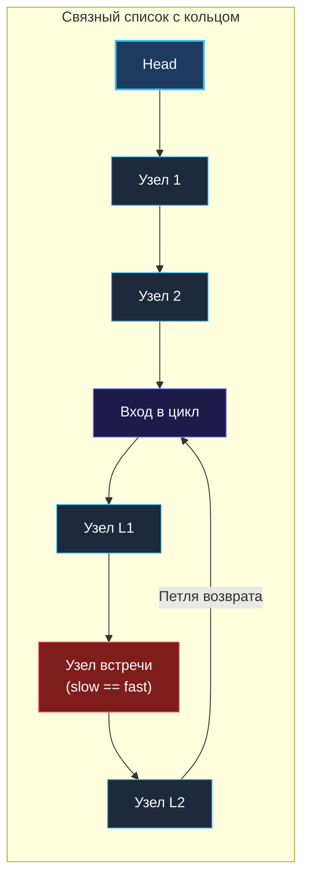

> *«Всякое движение по замкнутому кругу бесконечно, пока на трассу не выйдет тот, кто бежит быстрее».*  
> — Брайан Керниган

## Анатомия бесконечного цикла

Задача **Linked List Cycle** (LeetCode 141) — одна из самых известных задач в программировании. В реальных распределенных архитектурах циклические зависимости в графах владения ресурсами приводят к взаимным блокировкам (Deadlocks), утечкам памяти и вечным циклам обработки задач в брокерах сообщений.

На технических собеседованиях эта задача служит проверкой инженерной зрелости. Практически любой кандидат способен решить её за пару минут «в лоб», сохранив посещенные узлы в хеш-таблицу. Но от Senior-разработчика ожидают бескомпромиссного решения: **константная память $O(1)$, нулевая нагрузка на сборщик мусора Go и работа на уровне регистров CPU**.

> [!NOTE] Условие задачи
> Дан указатель на голову односвязного списка `head`.  
> Необходимо определить, присутствует ли в списке зацикливание.  
> Цикл возникает, если указатель `Next` некоторого узла замыкается на один из ранее пройденных узлов списка, превращая обход в бесконечную петлю.

---

## Архитектура решения: Алгоритм Флойда («Черепаха и Заяц»)

Представьте кольцевую гоночную трассу. Если дорога прямая, скоростной болид (Заяц) стремительно удалится от грузовика (Черепахи) и пересечет финишную черту в бесконечности (`nil`). Но если трасса замкнута в кольцо, то быстрый автомобиль неизбежно настигнет медленный сзади и обойдет его ровно на один круг.



### Механика двух указателей:
1. Запускаем указатели `slow` и `fast` из начального узла `head`.
2. На каждой итерации:
   - `slow` делает **1 шаг** вперед: `slow = slow.Next`.
   - `fast` делает **2 шага** вперед: `fast = fast.Next.Next`.
3. Если `fast` встретил `nil` или `fast.Next == nil` — список конечен, зацикливания нет.
4. Если указатели совпали (`slow == fast`) — они находятся по одному физическому адресу в памяти, цикл гарантированно обнаружен.

---

## Идиоматичный Go-код

```go
package list

// hasCycle определяет наличие цикла в связном списке за O(N) времени и O(1) памяти.
func hasCycle(head *ListNode) bool {
	// Базовый случай: пустой список или единственный узел без петли
	if head == nil || head.Next == nil {
		return false
	}

	slow := head
	fast := head

	// КРИТИЧНО: проверяем fast и fast.Next.
	// Короткое замыкание логического И в Go исключает nil pointer dereference!
	for fast != nil && fast.Next != nil {
		slow = slow.Next
		fast = fast.Next.Next

		// Сравниваем физические адреса памяти (указатели), а не значения узлов Val!
		if slow == fast {
			return true
		}
	}

	return false
}
```

---

## Взгляд под капот: Разгром наивного решения на Hash Map

Если интервьюер спросит:  
*«Зачем писать алгоритм с двумя указателями, если можно сложить посещенные узлы в мапу `seen := make(map[*ListNode]struct{})`?»*

Опытный инженер разложит наивный подход по полочкам:

1. **Escape Analysis и утечка в кучу:**  
   Поскольку длина связного списка заранее неизвестна, компилятор Go не сможет разместить `hmap` на стеке. Мапа утечет в кучу (*Heap allocation*). Для выделения структуры рантайм Go обратится к центральному аллокатору памяти.
2. **Давление на сборщик мусора (GC Pressure):**  
   Для списка из 500 000 элементов хеш-таблица выделит сотни тысяч бакетов, многократно вызывая эвакуацию при росте емкости. По завершении функции этот массив бакетов повиснет мертвым грузом в памяти. Фаза Mark сборщика мусора будет вынуждена просканировать всю таблицу.
3. **Такты CPU и машинные инструкции:**  
   - Алгоритм Флойда: ровно **16 байт** на стеке (два указателя по 8 байт). Проверка `slow == fast` компилируется в **одну ассемблерную инструкцию `CMP`**, работающую прямо в регистрах CPU.  
   - Хеш-таблица: вычисление хеша от указателя (`memhash64`), вычисление остатка бакета, проход по цепочке коллизий, множественные Cache Misses в RAM.

---

## Углубление: Поиск точки входа в цикл (LeetCode 142)

На собеседовании уровня Senior задачу немедленно усложнят:  
*«Цикл найден. А теперь верните точный узел, с которого этот цикл начинается. И также за строгое $O(1)$ памяти!»*

Это задача **Linked List Cycle II**, опирающаяся на фундаментальную теорему Флойда:

> **Теорема о начале цикла:**  
> Расстояние от начала списка до узла входа в цикл **в точности равно** расстоянию от точки первой встречи указателей до узла входа в цикл при движении вперед.

```go
// detectCycle возвращает узел входа в цикл за O(N) времени и O(1) памяти.
func detectCycle(head *ListNode) *ListNode {
	if head == nil || head.Next == nil {
		return nil
	}

	slow, fast := head, head
	var hasLoop bool

	// Шаг 1: фиксируем факт встречи внутри кольца
	for fast != nil && fast.Next != nil {
		slow = slow.Next
		fast = fast.Next.Next
		if slow == fast {
			hasLoop = true
			break
		}
	}

	if !hasLoop {
		return nil
	}

	// Шаг 2: переносим slow в head, а fast оставляем в точке встречи.
	// Теперь оба двигаются с равной скоростью (по 1 шагу)!
	slow = head
	for slow != fast {
		slow = slow.Next
		fast = fast.Next
	}

	// Точка повторной встречи — математически строгий узел входа в цикл
	return slow
}
```

---

> [!WARNING] Ловушка / Gotcha: Сравнение значений вместо указателей
> Самая нелепая ошибка при написании кода на доске — сравнение `slow.Val == fast.Val`. В связном списке узлы могут содержать одинаковые значения полезной нагрузки (например, все нули). Сравнивать необходимо **исключительно адреса памяти**: `slow == fast`.

## Итог

Задача **Linked List Cycle** — это демонстрация превосходства математических инвариантов над грубой силой выделения памяти. Знание алгоритма Флойда позволяет находить циклы любой сложности без единой аллокации в куче.

Освоив механику встречных скоростей, перейдем к задаче на координацию относительных расстояний: как удалить элемент с конца списка без предварительного подсчета его длины? Разбираем в статье [[6. Remove Nth Node From End]].