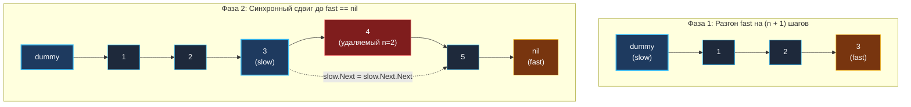

> *«Дистанция, однажды установленная между двумя точками, позволяет исследовать будущее, не теряя связи с прошлым».*  
> — Брайан Керниган

## Дистанция вслепую

В предыдущих главах мы освоили технику фиктивного узла (*Dummy Node*) и алгоритм встречных скоростей. Задача **Remove Nth Node From End of List** (LeetCode 19) — это классический пример того, как скользящее окно фиксированной ширины (*Sliding Window Gap*) переносится с непрерывных массивов на динамические топологии связных списков.

На технических интервью эта задача часто дается в качестве разминочной, но архитектор или Staff-интервьюер непременно задаст проверочный вопрос:  
*«Зачем мы стремимся выполнить удаление строго за один проход (One-Pass), если асимптотически два прохода $2N$ дают то же самое линейное время $O(N)$?»*

> [!NOTE] Условие задачи
> Дан указатель на голову связного списка `head` и целое число $n$.  
> Необходимо удалить $n$-й узел, считая с конца списка, и вернуть голову обновленного списка.
> 
> ```
> Исходный список: 1 -> 2 -> 3 -> 4 -> 5 -> nil,  n = 2
> Результат:       1 -> 2 -> 3 -> 5 -> nil
> ```

---

## Архитектура: Скользящее окно фиксированного разрыва (Gap)

### Наивный подход Junior-разработчика (Two-Pass):
1. Пройти по списку от начала до конца и сосчитать длину $L$ ($N$ операций).
2. Вычислить порядковый номер удаляемого узла от начала: $idx = L - n$.
3. Запустить второй проход от головы до узла $idx - 1$ и перебросить ссылку ($L - n$ операций).
Суммарно: почти $2N$ обращений к памяти.

### Подход Senior-инженера (One-Pass с фиксированным зазором):
Мы создаем скользящее окно между двумя указателями `fast` и `slow` с фиксированным интервалом ровно в $n + 1$ шагов.

1. Устанавливаем фиктивный узел `dummy` перед головой списка (`dummy.Next = head`).
2. Оба указателя `slow` и `fast` стартуют из `dummy`.
3. Сначала выдвигаем `fast` вперед на **$n + 1$ шагов**.  
   *Зачем $+1$?* Чтобы когда `fast` дойдет до `nil`, указатель `slow` остановился **ровно перед удаляемым узлом**, имея прямой доступ к его ссылке `slow.Next`!
4. Затем двигаем `slow` и `fast` синхронно с одинаковой скоростью (по 1 шагу), пока `fast` не выйдет в `nil`.
5. Перебрасываем ссылку `slow.Next = slow.Next.Next`.



---

## Идиоматичный Go-код

```go
package list

// removeNthFromEnd удаляет n-й узел с конца списка за один проход O(N) и O(1) памяти.
func removeNthFromEnd(head *ListNode, n int) *ListNode {
	// 1. Создаем Dummy Node на стеке.
	// Это безупречно изолирует случай удаления реальной головы (head).
	var dummy ListNode
	dummy.Next = head

	slow := &dummy
	fast := &dummy

	// 2. Создаем зазор ровно в (n + 1) шагов
	for i := 0; i <= n; i++ {
		fast = fast.Next
	}

	// 3. Синхронно двигаем оба указателя до самого конца
	for fast != nil {
		slow = slow.Next
		fast = fast.Next
	}

	// 4. Удаляем целевой узел in-place
	target := slow.Next
	slow.Next = target.Next
	target.Next = nil // Инженерная гигиена: отсекаем старую связь

	return dummy.Next
}
```

---

## Взгляд под капот: Mechanical Sympathy и Cache Misses

Почему инженерный мир отдает предпочтение One-Pass решению, если $O(2N) = O(N)$?

Вспомним физику работы процессора: узлы связного списка разбросаны по куче (Heap). Каждый переход `node.Next` — это обращение к новому случайному участку DRAM, которое почти со 100% вероятностью приводит к **L1/L2 Cache Miss**.  
При промахе кэша конвейер процессора простаивает (*CPU Pipeline Stall*) около **100–250 тактов**.

- **Двухпроходный алгоритм (Two-Pass):** Процессор дважды читает один и тот же связный список. Если в списке 100 000 элементов, мы получаем до 200 000 полных промахов кэша.
- **Однопроходный алгоритм (One-Pass):** Указатель `fast` идет первым, а `slow` следует прямо за ним по горячим следам. Данные, подгруженные контроллером памяти для `fast`, с высокой вероятностью оказываются в общем L3-кэше процессора к моменту, когда до них доходит `slow`. 

В реальном времени выполнения (*wall-clock time*) однопроходный код на связанных списках отрабатывает в **1.5–2 раза быстрее**, демонстрируя истинное механическое сочувствие к машине.

---

> [!WARNING] Ловушка / Gotcha: Фантомное удержание ссылок в долгоживущих структурах
> В строке:
> ```go
> target := slow.Next
> slow.Next = target.Next
> target.Next = nil
> ```
> Зануление `target.Next = nil` кажется избыточным для простых задач на LeetCode. Однако в долгоживущих системных структурах (например, LRU-кэш на миллионы объектов) удаленный узел `target` может случайно остаться доступен через стороннюю ссылку. Если не занулить `target.Next`, этот «отцепленный» узел продолжит удерживать в памяти весь оставшийся хвост списка, блокируя работу Garbage Collector. Очищайте ссылки при удалении!

---

> [!INTERVIEW] Вопросы для собеседований
> 1. **Что произойдет, если $n$ в точности равно длине списка (удаление головы)?**  
>    *Ответ:* Благодаря фиктивному узлу `dummy` указатель `fast` на этапе разгона дойдет до самого `nil`. Затем цикл `for fast != nil` не сделает ни одной итерации, а `slow` останется на `dummy`. Строка `dummy.Next = dummy.Next.Next` просто отцепит оригинальный `head`, и функция безопасно вернет бывший второй элемент списка.
> 2. **Возможен ли выход за границы при разгоне `fast`?**  
>    *Ответ:* По условиям задачи гарантируется, что $1 \le n \le \text{sz}$. Зазор $n + 1$ с учетом фиктивного узла строго корректен.

## Итог

Задача **Remove Nth Node From End** демонстрирует, как скользящее окно с фиксированным зазором превращает двухпроходный перебор в лаконичный и быстрый однопроходный алгоритм.

Что произойдет, если два независимых списка в какой-то момент сойдутся и продолжат путь как единое целое? Как обнаружить точку их слияния без хеш-таблицы? Разбираем в следующей статье: [[7. Intersection of Two Linked Lists]].