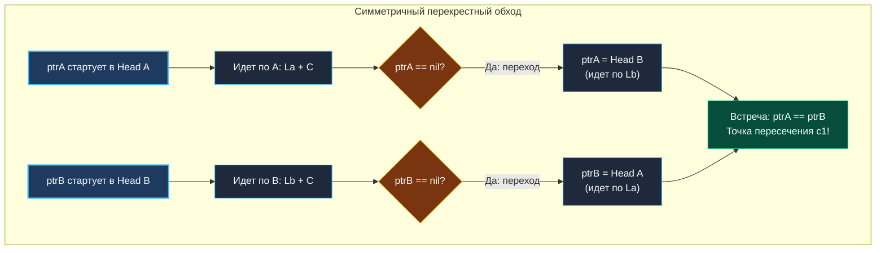

> *«Две разные дороги, пройденные до конца и начатые снова на чужом пути, непременно сойдутся в точке общего истока».*  
> — Анри Пуанкаре

## Точка слияния двух миров

В реальном системном программировании переиспользование динамической памяти — стандарт оптимизации. В системе контроля версий Git различные ветки разработки делят общие цепочки родительских коммитов; в LRU-кэшах различные ключи могут указывать на единый базовый дескриптор в памяти для экономии RAM.

В терминах структур данных это означает, что два независимых связных списка в определенный момент физически сходятся в один узел и дальше продолжают путь как единое целое.

Задача **Intersection of Two Linked Lists** (LeetCode 160) требует найти точный узел слияния двух списков. Если списки не пересекаются, необходимо вернуть `nil`.

Интервьюер ожидает от кандидата уровня Middle+/Senior решение с линейным временем $O(N + M)$ и **строго константной памятью $O(1)$ без аллокаций в куче**.

> [!NOTE] Условие задачи
> Даны указатели на головы двух односвязных списков `headA` и `headB`.  
> Списки могут иметь разную длину до точки пересечения, но после нее делят общую память.  
> Верните узел, в котором два списка пересекаются, или `nil`, если общих узлов нет.  
> **Запрещено** модифицировать исходную структуру списков.

---

## Архитектура: Симметрия путей против наивных решений

Главная трудность задачи — **разная длина непересекающихся частей**.
- Список A: $a_1 \to a_2 \to c_1 \to c_2 \to c_3$
- Список B: $b_1 \to b_2 \to b_3 \to c_1 \to c_2 \to c_3$

Точка пересечения — узел $c_1$. Но если просто запустить два указателя параллельно, указатель $A$ придет в $c_1$ на 3-м шаге, а указатель $B$ — только на 4-м. Они разминутся во времени.

> [!WARNING] Ловушка / Gotcha: Наивное решение на Hash Map
> Первое предложение начинающих разработчиков: «Создадим `map[*ListNode]struct{}`, обойдем список A, запишем адреса, затем пройдем список B и проверим наличие в мапе».  
> Это $O(N)$ памяти, аллокация в куче, давление на GC и Cache Misses при хешировании указателей. На серьезном системном интервью это дисквалифицирующий ответ.

### Математический триумф: Выравнивание путей перекрестным обходом
Обозначим:
- $L_A$ — длина уникальной части списка A до пересечения.
- $L_B$ — длина уникальной части списка B до пересечения.
- $C$ — длина общего разделяемого сегмента.

Полный путь A: $L_A + C$. Полный путь B: $L_B + C$.  
Разница путей: $|L_A - L_B|$.

Как ликвидировать эту разницу без вычисления длин?  
Пусть каждый указатель, дойдя до конца своего списка (`nil`), **перепрыгивает на голову чужого списка**!
- Указатель `ptrA` пройдет: $L_A + C + L_B$.
- Указатель `ptrB` пройдет: $L_B + C + L_A$.

Поскольку сложение коммутативно ($L_A + C + L_B = L_B + C + L_A$), оба указателя пройдут **абсолютно одинаковое расстояние**! Они окажутся в узле $c_1$ **в один и тот же такт времени**.



---

## Идиоматичный Go-код

```go
package list

// getIntersectionNode находит узел физического пересечения двух списков за O(N + M) и O(1) памяти.
func getIntersectionNode(headA, headB *ListNode) *ListNode {
	if headA == nil || headB == nil {
		return nil
	}

	ptrA := headA
	ptrB := headB

	// Крутим цикл, пока указатели не укажут на одну и ту же физическую ячейку памяти
	for ptrA != ptrB {
		// Если ptrA уперся в конец списка A, переключаем его на старт списка B
		if ptrA == nil {
			ptrA = headB
		} else {
			ptrA = ptrA.Next
		}

		// Если ptrB уперся в конец списка B, переключаем его на старт списка A
		if ptrB == nil {
			ptrB = headA
		} else {
			ptrB = ptrB.Next
		}
	}

	// Либо узел пересечения, либо nil (если списки не пересекаются)
	return ptrA
}
```

---

## Взгляд под капот: Mechanical Sympathy

### 1. Физика сравнения указателей `ptrA != ptrB`
В Go тип `*ListNode` — это чистое 64-битное значение виртуального адреса. Оператор `ptrA != ptrB` компилируется в одну процессорную инструкцию `CMP` между регистрами CPU.  
Здесь нет тяжелых вызовов `equals()` или сравнения полей структуры. Даже если узлы содержат одинаковые числа `Val = 42`, но находятся в разных аллокациях, они не равны. Мы ищем точное слияние графа в одном адресе RAM.

### 2. Что происходит, если списки НЕ пересекаются?
Логичный вопрос интервьюера: *«Не уйдет ли код в бесконечный цикл, если общих узлов нет?»*  
**Нет, никогда.**  
Оба указателя сделают ровно $L_A + L_B$ шагов. На последнем шаге `ptrA` дойдет до конца списка B и станет `nil`, а `ptrB` дойдет до конца списка A и тоже станет `nil`.  
Сработает условие `nil == nil` (в Go это истинное равенство), цикл завершится, и функция корректно вернет `nil`.

### 3. Предсказатель переходов CPU (Branch Predictor)
Внутри цикла проверка `if ptrA == nil` истинна ровно **один раз** за весь обход (в момент переключения на другой список). В 99.9% тактов процессорный предсказатель ветвлений спекулятивно выбирает ветку `ptrA = ptrA.Next`, обеспечивая максимальную пропускную способность конвейера инструкций без пауз на Pipeline Flush.

---

## Альтернативный подход: Выравнивание через дельту длин ($\Delta L$)

Если интервьюер предпочитает строго алгоритмический подход без «прыжков» по спискам:

1. Вычисляем длину первого списка $L_A$ и второго $L_B$.
2. Находим разницу $\Delta = |L_A - L_B|$.
3. Указатель более длинного списка сдвигаем вперед на $\Delta$ шагов.
4. Теперь до точки пересечения обоим указателям осталось пройти ровно одинаковое расстояние. Двигаем их параллельно: первый же узел, где `ptrA == ptrB`, и есть пересечение.

Этот вариант требует чуть больше строк кода, но работает за аналогичные $O(N + M)$ времени и $O(1)$ памяти.

---

> [!INTERVIEW] Вопросы для собеседований
> - **Почему нельзя менять значения `Val` в узлах (например, умножать на -1 или ставить метку)?**  
>   *Ответ:* В конкурентной среде (Concurrent Go) связный список может параллельно читаться другими горутинами. Мутация значений вызовет Data Race и сломает консистентность данных. Алгоритм обязан быть read-only.

## Итог

Задача **Intersection of Two Linked Lists** — образец математической симметрии в коде. Объединение двух траекторий превращает разность длин в нулевую дельту, решая задачу за честное $O(1)$ по памяти.

Теперь, когда в нашем арсенале есть разворот, поиск середины и слияние, соберем их в комплексный алгоритм, решающий одну из самых красивых задач на переупорядочивание памяти: [[8. Reorder List]].