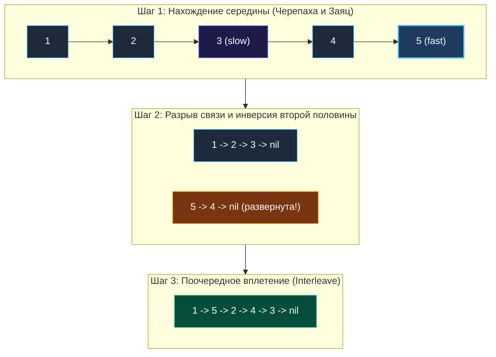

> *«Сложное преобразование становится тривиальным, если разложить его на последовательность безупречно выверенных элементарных шагов».*  
> — Брайан Керниган

## Экзамен на знание связных списков

В предыдущих разделах мы освоили три фундаментальных кирпичика работы со связными структурами:
1. Поиск середины за один проход алгоритмом «Черепахи и зайца» ([[2. Быстрый и медленный указатели]]).
2. Разворот цепочки указателей in-place ([[3. Reverse Linked List]]).
3. Поочередное слияние независимых списков ([[4. Merge Two Sorted Lists]]).

Задача **Reorder List** (LeetCode 143, уровень Medium) — это настоящий квалификационный экзамен по теме списков. Интервьюеры ведущих технологических компаний любят её за то, что она не требует редких эвристик, но заставляет кандидата написать около 40 строк кристально чистого кода, скомбинировав **три самостоятельных алгоритма в единую конвейерную цепочку без единой ошибки в указателях**.

> [!NOTE] Условие задачи
> Дан односвязный список:
> $$L_0 \to L_1 \to L_2 \to \dots \to L_{n-1} \to L_n$$
> Необходимо перестроить его структуру in-place (без выделения новых узлов) по принципу «гармошки»:
> $$L_0 \to L_n \to L_1 \to L_{n-1} \to L_2 \to L_{n-2} \to \dots$$
> 
> ```
> Вход:   1 -> 2 -> 3 -> 4 -> 5 -> nil
> Выход:  1 -> 5 -> 2 -> 4 -> 3 -> nil
> ```

---

## Архитектура: Декомпозиция на три шага

Наивный подход Junior-разработчика: собрать все указатели в слайс `nodes := []*ListNode`, а затем переставлять ссылки двумя указателями с начала и конца слайса.  
*В чем изъян?* Это требует $O(N)$ дополнительной памяти. При обработке длинных цепочек в конкурентных горутинах выделение слайса на куче нагружает сборщик мусора Go.

Senior-инженер решает задачу за **$O(1)$ памяти**, разделив трансформацию на три изолированных этапа:



1. **Шаг 1 (Поиск середины):** Запускаем быстрый и медленный указатели. Когда Заяц дойдет до конца, Черепаха укажет на конец первой половины.
2. **Шаг 2 (Разрыв и инверсия):**  
   - Физически разрываем список: `slow.Next = nil` (защита от зацикливания!).
   - Разворачиваем вторую половину с помощью классической итерации трех указателей (`prev`, `curr`, `nextTemp`).
3. **Шаг 3 (Вплетение):** Поочередно соединяем узлы первой половины с узлами развернутой второй половины.

---

## Идиоматичный Go-код

Обратите внимание: функция имеет сигнатуру `func reorderList(head *ListNode)` и ничего не возвращает — модификация происходит строго in-place.

```go
package list

// reorderList перестраивает связный список гармошкой за O(N) времени и O(1) памяти.
func reorderList(head *ListNode) {
	// Базовый случай: пустой список или список меньше 3 узлов не требует перестроения
	if head == nil || head.Next == nil || head.Next.Next == nil {
		return
	}

	// === ШАГ 1: Поиск середины (Черепаха и Заяц) ===
	slow, fast := head, head
	for fast != nil && fast.Next != nil {
		slow = slow.Next
		fast = fast.Next.Next
	}

	// === ШАГ 2: Разворот второй половины ===
	// slow сейчас находится на последнем узле первой половины
	var prev *ListNode
	curr := slow.Next

	// КРИТИЧНО: разрываем исходный список на две независимые цепочки!
	slow.Next = nil

	for curr != nil {
		nextTemp := curr.Next
		curr.Next = prev
		prev = curr
		curr = nextTemp
	}

	// === ШАГ 3: Поочередное сшивание (Interleaving) ===
	// first — голова первой половины (head)
	// second — голова развернутой второй половины (prev)
	first := head
	second := prev

	for second != nil {
		// Спасаем следующие шаги в обеих цепочках
		tmp1 := first.Next
		tmp2 := second.Next

		// Вплетаем узел из второй половины между узлами первой
		first.Next = second
		second.Next = tmp1

		// Продвигаем указатели вперед
		first = tmp1
		second = tmp2
	}
}
```

---

## Взгляд под капот: Mechanical Sympathy

### 1. Zero Allocations и регистры процессора
Все служебные переменные функции (`slow`, `fast`, `prev`, `curr`, `first`, `second`, `tmp1`, `tmp2`) компилятор Go аллоцирует исключительно в 64-битных регистрах CPU. Память кучи не запрашивается ни разу. Вся операция — это чистое перекладывание машинных адресов между регистрами процессора.

### 2. Почему цикл слияния проверяет только `second != nil`?
При нечетном количестве узлов (например, 5 узлов) первая половина получит 3 узла, а вторая — 2 узла. При четном числе (4 узла) обе половины будут иметь по 2 узла.  
Таким образом, первая половина **всегда либо равна, либо на 1 узел длиннее второй половины**.  
Как только вторая половина `second` заканчивается, последний узел первой половины гарантированно уже указывает на `nil` (благодаря разрыву `slow.Next = nil` на шаге 2). Код защищен от лишних проверок.

---

> [!WARNING] Ловушка / Gotcha: Забытый разрыв списка
> Если пропустить строку `slow.Next = nil`, хвост первой половины продолжит ссылаться на узел второй половины. При развороте второй половины возникнет скрытый циклический граф, и цикл вплетения `for second != nil` уйдет в вечный цикл, что на собеседовании приведет к немедленному Time Limit Exceeded (TLE).  
> **Инвариант:** При разделении списка всегда явно обнуляйте терминальную связь!

## Итог

Задача **Reorder List** демонстрирует зрелое инженерное мышление: разбиение комплексной задачи на три независимых детерминированных блока, каждый из которых работает за константную память.

До сих пор мы работали со списками, где каждый узел ссылался только на следующего соседа. Но что, если структура памяти усложняется, и узел может ссылаться на *произвольный случайный узел в куче*? Как создать глубокую копию такого графа? Разбираем в статье: [[9. Copy List with Random Pointer]].