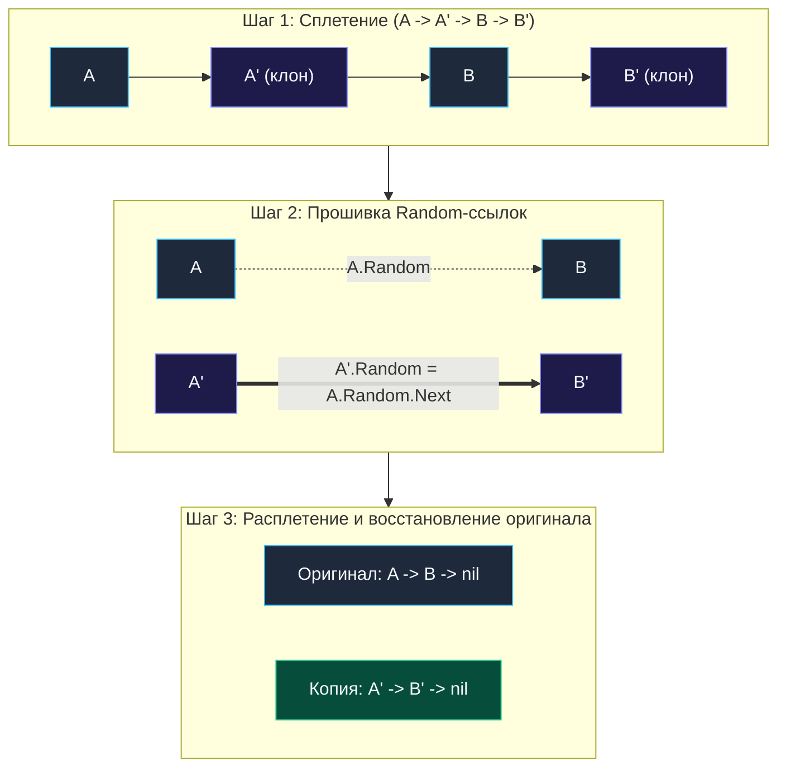

> *«Истинное мастерство копирования состоит не в слепом дублировании, а в сохранении тончайших нитей связей между элементами целого».*  
> — Брайан Керниган

## Мост между списками и произвольными графами

Завершая исследование связных списков, мы сталкиваемся с задачей, которая перекидывает мост между линейными цепочками и общими ориентированными графами в памяти.

Задача **Copy List with Random Pointer** (LeetCode 138, уровень Medium) — это эталонная проверка понимания концепции **глубокого копирования (Deep Copy)** и способности управлять динамическими ссылочными топологиями без привлечения тяжеловесных структур данных.

> [!NOTE] Условие задачи
> Дан связный список длины $N$, где каждый узел содержит:
> - `Val` — целочисленное значение.
> - `Next` — указатель на следующий узел в последовательности.
> - `Random` — произвольный указатель, который может ссылаться на **любой другой узел** в этом же списке, на самого себя или быть равным `nil`.
> 
> Необходимо создать и вернуть **глубокую копию** этого списка. Новые узлы должны быть полностью независимыми объектами в памяти, но в точности повторять значения и топологию связей (`Next` и `Random`) оригинала.

---

## Архитектура: Проблема опережающих ссылок (Forward References)

Почему список с произвольными ссылками нельзя скопировать простым линейным обходом за один шаг?  
Представьте узел $A$, чей указатель $A.\text{Random}$ ссылается на узел $C$. Находясь на узле $A$, мы аллоцируем клон $A'$, но узел $C$ находится далеко впереди — его копии $C'$ физически еще не существует в памяти! Нам некуда направить указатель $A'.\text{Random}$.

### Подход 1: Наивный через Hash Map (Уровень Middle)
Классическое решение в лоб:
1. Завести `map[*Node]*Node` (соответствие `Оригинал -> Клон`).
2. В первом проходе создать все клоны узлов и сложить их в мапу: `clones[curr] = &Node{Val: curr.Val}`.
3. Во втором проходе связать указатели:  
   `clones[curr].Next = clones[curr.Next]`  
   `clones[curr].Random = clones[curr.Random]`

> [!WARNING] Ловушка / Gotcha: Нагрузка на сборщик мусора Go
> Решение с хеш-таблицей требует $O(N)$ дополнительной памяти. При миллионе узлов мапа `map[*Node]*Node` потребует десятки мегабайт в куче.  
> Поскольку ключи и значения — указатели, фаза разметки сборщика мусора Go (*GC Mark*) будет вынуждена сканировать каждый бакет этой гигантской таблицы, вызывая задержки сервиса.  
> На серьезном архитектурном собеседовании вас сразу остановят: *«Решите эту задачу за честное $O(1)$ вспомогательной памяти без использования хэш-таблиц»*.

---

## Подход 2: Алгоритм сплетения (Weaving / Interleaving) за $O(1)$ памяти

Вместо того чтобы хранить соответствие `Оригинал -> Клон` во внешней хеш-таблице, мы используем **сам исходный список в качестве естественного хранилища связей**!

Алгоритм состоит из трех последовательных проходов:



1. **Шаг 1 (Сплетение / Weaving):**  
   Для каждого узла $A$ создаем узел-клон $A'$ и вставляем его строго между $A$ и его соседом $B$:
   $$A \to A' \to B \to B' \to C \to C' \to \text{nil}$$
2. **Шаг 2 (Прошивка Random):**  
   Где в этой сплетенной цепочке находится клон узла, на который указывает $A.\text{Random}$?  
   Он находится **ровно на одну позицию правее**: `A.Random.Next`!  
   Следовательно:
   $$\text{curr}.\text{Next}.\text{Random} = \text{curr}.\text{Random}.\text{Next}$$
3. **Шаг 3 (Расплетение / Unweaving):**  
   Аккуратно расплетаем цепочки: восстанавливаем исходные ссылки оригинала ($A \to B \to C$) и выделяем независимый список клонов ($A' \to B' \to C'$).  
   *Критично:* мутировать исходный список навсегда — грубое нарушение инвариантов надежного кода (Side-Effect). Восстановление оригинала обязательно!

---

## Идиоматичный Go-код

```go
package list

// Node представляет узел связного списка с произвольным указателем.
type Node struct {
	Val    int
	Next   *Node
	Random *Node
}

// copyRandomList создает глубокую копию списка за O(N) времени и O(1) вспомогательной памяти.
func copyRandomList(head *Node) *Node {
	if head == nil {
		return nil
	}

	// === ШАГ 1: Сплетение списков (A -> A' -> B -> B') ===
	curr := head
	for curr != nil {
		clone := &Node{Val: curr.Val}
		// Вставляем клон сразу за оригиналом
		clone.Next = curr.Next
		curr.Next = clone
		// Шагаем на следующий оригинальный узел
		curr = clone.Next
	}

	// === ШАГ 2: Прошивка Random-указателей клонов ===
	curr = head
	for curr != nil {
		if curr.Random != nil {
			// Клон узла curr.Random лежит ровно на один шаг правее него
			curr.Next.Random = curr.Random.Next
		}
		// Шагаем через один (на следующий оригинальный узел)
		curr = curr.Next.Next
	}

	// === ШАГ 3: Расплетение цепочек и восстановление оригинала ===
	curr = head
	cloneHead := head.Next // Голова скопированного списка

	for curr != nil {
		clone := curr.Next
		// Восстанавливаем оригинальную связь
		curr.Next = clone.Next
		// Сшиваем связь между клонами
		if clone.Next != nil {
			clone.Next = clone.Next.Next
		}
		curr = curr.Next
	}

	return cloneHead
}
```

---

## Взгляд под капот: Mechanical Sympathy

### 1. Почему память считается $O(1)$, если мы создаем узлы?
В теории алгоритмов **пространственная сложность (Space Complexity) оценивает вспомогательную память**, требуемую алгоритму для управления вычислениями. Сам результирующий граф (выходные данные) в оценку вспомогательной памяти не входит.  
Алгоритм сплетения использует всего несколько локальных указателей на стеке: zero allocations для служебных структур.

### 2. Кэш-локальность: 3 последовательных прохода против хеш-таблицы
Хотя алгоритм делает три прохода по списку вместо двух проходов с мапой, на реальном процессоре он работает **быстрее**:
- В варианте с мапой каждый шаг — это случайное обращение к памяти при поиске по бакетам (Random Memory Access) с десятками Cache Misses.
- В алгоритме сплетения все три прохода строго последовательны (*Sequential Access*). При создании клонов аллокатор Go `mcache` выделяет память пачками в смежных участках одного `span`. Аппаратный Prefetcher процессора подтягивает соседние узлы в L1/L2 кэш заранее.

---

> [!WARNING] Ловушка / Gotcha: Разрушение оригинала (Side Effects)
> На собеседованиях частая ошибка — вытащить клоны, но не восстановить исходный список `head`.  
> В промышленном коде передача структуры в функцию копирования не должна приводить к ее разрушению. Если функция повредит аргумент, другие горутины получат поврежденное состояние или панику. Восстановление исходных ссылок в шаге 3 обязательно.

## Итог

Задача **Copy List with Random Pointer** венчает кластер связных списков, демонстрируя, как сложную графовую адресацию можно временно интегрировать в линейную структуру памяти, исключая потребность во вспомогательных хеш-таблицах.

Мы завершили огромный цикл линейных и динамических структур данных (массивы, слайсы, префиксные суммы, хеш-таблицы, стеки, очереди, связные списки).  
Теперь мы переходим к фундаментальному разделу алгоритмов, лежащему в основе работы всех индексов современных СУБД, B-деревьев и систем поиска: [[1. Теория. Бинарный поиск]].