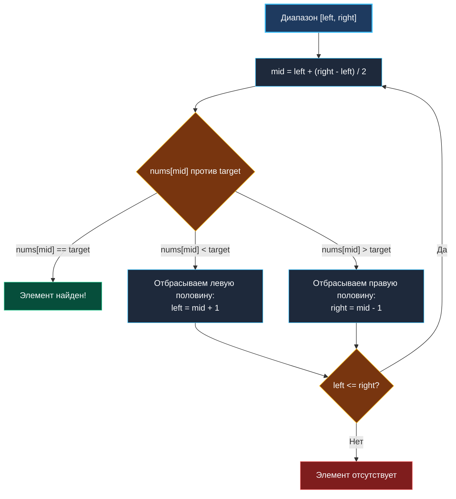
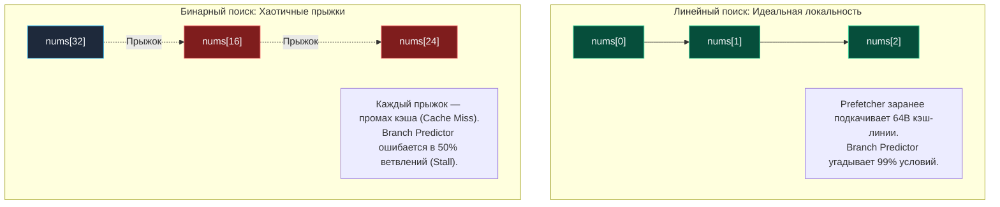

> *«Всякий раз, отбрасывая половину пространства поиска, мы делаем гигантский шаг к истине, сокращая вечность до считанных миллисекунд».*  
> — Дональд Кнут

## Экспоненциальное сокращение пространства поиска

Поиск элемента в отсортированном массиве за логарифмическое время $O(\log N)$ — классическая тема первого семестра Computer Science. Однако на технических собеседованиях уровня Middle+ и Senior интервьюеры редко просят написать тривиальный поиск числа. От инженера ждут виртуозного владения **граничными условиями (Lower / Upper Bound)**, умения находить экстремумы в **абстрактных пространствах решений** и понимания физики выполнения инструкций на современных CPU.

Логарифмический масштаб — величайшая сила в алгоритмах. Если массив содержит $1\,000\,000\,000$ (миллиард) элементов:
- Линейный поиск ($O(N)$) в худшем случае потребует миллиарда обращений к памяти (секунды работы CPU).
- Бинарный поиск ($O(\log_2 N)$) гарантированно локализует элемент всего за **30 шагов** (наносекунды).

Но за эту математическую мощь приходится платить прецизионной точностью: малейшая ошибка в границах или условии цикла превращает алгоритм либо в бесконечный цикл, либо в генератор ошибок *off-by-one*.

---

## Архитектура алгоритма и три канонических шаблона

Суть бинарного поиска состоит в поддержании инварианта: **целевое значение гарантированно лежит внутри активного отрезка `[left, right]`**. На каждом шаге мы вычисляем середину `mid` и за счет монотонности отбрасываем ровно половину пространства поиска.



В инженерной практике существует **три базовых шаблона** бинарного поиска. Выбор шаблона диктуется целью задачи:

### Шаблон 1: Точный поиск (Exact Match: `left <= right`)
Используется, когда нужно найти точное совпадение с `target` в массиве без повторяющихся элементов:
```go
left, right := 0, len(nums)-1
for left <= right {
    mid := left + (right-left)/2
    if nums[mid] == target {
        return mid
    } else if nums[mid] < target {
        left = mid + 1
    } else {
        right = mid - 1
    }
}
return -1
```

### Шаблон 2: Левая граница / Первое вхождение (Lower Bound: `left < right`)
Используется для поиска первого элемента, удовлетворяющего предикату (например, `nums[i] >= target` или `isBadVersion(i)`).  
**Инвариант:** искомый ответ всегда находится в полуинтервале `[left, right)`. При выходе из цикла `left == right`, поэтому гадать с возвращаемым индексом не нужно:
```go
left, right := 0, len(nums) // right за пределами массива
for left < right {
    mid := left + (right-left)/2
    if nums[mid] >= target {
        right = mid     // mid может быть ответом, сохраняем его
    } else {
        left = mid + 1  // mid точно не подходит
    }
}
return left // Индекс первого элемента >= target
```

### Шаблон 3: Окно из двух элементов (`left + 1 < right`)
Используется в сложных задачах, где для решения требуется сравнить текущий элемент с его непосредственными соседями `nums[mid-1]` и `nums[mid+1]` (например, поиск пика в массиве *Find Peak Element*). При выходе из цикла всегда остаются ровно два кандидата `left` и `right`, которые проверяются вручную.

---

## Знаменитая ловушка: Целочисленное переполнение (Integer Overflow)

Самая известная ошибка в истории алгоритмического программирования, которая более 20 лет скрывалась в стандартной библиотеке Java `Arrays.binarySearch`, таится в невинной формуле:

```go
mid := (left + right) / 2 // СКРЫТАЯ БОМБА!
```

> [!WARNING] Ловушка / Gotcha: Переполнение знакового `int`
> Если массив огромен (например, $2 \cdot 10^9$ элементов) или диапазон чисел приближается к пределу разрядной сетки `int32`, сумма `left + right` вызовет **целочисленное знаковое переполнение**.  
> Число станет отрицательным, а обращение `nums[mid]` приведет к аварийной панике рантайма `panic: runtime error: index out of range`.
> 
> **Каноническое решение:**
> ```go
> mid := left + (right-left)/2
> ```
> 
> **Go-way оптимизация (как в ядре самого Go):**
> ```go
> mid := int(uint(left+right) >> 1)
> ```
> Преобразование в беззнаковый `uint` сбрасывает интерпретацию старшего знакового бита, а побитовый сдвиг вправо `>> 1` аппаратно делит на 2 без переполнения.

---

## Mechanical Sympathy: Почему процессор «не любит» бинарный поиск

Асимптотически бинарный поиск на миллионе элементов ($~20$ операций) сокрушает линейный поиск ($1\,000\,000$ операций).  
Однако на интервью в финтех или HFT вам зададут провокационный вопрос:  
*«Какой поиск выполнится быстрее на отсортированном массиве из 32–64 чисел: линейный $O(N)$ или бинарный $O(\log N)$?»*

Правильный ответ Senior-инженера: **Линейный поиск будет физически быстрее бинарного на малых размерах данных.**

Причины кроются в архитектуре современных суперскалярных конвейеров CPU:



1. **Разрушение аппаратного префетчера (Hardware Prefetcher):**  
   Линейный скан читает память непрерывно. Контроллер памяти ядра загружает кэш-линии на опережение — данные всегда лежат в сверхбыстром L1d-кэше (1 такт). Бинарный поиск прыгает по адресам хаотично: `idx = 32`, затем `16`, затем `24`. Каждый прыжок выбивает процессор в ожидание системной шины RAM (до 100–200 тактов задержки).
2. **Ошибки предсказания ветвлений (Branch Misprediction):**  
   Условие `if nums[mid] < target` с вероятностью 50% истинно и 50% ложно. Процессорный блок Branch Target Buffer не может выявить закономерность и ошибается в половине случаев, вызывая сброс конвейера инструкций (*Pipeline Flush*) на 15–20 тактов.

> [!TIP] Инженерный стандарт: Гибридные сортировки
> Именно по этой причине стандартная библиотечная сортировка в Go (`slices.Sort` на базе алгоритма pdqsort — Pattern-Defeating Quicksort) при дроблении массива на отрезки меньше **12–24 элементов** автоматически переключается на обычные линейные вставки (*Insertion Sort*). Железо любит последовательную память.

---

## Бинарный поиск в стандартной библиотеке Go: `sort` против `slices`

В языке Go есть два поколения инструментов для бинарного поиска:

### 1. Устаревший интерфейс: `sort.Search`
```go
// sort.Search принимает предикат func(int) bool
idx := sort.Search(len(nums), func(i int) bool {
    return nums[i] >= target
})
```
*Недостаток:* Анонимная функция (замыкание) порождает накладные расходы на косвенный вызов через указатель функции на каждой итерации логарифмического цикла.

### 2. Современный стандарт (Go 1.21+): пакет `slices`
```go
import "slices"

// Generic-поиск с возвратом точного индекса и флага нахождения
idx, found := slices.BinarySearch(nums, target)
if found {
    fmt.Printf("Найден по индексу: %d\n", idx)
} else {
    fmt.Printf("Не найден. Точка для вставки (Lower Bound): %d\n", idx)
}
```
*Преимущество:* Пакет `slices` построен на дженериках (`cmp.Ordered`). Компилятор Go инлайнит код поиска напрямую в машинные инструкции целевого типа без единой аллокации и оверхеда на замыкания (*Monomorphization*).

## Итог

Бинарный поиск — это строгая математика полуинтервалов и контроль за переполнением разрядной сетки. Освоив базовые шаблоны, мы готовы сделать решающий концептуальный шаг: отказаться от поиска по статическим массивам и применить бинарное деление к **абстрактным пространствам ответов**.

Переходим к одному из самых мощных алгоритмических приемов в реальном бэкенде: [[2. Поиск по ответу]].