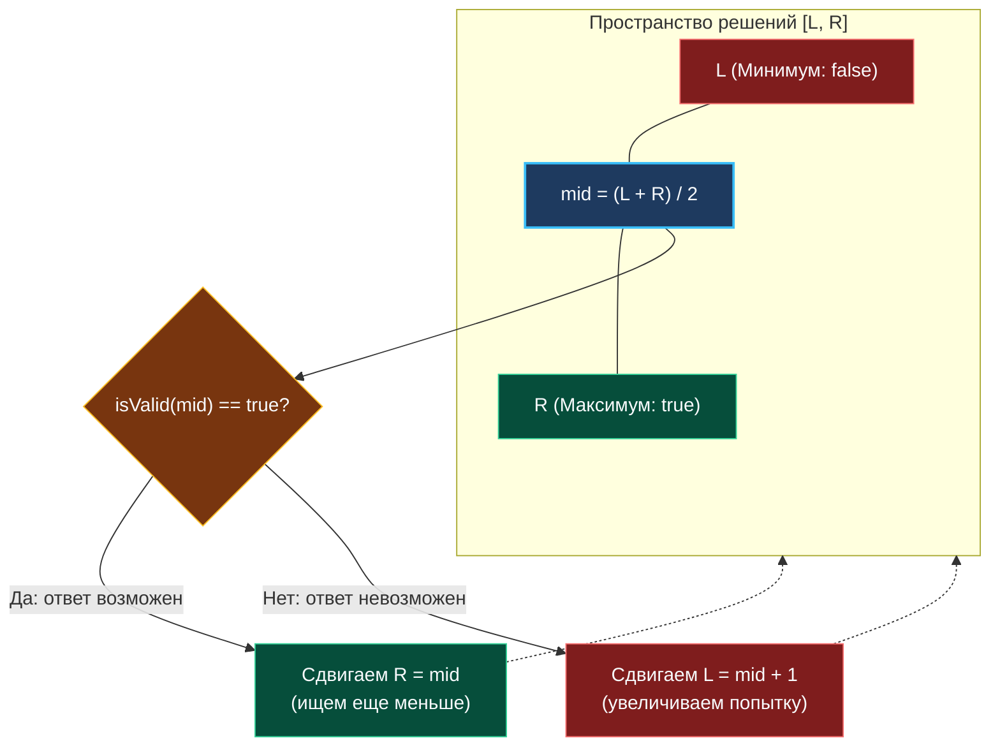

> *«Когда прямое решение кажется непостижимым, проверьте обратное: легко ли проверить готовую догадку? Если да, бинарный поиск сделает догадку безупречной».*  
> — Брайан Керниган

## От поиска данных к поиску решений

В классическом бинарном поиске мы ищем конкретное число в статическом массиве. Однако на собеседованиях уровня Middle+ и Senior в ведущие технологические компании такие задачи встречаются редко. Настоящий вызов — задачи, где **никакого отсортированного массива нет вовсе**, а найти требуется абстрактное «минимальное время доставки», «оптимальную грузоподъемность баржи» или «максимальный темп передачи пакетов в Rate Limiter».

Этот фундаментальный паттерн называется **Поиском по ответу (Binary Search on Answer)** или поиском в пространстве решений (*Search Space*). Умение мгновенно распознать этот паттерн — ключевой навык системного инженера.

---

## Суть паттерна: Монотонность предиката

Представьте прикладную задачу: *«Какова минимальная скорость $V$, с которой сервер должен отдавать видеопоток, чтобы буфер клиента не опустел за время $T$?»*  
У нас нет массива скоростей. Но у нас есть закон физической монотонности:
- Если сервер **успевает** при скорости $V = 100$ Мбит/с, то он **гарантированно успеет** при любой большей скорости ($101$, $150$, $500$ Мбит/с).
- Если сервер **не успевает** при скорости $V = 40$ Мбит/с, то он **гарантированно провалится** при меньших скоростях ($39$, $20$, $5$ Мбит/с).

Это свойство называется **монотонностью булевой функции**. Если мы формализуем проверку «успеваем ли мы при значении $X$» в виде предиката `isValid(X) bool`, то на всем диапазоне возможных ответов от $1$ до бесконечности результаты образуют идеально отсортированную последовательность:

$$\underbrace{[\text{false}, \text{false}, \dots, \text{false}]}_{\text{Не выполнимо}} \quad \longrightarrow \quad \underbrace{[\text{true}, \text{true}, \dots, \text{true}]}_{\text{Выполнимо}}$$

Задача инженера — найти **точку фазового перехода (Lower Bound)**: наименьший аргумент, при котором функция впервые возвращает `true`.



---

## Архитектура: Трехшаговый канонический каркас

Любая задача на поиск по ответу декомпозируется на три строгих этапа:

1. **Определение физических границ `[left, right]`:**  
   - Каков минимально возможный ответ? (Обычно $1$ или $\max(\text{nums})$).
   - Каков гарантированный верхний предел? (Сумма всех элементов $\sum \text{nums}$ или максимальный интервал времени).
2. **Проектирование жадного предиката `isValid(mid)`:**  
   - Функция, которая принимает гипотетическое значение `mid` и за один линейный проход $O(N)$ симулирует процесс (например, жадно упаковывает грузы в контейнеры).
3. **Логарифмический бинарный поиск:**  
   - Запуск поиска по полуинтервалу `[left, right)`.

### Идиоматичный Go-код

```go
package answersearch

// findMinimumFeasible находит минимальный параметр, удовлетворяющий ограничению limit.
func findMinimumFeasible(weights []int, limit int) int {
	// 1. Границы пространства решений
	// Минимум: самый тяжелый отдельный элемент (меньше него взять нельзя)
	// Максимум: сумма всех элементов (все берется за один шаг)
	left := 0
	right := 0
	for _, w := range weights {
		if w > left {
			left = w
		}
		right += w
	}

	// 2. Предикат-валидатор жадной симуляции O(N)
	// Не аллоцирует память в куче!
	isValid := func(capacity int) bool {
		chunks := 1
		currentSum := 0

		for _, w := range weights {
			if currentSum+w > capacity {
				chunks++
				currentSum = w
			} else {
				currentSum += w
			}
		}

		return chunks <= limit
	}

	// 3. Бинарный поиск Lower Bound за O(N * log(Range))
	for left < right {
		mid := int(uint(left+right) >> 1)

		if isValid(mid) {
			// mid выполним: возможно, существует еще более компактный ответ
			right = mid
		} else {
			// mid не выполним: все значения <= mid заведомо малы
			left = mid + 1
		}
	}

	return left
}
```

---

## Взгляд под капот: Mechanical Sympathy

Общая сложность алгоритма составляет:
$$T = O(N \cdot \log_2 M)$$
где $N$ — число входных элементов (стоимость одного вызова `isValid`), а $M = \text{right} - \text{left}$ — ширина диапазона ответов.

Если диапазон решений огромен ($M = 10^9$), логарифм $\log_2(10^9) \approx 30$. Это означает, что функция `isValid` будет вызвана ровно **30 раз**.  
Отсюда вытекает фундаментальное правило: **любая неэффективность внутри `isValid` мультиплицируется в 30 раз!**

### 1. Zero Allocations внутри предиката
Внутри `isValid` категорически запрещено выделять временные слайсы, мапы или структуры. Переменные `chunks` и `currentSum` должны быть простыми скалярами, живущими в регистрах процессора. Сборщик мусора Go не должен совершать ни одной паузы во время симуляции.

### 2. Inlining и замыкания
Если `isValid` оформлена как замыкание, компилятор Go благодаря Escape Analysis оставит захваченные переменные на стеке. Однако в критических путях высокопроизводительных микросервисов функцию проверки лучше выносить на уровень пакета:  
`func isValid(weights []int, limit int, cap int) bool`.  
Это позволяет компилятору гарантированно встроить тело функции (*Inline Optimization*), устранив накладные расходы на пролог/эпилог функции вызова в ассемблере.

---

> [!TIP] Как мгновенно распознать этот паттерн на интервью?
> Обратите внимание на сигнальные маркеры в условии:
> - *«Найдите **минимальное** значение $X$, при котором **возможно**...»*
> - *«Найдите **максимальную** скорость $Y$, чтобы уложиться в лимит...»*
> - *«Разбейте массив на $K$ частей так, чтобы максимальная сумма подмассива была **минимальной** (Minimize the Maximum)»*.
> 
> Если ограничения на числа достигают $10^9$ (где алгоритмы динамического программирования $O(N \cdot K)$ падают по Out of Memory), решение задачи почти со 100% вероятностью строится на **бинарном поиске по ответу**.

> [!WARNING] Ловушка / Gotcha: Верхняя граница `right = math.MaxInt64`
> Начинающие разработчики часто выставляют `right = math.MaxInt64` «с запасом».  
> Это грубая ошибка: сложение `left + right` немедленно вызовет переполнение, а бинарный поиск сделает 64 лишние итерации по пустому пространству. Верхнюю границу всегда следует оценивать исходя из физических инвариантов задачи (например, худший сценарий выполнения).

## Итог

Поиск по ответу кардинально меняет парадигму мышления: вместо сложного вычисления оптимального решения мы преобразуем задачу в простую линейную проверку гипотезы, а высокоскоростной логарифмический редуктор находит точный оптимум за считанные микросекунды.

Закрепив концепцию пространства решений, вернемся к практическому кодингу и разберем классическую реализацию базового поиска: [[3. Binary Search]].