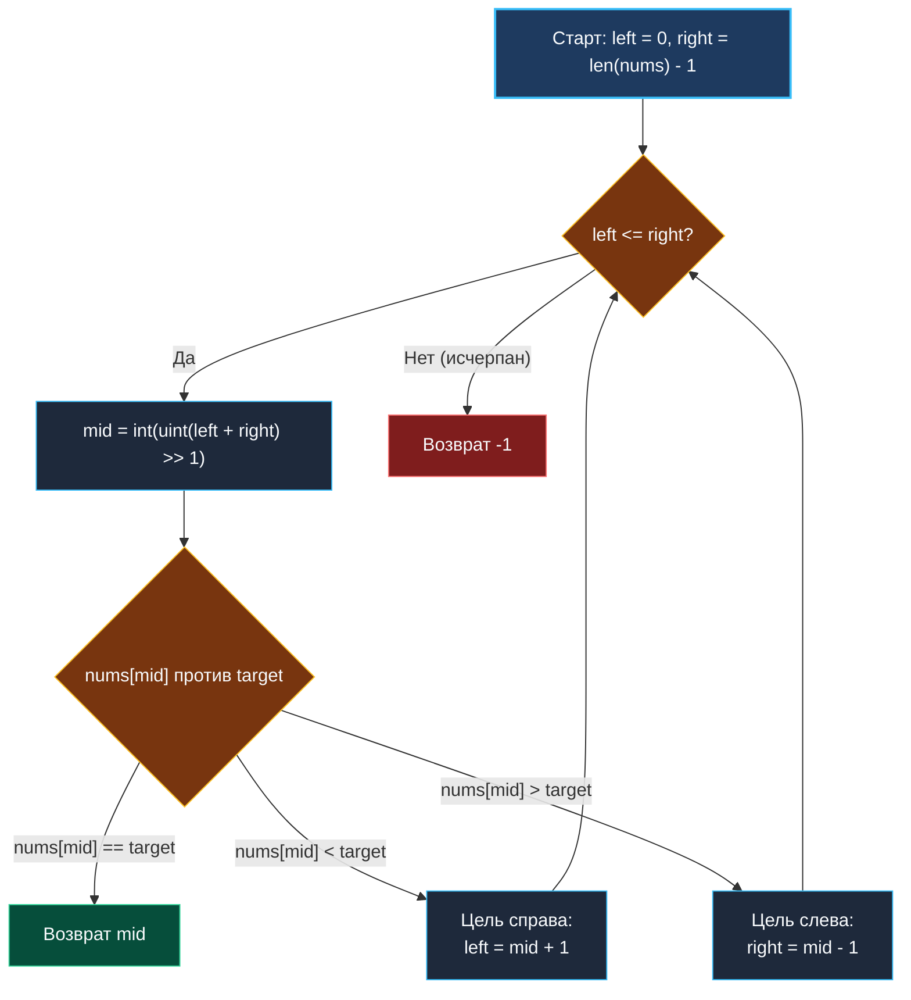

> *«В правильном алгоритме нет ничего лишнего: каждое сравнение уменьшает неизвестность ровно вдвое».*  
> — Брайан Керниган

## «Hello World» алгоритмических секций

Задача **Binary Search** (LeetCode 704) — это фундаментальный рубеж любого технического собеседования. Написание безошибочного бинарного поиска за 2 минуты у доски или в онлайн-редакторе — обязательный базовый навык для позиции любого уровня, от Junior до Staff Engineer.

Кажущаяся простота задачи обманчива: по статистике около половины кандидатов допускают ошибку в граничных условиях (*off-by-one errors*), зависают в бесконечном цикле или допускают целочисленное переполнение при расчете середины.

> [!NOTE] Условие задачи
> Дан целочисленный массив `nums`, строго отсортированный по возрастанию, и целое число `target`.  
> Напишите функцию поиска `target` в массиве `nums`. Если число присутствует, верните его индекс; в противном случае верните `-1`.  
> Временная сложность алгоритма обязана быть строго $O(\log N)$.
> 
> ```
> Вход:  nums = [-1, 0, 3, 5, 9, 12], target = 9
> Выход: 4 (nums[4] == 9)
> ```

---

## Архитектура: Инвариант замкнутого диапазона `[left, right]`

Для задачи **точного совпадения (Exact Match)**, где все элементы уникальны и требуется вернуть индекс конкретного элемента, наиболее чистым и самодокументированным является **шаблон замкнутого интервала `[left, right]`**:

### Правила инварианта:
1. `right` инициализируется индексом последнего элемента: `len(nums) - 1`.
2. Условие цикла — строго `left <= right`. Знак равенства обязателен: при поиске в массиве из одного элемента (`len == 1`) указатели `left` и `right` равны $0$, и без равенства тело цикла не выполнится вовсе.
3. При сужении диапазона текущий проверенный индекс `mid` **гарантированно исключается**:
   - Если `nums[mid] < target`, то `left = mid + 1`.
   - Если `nums[mid] > target`, то `right = mid - 1`.



---

## Идиоматичный Go-код

```go
package binarysearch

// search выполняет точный поиск target в отсортированном массиве за O(log N) времени и O(1) памяти.
func search(nums []int, target int) int {
	left := 0
	right := len(nums) - 1

	for left <= right {
		// Защита от переполнения + оптимизация BCE для компилятора Go
		mid := int(uint(left+right) >> 1)

		if nums[mid] == target {
			return mid
		}

		if nums[mid] < target {
			left = mid + 1
		} else {
			right = mid - 1
		}
	}

	return -1
}
```

---

## Взгляд под капот: Bounds Check Elimination (BCE)

На собеседованиях уровня Senior в высоконагруженные проекты часто звучит вопрос:  
*«Зачем вычислять середину через `mid := int(uint(left+right) >> 1)`, а не через классическое `left + (right-left)/2`?»*

Ответ раскрывает тонкости работы компилятора Go:

1. **Защита от Integer Overflow:**  
   Приведение к беззнаковому типу `uint(left+right)` устраняет риск переполнения знакового разряда `int32`, когда сумма индексов превышает $2 \cdot 10^9$.
2. **Аппаратный битовый сдвиг:**  
   Операция `>> 1` транслируется в одну процессорную инструкцию сдвига `SHR`, выполняемую процессором за 1 такт, в то время как деление `DIV` требует до 15–30 тактов.
3. **Оптимизация BCE (Bounds Check Elimination):**  
   В Go каждое обращение по индексу `nums[i]` по умолчанию сопровождается невидимой ассемблерной проверкой: не вышел ли индекс за границы слайса (чтобы в случае ошибки выбросить `panic`).  
   Компилятор Go оснащен анализатором **BCE**. Когда компилятор видит, что `mid` получен через беззнаковый `uint` сдвигом вправо, он математически доказывает, что `mid` не может быть отрицательным и не превосходит `right`. В результате компилятор **полностью удаляет ветвление проверки границ из машинного кода**, делая бинарный поиск предельно близким по скорости к ассемблеру C!

> [!NOTE] Краевой случай: Пустой слайс
> Если на вход подан пустой массив `nums = []`, `right` станет равным `0 - 1 = -1`.  
> Условие цикла `0 <= -1` немедленно вернет `false`, тело цикла не выполнится ни разу, и функция безопасно вернет `-1` без дополнительных ветвлений `if len(nums) == 0`.

---

> [!INTERVIEW] Вопросы для собеседований
> 1. **Что делать, если в массиве есть дубликаты и нужно вернуть индекс первого вхождения?**  
>    *Ответ:* Шаблон замкнутого интервала с мгновенным `return mid` не подходит, так как мы можем случайно попасть в середину группы дубликатов. Необходимо переключиться на шаблон полуинтервала (Lower Bound): при `nums[mid] >= target` сдвигать правую границу `right = mid`, продолжая поиск левее.
> 2. **Как записать это с использованием стандартной библиотеки Go 1.21+?**  
>    *Ответ:* Через дженерик-пакет `slices`:
>    ```go
>    import "slices"
>    
>    func search(nums []int, target int) int {
>        idx, found := slices.BinarySearch(nums, target)
>        if found {
>            return idx
>        }
>        return -1
>    }
>    ```

## Итог

Классический бинарный поиск требует безупречного соблюдения инвариантов замкнутых границ и учета особенностей компилятора.

Но что, если искомого числа в массиве вообще нет? Как узнать, **куда именно его следовало бы вставить**, чтобы не нарушить порядок сортировки? Переходим к следующей фундаментальной задаче: [[4. Search Insert Position]].