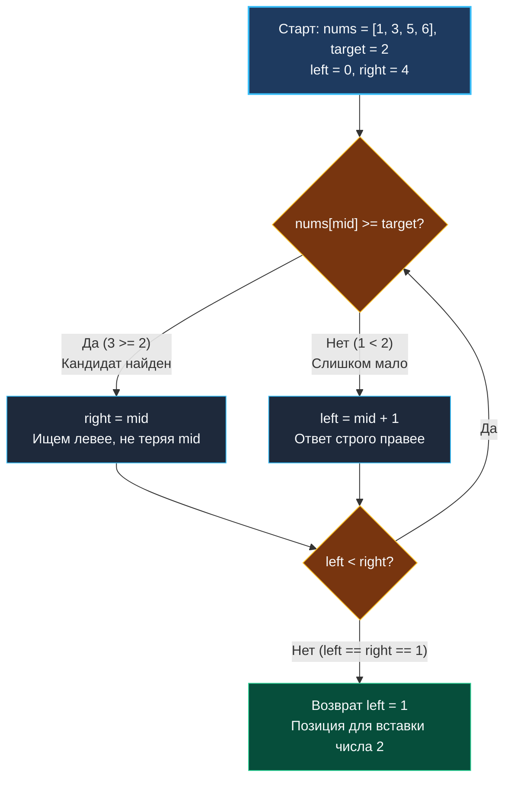

> *«Вставка элемента в упорядоченную структуру — это поиск места, где он должен был находиться с самого начала».*  
> — Никлаус Вирт

В предыдущей статье [[3. Binary Search]] мы разобрали классический бинарный поиск (Exact Match), который отвечает на строгий вопрос: *«Присутствует ли заданное число в массиве?»*. 

Но в системном программировании, при разработке B-Tree индексов в СУБД (PostgreSQL, SQLite), при поддержке упорядоченных in-memory структур (Log-Structured Merge-trees в RocksDB/Pebble) или в стандартной библиотеке Go (`slices.BinarySearch`), инженера чаще интересует другой вопрос: *«Если элемента нет в массиве, то **в какую позицию** его необходимо поместить, чтобы сохранить сортировку?»*.

Задача **Search Insert Position** (LeetCode 35) — это канонический пример фундаментального паттерна **Lower Bound** (поиск нижней границы). Это строгая база, на которой строится поиск по ответу и навигация в структурах данных ядра.

---

## Архитектура: Инвариант Lower Bound против Exact Match

В классическом поиске точного совпадения (Exact Match) мы использовали закрытый интервал `[0, len(nums)-1]` и три ветки: `< target`, `> target` и `== target`. При совпадении мы немедленно завершали работу (`return mid`).

В поиске позиции вставки (Lower Bound) архитектура меняется:
1. **Мы ищем первый индекс $i$, для которого `nums[i] >= target`:** Если точный элемент найден, мы не имеем права выходить досрочно, если массив может содержать дубликаты — вставка обязана происходить перед первым дубликатом (требование стабильности порядка).
2. **Полуинтервал `[0, len(nums))`:** Верхняя граница `right` инициализируется значением `len(nums)`, а не `len(nums) - 1`. Если `target` больше любого элемента в срезе, его законная позиция для вставки — в самый конец, то есть на индекс `len(nums)`.
3. **Безусловная сходимость:** Условие цикла `left < right` гарантирует, что полуинтервал схлопывается в единственную точку `left == right`, которая и является искомой позицией.



---

## Идиоматичная реализация на Go

Этот шаблон полуинтервала `[left, right)` — золотой стандарт конкурентного и системного программирования. Он полностью исключает ошибки выхода за границы среза и неоднозначности выхода из цикла.

```go
package main

// searchInsert возвращает индекс элемента, если он найден в отсортированном срезе.
// Если элемент отсутствует, возвращается индекс, куда его следует вставить
// с сохранением порядка сортировки (паттерн Lower Bound).
// Временная сложность: O(log N)
// Пространственная сложность: O(1)
func searchInsert(nums []int, target int) int {
	// right инициализируется длиной среза: возможная позиция вставки в конец
	left, right := 0, len(nums)

	// Цикл сужает полуинтервал [left, right) до тех пор, пока left != right
	for left < right {
		// Защищенное от переполнения деление сдвигом в регистре CPU
		mid := int(uint(left+right) >> 1)

		if nums[mid] >= target {
			// Текущий элемент подходит или больше искомого:
			// ответ может быть в позиции mid или левее.
			// Сдвигаем правую границу, сохраняя mid в полуинтервале [left, mid).
			right = mid
		} else {
			// Элемент nums[mid] строго меньше target:
			// позиция вставки гарантированно находится правее.
			left = mid + 1
		}
	}

	// По выходу из цикла left == right — это точная позиция вставки
	return left
}
```

---

## Взгляд под капот: Mechanical Sympathy

### 1. Предсказуемость ветвлений (Branch Prediction)
В цикле `for left < right` содержится всего **одно бинарное условие** (`if ... else ...`), в отличие от классического поиска с тремя исходами (`<`, `>`, `==`).
- Для аппаратного блока Branch Predictor в процессорах AMD Zen или Intel Core предсказание исхода двух ветвей на монотонных данных требует минимальных ресурсов.
- Поскольку цикл не содержит досрочного выхода `return mid`, число итераций детерминировано и составляет строго $\lceil \log_2 (N+1) \rceil$. Это позволяет суперскалярному конвейеру процессора непрерывно спекулятивно вычислять инструкции без сбросов конвейера (Pipeline Flushes).

### 2. Доказанная безопасность Bounds Check (BCE)
Возникает резонный вопрос: если `right = len(nums)`, не вызовет ли обращение `nums[mid]` панику рантайма `runtime.panicIndex`?
- Формула `mid := int(uint(left + right) >> 1)` математически производит округление вниз.
- Даже в худшем сценарии, когда `left = len(nums) - 1` и `right = len(nums)`, их полусумма дает `mid = len(nums) - 1`.
- Значение `mid` **строго меньше** `len(nums)` на любой итерации цикла. Компилятор Go (`cmd/compile`) при включенной оптимизации доказывает данный инвариант и устраняет машинные инструкции проверки выхода за границы (`CMPQ` + `JAE runtime.panicIndexOutBounds`).

---

## Подводные камни и вопросы с собеседований

> [!WARNING] Ловушка: Попытка адаптировать шаблон `left <= right`
> Многие кандидаты пытаются решить задачу через шаблон с закрытым интервалом:
> ```go
> left, right := 0, len(nums)-1
> for left <= right {
>     mid := left + (right-left)/2
>     if nums[mid] == target { return mid }
>     if nums[mid] < target { left = mid + 1 } else { right = mid - 1 }
> }
> return left // Почему именно left, а не right или mid?
> ```
> Этот код вернет правильный ответ, но на собеседовании вас попросят математически доказать, почему по выходу из цикла именно `left` указывает на позицию вставки, а не `right`. Кандидаты начинают путаться в краевых случаях (когда элемент меньше первого или больше последнего). 
> Шаблон полуинтервала `[left, right)` с `right = len(nums)` свободен от этой ментальной двусмысленности: по завершении цикла $left = right$, никакого выбора не существует в принципе.

> [!NOTE] Как устроена стандартная библиотека: `slices.BinarySearch`
> В Go 1.21+ функция `slices.BinarySearch(nums, target)` реализует именно этот алгоритм. Она возвращает пару `(index, found)`:
> ```go
> idx, found := slices.BinarySearch(nums, target)
> ```
> Под капотом она ищет lower bound: если `found == true`, `idx` — позиция первого вхождения; если `found == false`, `idx` — позиция, куда элемент следует вставить (`nums = slices.Insert(nums, idx, target)`).

> [!INTERVIEW] Вопрос с собеседования: Вставка в B-Tree страницы СУБД
> **Вопрос:** Почему при поиске слота для нового ключа внутри страницы B-дерева в Postgres/SQLite используется именно Lower Bound на массиве смещений (slot array)?  
> **Ответ:** Страница B-Tree хранит ключи в строго упорядоченном виде. Чтобы вставить новый кортеж, движок должен за $O(\log K)$ найти слот первого ключа, большего или равного новому, сдвинуть хвост массива смещений на 2–4 байта через `memmove` и записать указатель. Если бы использовался поиск точного совпадения, при отсутствии ключа пришлось бы делать дополнительные ветвления для определения точки разрыва.

---

## Резюме

**Search Insert Position** демонстрирует мощь полуинтервального подхода `[left, right)`:
- `right = len(nums)` естественным образом включает индекс вставки за пределы массива.
- `nums[mid] >= target` сжимает правую границу без потери кандидата.
- Никаких скрытых аллокаций памяти — вычисления целиком происходят в регистрах процессора.

В следующей задаче мы абстрагируемся от физического массива в оперативной памяти и применим Lower Bound к динамическому интерфейсу поиска дефектов: [[5. First Bad Version]].