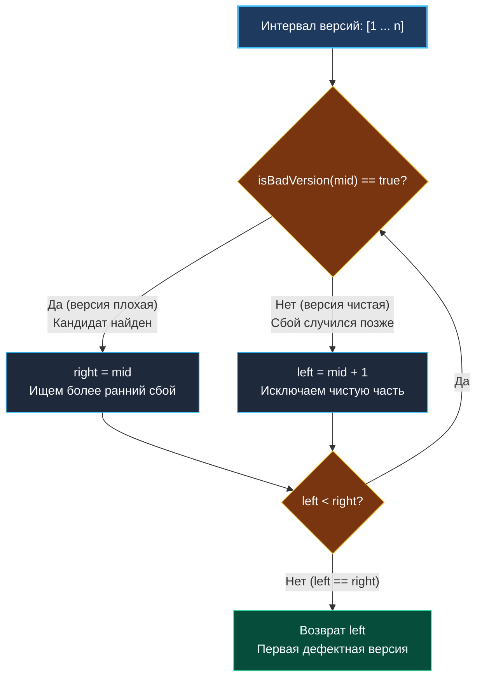

> *«Поиск первой ошибки во времени — это всегда поиск точки перелома между тем, что работало, и тем, что сломалось».*  
> — Брайан Керниган

В статье [[4. Search Insert Position]] мы научились находить границу в физическом массиве, непрерывно лежащем в оперативной памяти. Но в реальной инженерии мы редко имеем дело со статическими срезами. Данные могут находиться за сетевым RPC-вызовом, лежать в распределенной базе данных или вычисляться на лету тяжелой функцией.

Задача **First Bad Version** (LeetCode 278) — это фундаментальный пример бинарного поиска поверх **абстрактного предиката (черного ящика)**. В повседневной инженерной практике ровно этот алгоритм лежит в основе инструмента `git bisect`, позволяющего локализовать баговый коммит в истории репозитория из десятков тысяч ревизий за $O(\log N)$ шагов.

**Формулировка задачи:** Продукт имеет версионирование от $1$ до $n$. Начиная с некоторой версии $k$, сборка сломалась, и все последующие версии ($k, k+1, \dots, n$) также являются дефектными. Предоставлен API-метод `isBadVersion(version int) bool`. Необходимо найти номер первой сломанной версии $k$, минимизировав количество обращений к API.

---

## Архитектура: Монотонный предикат и Lower Bound

Хотя физического массива нет, последовательность результатов вызова `isBadVersion(i)` от $i = 1$ до $n$ формирует строго **монотонную булеву последовательность**:

$$\underbrace{[\text{false}, \text{false}, \dots, \text{false}]}_{\text{Рабочие версии}} \;\underbrace{[\text{true}, \text{true}, \dots, \text{true}]}_{\text{Сломанные версии}}$$

Задача сводится к поиску первого индекса со значением `true`. Это классический паттерн **Lower Bound**:
1. Границы диапазона: `left = 1`, `right = n`. Поскольку гарантируется, что хотя бы одна плохая версия существует, ответ лежит строго в отрезке $[1, n]$.
2. Если `isBadVersion(mid) == true`: версия `mid` дефектна. Она может быть как первой плохой, так и одной из последующих. Мы не можем исключать `mid`, поэтому сжимаем правую границу: `right = mid`.
3. Если `isBadVersion(mid) == false`: версия `mid` исправна. Первая ошибка гарантированно появилась позже. Сдвигаем левую границу: `left = mid + 1`.



---

## Идиоматичная реализация на Go

```go
package main

// isBadVersion предоставлен рантаймом/внешним API:
// func isBadVersion(version int) bool

// firstBadVersion находит номер первой дефектной версии.
// Временная сложность: O(log N) обращений к API
// Пространственная сложность: O(1)
func firstBadVersion(n int) int {
	left, right := 1, n

	for left < right {
		// Защита от переполнения 32-битного int при больших n
		mid := int(uint(left+right) >> 1)

		if isBadVersion(mid) {
			// mid сломан, ищем левее, сохраняя mid как кандидата
			right = mid
		} else {
			// mid исправен, первый сбой строго справа
			left = mid + 1
		}
	}

	// По сходимости left == right указывает на первую плохую версию
	return left
}
```

---

## Взгляд под капот: Mechanical Sympathy и цена абстракции

### 1. Накладные расходы на вызов функции (Call Overhead)
В задаче [[3. Binary Search]] доступ к `nums[mid]` выполнялся за $\sim 0.5$ нс (одна инструкция `MOV` из L1-кэша). В `firstBadVersion` каждый шаг — это вызов функции:
- Если `isBadVersion` не может быть заинлайнена (например, из-за внешнего связывания или сложности), рантайм выполняет инструкцию `CALL`, переключение стековых кадров и сохранение регистров caller-saved.
- При $N = 2 \times 10^9$ последовательный перебор $O(N)$ занял бы годы. Бинарный поиск делает всего 31 вызов функции, сокращая время работы до микросекунд.

### 2. Из CPU-Bound в I/O-Bound
В реальных production-системах (например, распределенная трассировка или репликация WAL-логов) `isBadVersion` — это не ассемблерная функция, а сетевой RPC по gRPC или HTTP к удаленному узлу.
- Каждый сетевой вызов стоит от $0.5$ до $5$ миллисекунд.
- Алгоритм становится полностью зависимым от I/O (I/O-Bound). Сокращение числа сетевых запросов с 1000 до 10 экономит 5 секунд клиентского времени.

---

## Подводные камни и вопросы с собеседований

> [!WARNING] Ловушка: Антипаттерн кэширования в `map`
> Кандидаты нередко предлагают: *«Давайте обернем вызовы `isBadVersion` в кэш `map[int]bool`, чтобы не делать повторных запросов»*.  
> Это грубая ошибка понимания инвариантов бинарного поиска:
> - На каждом шаге полуинтервал $[left, right)$ строго сжимается.
> - Центральная точка `mid` **никогда не проверяется дважды** в течение одного цикла поиска.
> - Создание хэш-таблицы приведет лишь к паразитным аллокациям в куче (`runtime.makemap`), накладным расходам на хеширование и нагрузке на сборщик мусора (GC) без единого Cache Hit!

> [!INTERVIEW] Вопрос с собеседования: Локализация деградаций в CI/CD
> **Вопрос:** Как устроен `git bisect run <test_script>` и почему иногда бинарный поиск по истории коммитов находит ложный результат?  
> **Ответ:** `git bisect` использует бинарный поиск по топологически отсортированному DAG коммитов. Поиск работает корректно только при строгой монотонности предиката: если коммит сломан, все его потомки сломаны. Если в ветку попал flaky-тест (мигающий) или коммит, который временно чинит билд обходным путем, монотонность нарушается, и бинарный поиск попадает в локальный ложный оптимум. Для борьбы с этим применяют повторные прогоны на подозрительных коммитах.

---

## Резюме

Паттерн поиска по предикату позволяет применять бинарный поиск к системам любой сложности:
- Физический массив не требуется — достаточно монотонности булевой функции $[0, \dots, 0, 1, \dots, 1]$.
- Сходимость полуинтервала $left = right$ гарантирует минимальное число вызовов $O(\log N)$.
- Никакой избыточной памяти и хэш-таблиц — только чистая работа регистров.

В следующей лекции мы разберем случай, когда монотонность данных нарушена циклическим сдвигом: [[6. Find Minimum in Rotated Sorted Array]].