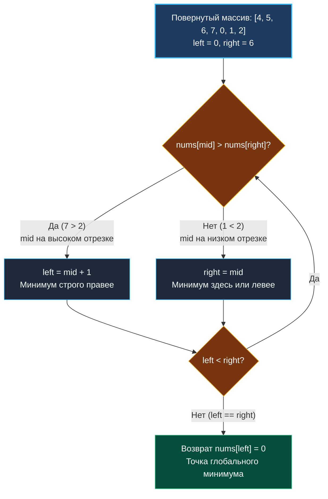

> *«Даже если порядок нарушен, в структуре всегда остается след ее первоначальной гармонии».*  
> — Брайан Керниган

До сих пор мы применяли бинарный поиск к непрерывно отсортированным срезам или строго монотонным функциям. Однако на собеседованиях в высоконагруженные компании часто проверяют способность инженера сохранять контроль над алгоритмом, когда базовые инварианты частично сломаны.

Задача **Find Minimum in Rotated Sorted Array** (LeetCode 153) вводит важную модель: изначально отсортированный массив уникальных чисел был циклически сдвинут (повернут) неизвестное количество раз.  
Например: массив `[0, 1, 2, 4, 5, 6, 7]` после поворота превращается в `[4, 5, 6, 7, 0, 1, 2]`.

Необходимо найти минимальный элемент массива за логарифмическое время $O(\log N)$.

---

## Архитектура: Геометрия двух восходящих отрезков

Если визуализировать значения повернутого массива в виде графика, мы увидим не единую прямую, а **два параллельно восходящих отрезка**, разделенных точкой разрыва (инфлексии):

$$\underbrace{[4, 5, 6, 7]}_{\text{Левый отрезок (высокий)}} \quad \big\downarrow \quad \underbrace{[0, 1, 2]}_{\text{Правый отрезок (низкий)}}$$

Минимальный элемент массива — это **самая первая точка правого отрезка** (абсолютное дно разрыва).

Ключевой архитектурный вопрос: *с каким элементом сравнивать середину `nums[mid]`?*  
Сравнение необходимо проводить с **правым краем** `nums[right]`:
1. Если `nums[mid] > nums[right]`: `mid` гарантированно лежит на **высоком (левом) отрезке**. Вся зона от `left` до `mid` монотонно возрастает и заведомо больше любого элемента правого отрезка. Минимальный элемент находится строго справа. Сдвигаем: `left = mid + 1`.
2. Если `nums[mid] < nums[right]`: `mid` гарантированно лежит на **низком (правом) отрезке**. Поскольку этот отрезок также монотонно возрастает, минимальный элемент — это либо сам `nums[mid]`, либо элемент, расположенный **левее**. Исключать `mid` нельзя: `right = mid`.



---

## Идиоматичная реализация на Go

```go
package main

// findMin возвращает значение минимального элемента в повернутом
// отсортированном срезе уникальных чисел.
// Временная сложность: O(log N)
// Пространственная сложность: O(1)
func findMin(nums []int) int {
	left, right := 0, len(nums)-1

	// Схлопываем границы до тех пор, пока left != right
	for left < right {
		// Оптимизированное вычисление середины в регистрах ALU
		mid := int(uint(left+right) >> 1)

		if nums[mid] > nums[right] {
			// Высокий отрезок: разрыв находится правее mid
			left = mid + 1
		} else {
			// Низкий отрезок или массив не был повернут вовсе:
			// минимум находится в mid или левее
			right = mid
		}
	}

	// Когда left == right, указатель стоит точно на минимальном элементе
	return nums[left]
}
```

---

## Взгляд под капот: Mechanical Sympathy

### Почему именно `nums[right]`, а не `nums[left]`?
Попытка сравнения с `nums[left]` — классическая ошибка новичков. Рассмотрим полностью отсортированный массив, который сдвинули на 0 позиций (то есть не поворачивали вообще): `[1, 2, 3, 4, 5]`.
- Здесь `nums[mid] = 3`, `nums[left] = 1`.
- Условие `nums[mid] > nums[left]` истинно (`3 > 1`). Если наивно предположить, что минимум справа, алгоритм пойдет вправо и никогда не найдет единицу на нулевом индексе!
- При сравнении же с `nums[right]` (`3 < 5`) алгоритм немедленно сжимает `right = mid`, безошибочно двигаясь к левому краю. Сравнение с `right` обладает универсальной математической устойчивостью для любых углов поворота.

### Поведение Branch Predictor
В процессе бинарного поиска по повернутому массиву интервал поиска очень быстро (за 1–3 шага) целиком локализуется либо строго на правом, либо на исходном отрезке.
Как только оба указателя `left` и `right` оказываются внутри единого монотонного сегмента, условие `nums[mid] > nums[right]` стабильно принимает значение `false`. Аппаратный предсказатель ветвлений CPU фиксирует данный паттерн и спекулятивно исполняет ветку `right = mid`, сводя штрафы за сброс конвейера инструкций к абсолютному нулю.

---

## Подводные камни и вопросы с собеседований

> [!WARNING] Ловушка: Обработка дубликатов (LeetCode 154)
> Если в массиве разрешены дубликаты (например, `[3, 3, 1, 3]` или `[3, 1, 3, 3, 3]`), алгоритм может столкнуться с ситуацией:
> `nums[mid] == nums[right]`
> В этом случае невозможно однозначно определить, в какой половине находится разрыв: в первом примере он справа от середины, во втором — слева!  
> Единственное корректное действие при равенстве:
> ```go
> if nums[mid] == nums[right] {
>     right-- // Безопасно отбрасываем дубликат справа
> }
> ```
> В худшем случае (массив из $N$ одинаковых чисел) сложность деградирует с $O(\log N)$ до линейного $O(N)$.

> [!INTERVIEW] Вопрос с собеседования: Кольцевые буферы в ядре (Ring Buffers)
> **Вопрос:** Где в реальных системах встречается структура, аналогичная повернутому массиву?  
> **Ответ:** В циклических ring-буферах (например, в подсистемах логирования ядра Linux `dmesg` или сетевых очередях NIC rx/tx ring). Когда указатель записи `head` переполняет буфер и перескакивает в начало, старые и новые сообщения образуют именно повернутый массив временных меток (timestamps). Поиск самого старого сообщения в буфере для ротации выполняется ровно по алгоритму `findMin`.

---

## Резюме

Поиск точки перелома в повернутом массиве строится на строгом инварианте:
- Сравнение `nums[mid] > nums[right]` четко разделяет два монотонных сегмента.
- Границы схлопываются в `left == right`, возвращая точный индекс минимума без лишних проверок.

Теперь мы готовы решить самую знаменитую задачу этого семейства — поиск произвольного значения в повернутом массиве: [[7. Search in Rotated Sorted Array]].