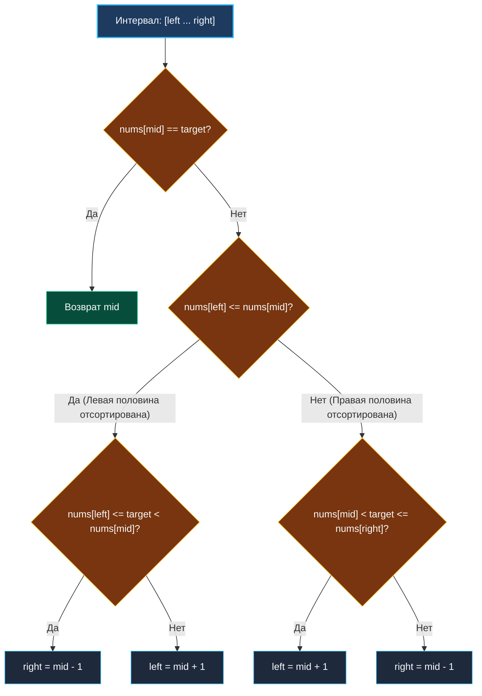

> *«Разделив несовершенную систему пополам, вы почти всегда обнаружите, что одна из ее половин совершенно нормальна».*  
> — Чарльз Хоар

В статье [[6. Find Minimum in Rotated Sorted Array]] мы научились находить точку разрыва монотонности в массиве, подвергнутом циклическому сдвигу.

Задача **Search in Rotated Sorted Array** (LeetCode 33) — классический эталон алгоритмических интервью в ведущие инженерные компании. Она проверяет, умеет ли разработчик синтезировать базовые законы бинарного поиска со строгим анализом границ в условиях деформированных данных.

**Формулировка задачи:** Дан массив уникальных целых чисел `nums`, отсортированный по возрастанию и циклически сдвинутый вокруг неизвестного индекса (например, `[0, 1, 2, 4, 5, 6, 7]` превратился в `[4, 5, 6, 7, 0, 1, 2]`). Задан искомый элемент `target`. Необходимо за логарифмическое время $O(\log N)$ вернуть индекс `target` в массиве или `-1`, если число отсутствует.

---

## Архитектура: Инвариант отсортированной половины

Многие инженеры пытаются решить задачу в два прохода (Two-Pass): сначала найти точку минимума за $O(\log N)$, а затем запустить классический бинарный поиск в соответствующей половине. Это корректный подход, однако интервьюер почти всегда требует реализовать решение **за один проход (One-Pass)**.

Фундаментальный математический инсайт:  
**Если разрезать циклически сдвинутый отсортированный массив в ЛЮБОЙ произвольной точке `mid`, то как минимум одна из двух образовавшихся половин гарантированно будет строго и непрерывно отсортирована!**

Алгоритм на каждой итерации:
1. Вычисляем `mid`. Если `nums[mid] == target`, элемент найден.
2. Определяем, **какая из половин монотонна**:
   - Если `nums[left] <= nums[mid]` — левая половина `[left ... mid]` строго отсортирована.
   - Иначе — правая половина `[mid ... right]` строго отсортирована.
3. Проверяем, **попадает ли `target` в границы отсортированной половины**:
   - Для отсортированной левой половины: если `nums[left] <= target && target < nums[mid]`, искомое значение обязано лежать слева. Отбрасываем правую часть: `right = mid - 1`.
   - Иначе: цель находится в правой (возможно, сломанной) половине: `left = mid + 1`.
   - Симметрично для отсортированной правой половины: если `nums[mid] < target && target <= nums[right]`, сужаем влево: `left = mid + 1`, иначе `right = mid - 1`.



---

## Идиоматичная реализация на Go

Поскольку нам требуется точное совпадение значения (Exact Match), используется замкнутый интервал `left <= right` с досрочным выходом при успехе.

```go
package main

// search находит индекс target в повернутом отсортированном срезе за один проход.
// Временная сложность: O(log N)
// Пространственная сложность: O(1)
func search(nums []int, target int) int {
	left, right := 0, len(nums)-1

	for left <= right {
		// Быстрое вычисление середины без переполнения int
		mid := int(uint(left+right) >> 1)

		if nums[mid] == target {
			return mid
		}

		// Проверяем, какая половина строго монотонна
		if nums[left] <= nums[mid] {
			// Левая половина [left...mid] отсортирована
			if nums[left] <= target && target < nums[mid] {
				// target гарантированно внутри левого диапазона
				right = mid - 1
			} else {
				// target вне левого диапазона -> уходим вправо
				left = mid + 1
			}
		} else {
			// Правая половина [mid...right] отсортирована
			if nums[mid] < target && target <= nums[right] {
				// target гарантированно внутри правого диапазона
				left = mid + 1
			} else {
				// target вне правого диапазона -> уходим влево
				right = mid - 1
			}
		}
	}

	return -1
}
```

---

## Взгляд под капот: Mechanical Sympathy

### Цена вложенных ветвлений и конвейер процессора
Внутри цикла `for` находится двухуровневая структура `if-else`. На каждой итерации процессор выполняет до двух условных переходов (`CMP` + `JLE` / `JGE`).
- В непредсказуемых массивах предсказатель ветвлений (Branch Predictor) не может обучиться стабильному шаблону, так как попадание цели в левую или правую зону зависит от случайных запросов.
- Ошибка предсказания (Branch Misprediction) влечет сброс 14–20 стадий суперскалярного конвейера современных x86-64 ядер.
- **Инженерный факт:** На коротких срезах ($N \le 64$) решение Two-Pass (поиск минимума + классический бинарный поиск) в микробенчмарках иногда опережает One-Pass именно за счет более плоского и предсказуемого кода без вложенных развилок!

---

## Подводные камни и вопросы с собеседований

> [!WARNING] Ловушка: Критическая важность знака `<=`
> В выражении `if nums[left] <= nums[mid]` знак равенства **обязателен**.  
> Если срез сократился до двух элементов (например, `[3, 1]`, `target = 1`), то `left = 0`, `right = 1`, откуда `mid = 0`.  
> Если написать строгое сравнение `nums[left] < nums[mid]`, выражение `3 < 3` вернет `false`. Алгоритм решит, что отсортирована *правая* часть, проверит условие `nums[mid] < target <= nums[right]` (`3 < 1 <= 1` $\rightarrow$ `false`) и пойдет влево, навсегда потеряв правильный ответ. Равенство `left <= mid` гарантирует, что срез из одного или двух элементов трактуется корректно.

> [!INTERVIEW] Вопрос с собеседования: Дубликаты элементов (LeetCode 81)
> **Вопрос:** Что произойдет, если в массиве разрешены дубликаты (например, `nums = [1, 0, 1, 1, 1]`, `target = 0`)?  
> **Ответ:** Инвариант отсортированной половины ломается. Если `nums[left] == nums[mid] == nums[right]`, невозможно понять, где разрыв — слева или справа. Для сохранения корректности необходимо добавить сжатие краев:
> ```go
> if nums[left] == nums[mid] && nums[mid] == nums[right] {
>     left++
>     right--
>     continue
> }
> ```
> При этом в худшем случае временная сложность падает до $O(N)$.

---

## Резюме

**Search in Rotated Sorted Array** демонстрирует силу декомпозиции задачи:
- Разделение массива всегда обнажает как минимум один упорядоченный отрезок.
- Проверка принадлежности отсортированному сегменту детерминирует дальнейшее направление движения.
- Вся логика выполняется strictly in-place с нулевыми аллокациями памяти ($O(1)$ space).

Теперь мы покидаем область поиска по массивам и переходим к абстрактным пространствам решений. В следующей статье мы решим классическую задачу на оптимизацию пропускной способности: [[8. Koko Eating Bananas]].