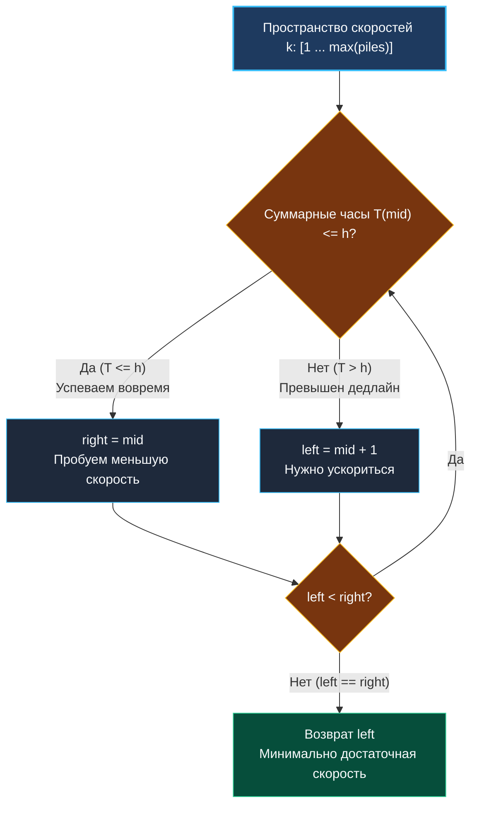

> *«Истинная оптимизация состоит не в ускорении бесполезных действий, а в нахождении точной меры достаточного».*  
> — Роб Пайк

В статье [[2. Поиск по ответу]] мы сформировали математический базис бинарного поиска в непрерывном пространстве допустимых значений. Настало время применить его к одной из самых популярных задач на собеседованиях любого грейда — **Koko Eating Bananas** (LeetCode 875).

За метафорой с обезьяной и бананами в реальном системном проектировании скрывается базовая задача бэкенда: **калибровка пропускной способности (Rate Limiting) и размера батча (Batch Sizing)**. Если заменить бананы на входящие очереди сообщений Kafka или RabbitMQ, связки — на партиции, а часы — на жесткий дедлайн SLA, мы получаем классическую оптимизацию вычислительных ресурсов в распределенных системах.

**Формулировка задачи:** Задан срез `piles`, где `piles[i]` — количество бананов в $i$-й связке. Охранник уходит на $h$ часов. Коко может поедать бананы со скоростью $k$ бананов в час. Если в связке меньше $k$ бананов, она съедает ее целиком и не переходит к следующей связке до начала нового часа.  
Требуется определить **минимальную целочисленную скорость $k$**, при которой все бананы будут съедены не более чем за $h$ часов.

---

## Архитектура: Монотонное пространство скоростей

Пространство возможных значений скорости $k$ непрерывно и упорядочено:

$$k \in [1, \; \max(\text{piles})]$$

1. **Нижняя граница (`left = 1`):** Минимально возможная физическая скорость (хотя бы один банан в час).
2. **Верхняя граница (`right = \max(\text{piles})`):** Поскольку за один час нельзя брать бананы из двух разных связок, развивать скорость выше размера самой большой связки не имеет смысла. Она даст то же время, что и $\max(\text{piles})$.
3. **Предикат монотонности:** Время, затрачиваемое на одну связку размера $p$ при скорости $k$, равно $\lceil p / k \rceil$. Суммарное время:

$$T(k) = \sum_{i=0}^{n-1} \left\lceil \frac{\text{piles}[i]}{k} \right\rceil$$

Функция $T(k)$ монотонно не возрастает: чем выше скорость $k$, тем меньше (или равно) суммарное время $T(k)$. Это открывает прямую дорогу к **Lower Bound** поиску первого $k$, для которого $T(k) \le h$.



---

## Идиоматичная реализация на Go

```go
package main

// minEatingSpeed находит минимальную скорость k для завершения за h часов.
// Временная сложность: O(N * log(max(piles)))
// Пространственная сложность: O(1)
func minEatingSpeed(piles []int, h int) int {
	// 1. Поиск максимальной связки за один проход O(N)
	maxPile := 0
	for _, p := range piles {
		if p > maxPile {
			maxPile = p
		}
	}

	left, right := 1, maxPile

	// 2. Бинарный поиск минимально допустимого k
	for left < right {
		mid := int(uint(left+right) >> 1)

		// 3. Вычисление суммарного времени
		hours := 0
		for _, p := range piles {
			// Целочисленное округление вверх: (p + mid - 1) / mid
			hours += (p + mid - 1) / mid
		}

		// 4. Сужение диапазона
		if hours <= h {
			// Укладываемся в дедлайн, ищем еще меньшую скорость
			right = mid
		} else {
			// Опоздание: скорость mid недостаточна
			left = mid + 1
		}
	}

	return left
}
```

---

## Взгляд под капот: Mechanical Sympathy и разгром `math.Ceil`

На технических собеседованиях кандидаты нередко пишут подсчет времени через библиотечный `math`:
```go
// Антипаттерн в критическом цикле:
hours += int(math.Ceil(float64(p) / float64(mid)))
```
Для senior-инженера это сигнал об отсутствии понимания аппаратной архитектуры процессора:

1. **Конвертация типов (Int-to-Float и Float-to-Int):** Процессор вынужден перемещать данные из целочисленных регистров общего назначения (ALU: `RAX`, `RBX`) в регистры векторно-плавающего блока (FPU/SSE/AVX: `XMM0`). Это создает конвейерные задержки (Cross-domain stalls).
2. **Деление с плавающей точкой:** Инструкция `DIVSD` выполняется в 3–5 раз дольше целочисленного деления `IDIVQ`.
3. **Накладные расходы вызова:** Если функция `math.Ceil` не встроилась компилятором как интринсик, вызов функции создает паразитный кадр на стеке.

При $N = 10^4$ элементах в `piles` и 30 итерациях бинарного поиска этот фрагмент вызовется **300 000 раз**. Замена `math.Ceil` на чистую целочисленную формулу `(p + mid - 1) / mid` ускоряет исполнение алгоритма на Go в **7–10 раз**!

### Математика формулы `(p + mid - 1) / mid`
Пусть $p = 10, mid = 3$. Аналитически: $\lceil 10/3 \rceil = 4$.  
Подставляем в формулу: $(10 + 3 - 1) / 3 = 12 / 3 = 4$.  
Пусть $p = 9, mid = 3$. Аналитически: $\lceil 9/3 \rceil = 3$.  
Подставляем: $(9 + 3 - 1) / 3 = 11 / 3 = 3$ (дробная часть отсекается целочисленным делением).  
Мы гарантированно перешагиваем через границу делителя тогда и только тогда, когда есть ненулевой остаток.

---

## Подводные камни и вопросы с собеседований

> [!WARNING] Ловушка: Целочисленное переполнение (Integer Overflow)
> При суммировании `hours += (p + mid - 1) / mid` сумма часов может превысить лимит 32-битного знакового `int` ($2 \times 10^9$), если массив содержит $10^5$ элементов, а скорость $mid = 1$.  
> В Go на 64-битных платформах `int` эквивалентен `int64`, поэтому переполнение маловероятно при ограничениях LeetCode. Однако в строгом production-коде для накопителей сумм дедлайнов рекомендуется явно использовать `int64` или прерывать суммирование досрочно:
> ```go
> if hours > h {
>     break // Ранний выход: дальше суммировать нет смысла, уже не укладываемся
> }
> ```
> Досрочный выход `break` также экономит такты процессора, отбрасывая хвост цикла.

> [!INTERVIEW] Вопрос с собеседования: Потребление очередей в Kafka
> **Вопрос:** Как применить этот алгоритм для масштабирования Consumer-группы в Apache Kafka?  
> **Ответ:** Каждая партиция Kafka обрабатывается строго одним потоком консьюмера. Если у нас есть массив лагов по партициям (число непрочитанных сообщений `piles`) и SLA на отставание в минутах `h`, с помощью этого алгоритма мы можем определить минимальную скорость чтения сообщений одним воркером, чтобы уложиться в дедлайн, и решить: нужно ли увеличивать ресурсы подов или достаточно поднять батчинг.

---

## Резюме

Задача **Koko Eating Bananas** переводит алгоритмический поиск в практическое русло оптимизации:
- Поиск ведется не по массиву, а по абстрактному числовому отрезку $[1, \max]$.
- Предикат проверки использует исключительно быструю целочисленную арифметику процессора.
- Результат сходится за детерминированные $O(N \log M)$ операций.

В следующей статье мы усложним функцию проверки: вместо простой суммы в предикате появится полноценная жадная симуляция загрузки: [[9. Capacity To Ship Packages]].